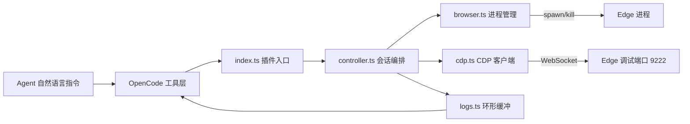

# opencode-edge-debug 设计文档

OpenCode 按需 Edge 浏览器调试插件：以自然语言驱动「启动 Edge → 抓取 Console/网络日志 → 关闭」的调试闭环。
零重型框架、零运行时依赖，对上游零修改。

## 1 概述

插件注册四个工具（见 4），由 `createEdgeDebugController` 统一编排生命周期：
启动 Edge → 轮询等待 CDP 就绪 → WebSocket attach → 订阅事件入缓冲 → 关闭时优雅退出并清理。

## 2 插件机制适配

- 入口 `src/index.ts` **仅 default export** 一个 `Plugin` 函数（`async (input) => Hooks`）。
  上游 legacy loader 遍历模块全部导出，任何额外命名导出都会导致「Plugin export is not a function」加载失败。
- 工具经 `tool()` + `tool.schema`（zod）定义，`Hooks.tool` 的 key 即工具名原名注册。
- `Hooks.dispose` 中 `await controller.stop()`：插件卸载（会话结束、opencode 退出）时兜底清理浏览器进程。
- 加载方式：项目 `opencode.json` 加 `{"plugin": ["./opencode-edge-debug"]}`（目录含 package.json，入口取 `main`）。
- 会话项目目录经 `input.directory` 取得，用作专用浏览器 profile 的根（见决策记录 D2）。

## 3 核心链路

### 3.1 通信与进程层（cdp.ts / browser.ts）

**CDP 客户端（零依赖，决策记录 D1）**：

- `CdpClient.connect(wsUrl)`：bun 原生 WebSocket，握手失败拒绝。
- `call(method, params)`：自增 id 发送 → pending Map 等待同 id 响应；协议 `error` 拒绝；默认 10 秒超时。
- `on(method, handler)`：事件订阅（无 id 的消息按 method 分发）。
- `close()`：先拒绝全部 pending，再关 WebSocket，触发 onClose 回调且仅一次。
- HTTP 助手：`probeVersion(port)`（`GET /json/version`，就绪探测与实例复用判定）、
  `getPageTargetWsUrl(port)`（`GET /json`，取首个 `type === "page"` target 的 `webSocketDebuggerUrl`）、
  `waitForCdp(port)`（300ms 间隔轮询、15s 超时，间隔/时长可注入以便测试）。

**Edge 进程管理**：

- `resolveEdgeBinary(platform)`：win32 查 Program Files 常见路径；darwin 查 `/Applications/Microsoft Edge.app`；
  linux 按 `microsoft-edge` / `-stable` / `-dev` 顺序查 PATH。未找到抛带安装指引的中文错误。
- `launchEdge(binary, {port, url, userDataDir})`：
  `--remote-debugging-port=<port> --user-data-dir=<dir> --no-first-run --no-default-browser-check <url>`，
  `detached: true, stdio: "ignore"` + `unref()`（自成进程组，守护进程不挂起）。
- `killProcessTree(child)`：CDP 优雅关闭失败时的兜底。posix 经 `-pid` 整组 SIGKILL（失败退化为单进程），
  win32 `spawn("taskkill", ["/pid", pid, "/T", "/F"], { stdio: "ignore" })` 静默终止——taskkill 终止复杂进程树
  （如 Edge）常失败，其 stderr 会打印多条 "ERROR: ... could not be terminated."，必须用 `stdio:"ignore"`
  彻底丢弃（不能用 `execFileSync`：它失败时会把子进程 stderr 泄漏打印到父进程 stderr，被 OpenCode 捕获后
  一条条显示在 TUI、盖住输入框）；已退出进程跳过。

### 3.2 Console 日志采集与序列化（logs.ts / controller.ts）

- 订阅 `Runtime.consoleAPICalled`（**不用已废弃的 `Console.messageAdded`**）：
  条目 `{time, level: type 大写, text}`，text 由 `formatConsoleArgs` 序列化。
- 订阅 `Runtime.exceptionThrown`：level 记为 `UNCAUGHT_EXCEPTION`，
  text 取 `exception.description`（含堆栈摘要），兜底 `exceptionDetails.text`。
- `formatRemoteObject`：`value`（字符串原样、其余 JSON.stringify）→ `description` → `type` → `"unknown"`。

### 3.3 日志缓冲与网络降噪（logs.ts / controller.ts）

- 环形缓冲 `createRingBuffer`：每类日志最多 `MAX_LOGS = 50` 条，超出丢弃最旧；`snapshot()` 返回副本。
- 网络采集订阅两个事件互补（`responseReceived` 不携带 method）：
  `Network.requestWillBeSent` 记 `requestId → method`；
  `Network.responseReceived` 按 `shouldKeepResponse` 过滤后入缓冲并消费该映射。
- `shouldKeepResponse`：状态码 >= 400 一律保留；否则仅保留疑似 API（URL 含 `/api/` 或 MIME 含 json）；
  静态资源（css/png/字体等）丢弃，为 Agent 降噪。

### 3.4 控制器编排（controller.ts）

`createEdgeDebugController(directory)` 闭包持有 child/cdp/双缓冲/method 映射（不在模块顶层持状态）。

- **start 幂等**：已 attach → 直接返回「已在运行」；否则 `probeVersion(9222)` 已有响应 →
  说明端口存在其他调试实例，直接 attach 复用并 `Page.navigate` 到目标地址，**不再拉起进程**；
  否则定位二进制 → `mkdir -p <directory>/.opencode/edge-debug/profile` → spawn →
  `waitForCdp` → attach（`Runtime.enable` + `Network.enable` 并行）。等待或 attach 失败时先杀进程树再抛错。
- **stop 幂等**：未运行返回 false；否则先置空 cdp 引用（避免 onClose 回调重复复位），
  再 `Browser.close` 优雅关闭（失败由进程树清理兜底）→ `client.close()` → `killProcessTree` → 清缓冲。
- **被动断开**：浏览器被手动关闭时 WebSocket 断开，onClose 回调复位会话状态（仅当该 client 仍是当前会话）。

## 4 工具定义

| 工具名 | 入参 | 行为 |
|---|---|---|
| `start_edge_browser` | `url?: string`（默认 `http://localhost:3000`） | 启动/复用 Edge + CDP 监听，回显加载地址 |
| `close_edge_browser` | 无 | 优雅关闭；未运行返回提示而非报错 |
| `get_browser_console_logs` | 无 | 未启动 → 引导先启动；空 → 明确说明；否则 JSON |
| `get_browser_network_logs` | 无 | 同上（仅 4xx/5xx 与疑似 API 条目） |

## 5 健壮性与降级

### 5.1 错误处理

- 所有可预期失败抛 `EdgeDebugError`：消息为中文并附修复路径（安装指引、重试建议），
  由工具 execute 抛出后经上游呈现为工具执行错误供 Agent 读取并自行决策。
- CDP 命令超时（10s）、就绪探测超时（15s）均以同类错误呈现，计时器成败均清理。
- 不可预期失败（网络异常、进程已退出）一律静默降级：杀进程、关连接处吞错，日志前缀 `[edge-debug]`。

## 6 安全与隐私

- 调试端口仅绑定本机（Chromium `--remote-debugging-port` 默认 127.0.0.1）。
- 日志仅存内存环形缓冲，进程退出即失；**无任何上行、无落盘**。
- 专用 profile 与用户日常浏览数据隔离，关闭后如需可手动删除 `<项目>/.opencode/edge-debug/`。

## 7 v1 限制与未来扩展

- 仅监听启动时 attach 的**单个 page target**，新开标签页不监听（未来可订阅 `Target` 域做多 target）。
- 端口固定 9222，不开放配置；网络降噪规则为硬编码启发式。
- 不抓取请求体/响应体（Agent 需要时可经 `Network.getResponseBody` 扩展）。

## 8 决策记录

- **D1 零依赖 CDP 客户端**：chrome-remote-interface 引入 ws/commander 且为 CJS；本插件所需协议面极小
  （命令调用 + 事件订阅），bun 原生 WebSocket + fetch 约 150 行即可覆盖，保持零运行时依赖。
- **D2 专用 user-data-dir**：用户已有 Edge 实例运行时，共用默认 profile 的进程不会开放调试端口
  （Chromium 单实例机制），必须专用 profile 才能稳定拉起调试实例；落在会话项目目录下便于隔离与清理。
- **D3 Browser.close 优先**：优雅关闭让浏览器自行落盘会话数据、正常退出；
  仅在 CDP 不可达时退化为进程树强杀，避免残留子进程。
