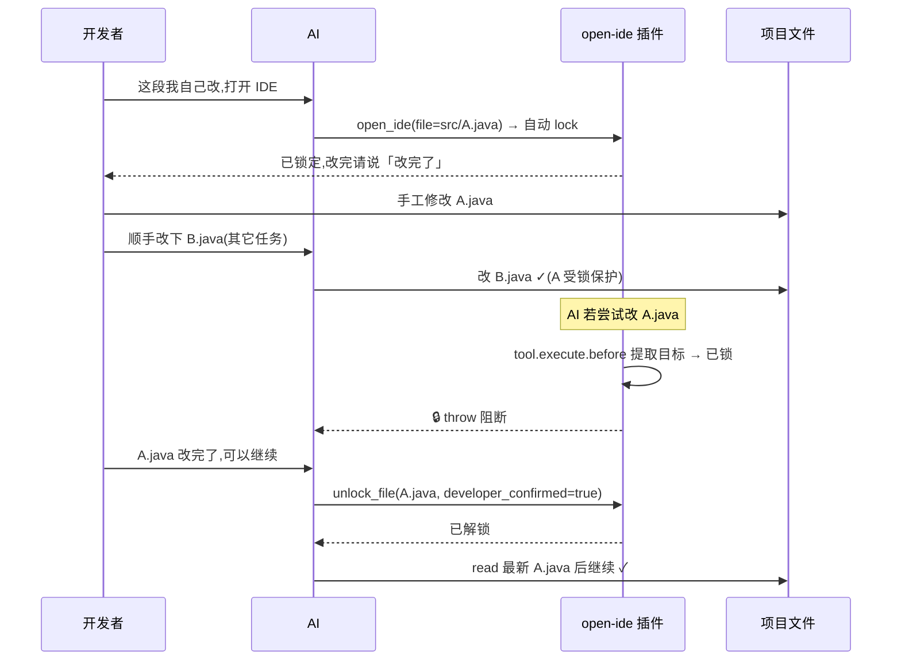

# opencode-open-ide 设计文档

OpenCode 打开 IDE 插件：以自然语言驱动「打开 IDE → 打开项目目录或定位到文件行 → 开发者人工修改」的闭环，零运行时依赖，对上游零修改。

## 1 概述


插件注册一个工具 `open_ide`（见 4）。流程：
读取插件根 `config.json`（合并内置预设）→ 按 `order` 探测可用 IDE → 构造定位参数 → `spawn` 拉起，返回中文结果供 Agent 回显。

## 2 配置与预设

### 2.1 config.json 位置与语义

配置文件放**插件目录根**（`import.meta.dir` 上溯一层），用户直接编辑：

```json
{
  "order": ["vscode", "idea"],
  "tools": {
    "cursor": { "binary": "cursor", "kind": "vscode" },
    "idea": { "binary": "/opt/idea/bin/idea.sh", "kind": "idea" }
  }
}
```

**tools 的语义：只放「覆盖」或「新增」，内置预设不写即用默认。** 上例中：
- `cursor` 是**新增示例**——不在内置 registry（`src/presets.ts` 只内置 vscode + idea），经 `tools` 注册新工具，kind 沿用 vscode 定位语法；
- `idea` 是**覆盖示例**——内置已有 `idea`，这里覆盖其 binary 为绝对路径（同 id 覆盖时 binary/kind 均生效）；
- `vscode` 未出现在 tools 中——使用内置默认（`binary: code`），无需写，写了反而冗余。

- `order`：探测优先级，缺省 `["vscode", "idea"]`。
- `kind` 仅允许 `"vscode" | "idea"`，决定定位参数语法；binary 可为 PATH 名或绝对路径。

> **Windows 路径警告**：config.json 是 JSON，`\` 是转义符——单反斜杠会破坏结构。`\P` 等非法转义导致解析失败回退预设；`\b`/`\n` 等合法转义会被静默转成控制字符（路径错但解析"成功"）。**请用正斜杠 `/`（Windows 原生接受），或双反斜杠 `\\`**。例：`"binary": "C:/Program Files/JetBrains/IntelliJ IDEA/bin/idea64.exe"`。

**兜底**：文件缺失/字段缺失 → 内置预设；无效 JSON 记 warning 回退默认，不崩溃。插件加载时只读一次。

### 2.2 内置预设（决策记录 D1）

| id | binary（按平台候选） | kind | 文件定位参数 |
|----|----------------------|------|-------------|
| `vscode` | `code` | vscode | `-g <path>:<line>[:<col>]` |
| `idea` | 见下方（PATH 名 + 常见绝对安装路径 + 版本化 glob） | idea | `--line <n> [--column <n>] <path>` |

idea 候选覆盖三类安装形态（候选含 `*` 时按 glob 展开取首个命中）：
- **PATH 名**：`idea` / `idea.sh`（darwin、linux）、`idea64.exe` / `idea.cmd`（win32）；
- **常见绝对路径**：linux `/opt/idea/bin/idea.sh`、darwin `/Applications/IntelliJ IDEA.app/Contents/MacOS/idea`、win32 `C:/Program Files/JetBrains/IntelliJ IDEA*/bin/idea64.exe` 等；
- **版本化 glob**：`/opt/idea-*/bin/idea.sh`、`~/.local/share/JetBrains/Toolbox/apps/IDEA-U/ch-0/*/bin/idea.sh`、win32 `C:/Users/*/AppData/Local/JetBrains/Toolbox/apps/IDEA-U/ch-0/*/bin/idea64.exe` 等。

只内置最小集（vscode + idea）；其余 IDE 经 `tools` 自行新增，避免 registry 膨胀。

### 2.3 探测与解析

按 `order` 逐项取 `tools` 覆盖后的候选：
- 含 `*` → `Bun.Glob` 展开取首个命中（零依赖）；
- 含 `/`、`\` 或 `~` 前缀 → `~` 展开 HOME 后查存在性；
- 否则 `which`（posix）/ `where`（win32）查 PATH。

win32 的 `where` 会返回**多行**（如 VS Code 同时有无后缀的 POSIX sh 脚本 `...\bin\code` 与真正的 shim `code.cmd`）。无后缀行供 WSL/linux 使用、cmd.exe 无法执行，必须跳过——按扩展名优先级 `.exe` → `.cmd` → `.bat` 挑选（`pickWindowsExecutable`），全部无后缀时兜底第一行（决策记录 D5）。

第一个命中启用，命中返回**解析后的真实可执行路径**（供 spawn 直接用）；全部未命中抛中文错误含安装指引。探测函数可注入以便测试。

## 3 进程与平台

- posix：`spawn(binary, args, { cwd: directory, detached: true, stdio: "ignore" })` + `unref()`——自成进程组、daemon 不挂起。
- win32：`code`/`idea` 经 `.cmd` shim，须 `shell: true` 才能解析；含空格的参数手动加双引号，避免被 shell 拆词。
- **dispose 不杀 IDE**：IDE 由用户自主关闭，不同于 Edge 调试实例（对比 `opencode-edge-debug` 的 `killProcessTree` 兜底）。

## 4 工具定义

| 工具名 | 入参 | 行为 |
|--------|------|------|
| `open_ide` | `file?: string`（相对项目目录或绝对路径）、`line?: number`、`column?: number`、`ide?: string`（强制指定 id） | 探测可用 IDE，打开项目目录或定位到文件行；**带 file 时自动锁定该文件**，回显「已用 X 打开 Y，已锁定」 |
| `lock_file` | `file` | 人工文件锁：开发者声明该文件由自己接管，AI 不得修改 |
| `unlock_file` | `file`、`developer_confirmed`（必须 true） | 解锁；须开发者明确确认（如说「改完了/可以继续」）才生效 |
| `list_locked_files` | 无 | 查看当前会话锁定清单 |

## 5 人工文件锁（决策记录 D4）

### 5.1 目的与机制

开发者打开 IDE 手工修改代码时，AI 可能基于会话内旧上下文整文件覆写，抹掉手工改动。锁 registry（内存级、按会话）在锁定期间对目标文件的 `write/edit/apply_patch` 做**服务端硬拦截**（`tool.execute.before`），与提交门禁同哲学、不靠模型自觉。



### 5.2 拦截点：从工具入参提取目标文件

`tool.execute.before` 收到本次调用完整入参 `output.args`，拦截逻辑经纯函数 `extractTargetFiles` 提取 AI 想改的文件，与锁集合比对：

| 工具 | 数据来源 |
|------|---------|
| `write` / `edit` | `args.filePath`（上游保证绝对路径，edit.ts:48 注释原话） |
| `apply_patch` | `patchText` 的 `*** Add/Update/Delete File:` 头部（格式与 sm-shared/loc.ts 解析口径一致） |

任一目标被锁 → throw 中文错误。只拦三个代码编辑工具，read/grep/bash 等不拦。入参畸形返回空（宁漏勿误拦）。

### 5.3 路径归一化

锁 registry 以**项目目录**为基准 `resolve()` 成绝对路径，与 gate 侧（同样以项目目录解析工具入参）口径一致，相对/绝对路径都能正确匹配。

### 5.4 锁定提示注入

`experimental.chat.system.transform`：有锁文件时向 `output.system` push「⚠ 当前锁定：X；若开发者已改完请询问确认并 unlock_file」。与 session-mgmt 各自独立 push，互不覆盖（上游按序调用各 hook）。判空 sessionID、无锁跳过（零开销）。

### 5.5 锁定期间可继续其它任务

锁是**按文件**的（`Map<sessionID, Set<file>>`），不是会话级暂停。开发者改 A.java 的同时可让 AI 改 B.java、答疑、推进其它阶段——只有 A.java 被保护。opencode 回合制，AI 只在开发者发消息时行动，无「等锁」挂起。

### 5.6 局限（见 docs/manual-edit-loop.md 第 5 章）

- 不经 open_ide / lock_file 的手改不受保护（插件不读磁盘文件）；
- `bash` 工具的写操作（`echo > file`）无法拦截；
- 锁内存级，daemon 重启即失；
- 无自动解锁、无超时，仅开发者明确确认后解锁。

## 6 健壮性与降级

- 可预期失败抛 `OpenIdeError`：中文消息附修复路径（安装指引、config.json binary 配置建议）。
- config.json 解析失败仅记 warning 回退默认，不阻断插件加载。
- 锁拦截抛 Error 直接阻断工具执行；锁 registry 在 dispose 时 clearAll。

## 7 安全与隐私

- 仅在本机 `spawn` IDE 进程，不产生任何网络请求、不读取/上行代码。
- 不读取项目文件内容；只把 `file` 参数拼进 IDE 定位参数；锁只记文件路径字符串，不读文件。
- IDE 进程由用户掌控，插件不注入内容、不捕获其输出。

## 8 v1 限制与未来扩展

- 单 IDE 同时探测（order 取第一个命中）；未来可支持 `ide` 强制参数逐项重试、或按文件后缀自动选 IDE。
- 不等待 IDE 启动结果（fire-and-forget）；未来可加启动失败探测。
- `~` 前缀展开仅简单替换 HOME，不含用户自定义 shell 语义。
- 锁内存级、无自动解锁；未来可加锁持久化、会话级暂停（pause_ai_editing）或跨插件共享（如需 session-mgmt 感知锁）。

## 9 决策记录

- **D1 内置预设最小集 + config.json 覆盖**：只内置 vscode + idea，其余按需经 `tools` 新增；配置文件放插件目录内（非 opencode.json options），用户编辑成本最低、改动可见、与代码解耦。
- **D2 探测即决、失败即报**：不做「探测不到就静默降级」，避免「以为开了 IDE 实际没开」的困惑；错误消息直接给出安装/配置修复路径。
- **D3 detached + 不杀进程**：IDE 是长驻用户工具，与浏览器调试实例生命周期不同；插件只负责拉起，关闭完全交给用户。
- **D4 人工文件锁（内存级、不跨插件共享、仅显式解锁）**：锁放本插件闭包内（tool.execute.before 全局广播特性使其可拦截所有编辑工具，session-mgmt 无需读锁，避免跨插件共享的 globalThis/契约包/磁盘三种代价）；内存级与 stuck 短记忆同取舍；解锁须开发者明确确认后 `unlock_file`（无自动检测、无超时——文件系统只能感知「变了」无法判定「改完」）；统计口径不特殊处理。
- **D5 win32 二进制定位跳过无后缀 sh 脚本**：`where code` 返回多行，第一行是无后缀的 POSIX sh 脚本（供 WSL/linux），cmd.exe 无法执行、`shell:true` spawn 时静默失败（stdio ignore + unref 吞错误）——曾致 VS Code 不启动。按扩展名优先级 `.exe`/`.cmd`/`.bat` 挑选（`pickWindowsExecutable`），全部无后缀才兜底第一行（不破坏仅有无后缀可执行程序的场景）。
