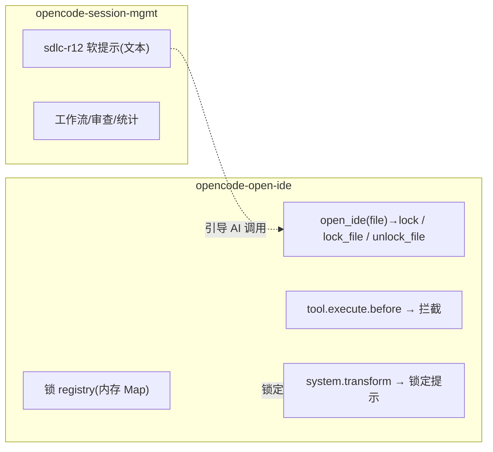

# 人工修改闭环：opencode-open-ide × opencode-session-mgmt 协作契约

版本: 1.0.0
最后更新: 2026-08-14
场景: 开发者对 AI 生成的代码不满意，打开 IDE 手工修改；AI 不得覆盖，改完后经确认解锁继续。

## 1 概述

两个独立插件协作，实现「打开 IDE 手工改代码 → AI 不覆盖 → 确认后解锁继续」的闭环：

- **opencode-open-ide**：负责拉起 IDE 与**人工文件锁**（写入方 open_ide/lock_file/unlock_file，读取方 tool.execute.before 拦截 + system.transform 提示）。
- **opencode-session-mgmt**：负责工作流/审查/统计，**软提示**规则 sdlc-r12 引导 AI 调用 open_ide/unlock_file（仅文本耦合，无代码依赖）。



## 2 完整时序

```mermaid
sequenceDiagram
    participant U as 开发者
    participant A as AI Agent
    participant O as open-ide
    participant S as session-mgmt
    participant F as 项目文件

    Note over U,F: ① 发起手工修改
    U->>A: 这段代码方向不对,我自己改,打开 IDE
    Note over A: AI 从上下文确定文件(开发者提及/最近编辑);<br/>不明确时先询问「要改哪个文件」
    A->>O: open_ide(file=src/A.java) → 自动 lock
    O-->>U: 已打开,该文件已锁定;改完请说「改完了」
    Note over O,S: ② 锁定期间(回合制:AI 此时已停,等开发者下一条消息)
    U->>F: 手工修改 src/A.java
    U->>A: 顺手帮我改下 B.java(其它任务)
    A->>S: 正常执行工作流/改 B.java ✓(A.java 受锁保护)
    Note over O,A: 若 AI 尝试改 A.java → tool.execute.before 拦截 🔒
    Note over U,S: ③ 改完解锁
    U->>A: A.java 改完了,可以继续
    A->>O: unlock_file(src/A.java, developer_confirmed=true)
    O-->>A: 已解锁
    A->>F: read 最新 src/A.java
    A->>S: 基于新内容继续工作流(comprehension_manual 等) ✓
    Note over O: 多文件锁定时,"改完了"只针对明确提及的文件;<br/>AI 须逐个确认解锁,未提及的保持锁定
```

## 3 角色职责

| 环节 | 开发者 | AI(编排者) | open-ide | session-mgmt |
|------|--------|-----------|----------|--------------|
| 决定手改 | 发起 | 识别意图(依 sdlc-r12) | — | 注入规则 |
| 打开 IDE | — | 调 `open_ide(file)` | 拉起 IDE + 自动加锁 | — |
| 编辑期防覆盖 | — | — | `tool.execute.before` 硬拦截 write/edit/apply_patch | — |
| 提醒勿改锁文件 | — | — | system.transform 注入锁定清单 | — |
| 记录人工片段 | — | 调 `comprehension_manual` | — | manual 终态 + 一次通过率口径 |
| 确认改完 | 明确说「改完了」 | 询问确认 | — | — |
| 解锁 | — | 调 `unlock_file(developer_confirmed=true)` | 校验后解锁 | — |
| 重新读取 | — | `read` 最新内容 | 解锁消息提示 re-read | — |
| 继续工作流 | — | 正常推进 | — | 阶段/审查/统计照常 |

## 4 关键机制

### 4.1 拦截点：从工具入参提取目标文件

`tool.execute.before` 收到本次调用完整入参 `output.args`，拦截逻辑从入参提取 AI 想改的文件，与锁集合比对（纯函数 `extractTargetFiles`）：

| 工具 | 数据来源 |
|------|---------|
| `write` / `edit` | `args.filePath`（上游保证绝对路径） |
| `apply_patch` | `patchText` 的 `*** Add/Update/Delete File:` 头部 |

任一目标被锁 → `throw` 中文错误阻断执行。只拦三个代码编辑工具，read/grep/bash 等不拦。这是**服务端硬约束**，不靠模型自觉。

### 4.2 路径归一化

锁 registry 以**项目目录**为基准 `resolve()` 成绝对路径，与 gate 侧（同样以项目目录解析工具入参）口径一致，相对/绝对路径都能正确匹配。

### 4.3 锁定期间可继续其它任务

锁是**按文件**的（`Map<sessionID, Set<file>>`），不是会话级暂停。开发者打开 IDE 改 A.java 的同时，可以让 AI 改 B.java、答疑、推进其它阶段——只有 A.java 被锁保护。opencode 是回合制，AI 只在开发者发消息时行动，不存在「等锁」的挂起。

## 5 局限声明

- **不经 open_ide 的手改不受保护**：开发者直接在自有编辑器/命令行改文件，锁无法感知（插件不读磁盘文件）。需用 `open_ide` 或 `lock_file` 明确锁定。
- **`bash` 工具的写操作无法拦截**：`echo > file` 等绕过三个编辑工具的拦截。文档注明，v1 接受。
- **锁是内存级**：daemon 重启即失（与 stuck 短记忆同取舍）。若重启前未解锁，重启后锁消失，需重新 `lock_file`。
- **无自动解锁、无超时**：只在开发者明确确认后 `unlock_file`（决策已定，不引入自动检测）。
- **统计口径不特殊处理**：手工改动片段在审查阶段仍走原有 `comprehension_manual`/confirm 流程，不做额外统计区分（决策已定）。

## 6 工具契约（跨插件文本耦合点）

session-mgmt 的 sdlc-r12 与评测脚本 `tool-defs.ts` 引用以下来自 open-ide 的工具契约。若 open-ide 改动工具名/参数，须同步更新：

| 工具 | 参数 | 归属 |
|------|------|------|
| `open_ide` | `file?`、`line?`、`column?`、`ide?` | opencode-open-ide |
| `lock_file` | `file` | opencode-open-ide |
| `unlock_file` | `file`、`developer_confirmed`（必须 true） | opencode-open-ide |
| `list_locked_files` | 无 | opencode-open-ide |

## 7 版本历史

- **v1.0.0（2026-08-14）**：首版。定稿三个决策——加软提示（sdlc-r12 引导 open_ide/unlock_file）、仅显式解锁、统计不特殊处理。
