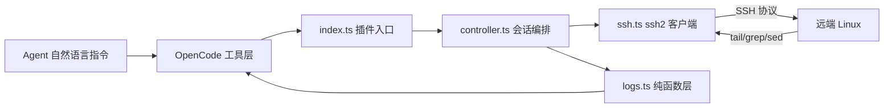

# opencode-server-debug 设计文档

OpenCode 按需远程服务器日志调试插件：以自然语言驱动「连接远端 Linux → 拉取日志文件 → 聚类错误 → 查看上下文 → 汇总分析」的调试闭环。
SSH 由 `ssh2` 库在进程内完成、对上游零修改，与 opencode-edge-debug 同属独立姊妹工程。

## 1 概述

插件注册六个工具（见 4），由 `createServerDebugController` 统一编排生命周期：
连接 → 验证可达 → 活动会话；按需拉取与聚类，断开时清空内存状态。

## 2 插件机制适配

- 入口 `src/index.ts` **仅 default export** 一个 `Plugin` 函数（`async (input) => Hooks`）。
  上游 legacy loader 遍历模块全部导出，任何额外命名导出都会导致「Plugin export is not a function」加载失败。
- 工具经 `tool()` + `tool.schema`(zod) 定义，`Hooks.tool` 的 key 即工具名原名注册；每个参数调用 `.describe()`。
- `Hooks.dispose` 中 `controller.disconnect()`：插件卸载（会话结束、opencode 退出）时兜底清空内存连接与日志缓冲。
- 加载方式：项目 `opencode.json` 加 `{"plugin": ["./opencode-server-debug"]}`（目录含 package.json，入口取 `main`）。

## 3 核心链路

### 3.1 SSH 执行层（ssh.ts，决策记录 D1）

**进程内 SSH**：`createSshClient()` 用 `ssh2` 库建立连接与执行命令，不 spawn 系统 `ssh`。
（原实现「spawn 系统 ssh + 管道喂密码」在 Windows 上行不通：Win32-OpenSSH 只读控制台、忽略管道 stdin，会弹密码提示并永久挂起；改为库后认证不经控制台，跨平台一致。）

- `buildConnectConfig(conn, privateKey?)`：纯函数，组装 ssh2 `ConnectConfig`（host/port/username、`readyTimeout`、`tryKeyboard`）；密码优先、否则私钥；不设 `hostVerifier`（默认自动接受主机密钥，等价原 `StrictHostKeyChecking=accept-new`）。
- `createSshClient()`：动态 `await import("ssh2")` 懒加载；首次 `verify`/`run` 建立连接并缓存复用，`close()` 断开。握手超时 `SSH_READY_TIMEOUT_MS=15s`，单命令超时 `SSH_EXEC_TIMEOUT_MS=30s`。
- **密码在进程内**：经 `password` 或 `keyboard-interactive`（`tryKeyboard`）交给库，不进进程参数、不落盘、不被记录。
- **私钥**：`identityFile` 读为文本交给 ssh2（`privateKey`）；加密私钥暂不支持（报错时提示改用未加密私钥或密码）。
- 失败统一转中文 `ServerDebugError`（连接失败、命令退出码非 0、超时）；命令 stderr 截断后仅随错误消息本地呈现，不泄到上游 TUI。
- 测试用 ssh2 自带 `Server` 起真实进程内 SSH 服务做零 mock 集成（密码/密钥/错误密码/退出码/缺凭证）。

### 3.2 日志解析（logs.ts，纯函数）

- `extractTimestamp(line)`：容忍 `yyyy-MM-dd HH:mm:ss,SSS`、ISO（含 `Z` 或时区偏移）。
- `detectLevel(line)`：`\b(TRACE|DEBUG|INFO|WARN|WARNING|ERROR|FATAL)\b` 不区分大小写，`WARNING` 归一为 `WARN`，缺省 `UNKNOWN`。
- `parseLogEvents(raw)`：按行聚合——前导时间戳或行首级别词视为新事件起点；其余行（堆栈、`Caused by:`）并入上一事件 `message`/`raw`，解决**多行堆栈**。
- `groupErrors(events, topN)`：保留 `level` 为 ERROR/FATAL 或含 `exception|caused by` 的事件；`describeSignature` 去掉时间戳与 log4j 前缀、折叠数字/十六进制，使同类异常（仅变量不同）归并；计数 + 首末出现 + 样例（截断 2000 字符），按计数降序取 topN。
- `filterEvents(events, {level?, grep?})`：级别精确匹配、子串或正则匹配。
- `createRingBuffer` / `truncateText`(MAX_TEXT_CHARS=20000)。

### 3.3 远端命令构造（logs.ts，纯字符串）

- `buildTailCommand(path, lines, {level?, grep?, since?})`：`tail -n N "path"` 后接可选 `| grep -i -E "\b(LEVEL)\b"` / `| grep -i -F "needle"` / `| grep -F "date:"`。
- `buildErrorSearchCommand(path, window=2000)`：`tail -n 2000 "path"`，聚类在本地完成（设计要点：远端只拉取，本地聚合）。
- `buildFindLineCommand(path, pattern)`：`grep -n -F -- "pattern" "path" | head -5`（定位行号）。
- `buildContextCommand(path, center, ctx)`：`sed -n START,ENDp "path"`（START=max(1,center-ctx)）。
- `buildListFilesCommand(paths)`：逐路径 `ls -l "path" 2>/dev/null || echo "缺失: path"`。
- 全部经 `quote()` 双引号包裹并转义内嵌引号。

### 3.4 控制器编排（controller.ts，设计文档 6）

`createServerDebugController(opts?)` 闭包持有 `conn` / `client` / `logBuffer`（不在模块顶层持状态）。

- **connect 幂等**：已连 → 返回「已在运行」；否则 `createClient()`（默认 `createSshClient`）→ `verify`（远端 `echo` 探针）→ 存 `conn` → 列日志文件清单回显。
- **disconnect 幂等**：未连返回 false；否则清空 `conn`/`client`/`logBuffer` 返回 true。
- **read 方法**（`getServerLogs`/`searchErrors`/`getContext`/`analyze`）：未连返回中文引导（不抛错）；否则解析路径（多文件须显式 `path`）→ 构造远端命令 → `client.run` → 本地解析/聚类/截断。
- **被动清空**：`dispose` 调 `disconnect`；连接信息（地址/用户/密码）仅存内存，退出即失，**无 sqlite store、无落盘**。

## 4 工具定义

| 工具名 | 入参 | 行为 |
|---|---|---|
| `connect_server` | `host`,`port?`,`user`,`password`,`logPaths:string[]`,`identityFile?` | SSH 连接 + 验证 + 列文件；连接信息存内存 |
| `disconnect_server` | 无 | 清空内存连接与缓冲；未连返回提示 |
| `get_server_logs` | `path?`,`lines?=200`,`level?`,`grep?`,`since?` | 远端 tail+过滤，截断返回 |
| `search_server_errors` | `path?`,`since?`,`contextLines?`,`topN?=20` | 聚类错误，返回结构化 JSON |
| `get_log_context` | `path`,`line?`,`match?`,`contextLines?=3` | 按行号/子串取上下文 |
| `analyze_server_errors` | `path?`,`topN?=20` | 汇总分析:按类型归类计数、时间分桶标尖峰、根因排序(含模块与 get_log_context 建议)、各类型样例 |

## 5 健壮性与降级

- 可预期失败抛 `ServerDebugError`：中文消息 + 修复路径（缺凭证、加密私钥、重试建议），经工具 execute 抛出后呈现为工具执行错误供 Agent 决策。
- SSH 在进程内完成（ssh2），不再有外部 ssh 进程、无控制台交互提示风险；命令 stderr 截断后仅随错误消息本地呈现，不泄到上游 TUI。
- 依赖缺失（远程不可达 / 认证失败 / ssh2 加载失败）优雅降级：抛中文错误引导；不崩溃、不挂起。

## 6 安全与隐私

- **连接信息仅存内存**：地址/用户/密码/私钥由 `connect_server` 传入、存于闭包；`disconnect_server`/`dispose` 清空并 `close()` 断开；**退出 OpenCode 即失，绝不落盘、绝不上行**。故无 `config.json`、无 sqlite（区别于 plugin-guide 6 的通用 store 规约）。
- 密码/私钥仅在进程内交给 `ssh2`、不记录、不落盘；密钥路径不打印。
- 无外发数据，故 plugin-guide 8 的白名单投影不适用（仅返回给本地 Agent 上下文）。

## 7 v1 限制与未来扩展

- 远端过滤依赖常见 GNU 工具链（`tail`/`grep`/`sed`/`ls`）。
- 错误聚类为启发式（按异常类型/首消息签名去重，折叠数字与十六进制），不解析完整调用链。
- `since` 为时间前缀子串过滤，非精确时间窗。
- 单次错误搜索拉取最近 `ERROR_SEARCH_WINDOW=2000` 行在本地聚类。
- 输出截断上限 `MAX_TEXT_CHARS=20000`（日志文本/样例），Agent 可分段取上下文获取更完整内容。
- 主机密钥默认自动接受（等价原 `StrictHostKeyChecking=accept-new`）；暂不提供指纹固定。
- 暂不支持加密私钥口令，需用未加密私钥或密码认证。
- 未来：精确时间窗（远端 `date` 比对）、多文件并行、错误趋势统计、可选落盘归档。

## 8 决策记录

- **D1 进程内 SSH 执行层（修订）**：原定「spawn 系统 ssh + 管道喂密码、零依赖」，但 Win32-OpenSSH 只从控制台读密码、忽略管道 stdin，导致 Windows 上弹密码提示并永久挂起。改为引入 `ssh2` 库在进程内完成 SSH（认证不经控制台、跨平台一致）；代价是新增一个运行时依赖，须以 `--omit=optional` / `bunfig.toml: optional=false` 跳过其会崩 Bun 的原生可选依赖 `cpu-features`（纯 JS 路径即可正常工作）。
- **D2 连接信息仅存内存**：用户明确要求「退出 OpenCode 即忘记、不能落盘」，故不引 config.json/sqlite，全部存于插件闭包，dispose 兜底清空。
- **D3 错误搜索本地聚类**：远端仅 `tail` 拉取，聚类/过滤在本地（logs.ts 纯函数）完成，便于单测与降噪，避免远端 grep 上下文丢失堆栈。
- **D4 分析增强(阶段 2)**：`analyze_server_errors` 在本地聚类基础上增加时间分桶（分钟/小时，按跨度自适应，保留服务器本地时区）、根因排序（计数优先、末次出现次之）、模块（component）维度与下一步 `get_log_context` 建议；全部走 logs.ts 纯函数，零远端开销。
- **D5 打包分发(阶段 2)**：`pack:bundle` 镜像 edge-debug 脚本，hoisted 模式打含 node_modules 的可移植 tarball，`setup` 校验 ssh 客户端（而非 Edge）；本工程以 AGENTS.md 为权威文档（无 CLAUDE.md）。
