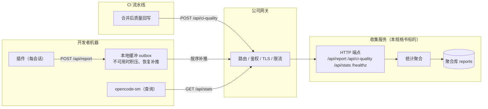

# org 收集服务系统规格书

| | |
|---|---|
| 版本 | v1.1 |
| 日期 | 2026-08-07 |
| 读者 | 后端收集服务开发团队、网关集成团队 |
| 状态 | 生效 |

> **v1.1（2026-08-07）**：新增**基线预估人工工时与 AI 提效百分比**——汇报侧 `workflow.baseline` 可选字段，查询侧 `avgEfficiency` / `baselineSessions` / `trends.efficiency`。全部为可选字段，旧插件↔新服务、新插件↔旧服务两种组合均须容忍（见 11.2）。

本文档定义「OpenCode 会话管理 — org 收集服务」的**接口契约、数据语义与非功能要求**，供其他团队据此实现后端服务并整合到公司网关。实现方可自由选择技术栈与内部架构，只要对外契约与本规格书一致、统计语义可复现相同结果，即为合格交付。

---

## 1. 背景与定位

OpenCode 会话管理方案以「插件 + 独立 CLI + org 收集服务」三件套形态，为团队提供标准化开发流程（五阶段门禁）、理解保障（代码片段评审）与效能分析（Token ROI、质量指标）。完整方案见同目录 `session-management.md`。

**收集服务是唯一需要跨机器汇聚数据的后端组件**，承担三个职责：

| 职责 | 方向 | 调用方 |
|------|------|--------|
| 接收会话摘要汇报 | 写入 | 各开发者机器上的插件（我们提供，已实现） |
| 接收 CI 质量回写 | 写入 | CI 流水线（各业务团队接入） |
| 提供组/组织级统计查询 | 读取 | `opencode-sm` CLI（我们提供，已实现） |

本规格书从 `session-management.md` 第 2.4、3.1、4.3、10、12 章提炼，是收集服务的**唯一接口契约**。我方三端（插件、CLI）已按此契约实现并通过测试，接收集服务的团队无需接触我方代码即可独立开发与联调。

---

## 2. 系统上下文与数据流



### 2.1 三个调用方

- **插件（汇报方）**：每台开发者机器上运行。在会话阶段事件触发 + 定时增量汇报。**收集服务不可用时插件本地缓冲、恢复后按顺序补推**（见 `session-management.md` 2.4「收集服务不可用」）。因此收集服务必须**按 sessionID 幂等 upsert**，对重复投递安全。
- **CI 流水线（回写方）**：会话代码合并后，CI 按 sessionID 回写 `reworkRate` / `testCoverage`（如 SonarQube 覆盖率、Bug/返工检测）。
- **opencode-sm CLI（查询方）**：组/组织级统计查收集服务；会话/项目级统计直读本机插件库，不经过收集服务。

### 2.2 两条质量通道在聚合库合并、互不覆盖

| 通道 | 端点 | 写入的指标 |
|------|------|-----------|
| 插件通道 | `POST /api/report` | `firstPassRate`、`iterationCount`、行数三分类聚合 |
| CI 通道 | `POST /api/ci-quality` | `reworkRate`、`testCoverage` |

同一会话的两类指标由收集服务按 `sessionID` 合并。**插件汇报不得覆盖 CI 已写入的 rework/testCoverage，CI 回写也不得覆盖汇报字段**（实现见 6 节 upsert 语义）。

### 2.3 身份语义（自报快照，与网关无关）

- 开发者的 `account`（账号邮箱）/ `group`（组名）/ `org`（组织名）由开发者本机 `opencode-sm init` 四问**手动自报**，随每条汇报携带为**快照**（见 `session-management.md` 3.1）。
- 组是**名称字符串**，无 ID、无注册表；子组用命名约定（如 `前端组/基础架构组`）。组织结构由各人汇报在聚合库中 `GROUP BY group_name` / `org_name` 自然形成。
- 快照语义：开发者调整身份后，只影响此后的汇报，**历史数据归属不追溯变更**。

> **⚠ 对网关集成团队的关键约束**：`account/group/org` 是客户端自报字段，**网关鉴权得出的身份不得覆盖或改写它们**。不要用网关 SSO 主体替换 `account`，也不要用网关路由前缀推导 `group`/`org`。收集服务必须原样信任汇报 payload 中的身份字段。

---

## 3. 与网关的集成

收集服务作为后端服务挂在公司网关之后。本节给出网关侧需要落实的路由、身份与状态码约定。

### 3.1 路由注册

网关须将以下路径转发到收集服务（方法、路径精确匹配）：

| 方法 | 路径 | 说明 |
|------|------|------|
| POST | `/api/report` | 插件汇报会话摘要 |
| POST | `/api/ci-quality` | CI 质量回写 |
| GET | `/api/stats` | 组/组织级统计查询 |
| GET | `/healthz` | 存活探针（网关健康检查用） |

**路径基址**：插件与 CLI 将开发者在 `identity.json` 里配置的 `collector_url` 作为基址，再拼接 `/api/report` 或 `/api/stats`（见 `session-management.md` 5.1）。因此网关只需保证「`collector_url` + 上表路径」能够解析到收集服务即可——`collector_url` 可填网关根域（推荐，路径即 `/api/*`），也可填带前缀的挂载点（此时 `collector_url` 需包含此前缀）。**建议网关以根域暴露 `/api/*`，避免各机器 `identity.json` 因挂载路径变化而重配**。

### 3.2 状态码纪律（对接插件 outbox 重试逻辑，必须严格遵守）

插件的补推逻辑按 HTTP 状态码分类处理（已实现）：

| 插件收到 | 插件行为 |
|----------|----------|
| 2xx | 视为送达成功，从缓冲删除 |
| 400 | 永久失败（payload 非法），**丢弃不再重试** |
| 401 / 403 | 永久失败（鉴权失败），丢弃并提示开发者核对 `collector_url` |
| 5xx | 瞬时故障，**保留缓冲、下次补推** |
| 网络错误 / 超时 | 同 5xx，保留缓冲 |

因此网关与收集服务必须：

1. **忠实透传上游状态码**，不得把上游 5xx 吞成 2xx（否则插件的失败汇报会丢失），也不得把合法请求的校验失败返回成 5xx（否则非法 payload 会被无限重试）。
2. **对非法 payload 明确返回 400**（含具体 `error` 字段），让插件丢弃。收集服务与网关对「合法/非法」的判定以第 5 章契约为准；网关一般不做 payload 深校验，直接透传给收集服务判定。

### 3.3 网关职责

- **鉴权**：建议网关对 `/api/*` 启用鉴权（mTLS、网关侧 token、网络 ACL 三者任一）。鉴权失败返回 401/403（触发插件侧「核对 collector_url」提示）。
- **TLS 终止**：在网关侧终止 TLS；后端服务可明文内网通信。
- **限流**：可选。汇报为低频小请求（每条几 KB），按普通 API 限流即可；**不得对 `POST /api/report` 施加过短超时**——插件在离线期间会积压缓冲，恢复后按序连发，网关应允许突发批量补推。
- **请求体大小限制**：汇报/回写均在 KB 级，建议上限 ≥ 100 KB，超限返回 413。
- **不记录敏感数据**：网关访问日志不得记录请求体（含账号邮箱等个人信息），见第 8 章。

---

## 4. 通用约定

### 4.1 传输

- 全部端点使用 JSON（`Content-Type: application/json`）；响应亦为 JSON。
- 时间戳一律为 **Unix 毫秒（epoch ms）**，如 `1750000000000`。
- `reportedAt` / 各 `at` 时间戳为**客户端本机时钟**产生（插件/CI 所在机器），收集服务不重写，仅用于 period 过滤与趋势取样。

### 4.2 错误响应

非 2xx 统一返回：

```json
{ "error": "非法的汇报 payload" }
```

| 状态码 | 场景 |
|--------|------|
| 400 | 参数缺失或 payload 不满足契约（详见各端点） |
| 404 | 未知路径 |
| 413 | 请求体超限（网关返回） |
| 5xx | 服务内部故障 |

### 4.3 幂等性

两个写入端点均按 `sessionID` 主键 upsert，**同一会话重复投递安全**（后到覆盖先到或按 6 节合并规则）。收集服务不得因重复汇报报错。

### 4.4 数据不变量

- payload 中**永不含代码内容、不含文件路径**（插件侧已剥离，见 8 章）。
- 汇报携带的 `workflow` 为投影摘要，各字段语义见 5.1。

---

## 5. API 契约

### 5.1 `POST /api/report` — 插件汇报会话摘要

请求体为完整 `SessionReport`：

```json
{
  "sessionID": "sess_abc123",
  "account": "alice@example.com",
  "group": "前端组",
  "org": "Engineering",
  "workflow": {
    "stages": {
      "requirements": {
        "status": "approved",
        "revision": 2,
        "transitions": [
          { "action": "enter", "at": 1750000000000, "note": "开始需求分析" },
          { "action": "approve", "at": 1750003600000 }
        ]
      },
      "design": {
        "status": "approved",
        "revision": 1,
        "transitions": [
          { "action": "enter", "at": 1750003600000 },
          { "action": "approve", "at": 1750007200000 }
        ]
      },
      "implementation": {
        "status": "approved",
        "revision": 1,
        "transitions": [
          { "action": "enter", "at": 1750007200000 },
          { "action": "approve", "at": 1750010800000 }
        ]
      },
      "testing": {
        "status": "approved",
        "revision": 1,
        "transitions": [
          { "action": "enter", "at": 1750010800000 },
          { "action": "approve", "at": 1750014400000 }
        ]
      },
      "review": {
        "status": "approved",
        "revision": 1,
        "transitions": [
          { "action": "enter", "at": 1750014400000 },
          { "action": "approve", "at": 1750018000000 }
        ],
        "checklist": {
          "businessIntent": true,
          "logicExplainable": true,
          "behaviorVerifiable": true,
          "designRationale": true
        },
        "comprehension": { "total": 5, "confirmed": 5 }
      }
    },
    "commit": {
      "status": "allowed",
      "blocked_by": []
    },
    "quality": {
      "firstPassRate": 92,
      "iterationCount": 2,
      "reworkRate": null,
      "testCoverage": null,
      "lines": { "business": 620, "test": 310, "config": 45 }
    },
    "baseline": { "estimatedHours": 120, "setAt": 1750000000000 }
  },
  "cost": 0.36,
  "tokensInput": 60000,
  "tokensOutput": 25000,
  "reportedAt": 1750000000000
}
```

字段语义：

| 字段 | 类型 | 必填 | 说明 |
|------|------|------|------|
| `sessionID` | string | 是 | 上游会话 ID，聚合库主键 |
| `account` | string | 是 | 开发者账号邮箱（init 自报快照） |
| `group` | string | 是 | 组名（名称字符串，子组用 `前端组/基础架构组` 命名约定） |
| `org` | string | 是 | 组织名 |
| `workflow.stages.*.status` | `"not_started" \| "in_progress" \| "approved"` | 是 | 五阶段状态 |
| `workflow.stages.*.revision` | number | 是 | 阶段回退次数（需求质量信号） |
| `workflow.stages.*.transitions` | array | 是 | 阶段转换时间戳序列（耗时统计的数据源），`action ∈ {"enter","revisit","approve"}`，`note` 可选 |
| `workflow.stages.review.checklist` | 四项 boolean | 是 | 审查清单：`businessIntent`/`logicExplainable`/`behaviorVerifiable`/`designRationale` |
| `workflow.stages.review.comprehension` | `{total, confirmed}` | 是 | 理解确认片段总数与已确认数（不携带片段正文） |
| `workflow.commit.status` | `"blocked" \| "allowed"` | 是 | 提交门禁状态 |
| `workflow.commit.blocked_by` | string[] | 是 | 未完成阶段列表 |
| `workflow.commit.force` | `{reason, at, used}` | 否 | 强制提交授权留痕（逃生口，见 `session-management.md` 3.4）；随汇报上行使「绕过审查」在统计中可见 |
| `workflow.quality.firstPassRate` | number \| null | 是 | 一次通过率（0–100 百分比）；纯讨论会话为 `null` |
| `workflow.quality.iterationCount` | number \| null | 是 | 单文件被 AI 编辑的最高次数；无编辑为 `null` |
| `workflow.quality.reworkRate` | number \| null | 是 | 返工率（0–1 分数）；插件通道恒为 `null`，由 CI 通道写入 |
| `workflow.quality.testCoverage` | number \| null | 是 | 增量测试覆盖率（0–100）；插件通道恒为 `null`，由 CI 通道写入 |
| `workflow.quality.lines` | `{business, test, config} \| null` | 是 | AI 净增行数三分类聚合；无 AI 代码编辑为 `null` |
| `workflow.baseline` | `{estimatedHours, setAt} \| null` | 否 | 基线预估人工工时（AI 提效参照系，见 7.2）：项目经理在需求创建时给出，开发者在 TUI 对话中经 `workflow_baseline` 转述录入；`estimatedHours` 单位小时（>0），`setAt` 录入时间戳；未录入或旧版汇报缺省为 `null`，聚合时按无基线处理，**不得报错** |
| `cost` | number \| null | 是 | 会话费用（美元）；daemon 不可达时插件上报 `null`（语义为「未知」，**不得当 0 拒绝**） |
| `tokensInput` / `tokensOutput` | number \| null | 是 | Token 数 |
| `reportedAt` | number | 是 | 汇报时间（插件本机时钟，epoch ms） |

**校验规则**：`sessionID`、`account`、`group`、`org` 必须为非空字符串；`workflow` 必须为对象。其余字段缺省容忍（如 `cost: null`、旧版本可能缺 `lines`）。校验不通过返回 `400 {"error": "非法的汇报 payload"}`。

**响应**：`200 {"ok": true}`。

**upsert 语义**（写入时）：以 `sessionID` 为主键，**覆盖快照字段**（account/group/org/workflow/cost/tokens/reportedAt）；**不得触碰该会话已由 CI 写入的 `reworkRate`/`testCoverage`**（见 6 节）。

### 5.2 `POST /api/ci-quality` — CI 质量回写

请求体：

```json
{ "sessionID": "sess_abc123", "quality": { "reworkRate": 0.08 } }
```

```json
{ "sessionID": "sess_abc123", "quality": { "testCoverage": 82 } }
```

字段语义：

| 字段 | 类型 | 必填 | 说明 |
|------|------|------|------|
| `sessionID` | string | 是 | 会话 ID |
| `quality.reworkRate` | number | 否 | 返工率（0–1 分数） |
| `quality.testCoverage` | number | 否 | 增量测试覆盖率（0–100） |

- 两个子字段均可选、可同时提供；**仅写本次提供的字段，缺失字段保持原值不动**（部分更新）。
- 该会话可能尚无汇报记录（CI 先于插件汇报到达）——**此时须先创建占位行**，后续插件汇报再补齐其余字段。

**响应**：`200 {"ok": true}`。

### 5.3 `GET /api/stats` — 组/组织级统计查询

**查询参数**：

| 参数 | 取值 | 必填 | 说明 |
|------|------|------|------|
| `scope` | `group` \| `org` | 是 | 统计范围 |
| `group` | 组名（URL 编码） | scope=group 时必填 | 如 `前端组` |
| `org` | 组织名（URL 编码） | scope=org 时必填 | 如 `Engineering` |
| `period` | `\d+d`（如 `7d`、`30d`） | 否 | 统计窗口；缺省或非法时不做时间过滤 |

**响应**（200）：`ScopeStats` JSON：

```json
{
  "scope": "group",
  "name": "前端组",
  "members": 5,
  "sessions": 42,
  "completed": 36,
  "completionRate": 0.857,
  "totalCost": 6.3,
  "avgFirstPassRate": 91.0,
  "avgTestCoverage": 78.0,
  "avgReworkRate": 0.06,
  "avgDurationMs": 207360000,
  "lowFirstPassCount": 1,
  "highIterationCount": 1,
  "linesTotal": { "business": 18200, "test": 9500, "config": 1200 },
  "hasLinesData": true,
  "avgEfficiency": 0.62,
  "baselineSessions": 31,
  "trends": {
    "requirementRevision": { "from": 1.5, "to": 0.9, "direction": "down" },
    "reworkRate": { "from": 0.1, "to": 0.06, "direction": "down" },
    "efficiency": { "from": 0.55, "to": 0.68, "direction": "up" }
  },
  "perAccount": [
    {
      "account": "alice@example.com",
      "sessions": 12,
      "completed": 11,
      "completionRate": 0.92,
      "cost": 6.3,
      "avgFirstPassRate": 92.0,
      "avgTestCoverage": 84.0,
      "avgDurationMs": 181440000,
      "lowFirstPassCount": 0,
      "highIterationCount": 0
    }
  ]
}
```

各级字段语义与计算规则见第 7 章。**`perAccount` 按 `sessions` 降序排列**；顶层 `name` 为传入的组名/组织名；`scope` 回显查询范围。

**错误**：`scope` 非法 → `400`；缺 `group`/`org` → `400 {"error": "缺少 group 参数"}`。

### 5.4 `GET /healthz` — 存活探针

```json
{ "ok": true }
```

用于网关健康检查 / 容器探针；不返回业务数据。

---

## 6. 数据模型与存储

聚合库至少含一张以 `session_id` 为主键的报表（参考 DDL，字段名实现方可自定，**语义须等价**）：

```sql
CREATE TABLE reports (
  session_id   TEXT PRIMARY KEY,   -- 上游会话 ID
  account      TEXT,               -- 身份快照（init 自报）
  group_name   TEXT,               -- 组名快照
  org_name     TEXT,               -- 组织名快照
  workflow     TEXT,               -- SessionReport.workflow 的 JSON 原样
  cost         REAL,               -- 会话费用；NULL=未知
  tokens_input INTEGER,            -- 输入 Token
  tokens_output INTEGER,           -- 输出 Token
  rework_rate  REAL,               -- CI 通道写入（0-1）；NULL=未回写
  test_coverage REAL,              -- CI 通道写入（0-100）；NULL=未回写
  reported_at  INTEGER             -- 客户端汇报时间戳
);

CREATE INDEX idx_reports_group ON reports(group_name);
CREATE INDEX idx_reports_org  ON reports(org_name);
```

### 6.1 写入合并语义

- **`upsertReport`**（对应 5.1）：`INSERT ... ON CONFLICT(session_id) DO UPDATE` 更新 `account/group_name/org_name/workflow/cost/tokens_*/reported_at`，**不更新** `rework_rate/test_coverage`（保证 CI 指标不被汇报覆盖）。
- **`applyCiQuality`**（对应 5.2）：`INSERT ... ON CONFLICT(session_id) DO UPDATE`，仅 `COALESCE(excluded.rework_rate, reports.rework_rate)`、`COALESCE(excluded.test_coverage, reports.test_coverage)`（部分更新，未提供的字段保留原值；会话不存在时先建占位行）。

### 6.2 存储建议

- 推荐 SQLite（参考实现用 WAL 模式）或任意同等语义的关系库。并发写入必须原子（upsert 语句或事务），避免同一会话并发汇报/回写丢更新。
- `group_name` / `org_name` 上建索引（组/组织级统计的过滤键）。
- 数据量为**单组织内会话数级**（数百开发者 × 数万会话量级），普通关系库即可承载；报表表为不可变追加型，建议定期归档或按 `reported_at` 分区。

---

## 7. 统计聚合规则

`GET /api/stats` 的聚合语义如下，**实现必须复现相同的数值结果**。所有平均值均为「范围内有该数据的会话」的均值（无数据为 `null`，不把 `null` 当 0 平均）。

### 7.1 范围与过滤

| 步骤 | 规则 |
|------|------|
| 范围 | `scope=group` → `group_name = <group>`；`scope=org` → `org_name = <org>` |
| period 过滤 | 指定 `period=Nd` 时：`since = now − N×86400000`，仅保留 `reported_at IS NULL OR reported_at >= since`；缺省则全部 |
| members | 范围内**去重 `account`** 数（`account` 为 NULL 计为 `"(unknown)"`） |
| sessions | 范围内汇报行数 |

### 7.2 顶层指标

| 字段 | 计算 |
|------|------|
| `completed` | `workflow.commit.status === "allowed"` 的行数 |
| `completionRate` | `completed / sessions`（sessions=0 时为 0） |
| `totalCost` | `Σ (cost ?? 0)`（`NULL` 按 0 计入总费用） |
| `avgFirstPassRate` | 非 NULL `firstPassRate` 的均值（0–100 百分比） |
| `avgTestCoverage` | 非 NULL `test_coverage` 的均值（0–100） |
| `avgReworkRate` | 非 NULL `rework_rate` 的均值（0–1 分数） |
| `avgDurationMs` | 各会话耗时的均值；会话耗时 = 全部 `transitions[].at` 最大值 − 最小值，无转换则为 0 |
| `lowFirstPassCount` | `firstPassRate < 70` 的会话数（返工信号参考线，非硬阈值） |
| `highIterationCount` | `iterationCount >= 5` 的会话数 |
| `linesTotal` | 有 `lines` 的会话按三分类**求和**（`business`/`test`/`config` 分别累加；会话内已逐文件 clamp≥0，会话间直接相加，**不做平均**——累加型指标） |
| `hasLinesData` | 范围内是否存在任一会话 `lines` 非 NULL |
| `avgEfficiency` | 平均 AI 提效率（比率型指标，对会话求均值）。单会话提效率 =（`baseline.estimatedHours × 3600000 − 会话耗时）÷（`baseline.estimatedHours × 3600000`），会话耗时同 `avgDurationMs` 口径（全部 `transitions[].at` 最大值 − 最小值）；**可为负**（实际超预估，仅展示、不设阈值）；无基线或会话耗时 ≤ 0 的会话不参与（`null`）；范围内无任何参与会话时为 `null` |
| `baselineSessions` | 范围内已录入基线（`workflow.baseline.estimatedHours > 0`）的会话数（提效曲线覆盖率参考） |

### 7.3 趋势

趋势仅在**指定 `period` 且汇报带 `reportedAt`** 时计算；任一半段无数据则该趋势为 `null`。

| 字段 | 计算 |
|------|------|
| 分段 | `mid = since + period/2`；`reported_at < mid` 为「早半段」，否则「近半段」 |
| `requirementRevision` | 早半段与近半段各自 `workflow.stages.requirements.revision` 的均值（缺省按 0） |
| `reworkRate` | 早半段与近半段各自 `rework_rate` 的均值 |
| `efficiency` | 早半段与近半段各自单会话提效率的均值（口径同 `avgEfficiency`；无基线/耗时 ≤ 0 的会话不参与），即「研发提效曲线」的数据基础 |
| `direction` | `to > from` → `"up"`；`to < from` → `"down"`；相等 → `"flat"` |

### 7.4 perAccount（成员行）

按 `account` 分组，**按 `sessions` 降序**返回。成员行字段固定为：`account`、`sessions`、`completed`、`completionRate`、`cost`、`avgFirstPassRate`、`avgTestCoverage`、`avgDurationMs`、`lowFirstPassCount`、`highIterationCount`——口径均以该成员名下会话计（`cost` 为该成员 Σ cost）。**成员行不包含顶层聚合指标**：`linesTotal`、`hasLinesData`、`avgEfficiency`、`baselineSessions`、`trends.*` 仅存在于整组/整组织聚合，不加入成员行（契约保持最小）；CLI 对成员仅做排行与低一次通过率/覆盖率标注。

### 7.5 汇总层级差异

- 会话级 `firstPassRate` 等明细来自各本机插件库，**不经收集服务**。
- 组/组织级全部指标来自收集服务聚合；CLI 查询时对 `avgFirstPassRate` 过低成员、`linesTotal` 等做展示层标注（仅展示，无告警）。

---

## 8. 隐私与安全

- **不含代码**：payload 中无任何代码内容、无文件路径、无理解确认正文。插件侧已由 `summarizeWorkflow` 剥离（`session-management.md` 第 12 章）。收集服务**不应在日志中记录请求体**（含账号邮箱等个人信息）；如需排障，仅记录 `sessionID` + 状态码。
- **账号邮箱属个人信息**：收集服务应仅内网可达（或经网关鉴权），最小化留存，访问权限限于组/组织管理者。
- **身份信任边界**：身份字段为客户端自报快照，服务端不校验其真实性（防绕过不是目标，统计口径的稳定性优先）；网关不得用自有鉴权身份改写。
- **汇报可关闭**：开发者可不配置 `collector_url`，退化为仅本机统计；收集服务对缺失汇报保持静默，不产生副作用。

---

## 9. 非功能需求

| 项目 | 要求 |
|------|------|
| 规模 | 单组织数百开发者；每会话数条汇报（阶段事件 + 定时增量），峰值存在「离线恢复后批量补推」的突发，设计承受量级为单组织每日千级请求 |
| 幂等 | 两个写入端点按 `sessionID` 幂等，重复投递不产生重复统计 |
| 可用性 | 强一致非必需——插件在收集服务不可用时本地缓冲、恢复补推，整体为**最终一致** |
| 并发 | 同一会话并发汇报与 CI 回写不丢更新（upsert 原子） |
| 持久化 | 报表表为单一数据源，须定期备份；迁移需向前兼容旧汇报（只做加字段类变更，见 11 节） |
| 性能 | `/api/stats` 单次查询应亚秒级（有索引 + 分页/归档兜底） |
| 可观测 | 提供 `/healthz`；建议暴露请求数、写入延迟、聚合耗时等指标供网关监控 |

---

## 10. 验收与冒烟测试

联调环境接入网关后，按下述用例逐条验证（可用 curl 直接打网关地址）：

```bash
BASE=https://<gateway>/api
```

| # | 用例 | 期望 |
|---|------|------|
| 1 | `POST $BASE/report`（合法 payload，sessionID=s1） | `200 {"ok":true}` |
| 2 | 再次 `POST $BASE/report`（同 s1，改 cost） | `200`；`GET stats` 中 s1 费用为新值（覆盖语义） |
| 3 | `POST $BASE/report`（缺 `sessionID`） | `400 {"error":...}` |
| 4 | `POST $BASE/ci-quality`（s1 的 `reworkRate:0.08`） | `200`；随后查 stats：`avgReworkRate=0.08`，且 `firstPassRate` 仍为报告值（合并不覆盖） |
| 5 | 先 `POST $BASE/ci-quality`（s2，仅 coverage）再 `POST $BASE/report`（s2） | `200`；stats 中 s2 同时有 coverage 与 report 字段（占位行合并） |
| 6 | `GET $BASE/stats?scope=group&group=前端组&period=30d` | `200`，响应含 `scope/name/members/sessions/.../perAccount` 全部字段，形状与 5.3 一致 |
| 7 | `GET $BASE/stats?scope=group`（缺 group） | `400` |
| 8 | `GET $BASE/stats?scope=unknown` | `400` |
| 9 | `GET $BASE/../healthz` 或直接 `GET <host>/healthz` | `200 {"ok":true}` |
| 10 | 对未鉴权请求访问 `/api/*` | 网关返回 `401/403` |
| 11 | 模拟上游 5xx（网关临时断开后端）时 `POST /api/report` | 网关不得返回 2xx/4xx 吞掉故障（应 502/504 透传） |

**数值等价性**：用例 4–6 的聚合数值须与我方参考实现 `packages/collector`（见 11 节）对同一批输入的结果一致（误差 ≤ 浮点舍入）。

---

## 11. 参考实现与演进

### 11.1 参考实现

我方仓库 `opencode-session-mgmt/packages/collector/` 提供一份**最小参考实现**（Bun + `bun:sqlite`，零外部依赖），当前用于我方三端联调。其行为即为本规格书的可执行解释。实现方可将其作为契约测试基准，也可完全重写（任何语言/框架），只要对外契约、聚合公式与 upsert 语义一致。涉及的全部本地代码见 11.2 清单。

### 11.2 涉及的本地代码清单

与本规格书相关的本仓库代码按角色分组如下，供联调与契约核对时定位。`sm-shared` 契约类型是插件、CLI、收集服务三方的**唯一事实来源**，字段变更须三包同步；对收集服务实现方而言，下列客户端代码均为只读参考，无需改动。

**① 收集服务参考实现**（本规格书标的，`packages/collector/`）：

| 文件 | 行数 | 对应契约 |
|------|------|----------|
| `packages/collector/src/index.ts` | 95 | HTTP 端点路由、参数解析、payload 校验、状态码纪律（第 3、4、5 章） |
| `packages/collector/src/db.ts` | 369 | `reports` 表 DDL、`upsertReport`/`applyCiQuality` 合并、`statsGroup`/`statsOrg` 聚合（第 6、7 章；含基线提效聚合 6.3） |
| `packages/collector/test/db.test.ts` | 266 | upsert 合并与聚合数值测试（10 节数值等价性的可执行基准；含基线提效均值与趋势用例） |
| `packages/collector/Dockerfile` | 7 | 容器镜像构建（`oven/bun:1` 基底、COPY `dist/collector`，离线搬运见部署手册 9.4 节） |

**② 契约层**（三包共用，`packages/shared/`）：

| 文件 | 行数 | 对应契约 |
|------|------|----------|
| `packages/shared/src/report.ts` | 111 | `SessionReport`/`CiQualityReport` payload 类型与 `summarizeWorkflow` 投影（5.1、8 章） |
| `packages/shared/src/workflow.ts` | 153 | `WorkflowState` 全量类型及子结构（5.1 `workflow` 字段基础） |
| `packages/shared/src/loc.ts` | 149 | AI 行数三分类 `LinesCategory` 与分类汇总（5.1 `workflow.quality.lines`、7.2 `linesTotal`） |
| `packages/shared/src/merge.ts` | 50 | `deepMerge` 增量合并：Agent 指标与 CI 指标互不覆盖（6.1） |
| `packages/shared/src/identity.ts` | 76 | `identity.json` 类型与读写：`account`/`group`/`org`/`collector_url`（2.3、3.1） |
| `packages/shared/src/index.ts` | 5 | barrel 导出 |

**③ 汇报方：插件**（`POST /api/report` 客户端，`packages/plugin/`）：

| 文件 | 行数 | 对应契约 |
|------|------|----------|
| `packages/plugin/src/report.ts` | 93 | 汇报组装 `buildReport` + outbox 补推 `flushOutbox`（3.2 状态码纪律的客户端依据） |
| `packages/plugin/src/db/schema.ts` | 65 | 插件库表定义（含 `outbox` 汇报缓冲表） |
| `packages/plugin/src/db/index.ts` | 185 | `Store`：工作流状态读写 + outbox 入队/待发/删除 |

**④ 查询方：CLI**（`GET /api/stats` 客户端，`packages/cli/`）：

| 文件 | 行数 | 对应契约 |
|------|------|----------|
| `packages/cli/src/api.ts` | 97 | `collectorQuery`：拼接 `{collector_url}/api/stats` 查询（5.3） |
| `packages/cli/src/commands/stats.ts` | 370 | `opencode-sm stats`：会话/项目级直读本机插件库，组/组织级查收集服务 |
| `packages/cli/src/commands/init.ts` | 37 | 四问写入 `identity.json`（含 `collector_url`，3.1 路径基址来源） |

**⑤ 部署与配置示例**（`deploy/`）：

| 文件 | 内容 |
|------|------|
| `deploy/docker-compose.collector.yml` | 收集服务部署示例（端口 8787、数据卷、镜像名 `opencode-sm-collector`） |
| `deploy/opencode.json.example` | 插件启用配置示例 |

> CI 回写方（`POST /api/ci-quality`）由各业务团队的流水线实现，不在本仓库代码内，仅需按 5.2 契约调用。

### 11.3 演进与兼容

- 字段只增不删、只弱不严：新增可选字段不得导致旧客户端请求被拒；`null` 语义固定（`cost:null`=未知、`lines:null`=无代码编辑、`reworkRate/testCoverage:null`=未回写、`baseline:null`=未录入基线）。
- 契约变更须保证**旧插件/旧 CLI 在新服务、新服务在旧插件**两种组合下均不报错（宽松校验 + 缺失字段容忍）。v1.1 新增字段全部可选：旧插件汇报无 `workflow.baseline` 时新服务按无基线聚合；旧服务响应无 `avgEfficiency`/`baselineSessions`/`trends.efficiency` 时，新 CLI 已按读侧可选字段降级为 N/A（见 `session-management.md` 第 6.3 章）。
- 若网关侧需要给 `/api/stats` 加权限分层（如组长看本组、管理员看全组织），由网关在收集服务之上实现，收集服务本体不做访问控制矩阵（保持契约最小）。
