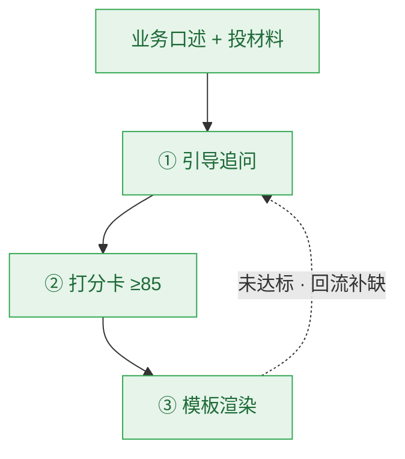

# 用 AI 把业务脑子里「写不出的需求」引导成「开发能照着做」的规范需求书

> 汇报对象：管理层｜定位：方案价值与决策请求（技术细节见设计文档族 workflow-reqdoc.md）

## 一、一句话结论

业务往往「心里有需求、笔下写不出」——缺结构、漏异常、忘权限合规，写出来的东西开发看不懂、照做就返工。我们规划了一套需求书工作流（reqdoc）：让 AI 充当「需求编写教练」，业务**口述 + 丢材料**，AI 沿着一条编写链路逐步引导、帮拆功能点、按行方模板代笔成稿，把含糊的口头诉求变成**完整、规范、来源可追溯、质量可度量**的需求书。业务始终是需求的 owner，AI 只帮写、不替业务做主。

## 二、业务写需求，难在哪

| 领导关心的点 | 方案回应 |
|---|---|
| **需求质量**：业务自己写的需求常漏异常 / 权限 / 合规，开发照做上线出事，来回扯皮返工 | 沿编写链路逐步引导补全：AI 按探针清单逼问真实案例（异常 / 逆向 / 权限 / 合规），打分卡八维门禁保证需求不缺关键项，每条要点可追溯来源 |

业务写不出好需求，本质是三道坎：

- **写不出结构**：心里有需求，却落不到纸面，口头讲完开发理解偏差；
- **写不全**：异常、逆向撤销、权限隔离、合规脱敏这些「业务觉得理所当然、却最容易漏」的项，往往根本没被提起；
- **写不规范**：没有统一模板，开发看不懂、照做就返工。

## 三、总体设计：AI 当教练，沿链路把需求写清楚、写规范

不让 AI 凭空代写，而是把「写需求」拆成一条可引导、可把关的编写链路；同时用一根**质量飞轮**贯穿全程，保证产出「完整、规范、可实施」。

**编写链路（主线）**：需求按五步推进，每步可反复迭代、不可跳过：

**质量飞轮（贯穿全程的保证）**：把「需求好不好」从主观感受升级为可量化门禁，三根支柱缺一不可（价值链见 workflow-reqdoc.md 1 章）：

- **引导追问**：业务没讲全 → 需求写不全的第一道闸，靠探针把缺口问出来；
- **打分卡**：八维分数让「需求好不好」可量化，扣分项同时是追问地图，直接告诉业务还该补哪类信息；
- **模板渲染**：严格逐字遵循行方模板，来源逐字段标注，产出开发能直接用的规范文档。

三根支柱对应落到编写链路的环节（见第四节）：引导追问主攻**边界与异常**，模板渲染落在**需求规格书**，打分卡门禁守在**业务确认**。

**机构规约（贴合本行本机构）**：机构可把自己的需求编写规矩（术语怎么叫、异常怎么分、非功能指标怎么定等）交给系统，AI 在写对应环节时就会被这些本行本机构的规矩带着走，不会写成千篇一律的通用稿；要加新规矩，丢一份文件即可生效，无需改代码。需求书工作流当前已内置的规约：

| 编写环节 | 规约内容 | 作用 |
|---|---|---|
| 目标与场景 | 范围与边界 | 写清本次需求做什么、不做什么，边界划明白 |
| 流程与规则 | 术语与命名 | 涉及制度 / 监管的术语引用原文，不凭记忆改写 |
| 流程与规则 | 状态与生命周期 | 订单 / 工单 / 账户等关键对象的状态变化写完整 |
| 边界与异常 | 异常分类 | 把异常分成业务 / 系统 / 边界三类，避免漏想 |
| 边界与异常 | 非功能量化 | 性能 / 并发 / 可用性 / 灾备等给可度量指标，不写空话 |
| 边界与异常 | 系统现状与能力 | 需求须建立在现有系统能力之上，不凭空设想接口字段 |
| 需求规格书 | 可验证与验收 | 每条需求附验收标准，功能 / 非功能 / 合规三类须可测 |

## 四、逐环把关：每一步 AI 怎么帮写、质量怎么兜底

**① 目标与场景——把痛点问明白**
机构「范围与边界」规约注入，AI 引导业务提炼核心用户 / 业务场景 / 业务价值，显式界定做什么、不做什么，避免一上来就跑偏。

**② 流程与规则——把主流程理顺、字段落定**
「术语与命名」「状态与生命周期」规约注入，AI 把口头流程整理成可读步骤，草拟主流程、字段与数据字典，对有关键状态的对象列出完整状态变化，不凭记忆改写术语。

**③ 边界与异常——把「最容易漏」的坑逼出来（质量飞轮·引导追问）**
这是业务写需求最薄弱的一环，也是引导追问发力主战场。AI 用渐进式探针帮业务补齐遗漏（每次最多 5 问、带 A/B/C 选项与默认推荐，同一需求追问最长 3 轮），专治「觉得理所当然却没讲出来」的坑：主流程闭环、真实异常案例、逆向撤销、敏感字段脱敏、权限与机构隔离；配合「异常分类」「非功能量化」「系统现状与能力」规约，要求性能 / 并发 / 灾备 / 数据分级给可度量指标，且需求须建立在现有系统能力之上。

**④ 需求规格书——按模板写成「开发能照着做」的稿（质量飞轮·模板渲染）**
成稿严格逐字遵循行方《业务需求说明书》模板，从封面、术语、到每功能点的输入 / 处理 / 异常 / 安全性 / 数据存贮。综合材料 + 问答拆成功能点清单（编号 / 名称 / 优先级），业务确认后逐字段定义名称 / 类型 / 长度 / 必填 / 取值 / 来源系统，形成数据字典；逐字段标来源——文档提取标 `[文档]`、问答补全标 `[问答]`、尚未获得标 `[缺省]`，绝不杜撰；「可验证与验收」规约要求每条需求附功能 / 非功能 / 监管合规三类可测验收标准。

**⑤ 业务确认——逐条签核 + 质量门禁兜底（质量飞轮·打分卡）**
业务逐条确认 PRD 要点，自己认领需求；同时两道质量门禁把关：
- **打分卡八维门禁**：8 维 100 分、≥85 才放行，`total` 由服务端计算、业务确认强制、两处硬拦截；其中 material / nfr / acceptability 任一为 0 分即视为不可实施。

| 维度 | 名称 | 满分 | 判定要点 |
|---|---|---|---|
| businessValue | 业务目标与价值 | 12 | 须明确使用角色与解决的痛点 |
| flowClosure | 主流程逻辑闭环 | 20 | 输入 / 处理 / 输出须闭环，有触发条件 |
| edgeControl | 异常与边界控制 | 22 | 须覆盖超时、扣款 / 提交失败、并发重复、逆向撤销 / 驳回 |
| compliance | 合规与数据安全 | 16 | 敏感字段须脱敏；资金 / 高危须留痕与复核 |
| authority | 权限与机构隔离 | 8 | 须明确总 / 分 / 支行数据边界及岗位权限 |
| material | 素材真实性 | 8 | 须有真实案例 / 字段 / 接口证据，非纯 AI 揣测 |
| nfr | 非功能覆盖 | 7 | 性能 / 并发 / 可用性 / 灾备 / 数据主权 / 信创 |
| acceptability | 可验收性 | 7 | 每功能点须有量化验收指标 |

- **来源真实性门禁**：`[文档]` 占比 ≥30% 或 ≥2 功能点含文档支撑，否则定稿拦截，防止全程靠 AI 问答兜底、毫无书面依据。

两道门禁通过后，导出 Word 交付件（.docx 与 md 同目录归档）。

## 五、规划中的能力

| 能力 | 规划状态 |
|---|---|
| 需求编写五步流程 | 规划中；定稿前强制业务确认，不可跳过，可反复迭代 |
| 机构规约按需注入 | 规划中；零代码扩展，已内置 7 份 reqdoc 规约 |
| 引导式追问探针 | 规划中；7 条探针清单，进规格书前强制记录覆盖、缺口与打分一致校验 |
| PRD 质量打分卡 | 规划中；8 维 100 分、≥85 硬门禁、业务确认强制、两处硬拦截 |
| 功能点拆解 | 规划中；综合材料 + 问答拆功能点清单，业务确认后建子目录 |
| 字段定义（数据字典） | 规划中；进规格书前逐字段与业务确认，硬门禁 |
| 资料扫描 | 规划中；reqdoc_scan 解析 docx / pdf / xlsx / txt / md / json / csv |
| 来源真实性门禁 | 规划中；[文档] 占比 ≥30% 或 ≥2 功能点含文档支撑，否则定稿拦截 |
| 模板化 Word 交付件 | 规划中；reqdoc_export 生成 .docx 与 md 同目录归档 |

## 六、兼容现状：不改变业务现有习惯

- 业务「口述 + 丢材料」完全 OK：材料放进 01~04 目录 AI 扫描提取，没材料就口述补全，无需一次备齐；
- AI 帮写的内容不脱离业务的掌控，每条要点由业务逐条签核、自己认领；
- 阶段推进、确认、回退全部在对话里完成，业务无需额外学习工具；
- 与 SDLC 同源引擎，需求定稿后可平滑交接进开发。
