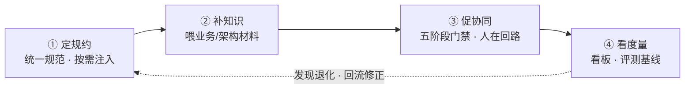
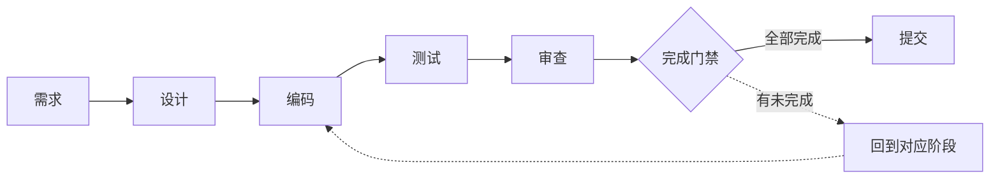
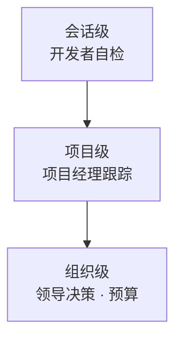

# 把 AI 辅助研发治理成「可跟踪、可理解、可度量」的标准化过程

> 汇报对象：管理层｜定位：方案价值与决策请求（技术细节见设计文档族 session-management.md）

## 一、一句话结论

针对「AI 写代码质量不可控、人接不住、看不到投入产出」的普遍顾虑，我们已落地一套**对现有工具零改动**的会话管理工作流：把 AI 辅助研发从「不可控的对话」治理为「**需求走流程、代码被理解、产出可度量、质量有护栏**」的标准化过程，并且完全兼容同事在 IDE 里用智能插件手工写码的现有习惯。

## 二、背景：这两件事必须回答

| 领导关心的问题 | 方案给出的回应机制 |
|---|---|
| **退出风险**：AI 写的代码，人能不能接、能不能改、AI 停了怎么办 | 理解保障：每段 AI 代码由人确认「看懂 + 认可」；审查清单把关，三个月后仍可维护 |
| **ROI 验证**：Token 投入产出合不合理、预算怎么定 | 效能度量：阶段耗时、一次通过率、返工率、费用、提效百分比，会话 → 项目 → 组织三级看板 |

促成方案的现状痛点：

- 多需求并行，会话切来切去，需求常常走不完流程；
- 没有统一规约，各写各的，风格、安全、异常处理不一致；
- 改提示词、改规则靠拍脑袋，无基线对照，质量悄然退化；
- 同事用 IDE 内置插件（Cursor 等）写码，与 Agent 各写各的、互相覆盖。

## 三、方案：四根支柱，每根一句话

| 支柱 | 做什么 | 对领导的价值 |
|---|---|---|
| ① 定规约 | 统一编码、安全、流程规约，随开发阶段按需注入 | 风格一致，弱模型也守规矩 |
| ② 补知识 | 把业务、架构材料喂给 AI，先理解再动手 | 减少「改一处、坏一片」的幻觉式实现 |
| ③ 促协同 | 需求 → 设计 → 编码 → 测试 → 审查 → 提交，五阶段完成门禁，人在回路逐段把关 | 需求必走完流程，关键节点人说了算 |
| ④ 看度量 | 阶段耗时、一次通过率、返工率、费用、提效百分比数据化，评测基线驱动规则迭代 | 提效可证明、质量可追溯、改进有依据 |

四根支柱构成一条闭环，缺一便会在某个环节失控：

其中「③ 促协同」落实为一条**完成门禁**的标准化流程——需求必走完、可反复迭代、不可跳过：

## 四、已落地成效（均已上线可用）

| 能力 | 现状 |
|---|---|
| 工作流五阶段门禁 | 完成；提交前强制审查，不可跳过，可反复迭代 |
| 理解保障 | 完成；AI 代码逐段人工确认，纯手工代码由人整体把关 |
| 统计看板 | 完成；本机 CLI 统计 + 组织级看板（内网收集服务） |
| 数据驱动规则迭代 | 完成；评测基线，模型遵循度多次迭代持续提升 |
| IDE 手工编码协同 | 完成；AI 打开 IDE 并锁定文件，绝不覆盖人工改动 |
| 需求书（reqdoc）工作流 | 完成；支持需求分析师代写需求，含质量打分卡门禁 |

统计看板分三级，自下而上汇聚成决策依据：

## 五、兼容现状：不改变同事现有习惯

- 用 IDE 智能插件写码完全 OK：AI 打开 IDE、锁定该文件，**人工写的代码 AI 不会覆盖**；
- 手工写的代码不进「AI 理解确认」流程，由人整体审查；
- 阶段推进、确认、回退全部在对话里完成，无需额外学习工具。

人机协同写码的边界约定（AI 与 IDE 各司其职、互不覆盖）：

## 六、引入方式：低风险、低门槛

- 对 OpenCode 本体**零改动**，可随上游升级，可随时卸载还原；
- 每台开发机一次性约 2 分钟安装配置；
- 形态：插件 + 独立 CLI + 内网收集服务（收集服务需在内网部署一次）。