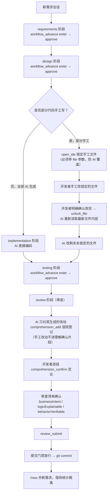
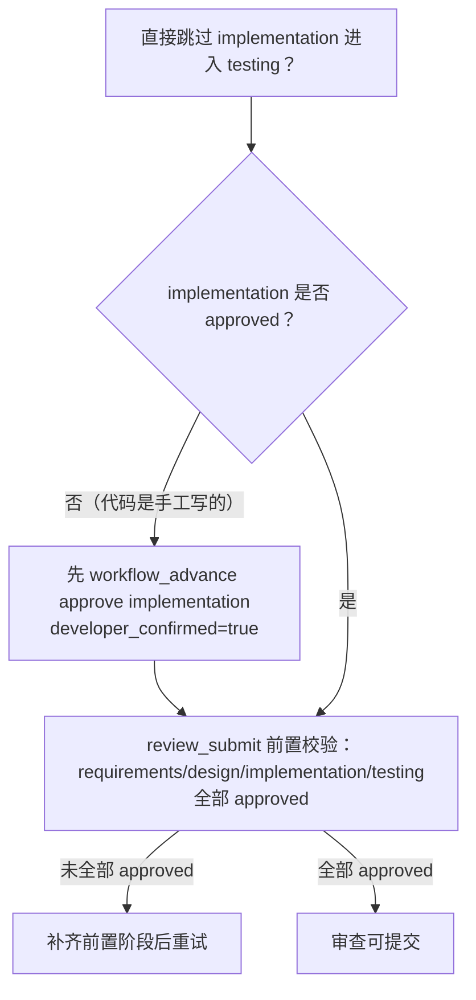
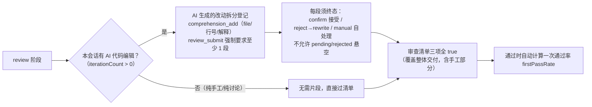
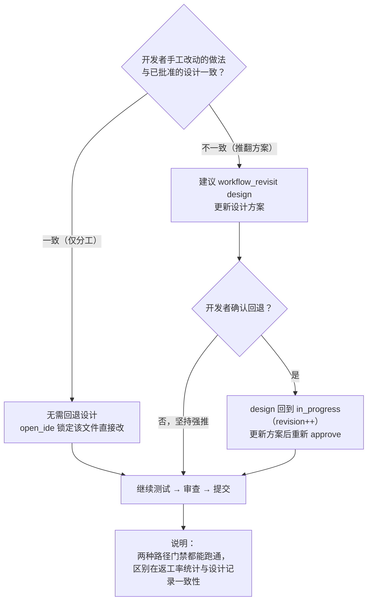

# 混合开发工作流：部分手工 + 部分 AI 生成

本页整理「需求/设计走工作流、代码部分手工写、再回到工作流完成测试与审查」的完整流程，
以及「AI 提出多处改动、开发者认领其中一处手工实现」时的推进方式。

## 1. 主干流程

## 2. 阶段推进的硬性约束

- 阶段进入/批准/回退可任意跳转（完成门禁模型），无顺序硬拦截（`applyTransition` 仅约束单阶段状态机）。
- 唯二硬约束：`review_submit` 要求前置四阶段全部 approved；`git commit` 被门禁拦截直到五阶段全 approved。
- `workflow_advance approve` 必须 `developer_confirmed=true`；审查阶段不可用 `workflow_advance` approve，必须走 `review_submit`。

## 3. 审查内容：谁写的审谁

- **AI 生成的代码**：逐段理解确认（做了什么/为什么/替代方案/风险），是审查核心。
- **手工写的代码**：不进理解确认片段（AI 不解释它没写的代码），由开发者经清单项整体把关。
- 清单 `designRationale` 为 auto 项，全部片段定论即通过，不占具名参数。

## 4. 手工改动与设计冲突时的决策

- **同一方案的分工**：不用回设计阶段，直接锁定文件手工改即可。
- **推翻已批准方案**：无硬性拦截（工作流不 diff 设计与代码），但正确做法是回退设计，否则 `designRationale` 与实际不符，返工率统计也漏记这次偏差。
