# Session Management: 标准化开发流程、理解保障与效能分析

## 1. 概述

### 1.1 核心问题

开发人员在使用 OpenCode 进行 AI 辅助开发时，面临三个层次的问题：

| 层次 | 问题 | 本质 |
|------|------|------|
| 过程管理 | 多个需求并行，如何在会话间切换并走完完整流程 | 效率问题 |
| **理解保障** | **AI 生成了代码，人是否真正看懂了？三个月后谁能维护？** | **控制权问题** |
| 效能度量 | AI 到底提效了多少？Token 消耗是否合理 | 可证明性问题 |

这三个层次对应《领导汇报_退出风险与ROI评估》中的两个核心疑问：

- **疑问一（退出风险）**：AI 写的代码，人能不能接、能不能改、AI 停了怎么办
- **疑问二（ROI 验证）**：Token 投入与产出之间的关系，同等产出下资源配置的优化空间

### 1.2 核心场景

**基本前提**：开发人员始终在 TUI 内，以自然语言对话的形式进行开发。工作流的推进（进入阶段、确认完成、回退）、代码审查、理解确认，全部通过对话完成，不需要退出 TUI 执行 CLI 命令。

CLI 只做两件事：
- **会话管理**：在 TUI 之外创建、列表、删除、标记会话
- **外部查看**：在不进入 TUI 的情况下查看工作流状态和统计数据

开发人员使用 OpenCode 进行 AI 辅助开发时，经常在同一时间收到多个需求。每个需求需要走完完整流程：需求分析 → 设计 → 编码 → 测试 → 审查 → 提交。每个需求对应一个会话，在不同需求之间来回切换，但每个需求都能走完完整流程。

### 1.3 能力清单

系统提供四项能力：

1. **会话管理** — 纯 CLI 子命令，不依赖 TUI 也能管理会话
2. **工作流追踪** — 确保每个会话走完完整流程，允许反复迭代但不可跳过
3. **理解保障** — 确保开发者真正理解 AI 生成的代码，而非仅仅"审查通过"
4. **使用分析** — 支撑投入产出评估、算力预算规划与质量监控，为资源配置决策提供数据依据

### 1.4 现状架构

OpenCode 采用 C/S 架构：

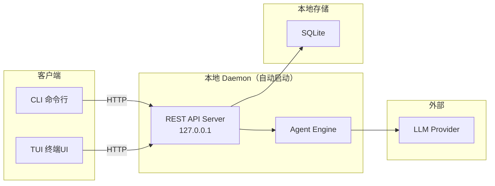

**TUI 已有完善的会话管理**（不需要改动）：创建、列表、删除、重命名、快速切换（`<leader>1-9`）、分叉、后台运行、压缩、中断、恢复。

**REST API 已完备**（全部复用，不修改）：`session.list`、`session.create`、`session.get`、`session.prompt`、`session.compact`、`session.interrupt`、`session.active`、`session.context`、`session.history`。上游 CLI 也已有 `opencode session list|delete`、`opencode stats`（token/费用统计）。

**Project（项目）是自动关联的**：OpenCode 根据工作目录自动创建 Project（`ProjectTable`，含 `worktree` 路径、`name`、`icon` 等）。开发者在某个目录下启动 OpenCode 时，自动关联该目录对应的 Project。Session 创建时自动继承当前 Project 的 `project_id`。**开发者不需要手动设定或管理 Project**。

> **例**：Alice 在 `~/work/user-service` 下执行 `opencode`，OpenCode 自动创建 Project（`worktree=/home/alice/work/user-service`，`name=user-service`，`id=proj_a1b2c3`）；她在 TUI 里创建的会话自动继承 `project_id=proj_a1b2c3`。第二天她在 `~/work/frontend` 启动 OpenCode，会话自动归属另一个 Project。全程无任何配置操作。因此统计时 `opencode-sm stats --period 7d` 省略 `--project` 即按 CWD 自动聚合本项目数据；只有人为划定的组/组织层级（开发者 init 时自报的身份数据，无法从 CWD 推断）才需要显式传 `--group`/`--org`。

**上游未覆盖的能力**由定制三件套补齐——**插件 + 独立 CLI `opencode-sm` + org 收集服务**（见 2.4，全部不修改上游代码）：

1. 工作流追踪机制（阶段推进、审查门禁、提交门禁）
2. 理解保障机制（代码片段级的理解确认记录）
3. 会话标签与扩展属性（tags、status）
4. 组/组织级的使用统计与质量分析

---

## 2. 技术决策记录

### 2.1 工作流模型选择

#### 候选方案对比

| | 方案 A：严格流水线 | 方案 B：完成门控 |
|---|---|---|
| **模型** | 单向推进，不允许回头 | 自由跳转，提交时统一检查 |
| **约束点** | 每个阶段转换 | 仅最终提交 |
| **灵活性** | 差 | 好 |
| **适合场景** | 瀑布式开发 | 迭代式开发 |

#### 方案 A：严格流水线（被拒绝）


**拒绝原因**：开发人员指出，实际开发中编码时经常发现需求不清楚，需要回到需求分析阶段；测试失败也需要回去改代码。严格流水线无法支持这种反复迭代。

#### 方案 B：完成门控（采用）

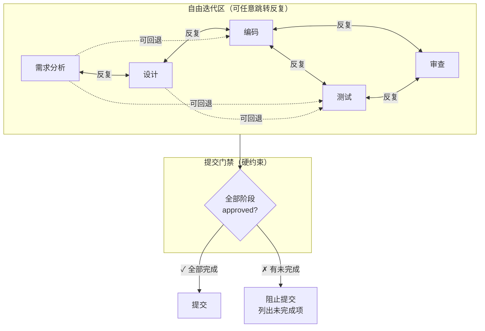

**采用原因**：真实开发本质上是迭代的。约束点应该是"所有必需产物是否都已完成"，而不是"当前处于哪个阶段"。

**审查阶段的特殊地位（sdlc）**：审查（review）是 sdlc 五阶段中唯一**不可被 AI 自行推进**的阶段。审查不仅检查代码正确性，更检查**人是否真正理解了代码**。审查清单包含四个硬性检查项（详见 3.2），不满足则审查阶段不可 approve。审查阶段与编码、测试阶段形成迭代循环——编码完成后进入审查，审查不通过则回到编码或测试。审查阶段由 `WorkflowDefinition.reviewStage` 声明；sdlc 与 reqdoc 均声明 `review` 审查阶段（reqdoc 语义为业务确认 PRD 要点）。

### 2.2 阶段检测方式选择

#### 候选方案对比

| | AI 自动推断 | 工具使用模式 | 产物文件判断 | AI 提议+开发者确认 |
|---|---|---|---|---|
| **准确度** | 低（语义歧义） | 低（行为歧义） | 低（存在≠确认） | 高（人为决策） |
| **可靠性** | 概率性 | 启发式 | 机械式 | 确定性 |
| **实现复杂度** | 高 | 中 | 低 | 低 |

**被拒绝的方案**：

- **AI 从对话推断**：讨论"用户权限"是在做需求分析还是设计？AI 会猜错
- **从工具使用判断**：写代码时也可能在重新思考需求
- **从产物文件判断**：文档存在不代表需求已被确认

**核心结论**：唯一真正知道"当前在哪个阶段、是否完成"的人，是**开发者本人**。

#### 采用的方案：AI 提议 + 开发者确认

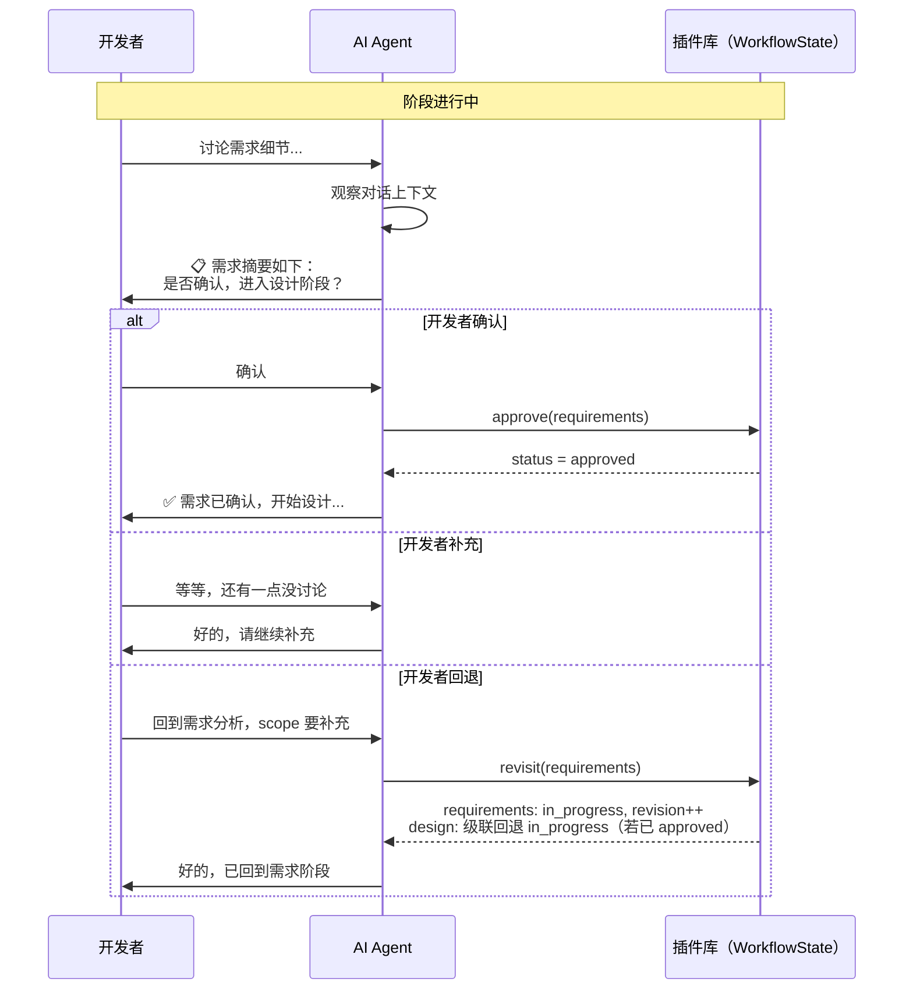

**规则**：
1. 阶段转换的唯一来源是开发者的明确操作
2. AI 只能提议，绝不自行推进
3. 开发者说"回到XX"时立即回退
4. 提交是唯一的硬门禁

### 2.3 统计分析粒度选择

讨论中确认需要三个层级：

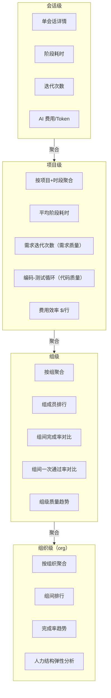

**统计层级说明**：

| 层级 | 聚合维度 | 对应 CLI 参数 | 用途 |
|------|----------|---------------|------|
| 会话级 | 单会话 | `opencode-sm stats <id>` | 开发者自检 |
| 项目级 | 按项目+时段 | `opencode-sm stats --project "用户系统"`（或省略，自动检测 CWD） | 项目经理跟踪 |
| 组级 | 按组聚合 | `opencode-sm stats --group "前端组"` | 组长管理、月度汇报 |
| 组织级（org） | 按组织聚合 | `opencode-sm stats --org` | 领导汇报、预算决策 |

组级统计是核心汇报层级——回应"各组 AI 使用程度和依赖程度"的需求。组级视图展示：成员排行、一次通过率分布、返工率对比、高迭代会话数、AI 净增行数（业务/测试/配置）。

**数据来源决策**：零额外采集。工作流状态变更的时间戳即为分析数据源。

**身份关联决策**：account → group → org 三级身份层级，另加 **workflowType（工作流类型）** 维度。身份不写上游数据库、不读上游账号体系——由开发者 `opencode-sm init` 五问自报（账号邮箱、组名、组织名、收集服务地址、主要工作流类型），存全局 `identity.json`；组是名称字符串，子组用命名约定；跨机聚合在每 org 一个的收集服务侧完成（见 2.4、3.1）。workflowType 决定本用户新会话走哪套工作流（开发者 `sdlc` 开发 / 需求分析师 `reqdoc` 需求书），不同角色 = 不同用户（见 3.1、3.2）。

### 2.4 部署架构选择：插件 + 独立 CLI（上游零修改）

#### 决策原则

团队后续需要持续同步 OpenCode 上游更新。**核心文件（session.ts、prompt.ts、sql.ts、protocol）是上游改动最频繁的文件**，任何直接修改都会导致每次同步产生合并冲突，核心 schema 迁移（给 SessionTable 加列）的风险尤其高。因此本方案的硬约束是：**所有定制不修改上游代码，收敛到我们自己的三个包里**（插件、`opencode-sm` CLI、org 收集服务）。

#### 关键发现：上游插件体系已覆盖所需能力

OpenCode 插件运行在 daemon 进程内，生命周期与 daemon 一致，通过 `config.plugin` 按 npm 名或本地路径加载。插件 `Hooks` 接口（`packages/plugin/src/index.ts`）提供的能力与接线位置如下（均已核实上游源码，无需任何上游改动即可使用）：

| 所需能力 | 插件 Hook | 上游已接线位置 |
|----------|-----------|----------------|
| 每轮注入 WorkflowState 到 system prompt | `experimental.chat.system.transform`（修改 `output.system: string[]`） | `agent/agent.ts`、`session/llm/request.ts` |
| 注册工作流工具（LLM 在对话中调用） | `tool`（ToolDefinition 字典） | `tool/registry.ts` |
| 硬门禁：阻断未过审查的提交 | `tool.execute.before`（抛错即令工具失败） | `session/tools.ts` |
| 统计工具执行（迭代计数、AI 代码行数） | `tool.execute.after` | `session/tools.ts` |
| 时间戳采集（阶段耗时数据源） | `chat.message` / `event` | `session/prompt.ts`、事件总线 |
| 读取会话数据（cost/tokens） | `PluginInput.client`（SDK） | 插件入参 |

#### 架构总览

**opencode-sm**（OpenCode Session Management CLI）：我们独立开发、单独安装的命令行工具，与上游代码零耦合，只读插件库与调用上游 REST API。每位开发者在自己机器上独立使用 OpenCode，因此部署形态是"每机器一套插件 + 全局身份配置，每组织一个收集服务"：

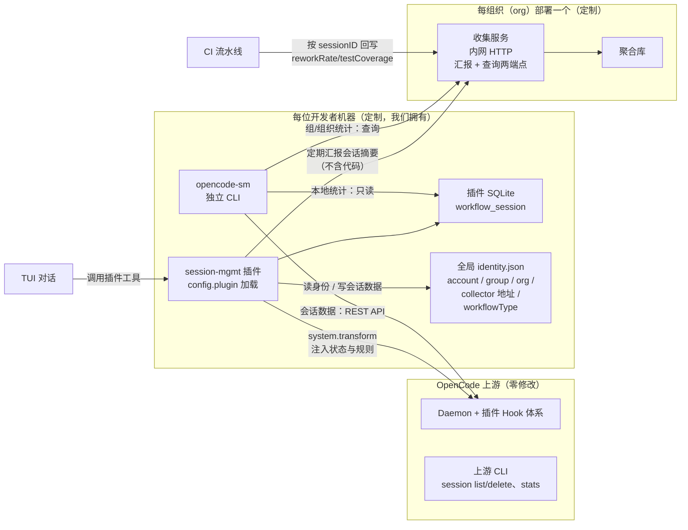

#### 设计点映射

| 需求 | 零侵入实现方式 |
|------|----------------|
| WorkflowState 每轮注入 system prompt | 插件 `experimental.chat.system.transform`，从插件 DB 读最新状态追加 |
| 会话 tags、status、workflow 扩展属性 | 存插件自有 SQLite，以核心 sessionID 为主键关联，不动 SessionTable |
| account / group / org 身份 + workflowType | 开发者首次使用 `opencode-sm init` 五问自报（账号/组/组织/收集服务地址/工作流类型），存全局 `identity.json`；组结构由各人汇报在 org 聚合库自然形成，组即名称字符串；workflowType 决定新会话走哪套工作流（见 3.1） |
| 阶段推进 / 审查 / 理解确认 | 插件注册工具（`workflow_advance`、`comprehension_confirm`、`review_submit`），Agent 在 TUI 对话中调用，校验逻辑在工具 handler 内——天然服务端强制 |
| 重复编辑模式检测与提交门禁 | `tool.execute.after` 计数每文件代码编辑（统计用）+ 内存短记忆检测连续重复/高频编辑模式；`tool.execute.before` 对未过审查的 `git commit` 抛错阻断；system prompt 注入 stuck 警告 |
| QualityMetrics 采集 | 会话内指标（firstPassRate/iterationCount/linesByFile）由插件记录于本机插件库；合并后指标（reworkRate/testCoverage）由 CI 按 sessionID 回写 org 收集服务 |
| 外部管理（tag/workflow/stats） | 独立 CLI `opencode-sm`：本地统计读插件库 + 上游 REST API；组/组织统计查 org 收集服务；通用会话操作（list/delete/stats）直接用上游已有命令 |

#### 风险与取舍

- **experimental hook 稳定性**：`experimental.chat.system.transform` 带 experimental 前缀，上游可能调整签名。缓解：插件是唯一受影响面，上游升级后只需改插件代码并回归测试，成本远低于核心合并冲突。插件内以适配层封装 hook，集中变更点。
- **rename（重命名会话）**：上游无会话标题更新 API（标题自动生成）。本方案不提供 rename；如将来必须支持，它是全部定制中唯一值得引入的小核心补丁，单独评估。
- **身份变更是快照语义**：汇报携带当时的 account/group/org 快照。开发者调组后重跑 `opencode-sm init`，只影响此后的汇报，历史统计归属不追溯变更。
- **收集服务不可用**：插件在本地缓冲未送达的汇报（同一会话仅保留最新一条快照，避免堆积），服务恢复后补推；期间单机会话/项目级统计的工作流/质量数据不受影响（直读本地插件库），但 cost/tokens 经上游 daemon 取得，daemon 不可达时统计示 `N/A`（而非误导的 $0）。
- **插件 DB 孤儿记录**：会话被上游删除后，插件 DB 中对应的扩展数据成为孤儿记录。`opencode-sm` 与插件定期以 `session.list` 比对清理（惰性清理即可，不影响功能）。
- **子代理会话不计入统计**：上游子代理会话带 `parentID`（指向主会话）。插件据 `session.get` 的 `parentID` 识别子代理会话，对其**不建记录、不打标、不汇报、不注入规则**；启动清理时一并移除存量子代理记录（仅保留主会话），避免子代理会话污染本地统计与收集服务聚合。

---

## 3. 数据模型设计

### 3.1 数据模型（插件库 + 全局身份 + 组织聚合库，上游零修改）

**三个存储位置**（每位开发者在自己机器上独立使用 OpenCode，故身份按机器配置、会话数据按项目存放、跨机统计在组织侧汇聚）：

| 存储 | 位置 | 内容 |
|------|------|------|
| 全局身份配置 | `~/.config/opencode/session-mgmt/identity.json` | `opencode-sm init` 五问写入：`{account, group, org, collector_url, workflowType}`（workflowType 可选，缺省 sdlc），每机器一份 |
| 插件库 | `<project>/.opencode/session-mgmt.db`（插件自动建表，迁移自管） | 每会话的工作流数据 `workflow_session` |
| 组织聚合库 | org 收集服务侧（每 org 一个） | 各机器汇报的会话摘要，组/组织结构由此自然形成 |

所有定制数据均**不修改上游 SessionTable / AccountTable**，通过核心 `sessionID` 与上游会话逻辑关联；费用、Token 等核心指标经 SDK（`session.list`/`session.get`）获取——**插件不直接读上游数据库**。

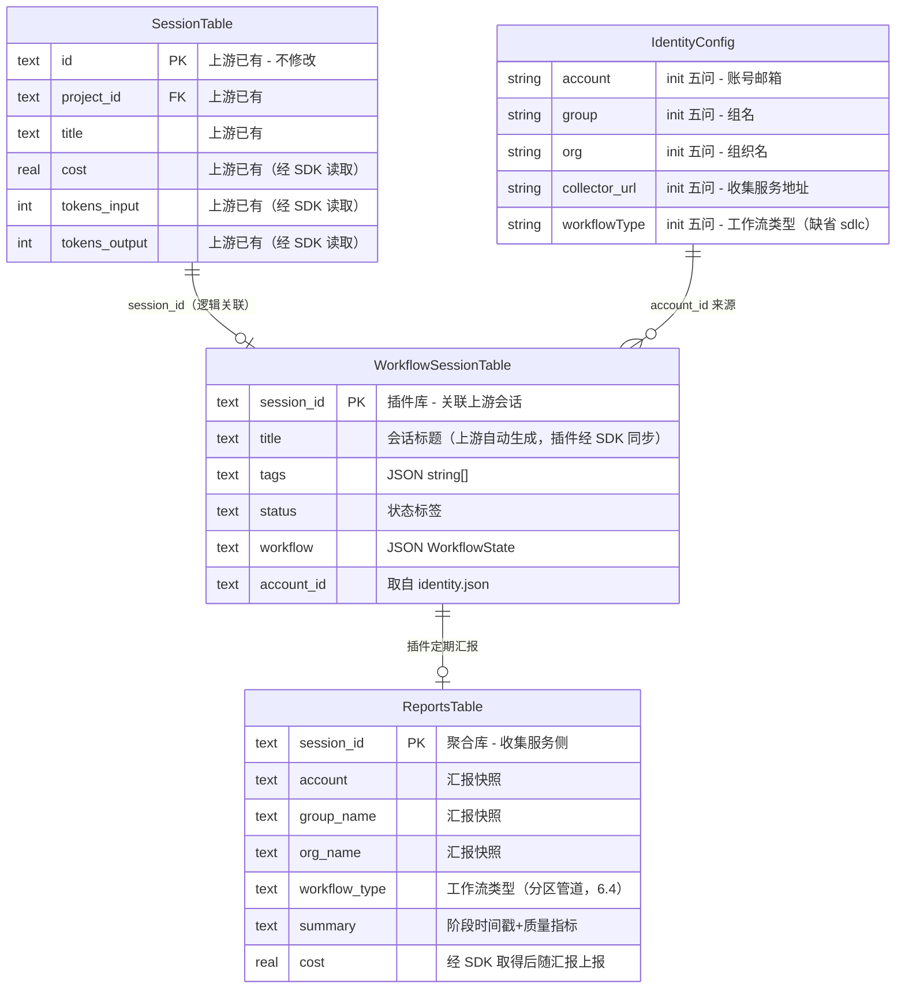

```typescript
// opencode-session-mgmt/packages/plugin/src/db/schema.ts — 插件库（bun:sqlite / drizzle），每项目一个
export const WorkflowSessionTable = sqliteTable("workflow_session", {
  session_id: text("session_id").primaryKey(),  // 上游 SessionTable.id
  title: text(),  // 会话标题（上游自动生成，插件经 SDK 同步写库，5.2 离线可读）
  tags: text({ mode: "json" }).$type<string[]>().$default(() => []),
  status: text(),   // "todo"|"analysis"|"design"|"coding"|"testing"|"review"|"done"|"archived"|null
  workflow: text({ mode: "json" }).$type<WorkflowState>(),
  account_id: text(),  // 会话首次活动时从全局 identity.json 写入
})

// ~/.config/opencode/session-mgmt/identity.json — 全局身份，opencode-sm init 写入
// { "account": "alice@example.com", "group": "前端组", "org": "Engineering",
//   "collector_url": "http://10.0.1.20:8787", "workflowType": "sdlc" }

// 收集服务侧聚合库（opencode-session-mgmt/packages/collector）：reports 表按 session_id 主键
// 接收汇报快照（account/group/org + 阶段时间戳 + cost/tokens + 质量指标），不含代码内容
```

**组是名称字符串，没有 ID 与嵌套表**：每台机器只有一个身份（init 填写），不存在单机花名册；"前端组有几个人"这件事由众人汇报的快照在聚合库中 `GROUP BY group_name` 自然得出。子组用命名约定表达（`前端组/基础架构组`）。组织级聚合同理：`GROUP BY org_name`。

**account / group / org 的关联时机**：

| 关联 | 写入方 | 时机 | 方式 |
|------|--------|------|------|
| identity.json（account/group/org/collector_url/workflowType） | 开发者本人 | 每台机器一次，人员或角色变动时重跑 | `opencode-sm init` 交互式五问，全部手动填写（见 5.1） |
| `workflow_session.account_id` | 插件 | 会话首次活动（`chat.message` hook） | 从全局 identity.json 读取 account 写入，不读上游数据库 |
| 聚合库 account/group/org | 插件 | 定期汇报 + 阶段事件触发 | 汇报携带当时的身份快照，收集服务落库 |

**快照语义**：三层关联随汇报固化在聚合库记录里。开发者调组后重跑 `opencode-sm init`，只影响此后的汇报与本机新会话的打标，**历史统计归属不追溯变更**。本机 `workflow_session.account_id` 亦为创建时快照。

**workflowType 继承（用户级流程选择）**：工作流类型由**用户角色**决定，而非目录。插件每次创建新会话 `WorkflowState` 时经 `resolveType` 读取 `identity.json.workflowType`（缺省 `sdlc`）写入 `workflow.type`（快照语义，与 account 一致——已存在会话不重读）。不同角色 = 不同用户（开发者走 sdlc 开发流程、需求分析师走 reqdoc 需求书流程），故**无目录配置、无会话内切换工具**；改类型只影响之后的新会话，历史归属不追溯。流程定义与通用机制解耦见 3.2。

**孤儿记录清理**：上游删除会话后，`workflow_session` 中对应记录成为孤儿。插件**启动后延后**（约 2 秒，错开 TUI 首屏与 daemon 启动竞态，减少启动耗时，见部署文档 FAQ）以 `session.list` 比对惰性清理（保守策略：上游不可达或返回空列表时不清理，防瞬时不可达误删），不影响功能。清理白名单**仅含主会话**（`parentID` 为空）：子代理会话（`parentID` 非空）与孤儿一并移除，配合 2.4 的「子代理不建记录」，保证统计纯净。

### 3.2 WorkflowState Schema

**文件**: `opencode-session-mgmt/packages/shared/src/workflow.ts`（契约包，插件/CLI/收集服务共用）

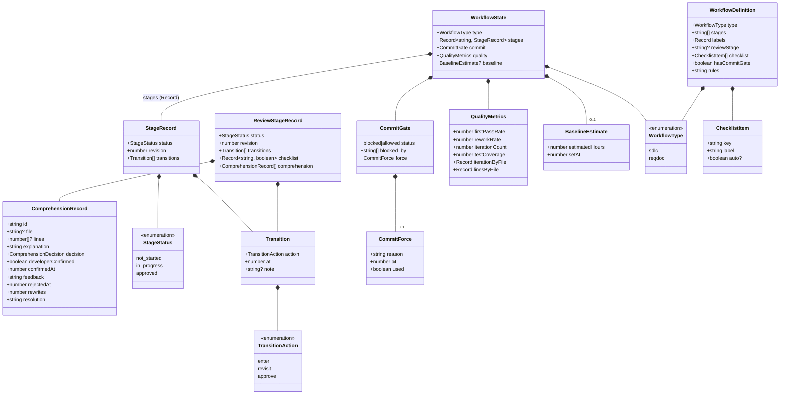

**WorkflowDefinition 注册表（多流程就绪）**：

插件把「工作流的定义」与「通用机制」解耦。定义（阶段键、阶段中文名、审查清单、提交门禁有无、注入的规则项）收敛为 `WorkflowDefinition`，按 `WorkflowType` 注册：

```typescript
export type WorkflowType = "sdlc" | "reqdoc"          // 当前注册 sdlc 与 reqdoc

export interface ChecklistItem { key: string; label: string; auto?: boolean }

export interface RuleItem {
  id: string                               // 稳定标识（如 sdlc-r1），测试/评测/文档交叉引用
  stage: string | "global"                 // 生效阶段键；"global" 所有阶段通用
  text: string                             // 只承载模型可行动作（工具/时机/确认语义）
}

export interface WorkflowDefinition {
  type: WorkflowType
  stages: string[]                        // 阶段键，顺序即推进顺序
  labels: Record<string, string>          // 阶段中文名（渲染/注入用）
  reviewStage: string | null              // 哪个阶段是审查阶段（可无）
  checklist: ChecklistItem[]              // 审查清单项（仅 reviewStage 存在时用）
  hasCommitGate: boolean                  // sdlc=true；reqdoc 定稿无 git 门禁 → false
  rules: RuleItem[]                       // 注入的规则项（见 7.4），阶段化注入：每轮只取 global + 当前阶段
}

export const WORKFLOW_DEFINITIONS: Record<WorkflowType, WorkflowDefinition>
export const SDLC: WorkflowDefinition     // sdlc 定义（五阶段 + 四清单 + 门禁 + 规则）
export const REQDOC: WorkflowDefinition   // reqdoc 定义（见下方、7.4）
export function getDefinition(type: WorkflowType): WorkflowDefinition
export function rulesForStage(def: WorkflowDefinition, stage: string | null): RuleItem[]
  // 阶段化注入取规则：stage 为 null 时只给 global；否则给 global + 该阶段（7.4）
export function currentInProgressStage(s: WorkflowState): string | null
  // 当前进行中阶段：按 stages 顺序取第一个 in_progress，无则 null
export function resolveWorkflowType(v: unknown): WorkflowType   // 未知值回退 "sdlc" 并打 warning
```

`WorkflowState` 含 `type` 字段标明本会话属于哪种工作流；`stages` 为泛化的 `Record<string, StageRecord>`，审查阶段经 `reviewRecord()` 定位（`getDefinition(s.type).reviewStage`）。系统不设 `STAGE_ORDER`/`STAGE_LABELS`/`StageName` 常量——消费方一律通过 `getDefinition(workflow.type)` 取阶段键/中文名/清单。`ComprehensionRecord` 是通用机制（见下方 reqdoc 段）。`metricKind`、`workflow_set_type` 工具未实现（reqdoc 指标模型/切换场景未定，避免死代码）。

**sdlc 定义**：五阶段 `["requirements","design","implementation","testing","review"]`，审查阶段为 `review`，四清单项（businessIntent/logicExplainable/behaviorVerifiable/designRationale），`hasCommitGate=true`，结构化规则见 7.4。

**reqdoc 定义**：需求书工作流（需求分析师角色），源于《业务需求难点与解决方案》的**四段式渐进引导**（目标与场景 → 主流程与规则 → 边界与异常探针 → 自动化排版），外加一个**业务确认闭环**。审查阶段（`reviewStage="review"`）语义为**业务确认 PRD 要点**（区别于 sdlc 的代码理解确认），复用同一套 comprehension/checklist/review_submit 闭环机制。四清单项（completeness 信息完整 / clarity 表达明确 / edgeCoverage 边界覆盖 / resolution 职责清晰），`hasCommitGate=false`（定稿无 git 门禁）。阶段键 `["goal","rules","edge","prd","review"]`，中文名 目标与场景 / 流程与规则 / 边界与异常 / 需求规格书 / 业务确认。prd 阶段产出按《业务需求说明书》模板渲染（`docs/reqdoc-prd-template.md`，源自 `docs/模版.docx`）。`resolveWorkflowType` 支持 `"reqdoc"`。结构化规则见 7.4；需求资料目录契约见 7.5。

**reqdoc 五阶段推进流程**（与 sdlc 完成门控同构；定稿闭环为业务确认，目录 → 阶段映射见 7.5）：

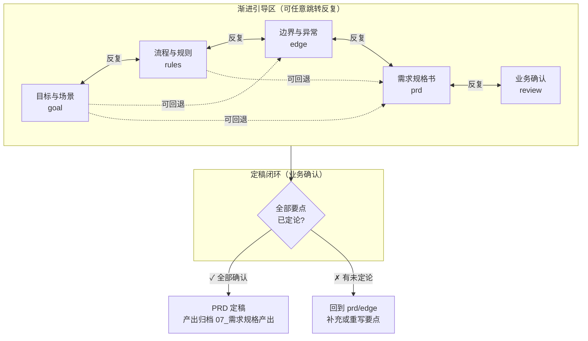

> **ComprehensionRecord 泛化**：`ComprehensionRecord` 是通用机制（sdlc 编码段与 reqdoc PRD 要点共用）——唯一标识字段为 `id`，`file`/`lines` 可选（sdlc 填、reqdoc 不填）。工具参数名一律保留 `codeSegmentId`（sdlc LLM 契约不变），内部映射到 `id`；`comprehension_add` 的 `file`/`lineStart`/`lineEnd` 可选，sdlc 填、reqdoc 省略。

**BaselineEstimate — 基线预估人工工时（6.3）**：

`baseline` 记录项目经理在需求创建时给出的**预估人工工时**（`estimatedHours`，小时、可小数），`setAt` 为录入时间戳。它给出实际周期的参照系：会话结束后，系统按 `（预估工时 − 实际周期）÷ 预估工时` 计算 **AI 提效百分比**。字段可选（无基线的会话提效率为 N/A），可随时重设（幂等覆盖、记最新值，见 7.4 规则 28-29）；录入由开发者在 TUI 对话中转述项目经理的预估（见 4.1 `workflow_baseline`）。

**ReviewChecklist — 可接手标准检查项（sdlc 专属）**：

审查阶段（`reviewStage="review"`）不同于其他阶段。审查不仅检查代码正确性，更检查**人是否真正理解了 AI 生成的代码**。审查清单由 `WorkflowDefinition.checklist` 定义（sdlc 注册四项），全部通过后审查阶段才可 approve。sdlc 的清单项：

| 检查项 | 要求 | 验证方式 |
|--------|------|----------|
| `businessIntent` | 公共方法必须有注释，说明业务意图而非只描述参数 | 审查清单 |
| `logicExplainable` | 圈复杂度 > 10 的方法必须有行内注释 | 静态分析 + 审查 |
| `behaviorVerifiable` | 每个 Service 方法至少有一个集成测试，测试即使用文档 | 审查清单 + 门禁 |
| **`designRationale`** | **AI 必须为每个代码变更输出设计推导：为什么这样写、有哪些替代方案被放弃、潜在风险是什么** | **开发者逐段定夺（accepted / manual）** |

`workflow.stages[review].checklist` 存储为 `Record<清单项 key, boolean>`。`review_submit` 从 `def.checklist` 生成具名输入参数（非 auto 项 → 布尔，auto 项由插件置真），未知键由 schema 层拒绝。sdlc 清单项见上表；reqdoc 清单项另见 reqdoc 定义段（completeness/clarity/edgeCoverage/resolution）。

此外，审查阶段自动记录 **`firstPassRate`（AI 代码一次通过率）**：

> **一次通过率 = 未重写即被接受的片段数 ÷ 全部定论片段数 × 100**

它反映 **AI 一次把代码写对的能力**，而非"开发者接受建议的比例"。每个片段的最终去留只有两种：**一次通过**（`confirm` 直接接受）或**未一次通过**（经历过 `reject` 后由 AI `rewrite` 重写、或由开发者 `manual` 自己处理）。重写或自己处理都计入"未一次通过"，因此公式分母用**片段数**、分子用**未重写即接受**的片段数。

该指标由 `review_submit` 审查通过时**插件自动计算**，不依赖 Agent 上报。它不设硬性预警阈值（重写频率因团队/任务而异），仅作**返工信号**展示：一次通过率过低提示 AI 返工偏多，应回溯 prompt 或该文件的重写轮次（`rewrites`）。纯讨论会话（无片段）不写，保持 `null`（显示 N/A）。

> 一次通过率由 `review_submit` 自动计算，sdlc 与 reqdoc 均适用：sdlc 分母为「代码片段」、reqdoc 分母为「PRD 要点」，口径一致（未重写即 accepted 占比）。行数三分类/rework/coverage 为 sdlc 专属，reqdoc 为 null（见 6.4）。

> 说明：业界 Copilot 的 25–35% 健康接受率针对**行级补全建议**（开发者多数跳过），而本插件是**整段 AI 代码、开发者审查后决定去留**，一次通过率天然偏高，二者口径不同，故不套用该区间。

**ComprehensionRecord — 理解确认记录**：

`ComprehensionRecord` 是理解保障的核心数据。它不是简单的"审查通过"标记，而是**开发者逐段确认理解的凭证**。每次 AI 生成代码变更后，在审查阶段，每个片段经历一个**去留闭环**：

```mermaid
stateDiagram-v2
    direction LR
    [*] --> pending: add
    pending --> accepted: confirm
    pending --> rejected: reject(+feedback)
    rejected --> pending: rewrite (rewrites++)
    rejected --> accepted: confirm(复议)
    rejected --> manual: manual(+resolution)
    accepted --> [*]
    manual --> [*]
    note right of rejected : 开发者补充意见,大部分要求 AI 重写;<br/>小部分由开发者自己处理;<br/>讨论后认可原实现可直接 confirm 复议
```

1. AI 将每个代码变更拆分为可理解的片段（按方法/类/模块），每个片段一个 `ComprehensionRecord`
2. AI 为每个片段输出 `explanation`（自然语言解释：这段代码做了什么、为什么这样写、有哪些替代方案被放弃）
3. 开发者逐段阅读 `explanation` 决定去留：
   - **接受**（`comprehension_confirm`）：确认理解，片段一次通过
   - **拒绝**（`comprehension_reject`）：附补充意见，进入 `rejected`
4. 被拒绝的片段：
   - **大部分**由 AI 按意见**重写**（`comprehension_rewrite`）→ 回到 `pending`，`rewrites++`，重新审查
   - **小部分**由开发者**自己处理**（`comprehension_manual`，如自己写/删除，须声明 `resolution`）→ 终态
   - 讨论后认可原实现的，可直接 `comprehension_confirm` 复议为 `accepted`（不计重写，`rewrites` 不变）
5. 开发者可以对任意片段追问"为什么这样写"，追问和回答追加到 `explanation` 中
6. 审查通过（`review_submit`）要求：**所有片段必须处于 `accepted` 或 `manual` 终态，不允许 `pending`/`rejected` 悬空**；此时 `designRationale` 才可标记为 `true`

```typescript
interface ComprehensionRecord {
  id: string                            // 唯一标识：sdlc 为代码段 id，reqdoc 为 PRD 要点 id
  file?: string                         // sdlc 专属文件路径；reqdoc 不填
  lines?: [number, number]              // sdlc 专属代码行范围；reqdoc 不填
  explanation: string                   // AI 输出的自然语言解释（含设计推导、替代方案、风险）
  developerConfirmed: boolean           // 兼容旧语义：accepted 时为 true
  confirmedAt: number | null            // 接受时间戳
  decision: "pending" | "accepted" | "rejected" | "manual"  // 片段/要点去留定论
  feedback: string | null               // reject 时开发者补充意见
  rejectedAt: number | null             // 拒绝时间戳
  rewrites: number                      // AI 重写轮次（默认 0；返工信号）
  resolution: string | null             // manual 时人工处理声明（自己写/删除）
}
```

**为什么这能解决"三个月后没人看得懂"的问题**：`ComprehensionRecord[]` 本身就是一个可检索的知识库。三个月后接手这段代码的人，不需要从零阅读代码——先读 `explanation`，理解设计意图；再读代码，验证实现是否匹配意图；如果有疑问，`explanation` 中的"替代方案和风险"能帮助判断改动的安全边界。

**无代码变更的会话**：若本会话没有 AI 代码编辑（`iterationCount=0`，如纯讨论/咨询），审查阶段无代码可理解，无需理解确认片段即可通过；一旦有 AI 代码编辑，`review_submit` 强制要求先 `comprehension_add` 登记片段、并让每个片段**处于终态**（`accepted` 或 `manual`），不允许 `pending`/`rejected` 悬空（以 `iterationCount` 作为"是否有代码编辑"的门控信号，兼顾防绕过）。`review_submit` 幂等：审查已通过后重复调用不再报错。

**审查是最后一关**：`review_submit` 还要求**前序阶段全部 `approved`**（sdlc：需求分析/设计/编码/测试；reqdoc：目标与场景/流程与规则/边界与异常/需求规格书），否则拒绝——防弱模型跳过中间阶段直接假通过审查。仅此一处硬性顺序校验：各阶段**进入/回退仍可任意跳转**（`workflow_revisit` 不受影响），前序校验只在审查批准时生效。

**QualityMetrics — 质量维度数据**：

`QualityMetrics` 记录本会话的质量相关数据，用于统计分析中的质量维度：

| 指标 | 定义 | 来源 |
|------|------|------|
| `firstPassRate` | AI 代码一次通过率（未重写即接受的片段 ÷ 全部定论片段） | 插件自动计算（review 通过时） |
| `reworkRate` | 合并后的代码在后续触发修改/Bug 修复的比例 | 外部 CI 管道回写 |
| `iterationCount` | 同一段代码的 AI 生成-修改循环次数 | Agent 会话内追踪 |
| `testCoverage` | AI 参与模块的增量测试覆盖率 | 外部 CI 管道回写 |
| `linesByFile` | AI 净增代码行数按文件分桶（本机明细），汇总时分为业务/测试/配置三类 | 插件自动累计（tool.execute.after） |

**QualityMetrics 的写入机制**：

`QualityMetrics` 字段按写入来源分为两类：

| 字段 | 写入方 | 写入时机 | 写入方式 |
|------|--------|----------|----------|
| `firstPassRate` | 插件 | 审查通过时 | 插件 `review_submit` 按「未重写即接受片段 ÷ 全部定论片段」自动计算写入插件 DB（不依赖 Agent 上报） |
| `iterationCount` | 插件 | 每次代码生成-修改循环，实时更新 | 插件 `tool.execute.after` hook 按文件（write/edit/apply_patch）累计，取各文件最大值写入插件 DB；本机另存 `iterationByFile` 明细 |
| `linesByFile` | 插件 | 每次 AI 代码编辑，实时更新 | 插件 `tool.execute.after` hook 按净增量口径累计（见下「AI 代码行数统计」） |
| `reworkRate` | 外部 CI 管道 | 合并后，当检测到同一会话产出的代码被再次修改 | CI 按 sessionID 回写 org 收集服务（见 4.3） |
| `testCoverage` | 外部 CI 管道 | 合并后，SonarQube/覆盖率工具生成报告时 | CI 按 sessionID 回写 org 收集服务（见 4.3） |

插件负责会话内指标（`firstPassRate`、`iterationCount`、`linesByFile`，写本机插件库并随汇报上行），外部 CI 负责合并后指标（`reworkRate`、`testCoverage`，回写 org 收集服务）。两条通道在聚合库按 sessionID 合并，互不覆盖，统计时统一聚合（见 4.3）。

`reworkRate` 和 `testCoverage` 依赖外部 CI 集成；未接入 CI 时这两个字段默认为 `null`，统计输出中显示为 `N/A`，不影响其他功能。

**重复编辑模式检测**：插件通过内存短记忆（每 session 最近 20 次代码编辑调用）检测 AI 是否陷入无效循环，而非对编辑次数设硬上限。两个检测信号：

| 信号 | 检测条件 | 含义 |
|------|----------|------|
| 连续相同操作（streak） | 同一文件连续 3 次以上使用相同参数的 AI 编辑 | AI 在重试同一个失败操作 |
| 高频编辑（frequency） | 同一文件在近期 20 次调用中出现 6 次以上 | 振荡循环（A→B→A→B）或渐进退化 |

检测到 stuck 文件时，system prompt 注入警告（"建议审查是否陷入无效循环"），但**不拒绝生成**。`iterationByFile` 和 `iterationCount` 仍按文件累计编辑次数（统计用，写入 WorkflowState），但不再触发硬限制。短记忆不持久化（内存级），daemon 重启自动清零。

参数指纹通过 hash（全参数）提取，区分"重试同一操作"vs"不同目的的编辑"——例如对同一文件做 3 次不同目的的 edit 不会触发 stuck，但用相同 oldString/newString 重试 3 次会触发。

`iterationByFile` 仅存本机插件库用于统计，汇报投影已剥离（不外传文件路径，见第 11 章）。

**AI 代码行数统计（业务 / 单元测试 / 配置 三分类）**：

`linesByFile` 按**净增量口径**记录每个文件在本会话内被 AI 净增的代码行数（`Record<文件路径, 行数>`，可为负），与 `iterationByFile` 共用同一观测点——`tool.execute.after` hook 中 write / edit / apply_patch 三个代码编辑工具的入参（插件不读磁盘文件、不依赖上游内部模块，只从入参推算）：

| 工具 | 行数算法 | 说明 |
|------|----------|------|
| write | `linesByFile[路径] = 行数(content)` | 整文件覆盖写：直接替换该文件的计数（AI 重写不重复累加） |
| edit | `delta = 行数(newString) − 行数(oldString)`，累加 | `oldString=""` 为新建文件语义（上游约束仅新文件可用），此时按 `行数(newString)` 整体计入；`replaceAll=true` 出现次数未知，按单次计（已知轻微低估边界） |
| apply_patch | 解析 `patchText` 段落，逐文件 `+行数 − −行数` 累加 | `*** Add File:` 段数 `+` 行；`*** Update File:` 的 `@@` hunk 内 `+` 行加、`-` 行减；`*** Delete File:` 段数 `-` 行；`*** Move to:`（改名）不计行数。解析器为插件内约 30 行的轻量扫描器（铁律：不 import 上游解析模块） |

同一文件多次编辑在同一会话内**去重累计**（如 write 100 行后 edit 净增 20 行，最终计 120 行）。行数取物理行（末尾换行不多计一行）。

**三分类规则**（`classifyFile`，优先级 测试 → 配置 → 业务）：

| 分类 | 判定 |
|------|------|
| 单元测试 | basename 匹配 `*.test.*` / `*.spec.*` / `*_test.*` / `*_spec.*` / `test_*.*`，或路径段为 `test` / `tests` / `__tests__`（大小写不敏感） |
| 配置文件 | 扩展名 ∈ `.json/.jsonc/.yaml/.yml/.toml/.ini/.conf/.cfg/.properties/.env`，或 basename ∈ `.npmrc/.editorconfig/.gitignore/.prettierrc/.eslintrc/.prettierignore/.eslintignore/Dockerfile/Makefile` |
| 业务代码 | 其余全部 |

**汇总口径**：`sumLinesByCategory` 将 `linesByFile` 分类累加为 `{business, test, config}` 三个数字；**逐文件 clamp ≥ 0**——AI 净删除代码的文件不产生负贡献，避免「删代码」让会话行数出现反直觉的负值。项目/组/组织级对会话行数**求和**（累加型指标，不做平均）。

**隐私**：`linesByFile` 的文件路径仅存本机插件库；汇报投影（`summarizeWorkflow`）剥离路径，只上行三类聚合数字（与 `iterationByFile` 的处理一致，见第 11 章）。行数指标**仅展示、不设告警阈值**。


### 3.3 状态转换规则

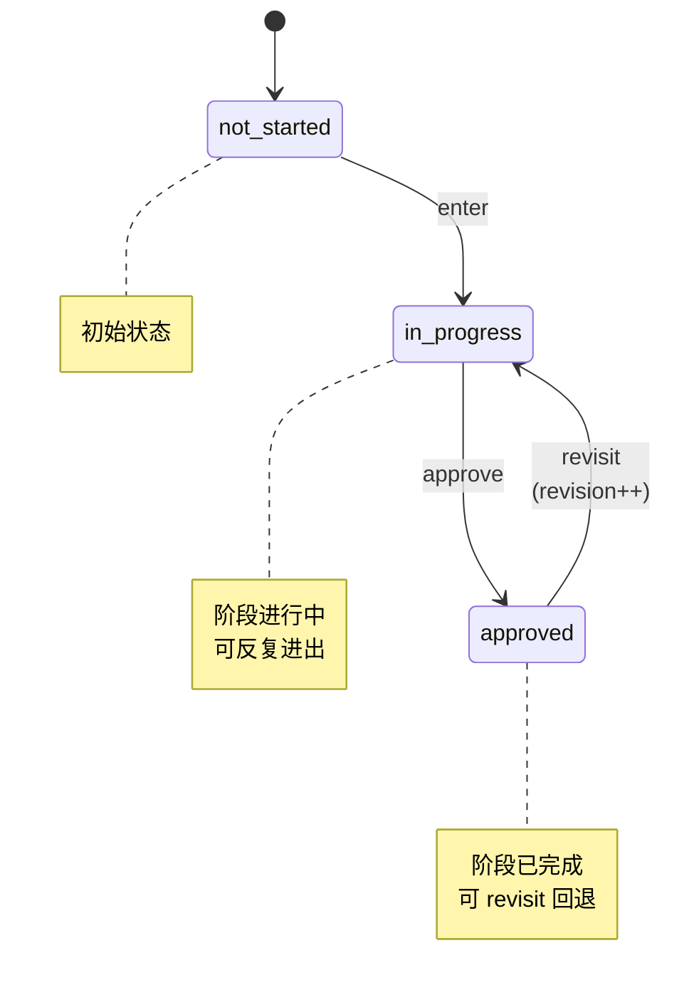

**revisit 级联回退**：`workflow_revisit(阶段S)` 除把 S 回退到 `in_progress`（revision++）外，还会把 **S 之后所有已 `approved` 的下游阶段**一并级联回退到 `in_progress`（同样 revision++、追加 revisit transition）。原因：下游阶段（设计/编码/测试/审查）的结论建立在 S 之上，S 返工后其 approved 状态不再成立，须重新走一遍（含审查的 review_submit 硬校验）。`currentInProgressStage` 按 `def.stages` 顺序取第一个 `in_progress`，级联后规则注入仍以最靠前的回退阶段为准。

每次转换自动追加到 `transitions[]`：

```json
{
  "action": "enter",
  "at": 1722412800000,
  "note": "开始需求分析"
}
```

这些时间戳就是统计分析的数据来源。sdlc 与 reqdoc 的各阶段适用同一套转换规则与时间戳口径。

**会话周期（durationMs）口径**：已完成会话（全部阶段 approved）取「全部转换时间戳的最早到最晚」跨度；进行中会话取「自工作流启动（最早转换）至今」，保证展示不为 0m。**AI 提效率仅对已完成会话计算**——进行中会话的周期是实时值，与整任务预估无参照意义，避免误报高提效。

### 3.4 提交门禁逻辑

提交门禁由 `WorkflowDefinition.hasCommitGate` 驱动：仅 `hasCommitGate=true` 的工作流（sdlc）启用，reqdoc 定稿无 git 提交门禁、`commit_gate_*` 工具不启用。下图以 sdlc 五阶段为例：

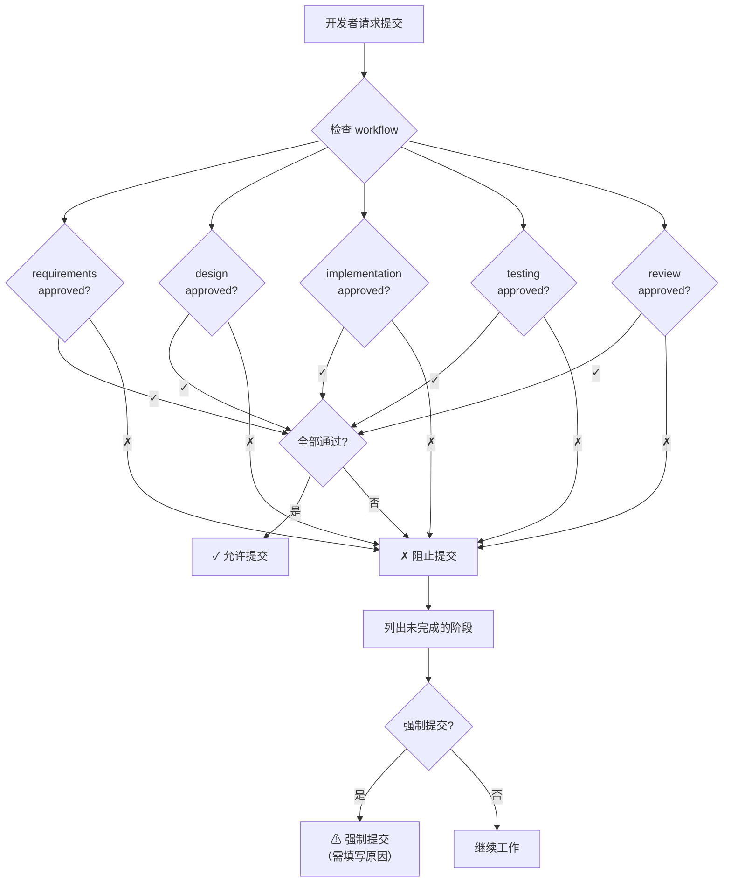

**执行点**：门禁落在插件侧——Agent 调用 `commit_gate_check` 工具获取检查结果；即使 LLM 不遵守规则，`tool.execute.before` hook 也会拦截未过审查的 `git commit`（见 7.3），硬约束不依赖 LLM 自觉。

**强制提交（逃生口）**：对应上图「强制提交（需填写原因）」分支，经 `commit_force_unlock` 工具授权：必须 `developer_confirmed=true` 且填写原因，写入 `commit.force = {reason, at, used:false}`。门禁遇到未使用的授权放行**一次** `git commit`，随即置 `used=true`（不删除，留痕于 WorkflowState 并随汇报上行，使"绕过审查"在组/组织统计中可见）。授权为一次性，此后恢复阻断；再次强制需重新授权。

---

## 4. 接口设计（插件工具 + 复用上游 API + org 收集服务端点，上游零修改）

### 4.1 插件工具（Agent 在 TUI 对话中调用）

工作流的所有状态变更不经过 REST API，而是通过插件注册的**工具（tool）**完成。Agent 在对话中调用这些工具，校验逻辑写在工具的 handler 内——运行在 daemon 进程里，天然具备服务端强制性。

| 工具 | 用途 | 服务端校验 |
|------|------|-----------|
| `workflow_advance` | 提议进入下一阶段 / 标记当前阶段 approved | 必须携带开发者确认语义；`stage` 运行时校验须在 `getDefinition(workflow.type).stages` 内（AI 不可在无确认时调用成功） |
| `workflow_revisit` | 回退到指定阶段（revision++） | 目标阶段必须存在于 `def.stages`；**级联回退**该阶段之后所有已 `approved` 的下游阶段（同样 revision++，见 3.3） |
| `workflow_baseline` | 录入/重设基线预估人工工时（项目经理给出，如 8h，6.3） | `developer_confirmed` 必须为 true（防 AI 杜撰）；`estimated_hours > 0`；幂等覆盖记最新值 |
| `comprehension_add` | 登记一个片段/要点及自然语言解释（sdlc 为代码片段，reqdoc 为 PRD 要点） | 不可重复登记；sdlc 填 `file/lineStart/lineEnd`，reqdoc 省略；登记后 `decision=pending`，待逐段定夺 |
| `comprehension_confirm` | 接受单个片段/要点（一次通过） | **单次调用只接受一个 `codeSegmentId`**，防止批量确认（见 7.3）；须处于 pending/rejected 才可接受 |
| `comprehension_ask` | 对片段/要点追问，问答追加到 explanation | 片段/要点必须存在 |
| `comprehension_reject` | 拒绝单个片段/要点并附补充意见 | 必须存在；`feedback` 必填（意见将用于 AI 重写） |
| `comprehension_rewrite` | AI 按意见重写后回到待审查 | 须处于 `rejected`；`rewrites++`，feedback 并入 explanation |
| `comprehension_manual` | 开发者自己处理该片段/要点（自己写/删除） | 须处于 `rejected`；`resolution` 必填；进入终态 `manual` |
| `review_submit` | 提交审查清单结果（从 `def.checklist` 生成具名参数） | 由 `def.checklist` 生成具名输入参数（非 auto 项布尔，auto 项插件置真）；**前序阶段须全部 `approved`（审查是最后一关）**；有片段/要点时须已 `comprehension_add` 登记、且**全部处于终态 accepted/manual，不允许 pending/rejected 悬空**；通过时自动计算 `firstPassRate`（sdlc 与 reqdoc 均适用） |
| `commit_gate_check` | 提交前门禁检查（`def.hasCommitGate=true` 时启用） | 返回未完成阶段列表；未通过时 `tool.execute.before` 阻断 `git commit` |
| `commit_force_unlock` | 强制提交授权（`def.hasCommitGate=true` 时，3.4 逃生口） | `developer_confirmed` 必须为 true、原因必填；写入一次性授权，门禁放行一次后置 `used` 留痕 |

工具定义遵循上游插件 `ToolDefinition` 接口（`packages/plugin/src/tool.ts`），由 `tool` hook 注册后自动进入 LLM 可用工具集（上游 `tool/registry.ts` 已接线）。

以上工具的行为由当前会话的 `workflow.type` 对应定义驱动：阶段键/中文名/清单项/是否有提交门禁均取自 `getDefinition(workflow.type)`。sdlc 的 `hasCommitGate=true`，行为与改动前一致；reqdoc 的 `hasCommitGate=false`，`commit_gate_*` 工具按 `def.hasCommitGate` 分支直接放行/不注册。

### 4.2 复用的上游 API（不修改）

`opencode-sm` 与插件通过上游 SDK 调用以下已有端点，不新增、不修改任何上游端点：

```
GET  /api/session                     session.list
POST /api/session                     session.create
GET  /api/session/:id                 session.get      （含 cost / tokens）
GET  /api/session/active              session.active
POST /api/session/:id/prompt          session.prompt   （resume 一次性模式）
POST /api/session/:id/compact         session.compact
POST /api/session/:id/interrupt       session.interrupt
GET  /api/session/:id/context         session.context
GET  /api/session/:id/history         session.history
```

### 4.3 质量指标写入与统计查询

**增量合并语义**：插件工具对本机 `workflow_session.workflow` 的写入采用深度合并（等价于 PATCH DeepPartial），只更新传入的字段，Agent 维护的字段互不覆盖。

**两条质量指标写入通道**：

| 指标 | 通道 |
|------|------|
| firstPassRate / iterationCount / linesByFile | 插件工具写入本机插件库 `workflow.quality`，随会话摘要汇报到收集服务（行数仅上行三分类聚合，文件路径不上行） |
| reworkRate / testCoverage | CI 管道按 sessionID **回写 org 收集服务**（`POST {collector_url}/api/ci-quality`），收集服务在聚合库按 session 合并 |

```json
// CI → 收集服务：只回写 reworkRate，与 Agent 汇报的指标在聚合库合并
{ "sessionID": "sess_abc123", "quality": { "reworkRate": 0.08 } }
```

**统计查询（不新增任何核心 API）**：

| 统计范围 | 数据来源 |
|----------|----------|
| 会话级 / 项目级 | `opencode-sm` 本机组合：插件库（工作流/会话内质量）+ 上游 `session.list`/`session.get`（cost/tokens/project），按 sessionID 关联 |
| 组级 / 组织级 | `opencode-sm` 查询 **org 收集服务的查询端点**（`GET {collector_url}/api/stats?scope=group&group=前端组`），聚合库已含各人汇报与 CI 回写 |

`--project` 参数不传时，自动从当前工作目录（CWD）聚合本项目数据。**因本地插件库按项目目录存放（`<project>/.opencode/session-mgmt.db`），`--project` 接受项目目录路径**以查看他处项目（如 `opencode-sm stats --project ~/work/user-service`），明确的目录以**只读**方式打开（库不存在则提示、不创建，避免在任意目录留下 `.opencode/`）；传入名称而非已存在目录时，无法据此定位库，退化为按 CWD 聚合并仅用作展示标签。`--group` 接受组名（如 `--group "前端组"`）；`--org` 使用 identity.json 中配置的组织。

---

## 5. CLI 命令设计

### 5.1 命令清单

命令分两部分：**上游已有命令直接复用**（不新增），**`opencode-sm` 独立 CLI**（我们自己的包，承载定制数据的查看）。

**复用上游 OpenCode 命令（零开发）**：

```
opencode session list                     # 会话列表（上游已有）
opencode session delete <sessionID>       # 删除会话（上游已有）
opencode -c                               # 回到当前目录最近一次会话（--continue，上游已有）
opencode -s <sessionID>                   # 恢复指定会话（--session，上游已有）
opencode stats [--days <n>]               # token/费用统计（上游已有）
opencode                                  # 进入 TUI，交互式恢复任意会话（上游已有）
```

> **恢复中断会话**：`-c`/`--continue` 按**当前工作目录**匹配该目录下最近一次会话，因此须回到当初的项目目录执行；若中断后在该目录又开过新会话，`-c` 接的是最新那个而非中断的那个，此时用 `opencode session list` 查出 ID 再 `opencode -s <sessionID>` 精确恢复。`-s`/`--session` 只认 session ID，不接受会话名。
>
> `opencode session list` 默认以表格输出三列——**Session ID / Title / Updated**：Title 为上游自动生成的会话标题、Updated 为更新时间，凭标题与时间即可辨认目标会话，再取其 ID 传给 `-s`；`--format json` 另含 created、projectId 等字段，`--max-count <n>` 限制条数。

**`opencode-sm` 独立命令（定制，读插件库 + 调上游 API + 查收集服务）**：

```
opencode-sm init          # 每台机器一次：交互式五问（账号/组/组织/收集服务地址/工作流类型），写入全局 identity.json
opencode-sm workflow-type set <sdlc|reqdoc>   # 轻量改角色（工作流类型），重跑 init 的等价替代
opencode-sm workflow-type get                # 查看当前工作流类型
opencode-sm tag          <sessionID> [--add <tag...>] [--remove <tag...>] [--list]
opencode-sm workflow     <sessionID> [checklist|comprehension|stats]
opencode-sm stats        [<sessionID>] [--project <dir>] [--group "组名"] [--org] [--workflow <type>] [--period <nd>] [--json]
opencode-sm list         [--status <s>] [--tag <t>] [--json]     # 在上游 session.list 结果上叠加插件库的 status/tag 过滤
```

**init 交互示例**（五问全部由开发者手动填写）：

```
$ opencode-sm init
? 你的账号（邮箱）: alice@example.com
? 所在组: 前端组
? 所属组织: Engineering
? 收集服务地址: http://10.0.1.20:8787
? 主要工作流类型（sdlc 开发 / reqdoc 需求书）: sdlc
✓ 已写入 ~/.config/opencode/session-mgmt/identity.json，本机即时生效
```

组名/组织名由组织内口头约定（如"前端组"），子组用命名约定（`前端组/基础架构组`）；收集服务地址由 org 管理员告知。人员变动（调组、换邮箱）或**角色变化（换工作流类型）**时重跑 `init` 即可——只影响此后的统计归属（快照语义，见 3.1）。

**workflow-type 命令**：`set` 与 `get` 用于轻量调整工作流类型（开发者 `sdlc` / 需求分析师 `reqdoc`），与「调组重跑 init」同语义，只是比重跑 init 少填四问。改类型只影响之后的新会话，历史归属不追溯（身份快照语义，见 3.1、3.2）。

**说明**：

| 事项 | 处理方式 |
|------|----------|
| resume（继续开发） | 主路径是 TUI 内切换会话（上游已有，`<leader>1-9` 快速切换）；一次性发消息用上游 `session.prompt` API 或 `opencode run` |
| create / get / active / compact / interrupt | 上游 REST API 已完备，TUI 与 `opencode-sm` 直接调用，不包装重复命令 |
| rename | 不提供。上游无标题更新 API，标题自动生成（见 2.4 取舍） |
| review | 并入 `opencode-sm workflow <id> checklist\|comprehension\|stats` |

**workflow 命令说明**：

工作流的推进（进入阶段、确认、回退）通过 **TUI 内自然语言对话**完成（Agent 调用插件工具，见 4.1），不走 CLI。开发者只需在对话中说"需求确认了"、"回到设计阶段"等。`opencode-sm workflow` 仅用于**从外部查看状态**：

| 子命令 | 行为 |
|--------|------|
| *(默认)* | 查看当前工作流状态（阶段进度、当前阶段，按 `def.labels` 渲染） |
| `checklist` | 查看审查清单项状态（按 `def.checklist` 逐项） |
| `comprehension` | 列出理解确认记录，支持 `--unconfirmed` 过滤未确认片段（sdlc） |
| `stats` | 查看当前会话质量指标（sdlc：一次通过率、迭代轮次、AI 代码行数业务/测试/配置、覆盖率；reqdoc：通用字段，专属字段为 N/A） |

### 5.2 opencode-sm 实现模式

`opencode-sm` 是独立安装的二进制（我们自己的包），按统计范围选择不同的数据源：

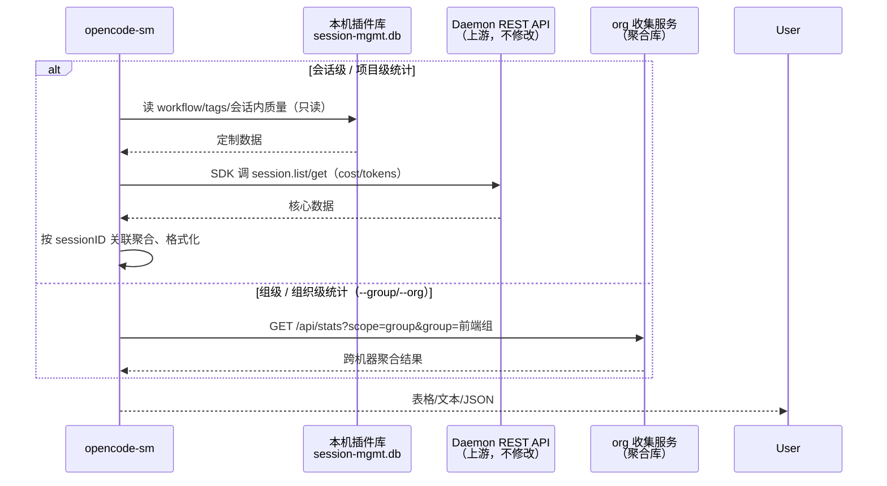

> 会话/项目级明细的**标题**也已由插件在会话活动时经 SDK 同步进插件库（启动后一次性回填 + 每条消息按需补），因此 CLI **离线（daemon 不可达）也能显示标题**；费用/Token 仍须 daemon 实时取。`list` 在上游不可达时同样用插件库标题兜底。
>
> **占位标题处理**：opencode 新建会话时先以 `New session - <ISO>` / `Child session - <ISO>` 占位，积累消息后才生成真实标题。插件同步时把占位符视为「未同步」——回填与按需补都会刷新占位符、只保留真实标题，否则插件库会一直停留在过期占位符，导致 `stats`（读插件库）与 `list`（读 daemon 实时标题）标题对不上。占位判断与上游一致（`packages/app/src/utils/session-title.ts`）。

---

## 6. 统计分析设计

统计分析的定位是**投入产出评估与资源规划的数据基础**，服务于三个明确目标：

1. **算力预算规划** — Token 消耗按场景/模型/组拆分，为下一次预算申请提供数据支撑
2. **质量监控** — 跟踪一次通过率、返工率、覆盖率，确保提效不以牺牲质量为代价
3. **流程优化** — 阶段耗时与迭代次数分析，识别瓶颈环节

### 6.1 数据来源（零额外采集）

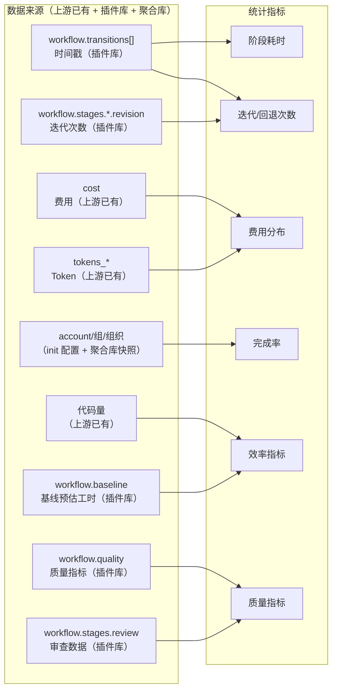

### 6.2 三级统计输出示例

**会话级**：

```
📋 会话 "用户认证模块" (sess_abc123)
开发者: alice@example.com
周期: 3.25 天

工作流:
  需求分析  ████████░░  2.1h   ✓ approved (修改2次)
  设计     ██████░░░░  1.5h   ✓ approved (修改1次)
  编码     ████████████████  4.2h  ✓ approved (编码-测试循环3次)
  测试     ██████████░░  2.8h  ✓ approved
  审查     ██████░░░░  1.2h  ✓ approved (一次通过率 92%, 理解确认 5/5)

质量:
  一次通过率: 92%  |  迭代轮次: 2 轮（单文件被 AI 编辑的最高次数）  |  测试覆盖率: 82%
  AI 净增行数: 业务 620 / 测试 310 / 配置 45（合计 975）
  基线对比: 预估 120h / 实际 3.3d → AI 提效 35%
  返工标记: 无  |  审查清单: ✓全部通过(4/4)  |  理解确认: 5片段 ✓已确认

AI 使用: 对话 47轮 | $0.36 | 85K tokens
```

**reqdoc 会话级（需求书）**：

```
📋 需求书 "合同管理流程" (sess_def456)
分析师: analyst@example.com
周期: 1.8 天

工作流:
  目标与场景  ██████████░░  1.1h  ✓ approved
  流程与规则  ████████░░░░  0.9h  ✓ approved
  边界与异常  ████████████  1.4h  ✓ approved
  需求规格书  ██████░░░░░░  0.7h  ✓ approved
  业务确认    ████░░░░░░░░  0.4h  ✓ approved (一次确认通过率 80%, 要点确认 4/5)

质量:
  一次确认通过率: 80%  |  迭代轮次: 1 轮
  基线对比: 预估 40h / 实际 1.8d → AI 提效 30%
  审查清单: ✓全部通过(4/4)  |  要点确认: 5 要点 ✓已确认

AI 使用: 对话 32轮 | $0.12 | 28K tokens
```

reqdoc 会话不产出代码，sdlc 专属指标——AI 代码行数（业务/测试/配置三分类）、覆盖率、返工率——为 `null`（显示 N/A）。

**项目级**：

```
📊 项目 "用户系统" - 最近 7 天
会话: 12 | 完成率: 75% | 平均周期: 2.3 天
阶段耗时: 分析 2.1h | 设计 1.5h | 编码 4.2h | 测试 2.8h | 审查 1.2h
迭代: 需求修改 avg 1.3次 | 编码-测试循环 avg 2.7次
费用: $4.32 总计 | $0.36/会话 | $0.02/行

质量:
  平均一次通过率: 91%  |  一次通过率过低会话: 1/12 ⚠
  AI 净增行数: 业务 5.8K / 测试 2.9K / 配置 0.4K（合计 9.1K）
  平均 AI 提效: 58%（基线会话 8/12）
  返工率: 8%  |  变更失败率: 2%  |  平均测试覆盖率: 78%
  高迭代会话(≥5轮): 0
```

**组级**：

```
👥 组 "前端组" - 最近 30 天
成员: 5 | 总会话: 42 | 完成率: 85%

  alice  12会话 92%完成 $6.30  2.1天/会话 一次通过率92% 覆盖率84%
  bob     8会话 78%完成 $3.80  2.8天/会话 一次通过率72% ⚠ 覆盖率71%
  carol  10会话 89%完成 $5.20  2.3天/会话 一次通过率89% 覆盖率79%

质量:
  组平均一次通过率: 91%  |  一次通过率过低成员: 1/5 ⚠
  AI 净增行数: 业务 18.2K / 测试 9.5K / 配置 1.2K（合计 28.9K）
  组平均 AI 提效: 62%（基线会话 31/42）
  组返工率: 6%  |  变更失败率: 2%  |  高迭代会话: 1/42 (2.4%)

趋势: 需求迭代 ↓1.5→0.9 | 单行成本 ↓$0.04→$0.02 | 返工率 ↓10%→6% | 提效 ↑55%→68%
```

**组织级**：

```
👥 组织 "Engineering" - 最近 30 天
成员: 8 | 总会话: 156 | 完成率: 82%

  alice  24会话 92%完成 $12.30 2.1天/会话 一次通过率92% 覆盖率84%
  bob    18会话 78%完成 $9.80  2.8天/会话 一次通过率72% ⚠ 覆盖率71%
  carol  22会话 85%完成 $11.20 2.3天/会话 一次通过率89% 覆盖率79%

质量:
  组织平均一次通过率: 91%  |  一次通过率过低成员: 1/8 ⚠
  AI 净增行数: 业务 62K / 测试 31K / 配置 4K（合计 97K）
  组织平均 AI 提效: 64%（基线会话 120/156）
  组织返工率: 7%  |  变更失败率: 3%
  高迭代会话: 2/156 (1.3%)

趋势: 需求迭代 ↓1.3→0.8 | 单行成本 ↓$0.03→$0.02 | 返工率 ↓12%→7% | 提效 ↑58%→70%
```

### 6.3 质量维度指标定义

质量维度数据用于验证"提效"不是建立在牺牲质量的基础上，同时支撑退出风险管控中的质量衰减监控（措施三）。

| 指标 | 定义 | 计算公式 | 数据来源 | 告警阈值 |
|------|------|----------|----------|----------|
| 一次通过率 | 代码片段免重写即被接受的返工信号（会话内统计） | 未重写即被接受的片段数 / 全部定论片段数 × 100% | 插件自动统计（review 闭环） | 无硬阈值；作为返工信号展示，过低提示流程质量 |
| AI 代码行数 | AI 净增代码量，按业务/测试/配置三分类（会话内统计） | write 整文件、edit 新行−旧行、apply_patch +行−−行，逐文件去重累计后分类汇总（逐文件 clamp ≥0） | 插件自动统计（tool.execute.after） | 无阈值；纯展示型指标（产出量参考，不与质量/绩效挂钩） |
| AI 提效率 | 相对预估人工工时的提效百分比（会话级，6.3） | （预估人工工时 − 实际周期）÷ 预估人工工时 × 100%（实际周期由阶段时间戳推算，6.1） | 插件 `workflow_baseline` 录入 + 阶段时间戳自动计算 | 无阈值；仅展示（可为负，实际超预估即为负值） |
| 返工率 | 合并后触发修改/Bug 修复的比例 | 返工提交数 / 总会话提交数 × 100% | Git + CI 管道 | 连续 2 个月上升触发审查 |
| 变更失败率 | 因 AI 生成代码引发的测试缺陷或生产故障 | 失败变更数 / 总变更数 × 100% | CI/CD + 缺陷跟踪 | 月度环比上升 >5% 触发告警 |
| 测试覆盖率 | AI 参与模块的增量测试覆盖率 | 覆盖行数 / 总行数 × 100% | SonarQube / CI | <70% 触发告警，<80% 不可 approve review |
| 迭代轮次 | 单文件被 AI 编辑的最高次数 | workflow.quality.iterationCount | Agent 追踪 | 统计展示用；重复模式检测由内存短记忆独立处理 |
| 审查清单通过率 | review.checklist 四项全部通过的会话比例 | 全部通过的会话数 / 总会话数 × 100% | workflow.stages.review.checklist | <90% 触发流程审查 |

> sdlc 专属指标：`AI 代码行数`（三分类）、`返工率`、`测试覆盖率` 在 reqdoc 会话中为 `null`（显示 N/A）。`一次通过率` 为通用字段——sdlc 语义为「代码片段一次通过率」、reqdoc 语义为「PRD 要点一次确认通过率」（口径见 3.2）；`迭代轮次`、`AI 提效率` 亦为通用字段。

这些指标在三个统计层级中的呈现方式不同：
- **会话级**：展示具体数值，一次通过率过低时提示（如一次通过率 72% ↓）
- **项目级**：展示平均值和分布，标记过低会话数
- **组织级**：展示成员排行，标记过低成员，展示趋势
- **AI 代码行数**为累加型指标：会话级展示三分类数值，项目/组/组织级展示各会话行数**求和**（不做平均），全层级仅展示、不告警
- **AI 提效率**为比率型指标（同一次通过率/返工率）：项目/组/组织级对「有基线且有有效周期」的会话**求平均**；无基线会话不参与，全无基线时显示 N/A（并以基线会话数 0/N 示覆盖率）；组/组织级另按汇报时间分**早/近半段**展示均值走向（如 提效 ↑55%→68%），即研发提效曲线在纯文本 CLI 下的呈现

### 6.4 多流程统计分区（type 感知）

不同工作流（sdlc / reqdoc）的指标不同，但**报告形状保持单一**，不建 union/meta-schema：

- **报告**：`QualitySummary` 单一形状——sdlc 填足（含行数三分类、rework、coverage），reqdoc 填通用字段（firstPassRate/iterationCount/baseline），code 专属字段（行数三分类、rework、coverage）为 `null` → 收集/展示侧自动作为 N/A。
- **聚合**：collector 的 `reports` 表落 `workflow_type` 列（+ 索引，见 3.1），写入侧从 `report.workflow.type` 取；查询侧 `GET /api/stats` 与 CLI `opencode-sm stats --workflow <type>` 按类型过滤——**两条流程的指标绝不混算**。
- **本机统计**：会话级/项目级（`stats.ts`）同样按 `workflow.type` 分区——sdlc 专属指标（行数三分类、一次通过率、返工、覆盖率）仅 sdlc 会话计算；reqdoc 会话这些字段为 null。
- **不预建** union/meta-schema（reqdoc 专属指标未定，定义即臆测）；扩展时新增可选字段（如 `docStats`）即可，分区管道已就位。

---

## 7. Agent 工作流约束

### 7.1 实现机制

工作流约束不修改 OpenCode 核心引擎，而是通过**插件 + 会话级系统提示（system prompt）**实现：插件通过上游已有的 `experimental.chat.system.transform` hook（上游在组装 system prompt 时触发，见 2.4），每轮将工作流规则与当前状态注入 system prompt；状态变更通过插件注册的工具完成，写入插件库。

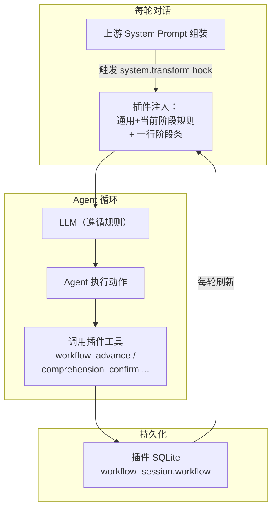

关键点：
- **规则注入**：上游每一步 Agent 循环都会重新组装 system prompt 并触发 `experimental.chat.system.transform`，插件在此 hook 中从插件库读取当前会话的 `WorkflowState`，将**阶段化规则（global + 当前 in_progress 阶段）**与**一行阶段条**追加到 `output.system`——弱模型只读当前需要的规则与压缩状态，降低遵循负担（7.4、7.3）。插件注入逻辑在 `packages/plugin/src/prompt.ts`，上游引擎 `prompt.ts` 零修改。`stage===null`（无 in_progress）**分三态**：**全未启动**（起步提示）/**空档态**（部分阶段 approved、无进行中：提示「继续→进入下一未启动阶段 / 回退→revisit」，不再误判为「尚未开始」）/**完成态**（全部 approved：走**专用完成块**，给全三条可行动作「提交（如尚未，commit_gate_check）→ 开新需求（/new，保持统计隔离）→ 改本需求（workflow_revisit）」，不注入常规全局规则）。同时 `workflow_advance` 对已 approved 阶段的 enter 报错也区分「返工（revisit）」与「开新需求（/new）」，避免弱模型被推向返工路径复用本会话污染统计（完成瞬间 `review_submit` 返回也直接带出该提示，双保险）。**合并 open-ide 后**：完成态注入块与 `review_submit` 返回额外读锁表（`store.listLocks`），仍有文件被人工锁定时提示开发者确认后逐个 `unlock_file`（仅 sdlc，`hasCommitGate` 门控，reqdoc 不提示）；锁提示由插件硬数据驱动，不依赖弱模型主动查 `list_locked_files`
- **状态持久化**：Agent 通过插件工具（4.1）写入 `WorkflowState`（阶段变更、审查清单、理解记录），不依赖 LLM 记忆
- **状态同步**：每轮 hook 触发时读取的都是插件库中的最新状态，确保 Agent 始终知道当前进度

### 7.2 实际效果：开发者看到什么

以一次典型的开发会话为例，展示开发者视角的交互过程。

**场景一：阶段推进（对话中自然触发）**

```
开发者: 用户认证模块的需求就这些了，你帮我总结一下

Agent:  📋 需求分析摘要
       1. 支持用户名+密码登录
       2. 支持 JWT token 刷新（access token 15min, refresh token 7d）
       3. 登录失败 5 次锁定 30 分钟
       4. 密码强度要求：8位+，含大小写+数字
       
       需求分析阶段是否确认完成？确认后进入设计阶段。

开发者: 确认

Agent:  ✅ 需求分析已确认。进入设计阶段。
       需要我帮你设计数据库 schema 和 API 接口吗？
```

**场景二：审查阶段——理解确认（逐段交互）**

```
开发者: 代码写完了，进入审查吧

Agent:  🔍 审查阶段 — 本会话共生成 3 个代码变更片段，逐段确认理解：

       ─── 片段 1/3: auth/service.ts:12-45 ───
       📖 这是 TokenService.refresh() 方法。
       它实现了 refresh token 轮换机制：每次用旧 refresh token 换取新 token 对时，
       旧 token 立即失效。选择这个方案（而非延长旧 token 有效期）是因为：
       - 如果 refresh token 泄露，轮换机制确保只有最新的 token 可用
       - 被放弃的替代方案：延长有效期（不够安全）、双 token 队列（复杂度高）
       - 潜在风险：并发刷新时可能触发竞态条件，已在 L38 用数据库行锁处理
       
       你是否理解这段代码的工作原理？[确认/追问]

开发者: 确认

Agent:  ─── 片段 2/3: auth/middleware.ts:8-32 ───
       📖 这是 AuthMiddleware，拦截所有 /api/* 请求...
       （解释内容同上结构）
       
       你是否理解这段代码的工作原理？[确认/追问]

开发者: L22 的缓存逻辑为什么用 Map 而不是 Redis？

Agent:  好问题。这里用了内存 Map 而非 Redis，原因是：
       - 缓存的是公钥（JWK），不是用户数据，不需要持久化
       - 每个服务实例独立缓存，内存占用极小（~2KB）
       - 如果将来需要多实例共享，可以切换到 Redis，接口不变
       - 替代方案：每次请求都去 Auth Server 验证（延迟高，已被放弃）
       
       现在理解了吗？[确认/追问]

开发者: 确认

Agent:  ─── 片段 3/3: auth/model.ts:1-20 ───
       ...
       
       ✅ 所有 3 个片段已确认理解。审查清单验证：
       ✓ businessIntent   — 公共方法有业务意图注释
       ✓ logicExplainable  — 圈复杂度 >10 的方法有行内注释
       ✓ behaviorVerifiable — 每个 Service 方法有集成测试
       ✓ designRationale   — 所有片段已定论（accepted/manual）
       
       审查阶段通过。可以提交了。
```

**场景三：提交门禁（对话中触发）**

```
开发者: 帮我提交代码

Agent:  🔒 提交门禁检查...
       ✓ requirements — approved
       ✓ design       — approved
       ✓ implementation — approved
       ✓ testing      — approved
       ✗ review       — 未完成（审查清单未通过）
       
       请先完成审查阶段再提交。输入 "进入审查阶段" 开始。

开发者: 进入审查阶段

Agent:  🔍 审查阶段 — 本会话共生成 2 个代码变更片段...
       （进入审查交互）
```

**场景四：重复编辑模式检测触发**

```
开发者: 这段代码还是有问题，再改一下

Agent:  ⚠ 检测到重复编辑模式：scheduler.py（连续相同操作 3 次），
       建议审查是否陷入无效循环，考虑人工介入修改。
       
       我可以继续帮你修改，但你可能需要先确认：
       1. 问题描述是否准确？
       2. 是否需要换一个思路来解决？
```

**场景五：reqdoc 业务确认（PRD 要点逐段确认）**

```
分析师: PRD 已生成，进入业务确认。共 5 个要点，逐段确认：

Agent:  📋 需求书 "合同管理流程" — 要点 1/5: 业务目标 ───
       「合同起草、审批、归档全流程线上化，审批时效从 3 天降到 1 天内」
       是否确认该目标？[确认/追问]

业务:   确认

Agent:  ─── 要点 2/5: 核心字段 ───
       「合同编号（必填）、合同金额（必填，>0）、生效日期、审批状态」
       是否确认该字段定义？[确认/追问]

业务:   等等，合同金额还要支持外币

Agent:  好的，已记录。我将补充「币种」字段后重新呈现该要点。
       （调用 comprehension_reject 附意见 → comprehension_rewrite 重写）
```

业务逐段确认（`comprehension_confirm` 单要点）直至全部终态后 `review_submit` 通过，业务确认闭环完成；未通过的要点经 reject/rewrite 或 manual 定论。

### 7.3 规则可靠性

"系统提示"方案的局限在于 LLM 可能不遵守规则。通过以下措施提高可靠性：

| 风险 | 措施 |
|------|------|
| Agent 忘记当前阶段 | 每轮 `system.transform` hook 将最新状态压缩为一行阶段条刷新到 system prompt |
| Agent 自行推进阶段 | 规则重复强调"绝不自行判断"，且 `workflow_advance` 工具在服务端（插件 handler）校验：`approve` 必须 `developer_confirmed=true`（开发者明确确认），否则拒绝 |
| Agent 跳过审查交互 | 审查阶段是独立的系统提示块，规则优先级最高；`review_submit` 工具在服务端二次校验审查清单（`def.checklist`）与前序阶段，未全部通过则拒绝 |
| Agent 批量跳过逐段确认 | **服务端防篡改**：`comprehension_confirm` 工具单次调用只接受一个 `codeSegmentId`，批量传入直接报错，防止 LLM 在开发者回复"看起来不错"时将全部片段批量设为 `confirmed` |
| Agent 绕过门禁直接提交 | `tool.execute.before` hook 拦截 `bash` 中的 `git commit`，未通过 `commit_gate_check` 时抛错阻断——这是插件层的硬约束，不依赖 LLM 自觉 |
| Agent 重复 enter 已 approved 阶段 | `applyTransition` 服务端校验：`enter` 已 approved 阶段抛错（须 `workflow_revisit` 回退），`enter` 已 in_progress 阶段幂等 no-op（不追加 transition） |
| 弱模型完成后不知收尾 / 在新会话复用当前会话致统计混入 | 完成态注入**专用完成块**给全「提交 → /new 开新需求 → revisit 改本需求」三条可行动作，且 `review_submit` 通过（门禁 allowed）时返回直接带出 /new 提示——完成瞬间即可见；对已 approved 阶段 enter 的报错也明确「开始下一个需求请执行 /new」，防止弱模型被引导走返工路径复用本会话。合并 open-ide 后完成块另读锁表提示解锁（仅 sdlc） |
| LLM 上下文窗口不足 | 工作流状态压缩为一行阶段条，system prompt 只注入当前阶段规则（global + 当前 in_progress 阶段，见 7.4），历史规则不重复注入 |

reqdoc 无 `git commit` 门禁，表中「绕过门禁直接提交」风险不适用；其 review 语义为**业务确认 PRD 要点**，防批量走过场的约束（`comprehension_confirm` 单次只接受一个要点）同样生效。

### 7.4 规则全文

规则以 `WorkflowDefinition.rules: RuleItem[]` 存储（见 3.2），每项带 `stage` 归属（`"global"` 或阶段键）。插件每轮经 `rulesForStage(def, currentInProgressStage(workflow))` **只注入 global + 当前 in_progress 阶段的规则**（弱模型遵循负担最小化，见 7.3）；无进行中阶段时只给 global + 起步提示。规则文本只承载**模型可行动作**（调用哪个工具、何时、确认语义）；插件内部机制（行数统计、stuck 检测、一次通过率计算）由代码强制，不进注入文本。

以下是 **sdlc** 的 12 条规则（6 global + 1 requirements + 5 review）：

| id | stage | 注入文本 |
|----|-------|----------|
| sdlc-r1 | global | 会话开始时，调用 workflow_advance(stage=requirements, action=enter) 初始化工作流。 |
| sdlc-r2 | global | 阶段可能完成时，先输出摘要并询问确认；仅开发者明确表示「确认/通过/可以」才算确认——「你看着办」「差不多」等模糊表态不算，不得自行 approve。确认后调用 workflow_advance(action=approve, developer_confirmed=true)。 |
| sdlc-r3 | global | 开发者说「回到XX」时，立即调用 workflow_revisit(stage=XX)。绝不自行判断阶段已完成。 |
| sdlc-r4 | global | 要求提交时，先调用 commit_gate_check；全部五阶段（含审查）approved 后才可 git commit。 |
| sdlc-r5 | global | 提交门禁放行且 git commit 成功后，提醒开发者执行 /new 开始下一个需求，保持统计隔离。 |
| sdlc-r12 | global | 开发者表示要手工修改某段/某文件代码时，先调用 open_ide 并**必须携带 file 参数指明该文件**（不指定 file 不会锁定），以锁定该文件防 AI 覆盖。若开发者未明确文件，先询问要改哪个文件。锁定期间可继续其它任务（改其它文件/答疑），但不得修改被锁定的文件（write/edit/apply_patch 会被服务端拒绝）。开发者确认改完后，须经其明确确认（如说「改完了/可以继续」）再调用 unlock_file 解锁该文件，并重新读取最新文件内容后继续；多个锁定文件须逐个确认解锁。 |
| sdlc-r6 | requirements | 进入需求阶段时，主动询问预估人工工时（小时）；开发者明确给出后调用 workflow_baseline(developer_confirmed=true)。未提供不阻塞；已录入后不必重复询问。 |
| sdlc-r7 | review | review 是唯一不可由 AI 自行推进的阶段（必须经 review_submit），目标是确保开发者真正理解代码。 |
| sdlc-r8 | review | 进入审查后，将每个 AI 生成的代码变更拆分为可理解片段，comprehension_add 逐段登记并输出解释（做了什么、为什么这样写、被放弃的替代方案、潜在风险）。 |
| sdlc-r9 | review | 开发者确认某片段时，立即调用 comprehension_confirm(codeSegmentId=该片段 id)；单次只接受一个 codeSegmentId，逐段确认、禁止一次确认多个。 |
| sdlc-r10 | review | 开发者追问时详细解释，comprehension_ask 将问答追加到该片段的 explanation。 |
| sdlc-r11 | review | 每个片段须达成终态（confirm 接受 / manual 开发者自处理），不允许 pending/rejected 悬空；拒绝的片段先 comprehension_rewrite 重写或 manual 定论，全部定论且前序阶段（requirements/design/implementation/testing）全部 approved 后才可 review_submit；清单四项须全为 true，否则回到编码/测试。返工多应结合拒绝意见 rewrite 改进，而非简单重试。 |

> 注入时机：进行中阶段为 requirements 时注入 7 条（r1-r6 + r12）；design/implementation/testing 时注入 6 条（r1-r5 + r12）；review 时注入 11 条（r1-r5 + r7-r12）。

以下是 **reqdoc** 的 19 条规则（5 global + 3 goal + 2 rules + 2 edge + 2 prd + 5 review）。源于《业务需求难点与解决方案》的四段式渐进引导 + 业务确认闭环；需求资料目录契约见 7.5：

| id | stage | 注入文本 |
|----|-------|----------|
| reqdoc-r1 | global | 会话开始时，调用 workflow_advance(stage=goal, action=enter) 初始化工作流。 |
| reqdoc-r2 | global | 采用渐进式分段引导，不要一次性抛出所有问题；单次提问不超过 2 个问题，避免业务有被「质问」的挫败感。 |
| reqdoc-r3 | global | 阶段可能完成时，先输出摘要并询问确认；仅业务明确表示「确认/可以」才算确认——模糊表态不算，不得自行 approve。确认后调用 workflow_advance(action=approve, developer_confirmed=true)。 |
| reqdoc-r4 | global | 业务说「回到XX」时，立即调用 workflow_revisit(stage=XX)。绝不自行判断阶段已完成。 |
| reqdoc-r5 | global | 业务确认完成（review_submit 通过）后，建议执行 /new 开始下一个需求，保持统计隔离。 |
| reqdoc-r6 | goal | 用一两句话引导业务说明：上线后谁在用、解决什么痛点；提炼【核心用户】【业务场景】【业务价值】，表达模糊时给出 2-3 个选项让业务勾选确认。 |
| reqdoc-r7 | goal | 进入 goal 阶段时，主动询问预估人工书写工时（小时）；业务明确给出后调用 workflow_baseline(developer_confirmed=true)。未提供不阻塞；已录入后不必重复询问。 |
| reqdoc-r8 | goal | 目录就绪检查：项目根约定 01~07 需求资料目录（01_业务背景与目标、02_制度与合规依据、03_现状与业务流程、04_数据与字段要求、05_用户与权限角色、06_界面与交互参考、07_需求规格产出）。尚无时询问业务是否搭建骨架，确认后创建（幂等，绝不重建或覆盖业务已放材料）；业务说资料已放好则扫描 01 目录作引导输入。 |
| reqdoc-r9 | rules | 引导补全主流程：用户输入哪些信息、系统处理后给什么结果；将自然语言转化为字段定义（数据项 / 是否必填 / 校验规则）。 |
| reqdoc-r10 | rules | 自动推演 Mermaid 流程图，反向展示给业务确认；业务说资料已放好则扫描 03、04 目录作输入。 |
| reqdoc-r11 | edge | 主动追问三类探针：数据与权限（所有岗位可见还是按机构/层级隔离）、异常流程（接口超时 / 操作失败 / 审批驳回，报错还是人工补单）、合规留痕（资金/敏感变更是否留审计日志、是否二次授权）。 |
| reqdoc-r12 | edge | 按已投放材料反问缺口（如已有制度但缺权限，追问「不同岗位的权限如何隔离」）；业务说资料已放好则扫描 02、05 目录作输入。 |
| reqdoc-r13 | prd | 将对话信息自动渲染成《业务需求说明书》模板（见 `docs/reqdoc-prd-template.md`，源自 `docs/模版.docx`）：封面（项目信息/文档变更过程）→ 第一章 需求概述 → 第二章 需求概述（术语/业务规则）→ 第三章 需求功能详述（逐功能点：输入要素/处理要求/异常/清算/差错/交易安全/附件）；未涉及项选「不涉及/不适用」并留白；业务说资料已放好则扫描 06 目录作输入。 |
| reqdoc-r14 | prd | 产出归档：需求澄清记录、自动提取的 Mermaid 流程图、最终 PRD 一律写入 07_需求规格产出 目录。 |
| reqdoc-r15 | review | review 是唯一不可由 AI 自行推进的阶段（必须经 review_submit），确保业务真正理解并确认 PRD 要点。 |
| reqdoc-r16 | review | 将 PRD 拆分为可确认要点（业务目标 / 核心字段 / 异常规则 / 合规要求），comprehension_add 逐段复述输出。 |
| reqdoc-r17 | review | 业务确认某要点时，立即调用 comprehension_confirm(codeSegmentId=该要点 id)；单次只接受一个要点，逐段确认、禁止一次确认多个。 |
| reqdoc-r18 | review | 业务追问时详细解释，comprehension_ask 将问答追加到该要点的 explanation。 |
| reqdoc-r19 | review | 每个要点须达成终态（confirm 接受 / manual 自处理），不允许 pending/rejected 悬空；拒绝的要点先 rewrite 重写或 manual 定论，全部定论且前序阶段（goal/rules/edge/prd）全部 approved 后才可 review_submit；清单四项须全为 true，否则回到 edge/prd。通过率低说明要点含糊，应结合拒绝意见重写，而非简单重试。 |

### 7.5 reqdoc 需求资料目录契约

该目录由 `REQDOC.rules`（见 7.4）驱动 Agent 落地：目录就绪检查落在 goal 阶段规则（reqdoc-r8），各阶段扫描映射嵌在 rules/edge/prd 规则（reqdoc-r10/12/13），产出归档在 reqdoc-r14。插件本体不实现、不追踪。

reqdoc 面向**业务人员**。业务习惯把现成资料（监管发文、旧流程 Word、Excel 台账、凭证扫描件）散着给，而非结构化表达。为此约定一套**需求资料目录**：业务「按图索骥」分类投放，Agent 按目录语义精准检索，支撑 7.4 的渐进式引导。该目录是**纯约定层**——不进 `WorkflowState`、不进汇报（见第 11 章）、不是插件工具，仅存在于 Agent 的引导行为。

**目录骨架（01~07）**

```
<项目根>/
├── 01_业务背景与目标/          # 业务放入：为什么做、预期业务指标
├── 02_制度与合规依据/          # 业务放入：监管政策文件、内部管理办法与风控制度
├── 03_现状与业务流程/          # 业务放入：旧系统 SOP、业务流程图、现有报表或凭证样例
├── 04_数据与字段要求/          # 业务放入：业务数据字典与字段说明、跨系统数据源需求
├── 05_用户与权限角色/          # 业务放入：岗位角色与权限矩阵
├── 06_界面与交互参考/          # 业务放入：竞品/同业参考截图、期望界面原型草图
├── 07_需求规格产出/            # 【Agent 输出区，业务无需放材料】
└── README.md                   # 填写指引
```

`07_需求规格产出` 是产出端：需求澄清记录、自动提取的 Mermaid 流程图、最终 PRD 一律归档于此。PRD 按《业务需求说明书》模板渲染（模板见 `docs/reqdoc-prd-template.md`，源自 `docs/模版.docx`），结构为「封面（项目信息/文档变更过程）+ 第一章 需求概述 + 第二章 需求概述（术语/业务规则）+ 第三章 需求功能详述（逐功能点）」。`README.md` 须写明「**07_需求规格产出/** 是智能体的专属输出目录，您无需往里放任何材料；需求梳理过程中，智能体会自动把澄清记录、流程图和最终 PRD 写到这里」。

**目录 → 阶段映射**

| 目录 | 对应 reqdoc 阶段 | 用途 |
|------|------------------|------|
| `01_业务背景与目标` | goal（目标与场景） | Actor/Scenario/Value 提取来源 |
| `02_制度与合规依据` | edge（边界与异常） | 合规与留痕探针依据 |
| `03_现状与业务流程` | rules（流程与规则） | AS-IS 现状 → TO-BE 目标推导 |
| `04_数据与字段要求` | rules（流程与规则） | 字段定义表直接来源 |
| `05_用户与权限角色` | edge（边界与异常） | 数据与权限探针、RBAC 权限矩阵 |
| `06_界面与交互参考` | prd（需求规格书） | 界面/组件需求（多模态读图） |
| `07_需求规格产出` | 全部（输出端） | 澄清记录 / 流程图 / PRD 落盘 |

`01/03/04/06` 喂「内容」阶段（goal/rules/prd），`02/05` 喂「探针」阶段（edge），`07` 是产出端——与 reqdoc 五阶段天然对齐，不改阶段结构。

**初始化与引导闭环**

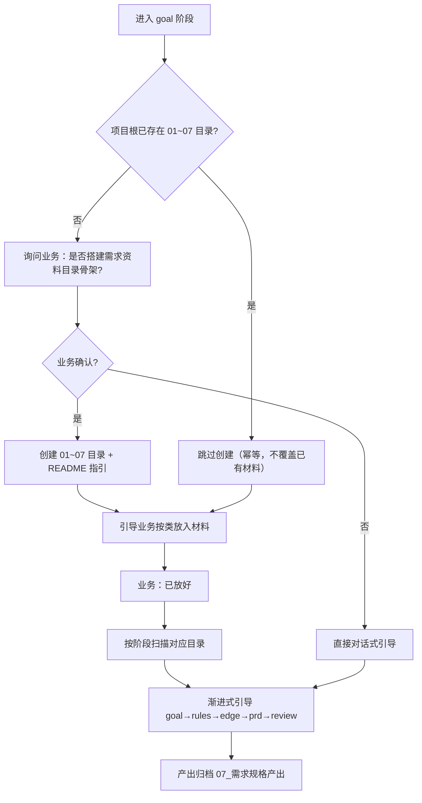

- **就绪检查**：进入 goal 阶段时检查 01~07 是否存在；缺失则询问业务确认后创建（含 `README.md`），业务拒绝则直接对话式引导。
- **缺失度校验**：扫描后按映射主动反问——`01` 缺失则优先问「系统要解决的核心痛点」；有 `02` 制度却无 `05` 权限则追问「该制度要求不同岗位的权限如何隔离」。
- **产出归档**：澄清记录、Mermaid 流程图、终稿 PRD 写入 `07_需求规格产出`。

**边界（明确不做）**

- **不加专用工具**：OpenCode 原生具备读写文件能力，目录骨架与扫描只是引导约定，做成工具是冗余。
- **幂等**：目录已存在则不重建、不覆盖业务已放材料。
- **业务确认后才建**：符合「AI 引导人决定」哲学（同 `workflow_advance`），不在用户项目里留下意料外的副作用。
- **插件不追踪路径**：目录信息不进插件库、不进汇报（见第 11 章），纯本机引导层。

---

## 8. 文件清单

### 上游 OpenCode（零修改）

不修改、不新增任何上游包（`packages/*`）内的文件。仅依赖上游已有的插件 Hook 体系与 session REST API（见 2.4、4.2）。

### 契约包 `opencode-session-mgmt/packages/shared/`（新建，三包共用）

| 文件 | 用途 |
|------|------|
| `src/workflow.ts` | WorkflowDefinition 注册表（WorkflowType/ChecklistItem/RuleItem/WorkflowDefinition/getDefinition/resolveWorkflowType + rulesForStage/currentInProgressStage 阶段化注入选择）+ WorkflowState schema（含泛化 stages/checklist、ComprehensionRecord、QualityMetrics、BaselineEstimate）与 efficiencyRatio 提效率口径；删除 STAGE_ORDER/STAGE_LABELS/StageName——插件写、收集服务收、CLI 读，单点定义 |
| `src/loc.ts` | AI 代码行数：行数计算、业务/测试/配置三分类（classifyFile）与分类汇总（sumLinesByCategory）（sdlc 专属） |
| `src/report.ts` | 汇报与 CI 回写 payload schema（WorkflowSummary 含 type + 泛化 stages，按 type 驱动） |
| `src/identity.ts` | identity.json 类型与读写（含 workflowType 第五属性，缺省 sdlc） |
| `src/merge.ts` | DeepPartial 增量合并语义（插件工具与收集服务共用） |

### 插件包 `opencode-session-mgmt/packages/plugin/`（新建，我们拥有）

| 文件 | 用途 |
|------|------|
| `src/index.ts` | 插件入口：注册 hooks（`experimental.chat.system.transform`、`tool`、`tool.execute.before/after`、`chat.message`），启动后台任务延后触发 |
| `src/startup.ts` | 启动后台任务：共用一次 `session.list` 完成 孤儿清理 + 标题回填（延后 2 秒，减少启动耗时） |
| `src/db/schema.ts` | 插件库表定义（仅 `workflow_session` 一张表） |
| `src/db/index.ts` | 插件 SQLite 初始化与迁移（bun:sqlite，WAL 模式） |
| `src/identity.ts` | 读全局 `identity.json`，会话首次活动时打标 `account_id` |
| `src/prompt.ts` | system prompt 注入片段：阶段化注入（rulesForStage 取 global + 当前阶段规则）+ buildStateBar 一行阶段条替代冗长 JSON；`stage===null` 三态化：未启动（起步）/ 空档态（部分 approved：继续→进入下一阶段 / 回退→revisit）/ 完成态（专用完成块：「提交 commit_gate_check / 开新需求 /new / 改本需求 workflow_revisit」，不注入常规全局规则；合并 open-ide 后完成态另读锁表提示解锁，仅 sdlc） |
| `src/tools/workflow.ts` | `workflow_advance` / `workflow_revisit` / `workflow_baseline` / `commit_gate_check` / `commit_force_unlock` 工具 |
| `src/tools/review.ts` | `comprehension_add` / `comprehension_confirm` / `comprehension_reject` / `comprehension_rewrite` / `comprehension_manual` / `comprehension_ask` / `review_submit` 工具（含防批量确认校验与终态门禁） |
| `src/tools/quality.ts` | 迭代计数 + AI 代码行数累计逻辑（`quality_report` 已移除，firstPassRate 由 review.ts 自动计算） |
| `src/workflow-ops.ts` | 阶段转换（enter/approve/revisit，3.3）与提交门禁重算（3.4），工具与门禁共用的状态机 |
| `src/gate.ts` | `tool.execute.before` 提交门禁拦截（git commit 阻断） |
| `src/report.ts` | 会话摘要汇报：推送至 `collector_url`，不可用时本地缓冲、恢复补推（fetch 带 5 秒超时，防止不可达时无界挂起） |
| `src/stats.ts` | 本机统计聚合查询（按 workflow.type 分区，sdlc 专属指标仅 sdlc 计算；供 opencode-sm 复用） |
| `test/*.test.ts` | 工具校验逻辑、合并语义、门禁、汇报缓冲的单元测试 |
| `package.json` | 插件包定义（入口、依赖） |

### 独立 CLI `opencode-session-mgmt/packages/cli/`（新建，我们拥有）

| 文件 | 用途 |
|------|------|
| `src/index.ts` | 入口与命令注册 |
| `src/commands/init.ts` | 交互式五问，写全局 `identity.json` |
| `src/commands/workflow-type.ts` | 工作流类型查看/修改（`set <sdlc|reqdoc>` / `get`） |
| `src/commands/tag.ts` | 标签管理（读写插件库） |
| `src/commands/workflow.ts` | 工作流状态外部查看（含 checklist/comprehension/stats，按 def.labels/def.checklist 渲染） |
| `src/commands/stats.ts` | 四级统计：会话/项目级组合本机数据；组/组织级查收集服务；`--workflow` 过滤按类型分区 |
| `src/commands/list.ts` | 会话列表（上游 list + 插件库 status/tag 过滤） |
| `src/api.ts` | 上游 opencode SDK 封装 + 收集服务查询客户端 |
| `test/*.test.ts` | 格式化与聚合的单元测试 |

### 组织收集服务 `opencode-session-mgmt/packages/collector/`（新建，每 org 部署一个）

| 文件 | 用途 |
|------|------|
| `src/index.ts` | 内网 HTTP 服务：`POST /api/report`（插件汇报）、`POST /api/ci-quality`（CI 回写）、`GET /api/stats`（opencode-sm 查询，可选 `workflowType` 过滤） |
| `src/db.ts` | 聚合库（reports 表含 `workflow_type` 列 + 索引，按 session_id 合并汇报与 CI 指标，按 type 分区聚合） |
| `test/*.test.ts` | 合并语义与查询的单元测试 |

### 部署配置

项目级 `opencode.json`（或等效配置）启用插件，无需改动上游：

```json
{ "plugin": ["./opencode-session-mgmt/packages/plugin"] }
```

### 已交付记录

多流程就绪与 reqdoc 工作流已交付（2026-08-08/09）：契约层多流程化（`WorkflowDefinition` 注册表、`WorkflowState.type`、stages/checklist 泛化、identity 五问）→ 各包消费方 def-driven（插件 / CLI / 收集服务）→ 文档同步与回归，均已落地。

启动耗时优化已交付（2026-08-12）：汇报 `fetch` 加 5 秒超时（`AbortSignal.timeout`，不可达时不再无界挂起）；孤儿清理与标题回填合并为一次 `session.list` 并延后 2 秒执行（错开 TUI 首屏 / daemon 启动竞态），逻辑移入 `src/startup.ts` 便于单测。

---

## 9. 部署与分发

**核心原则：开发者零编译**。三个包由团队构建发布一次，开发者只做安装与配置。

| 包 | 分发方式 | 开发者侧动作 |
|---|---|---|
| 插件 `session-mgmt` | 发布到 npm（或内部 registry）；daemon 基于 bun，TS 可直接加载，建议团队侧预编译为 JS 发布以屏蔽 bun 版本差异 | 无——OpenCode 按 `config.plugin` 自动拉取 |
| `opencode-sm` CLI | npm 包，或 `bun build --compile` 单文件二进制经内部分发 | `npm i -g @yourorg/opencode-sm`（或接收二进制） |
| `opencode-sm-collector` | 运维在 org 内网服务器部署一次（docker/systemd） | 无——仅在 init 时填写其地址 |

### 9.1 组织管理员（一次性）

```bash
# 内网服务器部署收集服务（示例）
docker run -d --name opencode-sm-collector -p 8787:8787 \
  -v collector-data:/data @yourorg/opencode-sm-collector
# 将地址（如 http://10.0.1.20:8787）与组名约定告知全体成员
```

### 9.2 开发者（一次性，约 2 分钟）

```bash
npm i -g @yourorg/opencode-sm                    # 1. 装独立 CLI
# 2. opencode 配置启用插件（opencode.json，可由团队标准配置预置）：
#    { "plugin": ["@yourorg/opencode-session-mgmt"] }
opencode-sm init                                  # 3. 五问：账号 / 组 / 组织 / 收集服务地址 / 工作流类型
```

此后开发者照常使用 `opencode`（TUI）——工作流规则随 system prompt 自动注入，阶段推进、审查、理解确认全部在对话中完成；外部查看用 `opencode-sm workflow/stats`。

### 9.3 升级路径

| 场景 | 操作 | 影响面 |
|------|------|--------|
| 插件 / CLI 升级 | 团队发新版；开发者 `npm update`（插件亦可由 OpenCode 启动时自动拉新） | 仅定制三包 |
| OpenCode 上游升级 | 开发者照常升级本体 | 与定制互不干扰，无合并、无迁移（见第 10 章） |

### 9.4 环境决策点

- **有内部 npm registry**：插件与 CLI 均走 npm，最省心；**无 registry**：插件以 git 路径/本地目录分发（上游 loader 支持本地路径），CLI 以 `bun build --compile` 二进制分发
- **插件发布形态**：建议团队侧编译为 JS 后发布（不受目标机 bun 版本影响）；此构建对开发者透明

---

## 10. 升级兼容性（上游同步）

本方案的核心目标是**让后续同步 OpenCode 上游更新没有合并冲突**：

- **上游零修改**：不改任何上游包内文件，上游版本升级等同正常更新，无核心文件冲突、无核心 schema 迁移对齐负担
- **数据独立**：定制数据全部在插件自有 SQLite 与 org 聚合库，表结构迁移各自自管，与上游 schema 演进互不影响；对上游会话仅以 `sessionID` 逻辑关联
- **接口稳定面小**：仅依赖上游插件 Hook 与 session REST API 两类公开接口；**插件不直读上游数据库**，上游内部表结构变化对定制无影响
- **experimental hook 风险受控**：`experimental.chat.system.transform` 若被上游调整签名，影响面仅插件包 `src/prompt.ts` 一处适配层，升级后回归测试即可，成本远低于核心合并
- **上游行为不变**：TUI、上游 CLI、上游 API 消费者均不受影响；卸载插件（移除 `config.plugin` 条目）即完全还原
- **快照语义**：身份（account/group/org）随汇报固化，调整 `identity.json` 不追溯历史统计（见 3.1）

---

## 11. 安全与隐私

- 本机会话数据存储于本地插件 SQLite；跨机汇聚仅传输**流程摘要**（阶段时间戳、cost/tokens、质量指标、身份字段），**不含代码内容**
- 迭代计数明细 `iterationByFile`、行数明细 `linesByFile`（键均为文件路径）仅存本机插件库，汇报投影（`summarizeWorkflow`）已剥离——与理解确认片段剥离 `file`/`lines`/`explanation` 的口径一致，文件路径不上行；行数仅以业务/测试/配置三类聚合数字上行
- 强制提交授权 `commit.force`（原因、时间、是否已用）随汇报上行：原因是开发者口述的流程元数据、非代码内容；上行是为让"绕过审查的提交"在组/组织统计中可见，服务于退出风险监控
- 汇报携带的账号邮箱属个人信息：收集服务应仅内网可达、最小化留存，访问权限限于组/组织管理者
- 组织级分析基于收集服务聚合库（各人汇报快照），不读上游账号体系
- 开发者可关闭汇报（不配置/停用 `collector_url`），退化为本机会话/项目级统计，功能不受影响
- 上游 Daemon 仅绑定 `127.0.0.1`，opencode-sm 经本机回环访问，不暴露网络端口
- reqdoc 会话的 PRD 要点 / 解释等理解确认正文与 sdlc 代码片段同属「不含代码内容」口径（汇报仅含流程摘要，剥离 comprehension 正文）；需求资料目录（01~07）仅存在于项目目录，不进插件库、不进汇报

---

## 12. 验证方式

上游命令与 `opencode-sm` 均通过 daemon 自动启动机制工作，无需手动操作。


```bash
# 首次使用（每台机器一次）
opencode-sm init    # 五问：账号 / 组 / 组织 / 收集服务地址 / 工作流类型

# 上游命令（复用，验证未被定制影响）
opencode session list
opencode stats --days 7

# 定制命令（opencode-sm）
opencode-sm tag <id> --add feature auth
opencode-sm workflow <id>
opencode-sm workflow <id> checklist
opencode-sm workflow <id> comprehension --unconfirmed
opencode-sm workflow-type get                    # 查看当前工作流类型
opencode-sm workflow-type set reqdoc             # 轻量改角色（只影响之后新会话）
opencode-sm stats <id>
opencode-sm stats --project "用户系统" --period 7d
opencode-sm stats --group "前端组" --workflow sdlc --period 30d
opencode-sm stats --org --period 30d --json

# TUI 内对话验证（工作流推进、理解确认、提交门禁按 7.2 场景走通）
opencode
```

单元测试：插件包 `opencode-session-mgmt/packages/plugin/test/`（工具校验、防批量确认、合并语义、门禁拦截）、`opencode-session-mgmt/packages/cli/test/`（格式化与聚合）。

上游回归：因上游零修改，只需确认插件启用/卸载两种状态下上游既有测试（`packages/core/test/session-*.test.ts`、`packages/tui/test/`、`packages/sdk/js`）均通过。

规则遵循度评测与数据驱动的规则迭代是**独立的验证方法论**，见第 13 章（重要：改规则前必须跑基线对比，不随 `bun test` 走）。

## 13. 评测驱动规则迭代（数据驱动优化）

规则文本优化（阶段化注入、状态条、审查清单引导）以**数据驱动**验证：量化弱模型对注入规则的遵循度，改前跑基线、改后对比。这是本方案的**核心方法论**——规则的每一步措辞调整都必须先有基线数据支撑，避免凭直觉改规则伤害弱模型。脚本 `scripts/eval-rules/`（不入 `bun test`，需真实模型端点）。

### 13.1 运行方式

```bash
# 冻结的 baseline 快照在 scripts/eval-rules/fixtures/baseline/（改造前的规则全文，可复现旧注入格式）
bun run scripts/eval-rules/run.ts --variant baseline --dry   # 只打印注入片段与判定期望，不调模型
bun run scripts/eval-rules/run.ts --variant baseline         # 跑基线通过率 → results/baseline.json
bun run scripts/eval-rules/run.ts --variant new              # 改造后 → results/new.json，自动对比 baseline
```

- 环境变量：`EVAL_BASE_URL`（OpenAI 兼容端点，默认 `http://localhost:8086/v1`，本地 vLLM）、`EVAL_API_KEY`、`EVAL_MODEL`（默认 `/models/qwen3`，本地 vLLM 的模型 id）、`EVAL_MAX_TOKENS`（输出上限，默认 2048；推理模型如 deepseek-*-flash 显式 4096 留 thinking 空间，慢速弱模型 4096 会拖到超时）、`EVAL_TIMEOUT_MS`（单请求超时，默认 180000，含网络/超时错误重试 3 次）；`--repeat N` 重复多次取通过率（聚合按**运行次数**统计，防单次抖动掩盖趋势）
- **baseline 与 new 共用同一状态夹具**（`finish()` 重算 commit），保证可对等比较
- `--dry` 不调模型，只打印各场景注入片段与判定期望，用于验证渲染

### 13.2 场景集

32 个场景（sdlc s1-s22 + reqdoc r1-r10），覆盖关键规则：

- 基线录入不重复、确认后 approve、无确认不 approve、回到XX→revisit、审查逐段不批量、前序未完成不 submit、提交前查门禁
- **完成后提示 /new**（sdlc s9 / reqdoc r7，`text.keyword` 判定回复须含 `/new`）
- **完成后开新需求不重启**（sdlc s10，`no_tool` 禁 `workflow_advance`/`workflow_revisit`）
- **空档态继续进入下一阶段**（sdlc s11，部分 approved 无 in_progress → `workflow_advance` enter 下一阶段）
- **审查全流程**（sdlc s12-s19 / reqdoc r8-r10：正向 review_submit 且片段全定论、片段未定论不 submit、reject 必带反馈、拒绝后 rewrite/manual、追问 ask、审查不可 advance approve 必须 review_submit、拒绝复议后 confirm、reqdoc 要点未定论防定稿）
- **手工修改走 open_ide 锁定与改完确认解锁**（sdlc s20-s21，sdlc-r12 规则，open_ide/unlock_file 契约——open-ide 已**物理合并**进本工程 `packages/plugin/src/open-ide/`，单一插件加载；锁持久化进 SQLite `file_lock` 表，daemon 重启自动恢复，会话删除后由启动时 `pruneLocks` 修剪）
- **SDLC 完结 → 提示解锁**（合并新增，插件硬能力）：完成态注入与 `review_submit` 返回均直接读锁表，有锁时提示开发者确认后逐个 `unlock_file`；仅 sdlc（`hasCommitGate` 门控），reqdoc 完成态不提示
- reqdoc 渐进引导 ≤2 问 / 业务确认单要点 / edge 探针

### 13.3 判定方式（rule-based，不用 LLM judge）

- 工具类比对 `tool_use` 名称与参数谓词（如 approve 时 `developer_confirmed` 必须 true）
- `no_tool` 类断言未调用某工具
- `text` 类（≤2 问、探针关键词）为关键词启发式，判定口径脆弱需人工复核

### 13.4 实测记录与迭代闭环

**迭代闭环**：改规则前跑 `--variant baseline` 冻结基线 → 改规则/脚本 → 跑 `--variant new` 对比 → 通过率不降才保留；失败场景逐个归因（规则措辞 / 判定口径 / 场景二义性），优先调脚本与判定口径而非膨胀规则。

**实测结果一**（2026-08-12，deepseek-v4-flash，repeat 3，按运行次数）：整体 **76% → 93%**（reqdoc 61% → 100%，sdlc 88% 持平）。驱动改进的三处迭代：状态条列出**待确认项 id**（让模型知道要 confirm 什么）、规则显式排除模糊表态（「你看着办」不算确认）、review_submit 规则补「前序须全部 approved」。基线快照冻结于 `fixtures/baseline/`，`results/{baseline,new}.json` 入库作参照，任何模型/时刻可重跑对比。

**实测结果二**（2026-08-14，29 场景，repeat 1）：本地 qwen3.6（vLLM 8086）整体 **28/29（97%）**，唯一失败 `r1 渐进引导 ≤2 问`（问句 17 个超上限 2）；远端 deepseek-v4-flash（zen/go）整体 **28/29（97%）**，唯一失败 `r10 要点拒绝后重写`（userTurn「边界这块」存在二义——edge 阶段名 vs 要点 id，模型偶发改走 `workflow_revisit`）。

**实测结果三**（2026-08-14，31 场景含 s20-s21，repeat 1）：新增 `open_ide`/`unlock_file` 手工文件锁场景（sdlc-r12，open-ide 此后并入本工程）。远端 deepseek-v4-flash（zen/go，`EVAL_MAX_TOKENS=4096`）整体 **31/31（100%）**；本地 qwen3.6（`EVAL_MAX_TOKENS=2048`）整体 **28/31（90%）**，sdlc **21/21（100%）**（r12 改动零回归），reqdoc 仅 `r1 渐进引导`（既有稳定失败）与 `r2/r10 要点 id 参数匹配`（qwen3.6 对中文 id 精确复述波动，与 r12 无关）。s20/s21 初版 userTurn 未指明文件却期望模型杜撰 `file` 调 `open_ide`（与「未明确文件先询问」规则矛盾），两模型均失败；改为明确 `auth/service.ts` 后通过——**新增场景的 userTurn 须先满足规则触发前提**。

### 13.5 关键教训（多次迭代沉淀）

- **规则文本保持简洁**：曾尝试给 r9/r11/r17/r19 补「须调用工具、逐段各调用一次」等详细措辞，实测发现弱模型对复杂措辞敏感（qwen3.6 出现 r2 确认要点不再调工具、r10 要点 id 错填），已全部回滚——提升应走脚本适配与判定口径，而非规则膨胀。
- **评测脚本对推理模型的适配**：`msg.content` 为空时回退 `reasoning_content`（推理模型正文可能在 thinking，text 类判定读不到 content）；输出上限用 `EVAL_MAX_TOKENS` 可配——推理模型显式 4096 留 thinking 空间，**慢速弱模型默认 2048**（本地 qwen3.6 实测 ~16 tok/s，4096 下长生成场景拖到超时）。
- **评测请求须带超时 + 重试**：`client.ts` 用 `EVAL_TIMEOUT_MS`（默认 180s）+ 网络/超时错误重试 3 次（HTTP 4xx/5xx 不重试），否则偶发超时中断整轮评测（曾丢 25 分钟全量结果）。
- **新增场景的 userTurn 须与规则前提一致**：先满足规则触发条件再期望动作——s20 曾用未指明文件的发言却期望模型杜撰 `file` 调 `open_ide`（规则要求「先询问」），两模型均失败；明确文件后通过。
- **判定口径适配模型能力**：`exactCount`（恰 N 次）对单轮单发 tool_call 的推理模型过苛，可放宽为「≥1 次 confirm 且 `distinctArg` 不重复」，反映能力基线而非单次抖动。
- **场景 userTurn 避免二义性**：发言词不要同时是阶段名与要点 id（如「边界这块」既像 edge 阶段又像要点 id），否则强模型可能误走 `workflow_revisit`。
- **hoisted 拷贝残留影响评测**：评测脚本经 `node_modules/sm-shared` 解析共享包，`node-linker=hoisted` 下它是真实拷贝；修改 `packages/shared` 后须删除 `node_modules/sm-shared` 并 `bun install` 重同步，否则评测读到旧规则文本（`typecheck`/`bun test` 仍全绿，易漏）。


