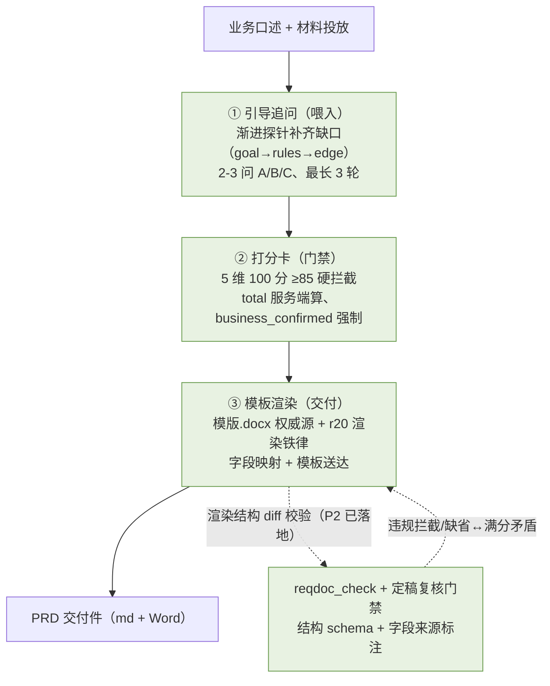
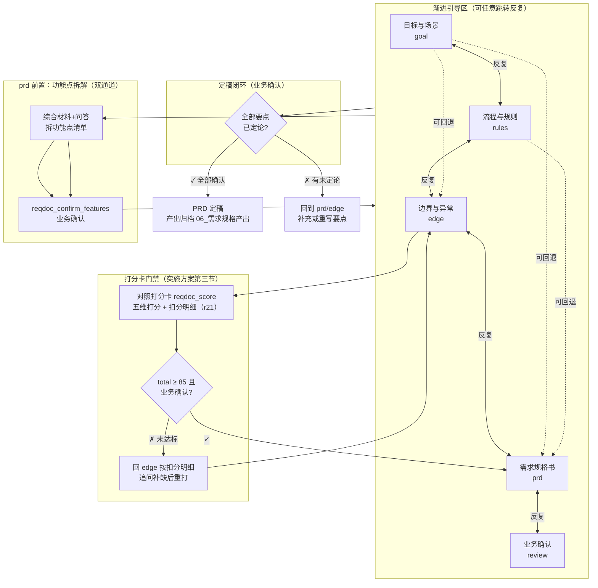
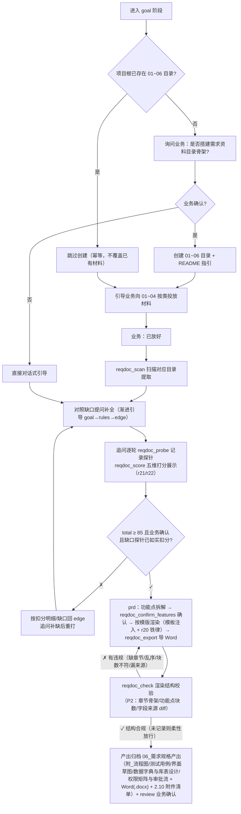

# 工作流二：reqdoc —— 需求书（辅助业务写需求）

> **文档族说明**：本文档是设计文档族的一份子（`session-management.md` 通用机制与部署统计、`workflow-sdlc.md` 软件开发工作流、`workflow-reqdoc.md` 需求书工作流）。引用约定：跨文件引用带文件名前缀（如「见 session-management.md 3.2」）；不带前缀的章号（如「见 5 章」）指本文档。通用机制（WorkflowState 核心 schema、状态转换、理解确认、质量指标、统计、评测方法论）只在主文档定义一次，本文档只放 reqdoc 专属内容并引用。

## 1. 概述

reqdoc 是**需求分析师**的工作流，核心目标**尽量通过 AI 与流程辅助业务人员写需求**：业务「口述 + 丢材料」，AI 扫描提取 + 提问补缺 + 拆功能点 + 按模版代笔成稿，业务逐项确认。源于《业务需求难点与解决方案》的**四段式渐进引导**（目标与场景 → 主流程与规则 → 边界与异常探针 → 自动化排版），外加**功能点拆解**（prd 前置）、**PRD 质量打分卡**（实施方案第三节，5 维权重满分 100、≥85 硬门禁）与**业务确认闭环**。

**三大支柱（设计要点）**

reqdoc 的价值链是「**引导追问（喂入）→ 打分卡（门禁）→ 模板渲染（交付）**」，三根支柱缺一不可：

1. **引导追问（输入质量）**：业务口述 + 材料投放后，靠渐进式探针补齐材料缺失（goal→rules→edge，每次 2-3 问、带 A/B/C 选项与默认推荐，同一需求追问最长 3 轮）。它是「材料不全 → 打分上不去」的第一道闸，决定后两级是否有料可打、有料可填。
2. **打分卡（质量门禁）**：5 维 100 分 ≥85 硬门禁；判定规则 + 逐条扣分标准为单一事实源（`REQDOC_SCORE_DIMS`/`REQDOC_SCORE_PASS`，经 `reqdocScoreRubric()` 同时注入 reqdoc-r21 规则文本与 `reqdoc_score` 工具描述），total 服务端计算、`business_confirmed` 强制、两处硬拦截。扣分项同时是追问探针的地图——三档分级直接规定该补哪类信息。
3. **模板渲染（交付形态）**：与行方的交付契约，`docs/模版.docx` 权威源（改动须同步重渲染 md），r20 渲染铁律 + 字段映射 + 模板送达保证「严格逐字」；**P2 渲染可测化已落地**——模板抽象为结构 schema（`REQDOC_TEMPLATE_CHAPTERS`/`REQDOC_TEMPLATE_FIELDS`），`parseRenderStructure` 对照 schema 做渲染 diff 校验，`reqdoc_check` 工具 + 定稿复核门禁把「渲染严格逐字」从纯规则文本升级为可解析校验。

**三大支柱价值链**



**风险分布**：三大支柱已全部**结构性固化**——打分（P0：单一事实源 + 服务端算分）、追问（P1：探针清单 `REQDOC_PROBES` + `reqdoc_probe` 记录 + 柔性一致校验）、渲染（P2：模板结构 schema + `parseRenderStructure` 渲染 diff 校验 + `reqdoc_check` 工具 + 定稿复核门禁），漂移风险均低。渲染「严格逐字遵循」从纯规则文本升级为可解析校验：缺章节/乱序/功能点块数不符/映射字段漏来源/「[缺省]↔满分」矛盾都被结构代码抓住（运行时工具与评测判定同源）。

## 2. 工作流定义

**reqdoc 定义**：需求书工作流（需求分析师角色），核心目标**尽量通过 AI 与流程辅助业务人员写需求**：业务「口述 + 丢材料」，AI 扫描提取 + 提问补缺 + 拆功能点 + 按模版代笔成稿，业务逐项确认。源于《业务需求难点与解决方案》的**四段式渐进引导**（目标与场景 → 主流程与规则 → 边界与异常探针 → 自动化排版），外加**功能点拆解**（prd 前置）、**PRD 质量打分卡**（实施方案第三节，5 维权重满分 100、≥85 硬门禁）与**业务确认闭环**。审查阶段（`reviewStage="review"`）语义为**业务确认 PRD 要点**（区别于 sdlc 的代码理解确认），复用同一套 comprehension/checklist/review_submit 闭环机制。四清单项（completeness 信息完整 / clarity 表达明确 / edgeCoverage 边界覆盖 / resolution 职责清晰），`hasCommitGate=false`（定稿无 git 门禁）。阶段键 `["goal","rules","edge","prd","review"]`，中文名 目标与场景 / 流程与规则 / 边界与异常 / 需求规格书 / 业务确认。prd 阶段产出按《业务需求说明书》模板渲染（`docs/reqdoc-prd-template.md`，源自 `docs/模版.docx`），逐字段标来源 `[文档]/[问答]/[缺省]` 不杜撰；渲染严格逐字遵循模板（见 4 章 reqdoc-r20）；模板全文由插件在 prd 阶段自动注入提示（**模板送达**，见 3 章；部署包随带 `docs/`），客户端模型无需自行读文件。`resolveWorkflowType` 支持 `"reqdoc"`。结构化规则见 4 章；需求资料目录契约（双通道）见 3 章；打分卡数据契约见 5 章 `ReqdocScore`；PRD 定稿后经 `reqdoc_export` 导出 Word 交付件（见 8 章、session-management.md 8）。

**reqdoc 五阶段推进流程**（与 sdlc 完成门控同构；定稿闭环为业务确认，目录 → 阶段映射见 3 章）：



**理解确认的 reqdoc 语义**：reqdoc 复用通用 ComprehensionRecord 机制（见 session-management.md 3.2）——记录对象为 **PRD 要点**（业务目标/核心字段/异常规则/合规要求）而非代码片段，`file`/`lines` 不填；工具参数名一律保留 `codeSegmentId`（sdlc LLM 契约不变），内部映射到 `id`；`comprehension_confirm` 单次只接受一个要点（防批量走过场）。

## 3. 需求资料目录契约（双通道）

reqdoc 面向**业务人员**。业务习惯把现成资料（监管发文、旧流程 Word、Excel 台账）散着给，而非结构化表达。为此约定一套**需求资料目录**：业务「按图索骥」分类投放，Agent 经 `reqdoc_scan` 按目录语义精准检索，支撑 4 章的渐进式引导。目录信息不进汇报（见 session-management.md 11）、不占用插件库，仅存在于 Agent 的引导行为与 `reqdoc_scan` 工具。

该目录由 `REQDOC.rules`（见 4 章）驱动 Agent 落地：目录就绪检查落在 goal 阶段规则（reqdoc-r8），各阶段扫描映射嵌在 rules/edge/prd 规则（reqdoc-r10/12/13），产出归档在 reqdoc-r14，进入 prd 前的打分卡门禁在 reqdoc-r21。**文档扫描经专用工具 `reqdoc_scan` 执行**（单目录参数、按阶段分步调用），对话补缺沿用渐进引导——「分析文档 + 提问题」双通道。

**目录骨架（01~06，材料区 + AI 工作区）**

```
<项目根>/
├── 01_背景与目标/          # 【业务投放】为什么做、预期业务指标、需求类型、完成时间
├── 02_制度与合规/          # 【业务投放】监管政策文件、内部管理办法与风控制度
├── 03_流程与数据/          # 【业务投放】旧流程/SOP、数据字段说明、Excel 台账
├── 04_角色与权限/          # 【业务投放】岗位角色与权限矩阵
├── 05_功能点/              # 【Agent 工作区】功能点拆解确认后，每功能点一个子目录（N_名称/来源摘录）
├── 06_需求规格产出/        # 【Agent 输出区】澄清记录 / Mermaid 流程图 / 最终 PRD；每功能点一个子目录（N_名称/，含 附_流程图/ 测试用例/ 界面草图/）
└── README.md               # 填写指引
```

业务只投放 `01~04`（或纯对话不放材料）；`05_功能点` 由 Agent 在 prd 阶段拆解确认后建立，`06_需求规格产出` 是产出端。PRD 按《业务需求说明书》模板渲染（模板见 `docs/reqdoc-prd-template.md`，源自 `docs/模版.docx`），结构为「封面（项目信息/文档变更过程）+ 第一章 需求概述 + 第二章 术语定义与业务规则（术语/业务规则）+ 第三章 需求功能详述（逐功能点）」。**模板送达**：模板文件随部署包分发到 bundle 根 `docs/`，插件在 prd 阶段经自身相对路径（`packages/plugin/src` 上溯三级）读取全文并注入系统提示（`loadReqdocTemplate`，缓存一次），客户端模型无需自行按 `docs/...` 读文件；全部候选路径读不到时才退化为 reqdoc-r14 内联骨架。`README.md` 须写明「**05_功能点/** 与 **06_需求规格产出/** 是智能体的专属工作区，您只需往 01~04 投放材料或直接对话即可」。

**目录 → 阶段映射（双通道）**

| 目录 | 对应 reqdoc 阶段 | 文档通道（reqdoc_scan） | 对话通道（提问补缺） |
|------|------------------|------------------------|----------------------|
| `01_背景与目标` | goal（目标与场景） | Actor/Scenario/Value 提取 | 痛点/场景/价值，模糊时给选项勾选 |
| `03_流程与数据` | rules（流程与规则） | 字段/流程提取；生成数据字典与库表设计（r10） | 字段必填/校验规则、Mermaid 反哺 |
| `02_制度与合规` | edge（边界与异常） | 合规/留痕探针依据 | 合规、清算/差错/交易安全/数据存贮 |
| `04_角色与权限` | edge（边界与异常） | 权限矩阵提取；生成 RBAC 权限控制矩阵与审批流（r12） | 权限隔离探针 |
| `05_功能点` | prd（需求规格书） | —（Agent 拆解产出） | 功能点清单确认（reqdoc_confirm_features） |
| `06_需求规格产出` | 全部（输出端） | prd 检查已有产出 | — |

`01/03` 喂「内容」阶段（goal/rules），`02/04` 喂「探针」阶段（edge），`05` 是功能点拆解区，`06` 是产出端——与 reqdoc 五阶段天然对齐。

**初始化与引导闭环**



- **就绪检查**：进入 goal 阶段时检查 01~06 是否存在；缺失则询问业务确认后创建（含 `README.md`），业务拒绝则直接对话式引导。
- **扫描工具**：`reqdoc_scan(directory)` 单目录参数、按阶段分步调用（goal→01、rules→03、edge→02 与 04、prd→06 检查已有产出），解析 docx/pdf/xlsx/txt/md/json/csv 等文本类文档。
- **缺失度校验**：扫描后按映射主动反问——`01` 缺失则优先问「系统要解决的核心痛点」；有 `02` 制度却无 `04` 权限则追问「该制度要求不同岗位的权限如何隔离」。
- **功能点拆解**：prd 阶段综合材料 + 问答信息拆功能点清单，业务确认后 `reqdoc_confirm_features` 记录，每功能点建 `05_功能点/N_名称/` 子目录 + 来源摘录，并幂等预建 `06_需求规格产出/N_名称/`（模板外成果落盘位），作为渲染依据。
- **打分卡门禁**（详见 5 章）：edge 收集完成、准备进入 prd 前，对照打分卡逐维打分，`reqdoc_score` 输出各维得分与扣分明细（附证据），向业务展示确认后 `business_confirmed=true`；total ≥ 85 且业务确认才可 `workflow_advance(stage=prd, action=enter)`；低于 85 分按三档分级回 edge 重打。
- **追问探针清单**（详见 6 章）：edge 该问什么落成结构化清单 `REQDOC_PROBES`（7 条探针，每维映射打分卡扣分项），每轮追问结束 `reqdoc_probe(asked, gaps, round)` 记录，状态条展示「追问覆盖：已问 X/7；缺口；轮次」。
- **柔性一致校验门禁**（详见 6 章，用户定：只拦矛盾、不强制记录）：一旦记录了缺口，缺口探针对应打分卡维度不得打满分（`probeGapViolations`，workflow_advance 进 prd 与 review_submit 两处拒绝）。
- **渲染结构校验门禁**（详见 7 章，用户定：柔性 + 定稿复核）：渲染写盘后调用 `reqdoc_check(source)` 对照模板结构 schema 校验，写入 `WorkflowState.render`；不强制调用（未记录则定稿柔性放行），一旦记录 review_submit 定稿时重读源 md 复核。
- **产出归档**：澄清记录、Mermaid 流程图、数据字典与库表设计、RBAC 权限控制矩阵与审批流控制逻辑、终稿 PRD 写入 `06_需求规格产出/N_名称/`；模板外成果不插入模板正文，按 reqdoc-r20 写入 `附_流程图/`、`测试用例/`、`界面草图/`、`数据字典与库表设计/`、`权限矩阵与审批流/` 子目录，并在对应功能点「2.10 附件」列出清单与相对路径；PRD 定稿后经 `reqdoc_export` 导出 Word（.docx）交付件，与源 md 同目录归档（实施方案「标准 PRD (Markdown/Word)」）；渲染逐字段标来源 `[文档]/[问答]/[缺省]`，绝不杜撰。

**多模态边界（硬约束）**：`reqdoc_scan` 目标部署模型（qwen3.6）为纯文本模型，**不支持读图**。扫描件图片/截图由工具显式降级（返回「无法解析图像，请业务文字描述或提供文本版」），杜绝 Agent 空承诺看图。

**边界（明确不做）**

- **不加图片解析**：多模态能力由模型决定，qwen3.6 无视觉支持时工具层显式降级，不做 OCR 等额外能力。
- **幂等**：目录已存在则不重建、不覆盖业务已放材料；`05_功能点` 重复确认覆盖记录。
- **业务确认后才建**：功能点拆解须业务确认后才调用 `reqdoc_confirm_features`（符合「AI 引导人决定」哲学）。
- **插件不追踪路径**：目录信息不进插件库、不进汇报（见 session-management.md 11），纯本机引导层。
- **实施方案第五节「5 大机制」完整机制不纳入**（已定案，防误判为漏功能）：交互原型双确认（低保真 HTML / 可交互界面草图 + 界面确认门禁）、科技可行性与架构预审（行内 API 资产库比对 / 成本风险提醒与降级建议）、版本变更与 Impact Diff 分析（《需求变更影响评估报告》）、研发平台一键排期（JIRA / 行内研发管理平台 API 自动建单）。仅保留相邻能力：
  - 交互原型：不生成 HTML；低保真界面说明以 r20 写入 `06_需求规格产出/界面草图/` 并列入功能点「2.10 附件」。
  - Impact Diff：变更留痕走 `workflow_revisit` 回退 + 阶段 `revision++` 版本化（见 session-management.md 3.3），不产影响面报告。
  - 一键排期：需求交付以 PRD 落盘 + 人工流转为准，不做 API 对接。
- **UAT 验收测试用例仅落盘、不设「上线验收唯一标准」门禁**：用例草案已纳入（r20 写入 `06_需求规格产出/测试用例/`），但「业务确认后作为上线验收唯一标准」的机制不纳入——规则层只要求落盘归档，不强制确认门禁。
- **不做 Streamlit 门户 / 行内 UI 组件库 / RAG 知识库**：实施方案阶段推进（Phase 1~3）属组织推广计划，本工程不落地 Web 门户、组件库与 RAG 检索；问答留痕以 `comprehension_ask` 本地可检索库为限（见 session-management.md 5.2）。

## 4. 规则全文（reqdoc-r1~r24）

规则以 `WorkflowDefinition.rules: RuleItem[]` 存储（见 session-management.md 3.2 注册表），阶段化注入同 sdlc（global + 当前阶段）。源于《业务需求难点与解决方案》的四段式渐进引导 + 业务确认闭环；需求资料目录契约见 3 章：

| id | stage | 注入文本 |
|----|-------|----------|
| reqdoc-r1 | global | 会话开始时，调用 workflow_advance(stage=goal, action=enter) 初始化工作流。 |
| reqdoc-r2 | global | 采用渐进式分段引导，不要一次性抛出所有问题；单次提问 2-3 个问题，每个问题必须附 A/B/C 选项并标注【默认推荐项】（业务回复「同意默认」即按推荐确认）；同一需求追问最长 3 轮，3 轮后仍未澄清项标 [缺省] 进入下一环节，避免业务有被「质问」的挫败感。提问一律用业务语言，严禁出现「高并发、幂等性、API」等纯技术词汇——同一含义必须转述为业务说法（如并发重复提交→「同一笔交易被重复点了几次怎么处理」）。 |
| reqdoc-r3 | global | 阶段可能完成时，先输出摘要并询问确认；仅业务明确表示「确认/可以」才算确认——模糊表态不算，不得自行 approve。确认后调用 workflow_advance(action=approve, developer_confirmed=true)。 |
| reqdoc-r4 | global | 业务说「回到XX」时，立即调用 workflow_revisit(stage=XX)。绝不自行判断阶段已完成。 |
| reqdoc-r5 | global | 业务确认完成（review_submit 通过）后，建议执行 /new 开始下一个需求，保持统计隔离。 |
| reqdoc-r6 | goal | 用一两句话引导业务说明：上线后谁在用、解决什么痛点；提炼【核心用户】【业务场景】【业务价值】，表达模糊时给出 A/B/C 选项并标注【默认推荐项】让业务勾选确认。 |
| reqdoc-r7 | goal | 进入 goal 阶段时，主动询问预估人工书写工时（小时）；业务明确给出后调用 workflow_baseline(developer_confirmed=true)。未提供不阻塞；已录入后不必重复询问。 |
| reqdoc-r8 | goal | 目录就绪检查：项目根约定 01~06 需求资料目录（01_背景与目标、02_制度与合规、03_流程与数据、04_角色与权限，此四目录业务投放材料；05_功能点、06_需求规格产出为 AI 工作区）。尚无时询问业务是否搭建骨架，确认后创建（幂等，绝不重建或覆盖业务已放材料）；业务说资料已放好则调用 reqdoc_scan(directory=01_背景与目标) 扫描提取作引导输入。 |
| reqdoc-r9 | rules | 引导补全主流程：用户输入哪些信息、系统处理后给什么结果；将自然语言转化为字段定义（数据项 / 是否必填 / 校验规则）。 |
| reqdoc-r10 | rules | 自动推演 Mermaid 流程图，反向展示给业务确认；业务说资料已放好则调用 reqdoc_scan(directory=03_流程与数据) 扫描提取字段与流程作输入；综合扫描材料与问答生成数据字典与库表设计（数据实体/字段/主外键关系/校验规则），向业务展示确认。 |
| reqdoc-r11 | edge | 按探针清单推进追问（清单 `REQDOC_PROBES`，与 reqdoc_probe 工具描述同源；7 条探针每维映射打分卡扣分项：main_flow/flow_trigger→flowClosure，exception/reverse→edgeControl，desensitize/audit→compliance，authority→authority，见 6 章/3 章）：逐轮追问 2-3 问（见 r2，带 A/B/C 与【默认推荐项】），每轮结束调用 reqdoc_probe(asked=本轮新问探针, gaps=仍缺口探针, round=轮次) 记录覆盖；追问最多 3 轮，3 轮后仍未澄清项标 [缺省] 停止追问。 |
| reqdoc-r12 | edge | 按已投放材料反问缺口（如已有制度但缺权限，追问「不同岗位的权限如何隔离」）；业务说资料已放好则调用 reqdoc_scan(directory=02_制度与合规) 与 reqdoc_scan(directory=04_角色与权限) 扫描提取作输入；综合岗位角色矩阵、机构隔离、审批授权与双人复核材料生成 RBAC 权限控制矩阵与审批流控制逻辑，向业务展示确认。 |
| reqdoc-r21 | edge | 打分时机与门禁（实施方案打分卡）：边界与异常收集完成、准备进入 prd 前，基于已扫描材料 + 问答对照打分卡逐维打分（满分 100；评分标准经 `reqdocScoreRubric()` 注入——判定规则 + 逐条扣分标准，见 5 章表格）。调用 reqdoc_score 输出各维得分与扣分明细（附证据引用），向业务展示并请其确认；business_confirmed=true 且 total≥85 后才可 workflow_advance(stage=prd, action=enter)。未达标按三档引导重打：<60 分（不合格）优先继续提问主流程与异常边界，补齐流程闭环与异常覆盖；60-84 分（良好）引导补充脱敏规则、权限与机构隔离、逆向撤销/驳回流程；≥85 分（达标）输出扣分明细、业务确认通过后即停止追问、不再重复盘问。展示得分时必须附质量得分进度条（如 [▓▓▓▓▓░░░░░ 50%]，进度直观反映达标）。严禁未展示扣分明细即自报达标。 |
| reqdoc-r22 | edge | 探针覆盖度（柔性门禁，质量飞轮 P1）：进入 prd 前，若已调用 reqdoc_probe 记录过探针，服务端校验缺口与打分一致——缺口探针对应打分卡维度不得打满分（缺口+满分=自评不诚实，workflow_advance 进 prd 与 review_submit 会被拒绝，见 6 章）；建议每轮追问结束调用 reqdoc_probe 记录（覆盖度在状态条可见，帮助自评一致）；材料已全覆盖无追问时可记录一次（asked/gaps 可为空），不记录不强求。 |
| reqdoc-r13 | prd | 功能点拆解（核心）：综合 goal/rules/edge 收集的信息（材料提取 + 问答）把需求拆成功能点清单（编号/名称/优先级），先向业务展示确认；业务确认后调用 reqdoc_confirm_features(features=[{name,priority}]...) 记录，并为每个功能点在 05_功能点 下建子目录写入来源摘录（标注 [文档]/[问答] 来源）。业务说资料已放好则先调用 reqdoc_scan(directory=06_需求规格产出) 检查已有产出。 |
| reqdoc-r14 | prd | 按《业务需求说明书》模板渲染最终 PRD（模板 `docs/reqdoc-prd-template.md`；模板全文由插件在 prd 阶段自动注入系统提示（见「模板全文」段），以注入的模板全文为唯一依据，渲染须严格逐字遵循（见 r20），插件找不到模板文件时才按内联骨架渲染）：封面（项目信息表、文档变更过程表）→ 第一章 需求概述（需求类型/流程优化/跨部门/总行开发/希望完成时间/提出原因及功能概述）→ 第二章 术语定义与业务规则（术语定义、业务规则）→ 第三章 需求功能详述（按已确认功能点：输入要素/处理要求/异常/清算/差错/交易安全/数据存贮/附件）。每功能点内容从 05_功能点/N_名称/ 来源摘录 + 问答补全，逐字段标来源 [文档]/[问答]/[缺省]，绝不杜撰；未涉及项选「不涉及/不适用」并留白；项目信息表与文档变更过程属项目元数据，不主动问业务，渲染时留空占位。产出归档：澄清记录、Mermaid 流程图、数据字典与库表设计、RBAC 权限控制矩阵与审批流控制逻辑、最终 PRD 写入 06_需求规格产出；PRD 定稿后调用 reqdoc_export(source=PRD 路径) 生成 Word 版（.docx）交付件，与 md 同目录归档。 |
| reqdoc-r20 | prd | 渲染铁律 + 字段映射（模板权威约束）：模板全文已由插件注入对话（见「模板全文」段，无需自行读文件），以注入的模板全文为唯一依据，渲染严格逐字遵循、不调整章节顺序/标题/字段名；如发现模板结构问题如实上报、不擅自修正（归行方模板主管部门）。打分卡扣分项按以下映射落位到模板既有字段：脱敏规则（手机号/身份证遮罩）→功能点 2.8 交易安全性/2.9 数据存贮和清理；资金或高危变更留痕与双人复核→1.2 控制要求/2.8 交易安全性；总/分/支行数据边界与岗位权限→1.2 控制要求/2.1 输入要素的检查；异常边界（网络超时/操作失败/并发重复提交/逆向撤销驳回）→2.3 异常处理要求/2.6 清算处理/2.7 差错处理；模板确无对应字段的补充内容→2.2 系统处理过程或功能点描述，来源标注注明「补」。模板外成果（Mermaid 流程图、UAT 验收测试用例、低保真界面说明、数据字典与库表设计、RBAC 权限控制矩阵与审批流控制逻辑）不插入模板正文，用 write 写入 06_需求规格产出 下子目录（附_流程图/、测试用例/、界面草图/、数据字典与库表设计/、权限矩阵与审批流/），并在对应功能点「2.10 附件」列出清单与相对路径。 |
| reqdoc-r23 | prd | 渲染结构校验（质量飞轮 P2）：PRD 渲染完成并写入 06_需求规格产出 后，调用 reqdoc_check(source=PRD md 路径) 对照模板结构 schema（章节骨架齐全且顺序正确、功能点块数与已确认功能点一致、打分卡映射字段逐功能点标来源；标准经 `renderCheckRubric()` 同源注入工具描述与规则文本，见 7 章）做渲染 diff 校验。校验有违规（缺章节/乱序/块数不符/漏来源）须修正渲染后重调复查；结构合规后再 review_submit 定稿（定稿时重读源 md 复核）。 |
| reqdoc-r24 | prd | 渲染门禁柔性说明（质量飞轮 P2）：不强制调用 reqdoc_check（未记录则定稿柔性放行，评分卡 ≥85 兜底）；一旦调用即记录到 WorkflowState.render，review_submit 定稿时重读源 md 复核——结构违规与「[缺省] 字段对应打分卡维度打满分」（渲染缺口与自评矛盾）均会拦截。[缺省] 字段须在 reqdoc_score 对应维度如实扣分，或把渲染 [缺省] 改为 [文档]/[问答]。 |
| reqdoc-r15 | review | review 是唯一不可由 AI 自行推进的阶段（必须经 review_submit），确保业务真正理解并确认 PRD 要点。 |
| reqdoc-r16 | review | 将 PRD 拆分为可确认要点（业务目标 / 核心字段 / 异常规则 / 合规要求），comprehension_add 逐段复述输出。 |
| reqdoc-r17 | review | 业务确认某要点时，立即调用 comprehension_confirm(codeSegmentId=该要点 id)；单次只接受一个要点，逐段确认、禁止一次确认多个。 |
| reqdoc-r18 | review | 业务追问时详细解释，comprehension_ask 将问答追加到该要点的 explanation。 |
| reqdoc-r19 | review | 每个要点须达成终态（confirm 接受 / manual 自处理），不允许 pending/rejected 悬空；拒绝的要点先 rewrite 重写或 manual 定论，全部定论且前序阶段（goal/rules/edge/prd）全部 approved 后才可 review_submit；清单四项须全为 true，否则回到 edge/prd。通过率低说明要点含糊，应结合拒绝意见重写，而非简单重试。 |

> 注入时机：进行中阶段为 goal 时注入 8 条（r1-r8）；rules 时注入 7 条（r1-r5 + r9-r10）；edge 时注入 9 条（r1-r5 + r11-r12 + r21-r22）；prd 时注入 10 条（r1-r5 + r13-r14 + r20 + r23-r24）；review 时注入 10 条（r1-r5 + r15-r19）。

## 5. PRD 质量打分卡（实施方案第三节，reqdoc 专属）

**ReqdocScore 数据契约**：`score` 记录 PRD 质量打分结果（五维权重满分 100），由 `reqdoc_score` 工具写入。字段可选（未打分或 sdlc 恒缺省），可多次重打覆盖（追问补缺后更新 `updatedAt`）。`dims` 为各维度实得分（键来自 `REQDOC_SCORE_DIMS`，`max` 为对应满分）；`deductions` 为扣分明细（`reason` 原因 + `evidence` 证据引用，含文件路径仅本机留痕，汇报投影不上行）；`total` 由**服务端 = Σ dims 校验后计算**（不信任模型自报总分）；`confirmed`/`confirmedAt` 为业务确认（`business_confirmed=true` 时置真，与 `developer_confirmed` 同属「AI 代转」语义）。达标判定 = `total ≥ REQDOC_SCORE_PASS(85)`，门禁在进入 prd 阶段（`workflow_advance`）与定稿（`review_submit`）两处硬拦截，只对 `def.type === "reqdoc"` 生效；追问轮数上限（最长 3 轮）为规则文本约束（reqdoc-r2），不入状态。

**评分标准（单一事实源）**：`REQDOC_SCORE_DIMS` 每维含 `rule`（判定规则）与 `deductionRules`（扣分标准，对应方案「Agent 后台判定规则与扣分标准」列），经 `reqdocScoreRubric()` 生成文本**同时注入两处**——reqdoc-r21 规则文本（edge 阶段每轮可见，指导打分与追问）与 `reqdoc_score` 工具描述（打分时可见），同源不漂移：

| 维度（权重） | 判定规则 | 扣分标准 |
|---|---|---|
| 业务目标与价值（15） | 必须明确使用角色与解决的痛点 | 缺失使用角色扣 10；缺乏量化目标扣 5 |
| 主流程逻辑闭环（25） | 输入、处理、输出必须闭环 | 流程有头无尾扣 15；步骤缺少触发条件扣 10 |
| 异常与边界控制（30）【核心扣分项】 | 必须覆盖网络超时、扣款/提交失败、并发重复提交、逆向撤销/驳回流程 | 未提及任何异常直接扣 25 |
| 合规与数据安全（20） | 敏感字段（手机号/身份证）必须明确遮罩脱敏规则；资金或高危变更操作必须声明留痕与复核机制 | 未定义脱敏扣 10 |
| 权限与机构隔离（10） | 必须明确总/分/支行数据查看边界及岗位权限 | 描述为「所有人均可使用」扣 10 |

**门禁与三档分级**：edge 收集完成、进入 prd 前，`reqdoc_score` 输出各维得分与扣分明细（附证据），向业务展示确认后 `business_confirmed=true`；total ≥ 85 且业务确认才可 `workflow_advance(stage=prd, action=enter)`。低于 85 分按**三档分级**回 edge 引导重打：<60 分（不合格）优先补主流程与异常边界；60-84 分（良好）补脱敏/权限/逆向撤销驳回；≥85 分（达标）输出扣分明细、业务确认后即停止追问。展示得分必须附**质量得分进度条**（如 `[▓▓▓▓▓░░░░░ 50%]`，服务端在 `reqdoc_score` 返回文本中渲染，10 格），严禁未展示扣分明细即自报达标。门禁两处硬拦截：进入 prd 阶段（workflow_advance）与定稿（review_submit），只对 `def.type === "reqdoc"` 生效；`reqdoc_score` 的 `business_confirmed` 由 AI 转述业务确认，与 `developer_confirmed` 同属「AI 代转」语义，缓解靠扣分明细结构化留痕 + 状态条/CLI 可见 + 评测场景约束。

## 6. 追问探针清单（质量飞轮 P1，追问可测化）

**追问探针清单（单一事实源）**：`REQDOC_PROBES` 7 条探针（质量飞轮 P1 追问可测化）与打分卡维度一一映射——`main_flow`/`flow_trigger`（主流程闭环/流程触发条件）→flowClosure、`exception`/`reverse`（异常处理/逆向撤销驳回）→edgeControl、`desensitize`/`audit`（敏感字段脱敏/留痕复核）→compliance、`authority`（权限与机构隔离）→authority；经 `reqdocProbeRubric()` 生成文本**同时注入两处**——reqdoc-r11 规则文本（edge 阶段逐轮可见，指导追问）与 `reqdoc_probe` 工具描述（记录时可见），同源不漂移。缺口探针对应维度须在 `reqdoc_score` 中如实扣分（柔性一致校验见下文）。

**记录方式**：每轮追问结束调用 `reqdoc_probe(asked, gaps, round)` 把「问了什么/还缺什么」写进 `WorkflowState.probes`（asked 跨轮追加去重，round 1-3 自动递增），状态条展示「追问覆盖：已问 X/7；缺口；轮次」。

**柔性一致校验门禁（用户定：只拦矛盾、不强制记录）**：一旦记录了缺口，缺口探针对应打分卡维度不得打满分（`probeGapViolations`，报缺口却打满分=自评不诚实），workflow_advance 进 prd 与 review_submit 两处拒绝；材料全覆盖无追问、不记录探针的合法流程零打扰（产出端 P0 评分器兜底）。因打分卡扣分粒度粗（如 edgeControl 要么 30 要么 5），诚实地认缺口必然掉到 85 以下被分数门禁拦回——一致性校验专抓「报缺口却打满分」的撒谎场景，与分数门禁互补不重叠。

## 7. 渲染结构校验（质量飞轮 P2，渲染可测化）

**渲染结构 schema（单一事实源）**：模板结构抽象为 `REQDOC_TEMPLATE_CHAPTERS`（有序章节树，含必填小节，校验出现 + 顺序）与 `REQDOC_TEMPLATE_FIELDS`（r20 扣分项→字段映射表**结构化**，7 条逐功能点出现且带打分卡维度映射，兼作「必填字段须标来源」清单与「[缺省]↔满分」矛盾映射）；经 `renderCheckRubric()` 生成文本**同时注入两处**——reqdoc-r23 规则文本（prd 阶段渲染后可见）与 `reqdoc_check` 工具描述（校验时可见），同源不漂移。`parseRenderStructure`（章节/功能点块/来源标注解析）运行时工具与评测 render 判定共用同一函数（同源，避免两份漂移）。

**结构校验门禁（用户定：柔性 + 定稿复核）**：`parseRenderStructure` 对照 schema 解析渲染 md（章节出现/顺序、功能点块数与已确认功能点一致、映射字段逐功能点来源标注 `[文档]/[问答]/[缺省]`）。渲染完成写盘后调用 `reqdoc_check(source)` 记录 `WorkflowState.render`（返回校验卡片：章节/功能点块/来源覆盖 + 10 格进度条）；**不强制调用**（未记录则定稿柔性放行，评分卡 ≥85 兜底）；**一旦记录，review_submit 定稿时重读源 md 复核**——`renderStructureViolations`（缺章节/乱序/块数不符/漏来源）与 `renderGapViolations`（[缺省] 字段对应维度打满分）非空即拦截，源文件缺失同样拦截。

**渲染铁律（模板权威约束）**：渲染严格逐字遵循《模版.docx》，如发现模板结构问题如实上报、不擅自修正（归行方模板主管部门）；打分卡扣分项按 reqdoc-r20 映射表落位（无对应字段标「补」）。**模板送达**：prd 阶段插件自动读取并注入模板全文（部署包随带 `docs/`），客户端不依赖运行目录有模板文件；找不到模板文件时退内联骨架（reqdoc-r14 兜底）。

**docx 与 md 的维护约定**：`docs/模版.docx` 为权威源，`docs/reqdoc-prd-template.md` 为运行时载体（插件注入的是 md，模型只以注入的 md 为唯一依据——r14/r20 规则文本不引用 docx，避免双权威歧义）。**改 docx 必须同步重渲染 md**，否则「严格逐字遵循」名不副实。

## 8. 专属工具

reqdoc 无 git 提交门禁（`hasCommitGate=false`），`commit_gate_*` 工具不启用。reqdoc 专属工具（通用工具 workflow_advance/revisit/baseline/comprehension_*/review_submit 见 session-management.md 4.1）：

| 工具 | 用途 | 服务端校验 |
|------|------|-----------|
| `reqdoc_scan` | reqdoc 需求资料扫描：单目录参数、按阶段分步调用（goal→01、rules→03、edge→02/04、prd→06），解析 docx/pdf/xlsx/txt/md/json/csv 等文本类 | 仅列目录 + 提取文本；图像与不支持格式显式降级提示文字描述（qwen3.6 无多模态，见 3 章硬约束） |
| `reqdoc_confirm_features` | reqdoc prd：功能点拆解确认（业务已确认清单后记录） | 仅 reqdoc；建 `05_功能点/N_名称/`（来源摘录）与 `06_需求规格产出/N_名称/` 子目录；重复调用覆盖记录 |
| `reqdoc_score` | reqdoc 打分卡：对照打分卡逐维打分，附扣分明细与证据引用，业务确认后记录（实施方案第三节） | 仅 reqdoc；`business_confirmed` 必须为 true（防 AI 自评）；五维齐全、`0 ≤ 得分 ≤ 该维度满分`；`total` 由服务端 = Σ 各维计算（不信任模型自报）；可多次重打覆盖 |
| `reqdoc_check` | reqdoc 渲染结构校验（质量飞轮 P2）：PRD 渲染写盘后对照模板结构 schema 做渲染 diff 校验（章节骨架/功能点块数/映射字段来源标注），结果写入 `WorkflowState.render`（返回校验卡片） | 仅 reqdoc；`source` 为 PRD md 相对项目根路径；不强制调用（柔性，未记录则定稿放行）；一旦记录，review_submit 定稿时重读源 md 复核——结构违规与「[缺省]↔满分」矛盾拦截 |
| `reqdoc_export` | reqdoc PRD 导出：定稿 PRD 从 md 转 Word（.docx）交付件，与源 md 同目录归档 | 仅 reqdoc；`source` 为 PRD md 相对项目根路径；仅转换 .md 文件（源不可读报错提示先完成渲染） |

## 9. 实际效果：业务确认（场景五）

**场景五：reqdoc 业务确认（PRD 要点逐段确认）**

```
分析师: PRD 已生成，进入业务确认。共 5 个要点，逐段确认：

Agent:  📋 需求书 "合同管理流程" — 要点 1/5: 业务目标 ───
       「合同起草、审批、归档全流程线上化，审批时效从 3 天降到 1 天内」
       是否确认该目标？[确认/追问]

业务:   确认

Agent:  ─── 要点 2/5: 核心字段 ───
       「合同编号（必填）、合同金额（必填，>0）、生效日期、审批状态」
       是否确认该字段定义？[确认/追问]

业务:   等等，合同金额还要支持外币

Agent:  好的，已记录。我将补充「币种」字段后重新呈现该要点。
       （调用 comprehension_reject 附意见 → comprehension_rewrite 重写）
```

业务逐段确认（`comprehension_confirm` 单要点）直至全部终态后 `review_submit` 通过，业务确认闭环完成；未通过的要点经 reject/rewrite 或 manual 定论。

## 10. 评测与质量飞轮

规则遵循度评测方法论（run 方式、baseline 冻结纪律、决策图）见 session-management.md 13。reqdoc 场景 r1-r24 覆盖：渐进引导 2-3 问带 A/B/C 与【默认推荐项】（r1）、双通道与功能点拆解（r11-r13）、打分卡门禁（r14-r17）、评分模式（r18-r19，`judge.kind="score"`）、追问可测化（r20-r22，`judge.argsContains`）、渲染可测化（r23-r24，`judge.kind="render"`）。

三大支柱的质量飞轮落地点（P0/P1/P2 均已落地，待办：真实模型端点跑 `--variant baseline → new` 冻结基线，见 session-management.md 13.6）：
- **P0（打分，轴承）**：eval 侧 `scorePrd()` 确定性评分器 + prd-render 场景（r18 材料齐全渲染高分 / r19 缺料低分不杜撰）+ run.ts 五维聚合与 baseline→new 逐维对比。
- **P1（追问，最软优先级最高）**：`REQDOC_PROBES` 探针清单 + `reqdoc_probe` 记录 + 柔性一致校验（`probeGapViolations`）；eval 数据里哪个探针被漏问频率最高就把它前移到更早追问轮次。
- **P2（模板）**：结构 schema + `parseRenderStructure` 渲染 diff 校验 + `reqdoc_check` 工具 + 定稿复核门禁（柔性 + 定稿复核）；模板后续演进 schema 同步更新，评测 r23/r24 从结构侧守渲染可测。
