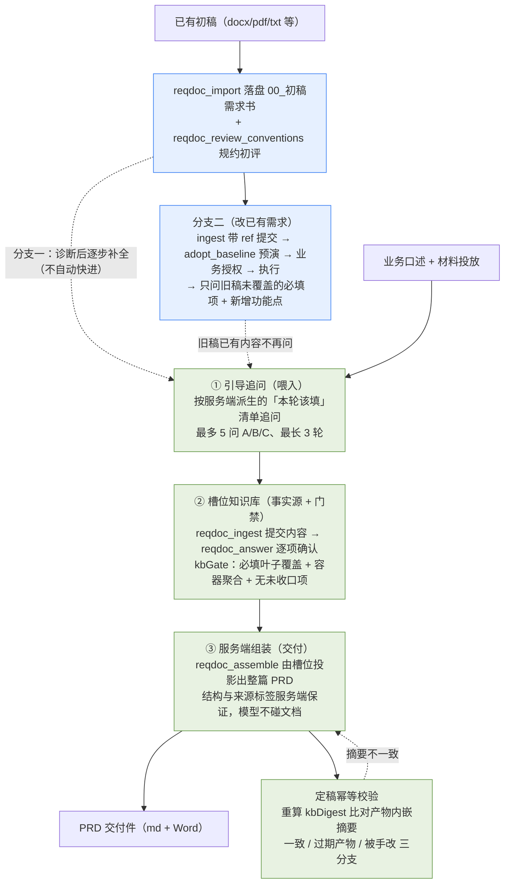
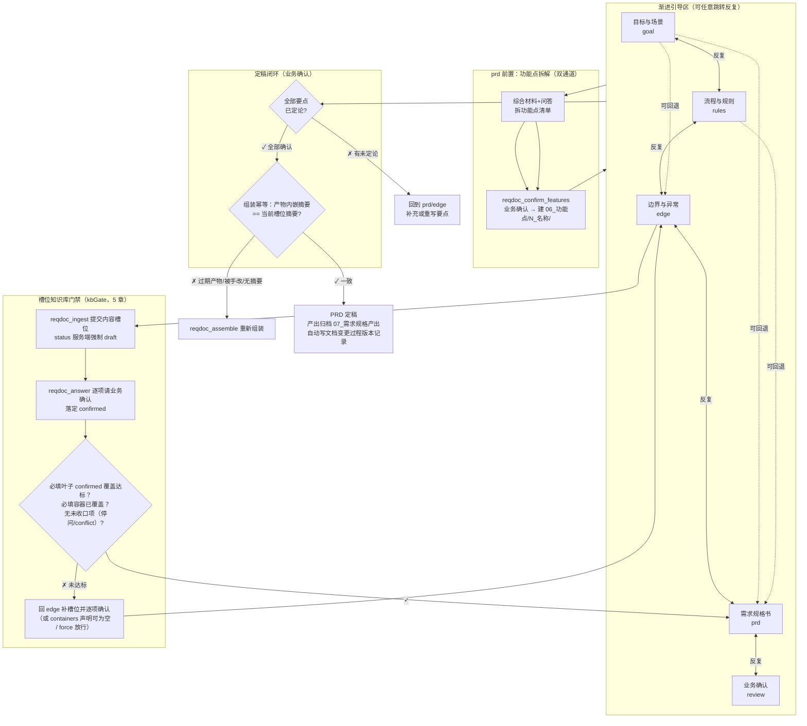
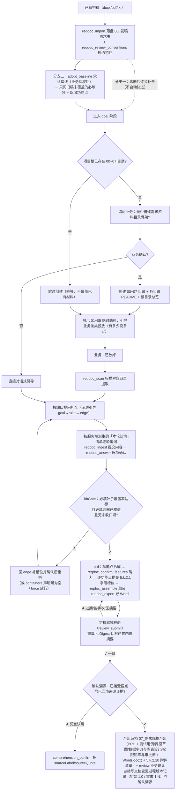
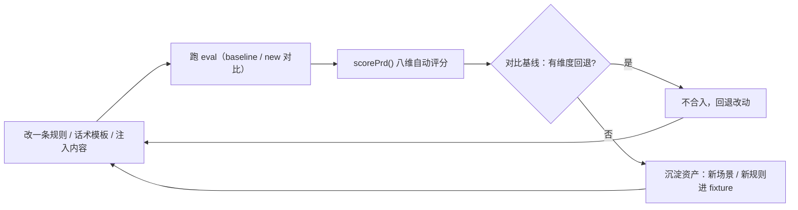

# 工作流二：reqdoc —— 需求书（辅助业务写需求）

> **架构变更提示（2026-10-01 槽位知识库重构后已同步）**：reqdoc 已由「八维打分卡 + 探针清单 + 渲染结构校验 + 来源记账 + 字段字典 + 模板骨架工具」六套平行状态，改为**槽位知识库（Slot-filling KB）**架构——**槽位是唯一事实源，PRD 是槽位的投影**，判据收敛为唯一派生门禁 `kbGate`。旧的 7 个写路径工具与 6 个状态字段已全部删除，取值与判定不再落状态、改由服务端从槽位实时派生。本文已按重构后的实现全量改写；**权威设计文档是 [`docs/reqdoc-kb-refactor.md`](reqdoc-kb-refactor.md)**（目标架构、地址空间、记忆分层、golden 体系、落地次序），本文只描述现行实现、工具契约与规则全文。重构前的历史交付记录保留在 10 章末尾「历史轮次（重构前存档）」小节——**那是历史，不是现状**。

> **文档族说明**：本文档是设计文档族的一份子（`session-management.md` 通用机制与部署统计、`workflow-sdlc.md` 软件开发工作流、`workflow-reqdoc.md` 需求书工作流）。引用约定：跨文件引用带文件名前缀（如「见 session-management.md 3.2」）；不带前缀的章号（如「见 5 章」）指本文档。通用机制（WorkflowState 核心 schema、状态转换、理解确认、质量指标、统计、评测方法论）只在主文档定义一次，本文档只放 reqdoc 专属内容并引用。

## 1. 概述

reqdoc 是**需求分析师**的工作流，核心目标**尽量通过 AI 与流程辅助业务人员写需求**：业务「口述 + 丢材料」，AI 扫描提取 + 按缺口追问补全 + 拆功能点 + **把需求内容填进槽位**，再由服务端投影成 PRD，业务逐项确认。源于《业务需求难点与解决方案》的**四段式渐进引导**（目标与场景 → 主流程与规则 → 边界与异常 → 自动化成文），外加**功能点拆解**（prd 前置）、**槽位知识库门禁**（必填槽位覆盖率，见 5 章）与**业务确认闭环**。

**核心模型：槽位是唯一事实源，文档是构建产物**。同一个现实只存一份——`WorkflowState.kb.slots`；PRD 由纯函数 `assembleDoc(slots, features, templateText)` 投影生成，产物首行内嵌 `<!-- kb-digest: xxx -->` 槽位摘要（`kbDigest`：逐槽位规范化 `address|status|source|reason|content` 后取 SHA-256 前 16 位），定稿时重算比对。**取不到的值不再存状态、也不再自评**：覆盖率、开放项清单、必填集、来源标签全部服务端实时派生。

**三大支柱（设计要点）**

reqdoc 的价值链是「**引导追问（喂入）→ 槽位知识库（事实源 + 门禁）→ 服务端组装（交付）**」，三根支柱缺一不可：

1. **引导追问（输入质量）**：业务口述 + 材料投放后，按服务端派生的「本轮该填」清单补齐缺口（goal→rules→edge，每轮最多 5 问、A/B/C 选项 + 【默认推荐项】、同一需求最长 3 轮）。清单由 `deriveQuestions` 从槽位缺口**实时派生**、随业务答复收敛，**只问还没 `confirmed` 的槽位**——这是「少问」的结构性机制（见 6 章）。
2. **槽位知识库（事实源 + 门禁）**：`kbGate` 只读三个输入（`slots` / `features` / `containers`），判据只有三条——必填**叶子**槽位 confirmed 覆盖率、必填**容器**聚合覆盖（选项 B，见 6 章）、无「未收口项」（停问项 + conflict 项）。`force_kb=true` + `force_reason`（**理由必须业务给，模型不得代填**）可放行。
3. **服务端组装（交付形态）**：结构与来源标签由服务端保证——`reqdoc_assemble` 按《业务需求说明书》模板逐字投影出整篇 md 并归档 `07_需求规格产出/`；**模型不得手写或手工编辑产物**（手写产物缺内嵌摘要，定稿必被拦）。来源标签按**最弱档聚合**（任一子项为 `[缺省]` 则整节不得标 `[文档]`），来源保证无法被绕过。

**三大支柱价值链**


```mermaid
flowchart TD
    IMP["已有初稿（docx/pdf/txt 等）"] --> IMP2["reqdoc_import 落盘 00_初稿需求书<br/>+ reqdoc_review_conventions 规约初评"]
    IMP2 -. 分支一：诊断后逐步补全（不自动快进） .-> A
    IMP2 --> AD["分支二（改已有需求）<br/>ingest 带 ref 提交 → adopt_baseline 预演 → 业务授权 → 执行<br/>→ 只问旧稿未覆盖的必填项 + 新增功能点"]
    AD -. 旧稿已有内容不再问 .-> A
    I["业务口述 + 材料投放"] --> A["① 引导追问（喂入）<br/>按服务端派生的「本轮该填」清单追问<br/>最多 5 问 A/B/C、最长 3 轮"]
    A --> B["② 槽位知识库（事实源 + 门禁）<br/>reqdoc_ingest 提交内容 → reqdoc_answer 逐项确认<br/>kbGate：必填叶子覆盖 + 容器聚合 + 无未收口项"]
    B --> C["③ 服务端组装（交付）<br/>reqdoc_assemble 由槽位投影出整篇 PRD<br/>结构与来源标签服务端保证，模型不碰文档"]
    C --> O["PRD 交付件（md + Word）"]
    C --> D["定稿幂等校验<br/>重算 kbDigest 比对产物内嵌摘要<br/>一致 / 过期产物 / 被手改 三分支"]
    D -. 摘要不一致 .-> C
    %% 风险分布：三大支柱均已结构性固化（绿色）
    style A fill:#e8f2e2,stroke:#6a9c4f
    style B fill:#e8f2e2,stroke:#6a9c4f
    style C fill:#e8f2e2,stroke:#6a9c4f
    style D fill:#e8f2e2,stroke:#6a9c4f
    style IMP2 fill:#e6f0ff,stroke:#4285f4
    style AD fill:#e6f0ff,stroke:#4285f4
```

**风险分布**：三根支柱均已**结构性固化**——追问（P1：开放项由 `deriveQuestions` 派生，缺什么问什么，无人工探针表可漂移）、事实源与门禁（P1：`kbGate` 单点判定；覆盖只认 `status === "confirmed"`，`reqdoc_ingest` 一律强制记 draft，**模型无法自称已确认**）、组装（P1：`assembleDoc` 纯投影 + `kbDigest` 幂等校验，把「PRD 与槽位一致」从提示词约束升级为可解析校验，过期产物与手改产物三分支可区分）。残留漂移点：规则文本的字段落位映射表已随阶段 3 从 r20 删除（地址改由模板结构派生进「本轮该填」清单，不再逐字注入；本轮进一步把规则里残留的编号示例也全部去编号化），`05_系统现状与能力` 的可选性使全程 `[问答]` 兜底无硬门禁（r30 仅软提示）——见 10 章飞轮。

## 2. 工作流定义

**reqdoc 定义**：需求书工作流（需求分析师角色），核心目标**尽量通过 AI 与流程辅助业务人员写需求**：业务「口述 + 丢材料」，AI 扫描提取 + 按缺口追问补全 + 拆功能点 + 把需求内容提交为**槽位**，由服务端投影成 PRD，业务逐项确认。源于《业务需求难点与解决方案》的**四段式渐进引导**（目标与场景 → 主流程与规则 → 边界与异常 → 自动化成文），外加**功能点拆解**（prd 前置）、**槽位知识库门禁**（`kbGate`，见 5 章）与**业务确认闭环**。审查阶段（`reviewStage="review"`）语义为**业务确认 PRD 要点**（区别于 sdlc 的代码理解确认），复用同一套 comprehension/checklist/review_submit 闭环机制。四清单项（completeness 信息完整 / clarity 表达明确 / edgeCoverage 边界覆盖 / resolution 职责清晰），`hasCommitGate=false`（定稿无 git 门禁）。阶段键 `["goal","rules","edge","prd","review"]`，中文名 目标与场景 / 流程与规则 / 边界与异常 / 需求规格书 / 业务确认（`stagePurpose` 依次为「明确谁在用、解决什么痛点」「理清主流程、字段与数据字典」「补全异常、逆向与权限合规」「按模板渲染需求规格书」「业务逐条确认 PRD 要点」）。prd 阶段产出由 `reqdoc_assemble` 按《业务需求说明书》模板投影（`docs/reqdoc-prd-template.md`，源自 `docs/模版.docx`），逐节标来源 `[文档]/[问答]/[缺省]` 不杜撰；**模型不读模板、不手写产物**（结构与标签由服务端保证，见 7 章）。`resolveWorkflowType` 支持 `"reqdoc"`。结构化规则见 4 章；需求资料目录契约（双通道）见 3 章；槽位数据契约与门禁见 5 章；组装与幂等校验见 7 章；PRD 定稿后经 `reqdoc_export` 导出 Word 交付件（见 8 章、session-management.md 8）。

**reqdoc 五阶段推进流程**（与 sdlc 完成门控同构；定稿闭环为业务确认，目录 → 阶段映射见 3 章）：


```mermaid
graph TB
    subgraph IterationZone["渐进引导区（可任意跳转反复）"]
        direction LR
        G["目标与场景<br/>goal"] <-->|"反复"| R["流程与规则<br/>rules"]
        R <-->|"反复"| E["边界与异常<br/>edge"]
        E <-->|"反复"| P["需求规格书<br/>prd"]
        P <-->|"反复"| RV["业务确认<br/>review"]
        G -.->|"可回退"| E
        G -.->|"可回退"| P
        R -.->|"可回退"| P
    end
    subgraph FeatureZone["prd 前置：功能点拆解（双通道）"]
        F["综合材料+问答<br/>拆功能点清单"] --> FC["reqdoc_confirm_features<br/>业务确认 → 建 06_功能点/N_名称/"]
    end

    subgraph KbGate["槽位知识库门禁（kbGate，5 章）"]
        KI["reqdoc_ingest 提交内容槽位<br/>status 服务端强制 draft"] --> KA["reqdoc_answer 逐项请业务确认<br/>落定 confirmed"]
        KA --> KG{"必填叶子 confirmed 覆盖达标？<br/>必填容器已覆盖？<br/>无未收口项（停问/conflict）?"}
        KG -->|"✗ 未达标"| EBACK["回 edge 补槽位并逐项确认<br/>（或 containers 声明可为空 / force 放行）"]
    end

    subgraph Close["定稿闭环（业务确认）"]
        C{"全部要点<br/>已定论?"}
        G0{"组装幂等：产物内嵌摘要<br/>== 当前槽位摘要?"}
    end

    IterationZone --> F
    F --> FC
    FC --> IterationZone
    E --> KI
    KG -->|"✓"| P
    EBACK --> E
    IterationZone --> C
    C -->|"✓ 全部确认"| G0
    G0 -->|"✗ 过期产物/被手改/无摘要"| BACK["reqdoc_assemble 重新组装"]
    G0 -->|"✓ 一致"| PRD["PRD 定稿<br/>产出归档 07_需求规格产出<br/>自动写文档变更过程版本记录"]
    C -->|"✗ 有未定论"| BACK2["回到 prd/edge<br/>补充或重写要点"]
```

**理解确认的 reqdoc 语义**：reqdoc 复用通用 ComprehensionRecord 机制（见 session-management.md 3.2）——记录对象为 **PRD 要点**（业务目标/核心字段/异常规则/合规要求）而非代码片段，`file`/`lines` 不填；工具参数名一律保留 `codeSegmentId`（sdlc LLM 契约不变），内部映射到 `id`；`comprehension_confirm` 单次只接受一个要点（防批量走过场）。**确认溯源（P3.10）**：`comprehension_confirm` 的可选 `sourceLabel` / `sourceQuote`（来源标签 + 引用原文或编号）在 reqdoc 定稿时**必填**——已接受要点未回填来源证据则 `review_submit` 被拦（防「凭空认可」）；回填后 best-effort 追加写入 PRD 末尾「## 确认溯源」章节，使交付件本身可追溯。

## 3. 需求资料目录契约（双通道）

reqdoc 面向**业务人员**。业务习惯把现成资料（监管发文、旧流程 Word、Excel 台账）散着给，而非结构化表达。为此约定一套**需求资料目录**：业务「按图索骥」分类投放，Agent 经 `reqdoc_scan` 按目录语义精准检索，扫描结果回填为槽位的 `[文档]` 来源。目录信息不进汇报（见 session-management.md 11）、不占用插件库，仅存在于 Agent 的引导行为与工具里。

该目录由 `REQDOC.rules`（见 4 章）驱动 Agent 落地：目录就绪检查落在 goal 阶段规则（reqdoc-r8，含「00_初稿需求书 已有文件先判定走哪个分支」的两分支判定与**分支二八步调用序**（分支二=改已有需求；分支一=全新流程，目录为空时），并入既有那一次提问、不额外多问一轮），初稿导入落在 reqdoc-r32，增量与参考件红线落在 reqdoc-r35，各阶段扫描映射嵌在 edge/prd 规则（reqdoc-r12/13/14），流程图生成在 reqdoc-r34，覆盖度门禁在 reqdoc-r22。**文档扫描经专用工具 `reqdoc_scan` 执行**（单目录参数、按阶段分步调用），对话补缺沿用渐进引导——「分析文档 + 提问题」双通道。

**目录骨架（00~07 材料区 + AI 工作区 + 知识库）**

```
<项目根>/
├── 00_初稿需求书/          # 【初稿导入入口】已有初稿放此处，reqdoc_import 解析为 [文档] 来源并产出规约初评；定稿后自动复制 PRD_V<N>.md 供下轮迭代。
├── 01_背景与目标/          # 【业务投放】为什么做、预期业务指标、需求类型、完成时间
│   └── README.md           # 初始化自动生成：本目录用途 + 建议投放材料
├── 02_流程与数据/          # 【业务投放】旧流程/SOP、数据字段说明、Excel 台账
│   └── README.md
├── 03_制度与合规/          # 【业务投放】监管政策文件、内部管理办法与风控制度
│   └── README.md
├── 04_角色与权限/          # 【业务投放】岗位角色与权限矩阵
│   └── README.md
├── 05_系统现状与能力/      # 【单位技术侧投放，可选】系统架构/现有能力/对外接口/数据模型；reqdoc_scan 按需拉取（不由 init 自动建，单位按需自建）
│   └── README.md
├── 06_功能点/              # 【Agent 工作区】功能点拆解确认后，每功能点一个子目录（N_名称/来源摘录）
│   └── README.md           # 初始化自动生成：注明本目录为 AI 工作区
├── 07_需求规格产出/        # 【Agent 输出区】最终 PRD（单功能点进 N_名称/ 子目录）+ 模板外成果子目录
│   └── README.md
├── 需求知识库/             # 【服务端维护】需求知识库：.kb.json（机器态 slots）+ 知识库.md（人可读账本，请勿手工编辑）
│                           #   独立顶层目录、不占 00~07 编号、不混入业务投料区（05 章）
└── 需求资料目录说明.md      # 初始化自动生成：目录总览（含可选 05_系统现状与能力；独立文件名，避免覆盖业务自有 README.md）
```

业务只投放 `01~05`（或纯对话不放材料）；`06_功能点` 由 Agent 在 prd 阶段拆解确认后建立，`07_需求规格产出` 是产出端，`需求知识库/` 由工具每次 `reqdoc_ingest` / `reqdoc_answer` 后自动落盘。各目录的 `README.md` 与根目录 `需求资料目录说明.md` 均由 `reqdoc_init` **初始化时自动生成**（幂等，已存在则跳过、不覆盖业务补充）。**投放引导（reqdoc-r8）**：init 后向业务展示各材料目录绝对路径，明确「有多少投多少、未投目录口述补全、无需一次备齐」，并显式提出「投放材料 / 直接口述」二选一；纯口述时先回知情确认（全程 [问答]，未确认项标 [缺省]）。

**目录 → 阶段映射（双通道）**

| 目录 | 对应 reqdoc 阶段 | 文档通道（reqdoc_scan） | 对话通道（提问补缺） |
|------|------------------|------------------------|----------------------|
| `01_背景与目标` | goal（目标与场景） | Actor/Scenario/Value 提取 | 痛点/场景/价值，模糊时给选项勾选 |
| `02_流程与数据` | rules（流程与规则） | 字段/流程提取；生成数据字典与库表设计（r12） | 字段必填/校验规则、Mermaid 反哺（r34） |
| `03_制度与合规` | edge（边界与异常） | 合规/留痕类内容的 `[文档]` 来源 | 合规、清算/差错/交易安全/数据存贮 |
| `04_角色与权限` | edge（边界与异常） | 权限矩阵提取；生成 RBAC 权限控制矩阵与审批流（r12） | 权限隔离 |
| `06_功能点` | prd（需求规格书） | —（Agent 拆解产出） | 功能点清单确认（reqdoc_confirm_features） |
| `07_需求规格产出` | prd（需求规格书） | prd 检查已有产出 | 组装产物读回校验（幂等） |
| `05_系统现状与能力` | edge（边界与异常） | 系统架构/现有能力/接口/数据模型提取，作为 prd 槽位（5.k.2.11 接口与数据源、5.k.2.12 权限与最小授权）的 `[文档]` 来源 | 技术侧确认系统能力边界 |

`01` 喂 goal（内容），`02` 喂 rules（内容），`03/04/05` 喂 edge（合规/权限/系统能力），`06/07` 与 `需求知识库/` 是产出端——编号即五步编写流顺序，与 reqdoc 五阶段天然对齐。

**知识层约定（可选目录 05）**：系统架构/现有能力/接口/数据模型与具体需求发起单位强相关，**不内置进插件，也不依赖业务不可维护的 AGENTS.md**；由单位技术侧投放至 `05_系统现状与能力/`，Agent 经既有通用工具 `reqdoc_scan(directory="05_系统现状与能力")` 消费。相应规约 `06-系统现状与能力.md`（stage: edge）强制「先扫后写、严禁杜撰」。该目录不由 `reqdoc_init` 自动生成，单位按需自建。

**初始化与引导闭环**


```mermaid
flowchart TD
    IMP["已有初稿（docx/pdf/txt）"] --> IMP2["reqdoc_import 落盘 00_初稿需求书<br/>+ reqdoc_review_conventions 规约初评"]
    IMP2 -. 分支一：诊断后逐步补全（不自动快进） .-> A
    IMP2 --> AD["分支二：adopt_baseline 承认基线（业务授权后）<br/>→ 只问旧稿未覆盖的必填项 + 新增功能点"]
    AD -.-> A
    A["进入 goal 阶段"] --> B{"项目根已存在 00~07 目录?"}
    B -- "否" --> C["询问业务：是否搭建需求资料目录骨架?"]
    C --> D{"业务确认?"}
    D -- "是" --> E["创建 00~07 目录 + 各目录 README + 根目录总览"]
    D -- "否" --> F["直接对话式引导"]
    B -- "是" --> G["跳过创建（幂等，不覆盖已有材料）"]
    E --> H["展示 01~05 绝对路径，引导业务按类投放（有多少投多少）"]
    G --> H
    H --> I["业务：已放好"]
    I --> J["reqdoc_scan 扫描对应目录提取"]
    J --> K["按缺口提问补全（渐进引导 goal→rules→edge）"]
    F --> K
    K --> S["按服务端派生的「本轮该填」清单逐轮追问<br/>reqdoc_ingest 提交内容 → reqdoc_answer 逐项确认"]
    S --> SG{"kbGate：必填叶子覆盖率达标<br/>且必填容器已覆盖<br/>且无未收口项?"}
    SG -->|"✗"| K2["回 edge 补槽位并确认后重判<br/>（或 containers 声明可为空 / force 放行）"]
    K2 --> K
    SG -->|"✓"| L["prd：功能点拆解 → reqdoc_confirm_features 确认 → 逐功能点提交 5.k.2.1 字段槽位 → reqdoc_assemble 组装 → reqdoc_export 导 Word"]
    L --> L2["定稿幂等校验（review_submit）<br/>重算 kbDigest 比对产物内嵌摘要"]
    L2 -->|"✗ 过期/被手改/无摘要"| L
    L2 -->|"✓ 一致"| G1{"确认溯源：已接受要点<br/>均已回填来源证据?"}
    G1 -->|"✗ 凭空认可"| BACK["comprehension_confirm 补 sourceLabel/sourceQuote"]
    G1 -->|"✓"| M["产出归档 07_需求规格产出（PRD + 测试用例/界面草图/数据字典与库表设计/权限矩阵与审批流 + Word(.docx) + 5.k.2.10 附件清单）+ review 业务确认<br/>自动写文档变更过程版本记录（初始 1.0 / 重做 1.N）与确认溯源"]
```

- **就绪检查**：进入 goal 阶段时检查 00~07 是否存在；缺失则调用 `reqdoc_init` 搭建骨架（幂等，绝不重建或覆盖业务已放材料），并向业务展示各材料目录绝对路径、说明「有多少投多少、未投目录口述补全」，显式提出「投放材料 / 直接口述」二选一（详见 reqdoc-r8）；业务拒绝则直接对话式引导。
- **扫描工具**：`reqdoc_scan(directory)` 单目录参数、按阶段分步调用（goal→01、rules→02、edge→03 与 04、prd→06/07 检查已有产出），解析 docx/pdf/xlsx/txt/md/json/csv 等文本类文档。
- **缺失度校验**：扫描后按映射主动反问——`01` 缺失则优先问「系统要解决的核心痛点」；有 `02` 制度却无 `04` 权限则追问「该制度要求不同岗位的权限如何隔离」。
- **功能点拆解**：prd 阶段综合材料 + 问答信息拆功能点清单，业务确认后 `reqdoc_confirm_features` 记录——**它是 `06_功能点/N_名称/` 目录的唯一创建者**（写入来源摘录 + 幂等预建 `07_需求规格产出/N_名称/`），符合「AI 引导人决定」哲学。功能点清单同时决定必填槽位集（每功能点 10 个必填叶子 + 1 个必填容器，见 5 章），故功能点一改，槽位必填集随之变。
- **槽位化（唯一事实源）**：每轮问答后必须回写槽位——① 提取到的内容批量 `reqdoc_ingest(slots=[...])`（地址取工具返回的「本轮该填」清单，一次最多 8 项，`status` 服务端强制 draft）；② 业务明确答复的项立即 `reqdoc_answer(address, content, source)` 落定 confirmed；③ 连续 2 轮未确认的项被**停问**并移出开放项清单，此时不得反复追问，应显式收口（`source=缺省` + reason 写明未确认原因）。
- **覆盖度门禁**（详见 5 章）：进入 prd 与定稿两处读 `kbGate`——必填叶子槽位未 confirmed、必填容器未覆盖、存在未收口项（停问/conflict）任一成立即拦截；业务明确「本期确实不涉及」的项用 `reqdoc_answer(source=缺省, reason=...)` 显式收口即可计入覆盖；确实无法补齐且业务坚持不做，`force_kb=true` + 业务给的 `force_reason` 放行。
- **产出归档**：PRD 由 `reqdoc_assemble` 投影生成（单功能点落 `07_需求规格产出/N_名称/PRD.md`，多功能点落 `07_需求规格产出/PRD.md`）；模板外成果（UAT 用例、低保真界面说明、数据字典与库表设计、RBAC 权限控制矩阵与审批流）用 write 写入 `07_需求规格产出` 下对应子目录，并在功能点「5.k.2.10 附件」列出清单与相对路径；**Mermaid 流程图例外**——按 r34 内嵌 PRD 正文 `5.k.2.13`（超长才拆独立文件引用），不再单独落盘 `附_流程图/`；PRD 定稿后经 `reqdoc_export` 导出 Word（.docx）交付件。

**多模态边界（硬约束）**：`reqdoc_scan` 目标部署模型（qwen3.6）为纯文本模型，**不支持读图**。扫描件图片/截图由工具显式降级（返回「无法解析图像，请业务文字描述或提供文本版」），杜绝 Agent 空承诺看图。

**边界（明确不做）**

- **不加图片解析**：多模态能力由模型决定，qwen3.6 无视觉支持时工具层显式降级，不做 OCR 等额外能力。
- **幂等**：目录已存在则不重建、不覆盖业务已放材料；`06_功能点` 重复确认覆盖记录；槽位同地址重复提交即覆盖（服务端强制回 draft，须重新确认）。
- **业务确认后才建**：功能点拆解须业务确认后才调用 `reqdoc_confirm_features`（符合「AI 引导人决定」哲学）。
- **模型不碰文档**：`reqdoc_assemble` 产物是构建产物，业务/AI 改内容一律改槽位后重新组装；手工编辑会被定稿幂等校验拦下。
- **插件不追踪路径**：目录信息不进插件库、不进汇报（见 session-management.md 11），纯本机引导层。
- **实施方案第五节「5 大机制」完整机制不纳入**（已定案，防误判为漏功能）：交互原型双确认（低保真 HTML / 可交互界面草图 + 界面确认门禁）、科技可行性与架构预审（行内 API 资产库比对 / 成本风险提醒与降级建议）、版本变更与 Impact Diff 分析（《需求变更影响评估报告》）、研发平台一键排期（JIRA / 行内研发管理平台 API 自动建单）。仅保留相邻能力：
  - 交互原型：不生成 HTML；低保真界面说明以 r20 写入 `07_需求规格产出/界面草图/` 并列入功能点「5.k.2.10 附件」。
  - Impact Diff：变更留痕走 `workflow_revisit` 回退 + 阶段 `revision++` 版本化（见 session-management.md 3.3），不产影响面报告。
  - 一键排期：需求交付以 PRD 落盘 + 人工流转为准，不做 API 对接。
- **UAT 验收测试用例仅落盘、不设「上线验收唯一标准」门禁**：用例草案已纳入（r20 写入 `07_需求规格产出/测试用例/`），但「业务确认后作为上线验收唯一标准」的机制不纳入——规则层只要求落盘归档，不强制确认门禁。
- **不做 Streamlit 门户 / 行内 UI 组件库 / RAG 知识库**：实施方案阶段推进（Phase 1~3）属组织推广计划，本工程不落地 Web 门户、组件库与 RAG 检索；问答留痕以 `comprehension_ask` 本地可检索库为限（见 session-management.md 5.2）。

## 4. 规则全文（reqdoc-r1~r35）

规则以 `WorkflowDefinition.rules: RuleItem[]` 存储（见 session-management.md 3.2 注册表），阶段化注入同 sdlc（global + 当前阶段）。源于《业务需求难点与解决方案》的四段式渐进引导 + 业务确认闭环；需求资料目录契约见 3 章。下表为按现行实现整理的注入文本（超长条目已摘要，逐字源见 `packages/shared/src/workflow.ts` 的 `REQDOC.rules`）。**当前全集 26 条 / 26 个唯一 id**（阶段 3 精简：由 30 条合并归并，global 由 10 条降到 8 条；id 不再复用——原 global 侧的 `reqdoc-r32` 独占该号，prd 侧流程图规则改为 `reqdoc-r34`）。

**相对上一版的规则集变更**（便于对照，权威以代码为准）：

- **删除**：`reqdoc-r21`（打分门禁）、`reqdoc-r23`（渲染结构校验，2c 已删）；`reqdoc-r9` / `reqdoc-r10`（主流程推演与字段字典落位，其要求已迁入 `reqdoc-r12`）；`reqdoc-r4`（并入 r3）、`reqdoc-r5`（并入 r1）、`reqdoc-r17` / `reqdoc-r18`（并入 r16）。
- **新增**：`reqdoc-r33`（填槽纪律：批量起草 / 一次性确认 / 术语优先取记忆）、`reqdoc-r34`（流程图生成，原 r32 撞号后改号）。
- **重写**：`reqdoc-r20` 降级为「生成事实」——删掉 760 字的字段映射表，映射已由模板结构派生进「本轮该填」的小节级地址（见 5 章地址空间），规则不再复述；本轮连 r8/r31/r33/r34/r35 里的编号示例也一并去编号化；`reqdoc-r14` 缩为两步；`reqdoc-r11` 只填服务端派生的开放项 + 记忆机制说明；`reqdoc-r22` / `r24` / `r27` / `r30` / `r31` 精简。
- **注意**：`rules`（流程与规则）阶段现**无专属规则**，该阶段只注入 8 条 global（原 r9/r10 删除、主流程推演归入 edge 的 r12）；流程图生成归 `reqdoc-r34`（prd 阶段）。

| id | stage | 注入文本 |
|----|-------|----------|
| reqdoc-r1 | global | 会话开始时调用 workflow_start 初始化工作流（开发者说「启动/开始 reqdoc 工作流」时也调用它，不要仅用文字回复）。定稿完成（review_submit 通过）后建议 /new 开始下一个需求，保持统计隔离。 |
| reqdoc-r2 | global | 采用渐进式分段引导，不要一次性抛出所有问题；单次提问最多 5 个问题，每个问题必须附 A/B/C 选项并标注【默认推荐项】（业务回复「同意默认」即按推荐确认）；同一需求追问最长 3 轮，3 轮后仍未澄清项标 [缺省] 进入下一环节，避免业务有被「质问」的挫败感。提问一律用业务语言，严禁出现「高并发、幂等性、API」等纯技术词汇——同一含义必须转述为业务说法（如并发重复提交→「同一笔交易被重复点了几次怎么处理」）。 |
| reqdoc-r3 | global | 阶段推进纪律：阶段可能完成时先输出摘要并询问确认，仅业务明确「确认/可以」才算（模糊表态不算），询问时须点明所确认的阶段名。确认后进入下一阶段即自动确认上一阶段（工具强制，无需单独调 approve）。业务说「回到XX」时立即 workflow_revisit(stage=XX)——**绝不自行判断阶段已完成，也不要用「进入下一阶段」绕过**。 |
| reqdoc-r25 | global | 阶段可见性（通用）：你每条回复的开头，必须用一行向业务展示当前所处阶段与全部阶段进展，格式——📍 阶段：<当前阶段中文名>（第 N/Y 步）｜ 目的：<本阶段一句话目的> ｜ 已完成：<已 approved 阶段名>✓ ｜ 下一步：<下一阶段名>。处于「未开始/空档」态时，说明「尚未开始，请从<首阶段>开始」或「空档，下一步：<阶段名>」。向业务询问确认/approve 时，必须显式点明所确认的**阶段名**（如「【边界与异常 阶段】以上边界与异常是否确认？」），不得用笼统的「以上流程与规则是否确认」之类不点名阶段的问法。 |
| reqdoc-r26 | global | 投放/口述 决定未完成前不得推进：需求资料目录（01~05）已建、但业务尚未明确选择「投放材料」还是「直接口述」时，每轮开场都须显式向业务提出二选一（或问清已投放了哪些目录），并停下等待业务明确选择；未获得明确选择不得进入追问、不得先抛其它问题。调用 reqdoc_init 后，必须把工具返回的目录绝对路径**逐行粘贴到你的回复正文里**（不要只写「见工具返回/见上方」——业务可能看不到工具记录），再附「① 投放材料 / ② 直接口述」二选一，不得自行浓缩成「方便您后续放材料」之类不触发动作的话术后直接追问。业务选直接口述时先回知情确认（见 reqdoc-r8），部分投放则仅扫描已投目录。 |
| reqdoc-r27 | global | 关键确认防浅背书：若业务连续 2 轮选择「默认推荐 / 同意默认」，则放弃 A/B/C 默认推荐、当轮改为开放式追问，强制业务对 3 项关键内容给出具体意见——量化目标（给具体数字）、功能范围、权限边界——不得继续走默认。此处不做硬拦截，靠 reqdoc-r22 覆盖度门禁兜底——默认项须用 reqdoc_answer(source=缺省, reason=...) 显式收口才计入覆盖。**静默点默认的内容不得写入记忆**（错误定义会跨需求传播）。 |
| reqdoc-r30 | global | 来源真实性：尽量让槽位来源为 [文档]——业务向 01_背景与目标 / 02_流程与数据 / 03_制度与合规 / 04_角色与权限 补充书面材料后重扫 reqdoc_scan。**凭历史记忆直接落定的术语一律标 [问答]，不算来源降级**——材料只出现该词、并未给出定义，标 [文档] 是不实溯源，审计拿标签回材料里搜不到那句话。当前无书面材料可直接与业务说明「本次全程 [问答] 兜底，未确认项标 [缺省]」，无需额外确认动作。 |
| reqdoc-r32 | global | 已有初稿需求书时，引导业务把初稿放进 00_初稿需求书/ 目录后调用 reqdoc_import(path) 导入（path 可为文件或目录）：工具按路径解析初稿为 [文档] 来源、产出「按机构规约的初评」（逐份规约列 满足/缺失/矛盾），并停在起点等待业务看初评后再逐阶段走（不自动 approve 任何阶段、不替业务快进）。初评后按三类路径补全：① AI 可直接改的结构/术语类（如术语未引原文、章节错序）；② 依赖外部依据（制度原文、系统接口、敏感字段清单）须投放 03_制度与合规 / 04_角色与权限 / 05_系统现状与能力 后 reqdoc_scan 提取；③ 仅业务知晓（真实异常实例、量化指标、权限边界）走 edge 探针追问（A/B/C + 默认推荐，≤3 轮）。初稿定位为「待完善的原始稿」，导入即诊断、不改写初稿本身。 |
| reqdoc-r35 | global | 增量与已有稿的增量口径（功能点地址按「章号.序号.*」结构寻址，序号即功能点在清单里的位置；地址本身取清单，勿自造）：① **功能点只能追加到末尾**——插入/删除/改名会让既有槽位地址漂移、内容错位，门禁判成未填导致全量重问，且无报错说明原因；已有需求要加功能时，用 `reqdoc_confirm_features` 传入「原清单 + 末尾追加的新功能」。② **不得把旧稿/上一版 PRD 整篇重新 `reqdoc_ingest`**——ingest 对提交的地址一律记为 draft（并把 askCount 归零），整篇重提会把已确认槽位静默打回草稿、覆盖率崩塌、业务被迫重述；要修改已有槽位内容只能用 `reqdoc_answer`（它保持 confirmed）。 |
| reqdoc-r6 | goal | 用一两句话引导业务说明：上线后谁在用、解决什么痛点；提炼【核心用户】【业务场景】【业务价值】，表达模糊时给出 A/B/C 选项并标注【默认推荐项】让业务勾选确认。 |
| reqdoc-r7 | goal | 进入 goal 阶段时，主动询问预估人工书写工时（小时）；业务明确给出后调用 workflow_baseline(developer_confirmed=true)。未提供不阻塞；已录入后不必重复询问。 |
| reqdoc-r8 | goal | 目录就绪检查：项目根约定 00~07 需求资料目录（编号即五步编写流顺序）：00_初稿需求书 为已有初稿导入入口；01_背景与目标、02_流程与数据、03_制度与合规、04_角色与权限 为业务投放材料区；05_系统现状与能力 为可选目录（单位技术侧投放系统架构/现有能力/接口/数据模型）；06_功能点、07_需求规格产出为 AI 工作区。尚无时主动调用 reqdoc_init 搭建骨架（幂等，绝不重建或覆盖业务已放材料），并向业务展示各材料目录的绝对路径、明确说明「把资料放进 01~05 对应目录，有多少投多少，未投放的目录我们口述补全，无需一次备齐」；业务已有初稿则放进 00_初稿需求书/ 后调 reqdoc_import(path) 导入。**00_初稿需求书/ 里有文件时，先判定走哪个分支再选路径**（并入下面「投放材料 / 直接口述」那一次提问，不要为此单独多问一轮）：**分支二（改已有需求）**——业务自己写的初稿、或本流程上一版定稿（`PRD_V*.md`）→ 调用序按本条后续顺序不跳步：`reqdoc_import` 导入为 [文档] → `reqdoc_ingest` 提交槽位（**每项 ref 填该稿路径**，槽位一律 draft）→ `reqdoc_adopt_baseline` **先不带 confirm 预演**，把按章分组的清单给业务逐条看过 → 带 `confirm=true` + `authorized_by` + `confirm_note` 执行（**两项须来自业务，模型不得代填**，照 force_kb/force_reason 先例）+ `unmapped` 逐条申报「稿里有、模板装不下的内容」（不申报这类内容会静默消失）→ 沿用基线后**只问「旧稿未覆盖的必填项 + 新增功能点」**（新增功能点用 `reqdoc_confirm_features` 末尾追加）；**别被状态条的「必填容器未覆盖」带偏**——术语容器与字段容器（本轮清单里 kind=term / kind=field 的那两个）是**聚合判定**：旧稿里有对应内容就把它提交成容器叶子（`reqdoc_ingest`，地址形如 `<容器地址>.<术语名>` / `<容器地址>.<字段名>`，具体地址取清单，勿自造），容器即算覆盖；旧稿里确实没有才声明 `required:false` + reason，**不要因为容器报未就绪就把旧稿里已写着的术语与字段重问一遍**；业务点名要改某段已确认内容时（见 r35 ②），先问清新内容再用 `reqdoc_answer` 落定 → 定稿回执给出「本次变更」清单。**顺序反了会出事**：先沿用基线、后问业务要改什么，中间没有可对照的基线，业务要的改动会被并进旧内容里分不清；**分支一（全新流程）**——该目录为空 → 按常规五阶段从头走，不为此额外发问。业务说资料已放好、或会话中途补充了材料，则调用 reqdoc_scan(directory=01_背景与目标) 扫描提取作引导输入（可重复扫描，不必等下一轮）。init 之后、进入追问前，必须显式向业务提出「投放材料 / 直接口述」的二选一（或问清已投了哪些目录），未得到明确选择不擅自推进追问；业务选直接口述时，先回一句知情确认「那全程来源会是 [问答]，定稿时你需确认『无书面材料』」再继续，部分投放则仅对投放目录扫描、状态条自然显示 [文档]/[问答] 混合、无需该确认。 |
| reqdoc-r28 | edge | 先补料再追问：进入边界与异常（edge）追问前，若 01_背景与目标 / 03_制度与合规 / 04_角色与权限 仍全空且业务未选「直接口述」，须先促业务投放其中至少 2 个目录（或确认口述），避免全程 [问答] 兜底导致需求说服力与可追溯性弱；同时提示调用 workflow_baseline(developer_confirmed=true) 录入预估工时与 MTTR 基线，形成 AI 提效对比。已扫描材料充足时可跳过。 |
| reqdoc-r11 | edge | 按工具返回的「本轮该填」清单追问（清单由服务端从槽位缺口实时派生，随答复收敛，不需手工维护探针表），清单话术见本节下方 r11 附。每轮最多 5 问（见 r2，带 A/B/C 与【默认推荐项】）；主流程/异常类须「先要真实案例再答题」——业务给不出实例则明示缺真实素材、卡住提示投放 01~05，不往下走。**清单里没有的项不要问**；标「默认：…」的说明有记忆可参考，转述成确认式提问（业务点头即可）。每轮问答后必须回写槽位（唯一事实源，不写则门禁不放行）：提取到的内容批量 reqdoc_ingest（一次最多 8 项）；业务明确答复的立即 reqdoc_answer 落定；同一项连续 2 轮未确认会被停问、移出清单，此时不得反复追问、应显式收口（source=缺省 + reason 写明原因）。最多 3 轮；到上限仍未澄清的逐条列出并说明业务可选项：补充材料/口述补全、确认接受 [缺省]、或开新会话继续。 |
| reqdoc-r12 | edge | 按已投放材料反问缺口（如已有制度但缺权限，追问「不同岗位的权限如何隔离」）；业务说资料已放好则调用 reqdoc_scan(directory=03_制度与合规) 与 reqdoc_scan(directory=04_角色与权限) 扫描提取作输入；综合岗位角色矩阵、机构隔离、审批授权与双人复核材料生成 RBAC 权限控制矩阵与审批流控制逻辑，向业务展示确认。\n主流程须先用**可读的纯文本步骤**（编号列表 ①→②→③ 或箭头串）向业务展示确认——对话内不得只给 Mermaid 图。综合扫描材料与问答产出**数据字典与库表设计**（数据实体/字段/主外键/校验规则）并请业务确认，落盘 07_需求规格产出/数据字典与库表设计/。 |
| reqdoc-r33 | edge | 填槽纪律：① 扫描后**批量起草**——一次 reqdoc_ingest 提交本轮全部提取项（工具封顶 8 项/次），不要一问一答写一条；② **一次性确认**——把本轮清单合成一条消息请业务逐项过目，业务点头后用 reqdoc_answer 连续落定，不要每项单独问一轮；③ 术语分三类，别混：**(a) 回执「已采信历史记忆」列出的项**——它们**不在本轮清单里**（服务端已剔除），**绝不要再问业务**，但**须由你直接 reqdoc_answer 落定，source 一律标「问答」**（定义出自业务过往口述，材料只出现该词、并未给出定义；标「文档」等于在交付件上做不实溯源）；不落定则术语容器覆盖不过、进 prd 被拦；**(b) 清单里带「默认：…」标记的**——共享知识命中（即 L2 组织知识），转述成确认式提问请业务点头（仍要问，只是带默认值）；**(c) 两者都没有的缩写**——正常问，取不到定义时可给猜测但必须带默认值请业务点头。 |
| reqdoc-r22 | edge | 覆盖度门禁（进 prd 硬前置）：服务端按 kbGate 校验必填槽位覆盖率与未收口项——**必填槽位未 confirmed、或有停问/conflict 项未收口，workflow_advance(stage=prd, action=enter) 会被拒绝**。工具返回的覆盖率与剩余项实时反映状态，别凭记忆判断。业务明确「本期确实不涉及」的项用 reqdoc_answer(source=缺省, reason=...) 显式收口即计入覆盖。确实无法补齐且业务坚持不做，可 force_kb=true + 业务给的 force_reason 放行（理由模型不得代填）。 |
| reqdoc-r13 | prd | 功能点拆解（核心）：综合前面 goal/rules/edge 收集的信息（材料提取 + 问答），把需求拆成功能点清单（编号/名称/优先级），先向业务展示清单确认；业务确认后调用 reqdoc_confirm_features(features=[{name,priority}]...) 记录，并为每个功能点在 06_功能点 下建子目录写入来源摘录（标注 [文档]/[问答] 来源）。业务说资料已放好则先调用 reqdoc_scan(directory=07_需求规格产出) 检查已有产出。 |
| reqdoc-r14 | prd | PRD 产出（**由服务端从槽位投影生成，不要手写**）：流程只有两步——① reqdoc_ingest 批量提交内容槽位（地址取工具返回的清单）→ reqdoc_answer 逐项请业务确认落定；② reqdoc_assemble 由服务端按《业务需求说明书》模板投影出整篇 md，归档到 07_需求规格产出。**严禁用 write 手写或手工编辑 PRD 正文**（手写产物缺内嵌槽位摘要，定稿会被拦）。槽位变更后重跑 reqdoc_assemble。定稿后调用 reqdoc_export 生成 Word 交付件。 |
| reqdoc-r20 | prd | 槽位内容铁律：工具返回的「本轮该填」地址已精确到小节，**照地址填即可，不要自己判断该写进哪一节，也不要自造地址**（换机构模板后编号会变，清单永远是唯一依据）。内容要求：业务语言书面语，**禁止杜撰事实**——[问答] 来源的口语须提炼为规范书面语，不得原话照搬；[缺省] 必须附 reason，禁止裸 [缺省]。模板外成果（UAT 用例、低保真界面、数据字典与库表设计、RBAC 权限矩阵）不插入 PRD 正文，用 write 写入 07_需求规格产出 下子目录，并在对应功能点的「附件」小节列出清单与相对路径（该小节标题与地址以工具清单为准）。 |
| reqdoc-r24 | prd | 组装幂等门禁：reqdoc_assemble 会把槽位摘要内嵌进产物，review_submit 定稿时重读比对——**不一致即拒绝**（槽位变更须重新组装；产物被手改须还原）。手写或编辑过的 PRD（无内嵌摘要）同样被拦。缺料字段如实标 [缺省] 并附 reason，不要为凑覆盖率编造内容。 |
| reqdoc-r31 | prd | 字段定义（进入本轮清单里 kind=field 的容器下的槽位，逐字段与业务确认）：每个功能点的输入字段逐一定义——字段名、类型、长度/精度、是否必填、取值域/约束、来源系统/接口——用 reqdoc_ingest(kind=\"field\") 提交、reqdoc_answer 落定。**确无结构化输入字段的，用 containers 把该容器声明为 {required: false, reason: <理由>}**（容器地址取工具返回的清单；术语容器同理，即 kind=term 的那个），否则 kbGate 会因必填容器未覆盖而拦截。 |
| reqdoc-r34 | prd | 流程图生成（prd 阶段，P3.12）：渲染每个功能点时，若满足以下任一条件，须在模板的「流程图」小节内嵌 Mermaid 流程图（flowchart TD 或 sequence diagram）：(1) 功能点涉及 3 步以上的主流程（含分支/循环）；(2) 功能点涉及多角色交互（如客户→系统→审批人）；(3) 业务在 rules/edge 阶段已提供或确认过流程图（02_流程与数据 扫描提取）。不满足时任选「● 不涉及」。该小节的地址取本轮清单，勿自造。流程图以 Mermaid 语法内嵌 PRD 正文该小节（用 ```mermaid 围栏包裹），不单独落盘附_流程图/（除非流程图超长超一屏才拆分独立文件，并在同一小节引用路径）。 |
| reqdoc-r15 | review | review 是唯一不可由 AI 自行推进的阶段（必须经 review_submit），确保业务真正理解并确认 PRD 要点。 |
| reqdoc-r16 | review | 要点拆解与确认：把 PRD 拆为可确认要点（业务目标/核心字段/异常规则/合规要求），comprehension_add 逐段复述输出。业务确认某要点立即 comprehension_confirm(codeSegmentId=该要点 id)——**单次只接受一个要点，禁止一次确认多个**。业务追问时用 comprehension_ask 把问答追加到该要点。 |
| reqdoc-r19 | review | 每个要点须达成终态（confirm 接受 / manual 自处理），不允许 pending/rejected 悬空；拒绝的要点先 rewrite 重写或 manual 定论，全部定论且前序阶段（goal/rules/edge/prd）全部 approved 后才可 review_submit；清单四项须全为 true，否则回到 edge/prd。通过率低说明要点含糊，应结合拒绝意见重写，而非简单重试。 |

> **reqdoc-r11 附：追问话术模板**（`REQDOC_PROBES` 7 条，经 `reqdocProbeRubric()` 注入 r11 文本；它只提供**问什么/建议第几轮问**，**不再是独立状态、不参与门禁**——「该问什么」的清单由 `deriveQuestions` 从槽位缺口派生，见 6 章）：
>
> - 主流程闭环，建议第 1 轮：请举一个最近发生的真实办理案例，描述它从发起到完成的具体步骤（不要泛泛讲流程，先给实例）；给不出实例请先向 01~05 投放材料或确认口述补全。
> - 流程触发条件，建议第 1 轮：什么情况下会开始这笔业务？请结合上面的真实案例说明触发场景。
> - 异常处理，建议第 1 轮：请举一个真实发生的异常案例（如某笔交易被重复提交、网络中断或提交失败），说明当时怎么处置的；无真实案例则先投放材料或确认口述补全，不要凭空假设。
> - 逆向撤销/驳回，建议第 2 轮：办错了想撤销、或提交后被驳回，怎么处理？
> - 敏感字段脱敏，建议第 2 轮：手机号、身份证这些敏感信息，界面上怎么展示？
> - 留痕与复核，建议第 2 轮：资金或重要操作，要不要留痕、双人复核？
> - 权限与机构隔离，建议第 2 轮：谁能看、谁能办？数据在总行/分行/支行之间怎么隔离？

> 注入时机（实测，脚本读 `REQDOC.rules` + `rulesForStage` 统计；字符数只计规则正文，不含阶段条头与序号）：规则全集 **25 条 / 25 个唯一 id / 6281 字符**，其中 global **8 条 / 1793 字符**（r1-r3、r25-r27、r30、r32），恒定注入。
>
> | 进行中阶段 | 注入条数 | 注入字符数 | 构成 |
> |---|---|---|---|
> | goal | 11 | 2540 | 8 global + 3 goal（r6-r8） |
> | rules | 8 | 1793 | 仅 8 global（该阶段现无专属规则） |
> | edge | 13 | 3611 | 8 global + 5 edge（r11、r12、r22、r28、r33） |
> | prd | 14 | 3269 | 8 global + 6 prd（r13、r14、r20、r24、r31、r34） |
> | review | 11 | 2240 | 8 global + 3 review（r15、r16、r19） |
>
> 对比上一版（30 条 / 10 global）：单轮注入最多下降 2 条；edge 阶段文本 3611 字符为当前最重的一档，主要来自 r8（565）、r11（780，含 7 条探针话术）、r12（316）与 r26（298）。r20 删掉 760 字字段映射表后，规则文本不再是上下文成本的主要来源。

## 5. 需求知识库门禁（kbGate，唯一门禁）

**数据契约（`WorkflowState.kb`，`packages/shared/src/workflow.ts`）**：

| 字段 | 内容 |
|---|---|
| `slots` | 槽位数组（唯一事实源）。每项 `{ address, kind: prose\|term\|field, content, source: 文档\|问答\|缺省, status: draft\|confirmed\|conflict\|retired, reason?, ref?, askCount? }` |
| `features` | 已确认功能点（**功能点单一事实源**：`reqdoc_confirm_features` 与 `reqdoc_ingest(features:)` 都写这里）——决定必填槽位集 `5.{序号}.*`。顶层 `workflow.features` 仅为 kb 建立前的初始化输入，kb 一旦存在即被清空（历史缺陷：两工具各写一份，kb 建立后 `reqdoc_confirm_features` 对地址体系无效却仍按新列表重建 06/07 目录，导致目录、槽位地址、门禁三者不一致） |
| `containers` | 容器声明 `{ [addr]: { required: boolean, reason? } }`（如 `4.1`、`5.k.2.1` 声明 `required: false` 表示本次无术语/无结构化字段，须给 reason） |
| `askCounts` | 地址 → 连续出现在开放项的轮次（追问终止用，`STOP_ASK_AFTER=2`） |

**记忆不在 kb 内（阶段 3 已接线）**：记忆是**独立的文件态**，不进 `WorkflowState.kb`、**不参与 `kbGate` 任何一条判据**（记忆只能影响「问不问」与「措辞」，不能让未确认槽位变成已确认）。`WorkflowState.kb` 里只有一个 `evidence` 字段——那是**材料原文快照**（`materialEvidence(root)` 的产物，喂给同步的状态栏用），不是记忆条目，也不写进项目侧 `kb.json`。落盘在 `~/.config/opencode/session-mgmt/memory/{l1-glossary,l2-org,l4-prefs}/*.json`（按条文件、删文件即遗忘，`SM_MEMORY_HOME` 可覆盖测试路径），读写内核在 `packages/shared/src/reqdoc-memory.ts` 与 `reqdoc-kb.ts`。三条语义（对齐 reqdoc-r11 / r27 / r33）：

- **L1 术语命中免问**——业务复述过的内部简称/行业通用词直接采信，不再追问（`deriveQuestions` 的 `l1Applied`，工具返回与状态条都会报「已采信历史记忆 N 项」）。**免问 ≠ 已覆盖**：该项被移出清单却仍是 `draft`，若模型守「清单是唯一依据」而不落定，必填容器 `4.1` 永无 confirmed 子项、进 prd 被拦——**解卡不需业务参与**，但得让 AI 知道该动手。**动作指令载于 `reqdoc_ingest` 的工具描述**（model-only、每次请求都在、不分阶段、从不进时间线），回执与状态条只报**事实 + 一句受众安全的提示**（如状态条「已采信历史记忆 1 项待你落定（不必再问）：4.1.CLD」——**地址必须带上**，回执一次性、状态条是唯一持久提示，跨轮只剩数量会让模型反查无门；措辞按 `07-业务口语` 第 3 节保持可直接转述：不点工具名、不铺门禁因果）；`r33③` 在 edge 阶段再复述一次。**落定 source 一律标「问答」**——定义出自过往需求中业务的复述，材料只出现该词、并未给出定义，标「文档」等于在交付件上做不实溯源（审计拿标签回材料里搜不到那句话），`r30` 已注明凭记忆落定的术语标 [问答] **不算来源降级**。**匹配的证据是 00~05 材料原文**（`materialEvidence`），不是模型转述的槽位正文——否则模型写一句「与 CCB 无关」也能让 CCB 命中（对抗审查 I-1，方案 C）；
- **L2 组织知识不消缺口**——只作默认值带出（开放项带 `guess`，`from: memory-L2`），仍要业务点头才算确认；
- **静默点默认不入库**——`origin=accepted_default` / `inferred` 一律拒写（`isPollutingOrigin`），错误定义不跨需求传播；写入只发生在 `reqdoc_answer(restated_term=...)`（业务主动复述释义 → L1）与定稿后的 `reqdoc_memory_recall`（业务勾选 → L2/L4）。
- **L1 写入必须带业务原话 `business_quote`（对抗审查第九轮）**——`restated_term.business_quote` 必填，留空按**拒写**处理（`writeL1Term` 返回 `missing_quote`，回执说清真因与出路），**不静默入库**。理由是**污染成本不对称**：L1 命中即免问，而免问项只需模型自己 `reqdoc_answer` 落定（source=问答）、**业务全程不参与**——一条伪造的「业务复述」可以永久消掉未来需求里一个本该问的问题，而旧格式条目里只有模型的释义、无从追查谁说的。这与 `force_kb.force_reason`、`reqdoc_adopt_baseline.confirm_note` 同一原则：**理由/凭据必须来自业务，模型不得代填**；`origin` 由服务端钉死为 `restated`（杜绝「点默认也入库」）只是**必要不充分**——它管住了「凭什么入库」，管不住「业务是否真说过」。凭据原样落库（两端空白裁掉）以备审计，`MemoryTerm.businessQuote` 为 optional，旧条目读取不受影响。

**对抗复审第十轮（评测判据在奖励违规）**：真实评测（关闭思考模式后端点才可用，见 10 章）暴露出四个渲染场景 r18/r19/r23/r24 的判据要求「模型正文里渲染出 PRD、拿五维分」——而规则明令「PRD 由服务端从槽位投影生成，不要手写产物」，评测器又从不执行工具（`ModelOutput` 只有 `text` + `toolCalls`），看不到 `reqdoc_assemble` 的返回。**遵守规则的模型必然失败**：这不是模型不听话，是判据在惩罚合规；加强「不要手写」这条规则反而会让分数下降，`--fail-on-regression` 会因此拦住正确的改动。已按「组装后验证」口径重定义为四件模型职责范围内、且规则要求的动作：r18 齐料 → 交服务端组装；r19 缺料（13% 覆盖/20 开放项）→ 继续收集槽位、不提前组装；r23 改既有内容 → 走 `reqdoc_answer` 再重新组装（顺序门禁 + 禁止整篇重提，否则产物摘要过期、定稿三重校验会拒）；r24 缺料 → 收进槽位，不得用 `comprehension_add` 绕过（实测最隐蔽的失败形态）。为此判定器新增 `sequence`（子序列顺序门禁）与 `tool.forbidTool` 两类判据，均有自检用例。

**第十一轮（代价已解决）**：评测器新增 `EVAL_EXECUTE=1`——真实内存 Store + 临时工作区 + 真实工具实现，多轮把工具结果按协议回灌，最后从 `07_需求规格产出/` **递归**读回组装产物（组装按功能点分子目录落盘，只扫顶层会永远读不到，症状是「模型没渲染」这种把排查引向错方向的假失败）。`render` / `score` 判据改为只认 `artifact`，无产物即判不通过。r18 因此恢复为评分场景，评的是真实产物。配套 `exec-selfcheck.ts`（不调模型）证明链路通、产物含内嵌摘要、判据确实读产物、重复调用能被识别。

执行器踩到的两个坑（都已修）：① 判据只看**最后一轮**的工具调用——期望的调用常发生在更早轮次，26 个 reqdoc 场景里 12 个假失败；② 弱模型在工具回灌后 loop 更凶（r14 连发 25 次 `comprehension_add`），且**把「重复调用」如实回灌并不能让它停下**，只能由执行器检测并停止。

**本机真实评测最终结果（本地 qwen3，`EVAL_DISABLE_THINKING=1 EVAL_EXECUTE=1`，26 场景同口径）**：baseline 旧注入 **12/26 = 46%**，new **19/26 = 73%**。r18 仍失败，但归因明确且正确：模型在该端点上死循环于 `reqdoc_confirm_features`（连发 4 次参数完全相同），走不到 ingest/assemble，因而无产物可评——**这是模型局限，不是指标失真**（执行链路自检已证明产物能正常产出并评分）。

**同口径真实评测结果（本地 qwen3，`EVAL_DISABLE_THINKING=1`，26 场景）**：baseline（旧注入快照）**12/26 = 46%**，new **20/26 = 77%**。九个场景转好（r2/r7/r10/r18/r19/r20/r24/r25/r26），**一个真实回退：r5「前序未完成不 submit」baseline 3/3 → new 0/3**（repeat=3 复核，非噪声）。诊断：规则文本与状态条「提交状态：blocked（未完成：prd、review）」**都在**，但状态条重构后同一事实改用业务语言嵌进长条（原始 JSON → 业务语言），显著性下降，弱模型不再据此收手。该回退归因于**状态条重构本身**（`renderBaseline` 镜像的是重构前快照），非本轮改动；修法需改措辞并重跑 baseline，按 P2 交用户拍板。

**评测已覆盖（r25/r26 一正一反）**：真实模型跑不跑得动这条 Previously 只有工具侧单测证明「不给就拒」，没有证明弱模型会主动给。故新增两个 reqdoc 场景——r25 业务口头复述缩写 → 必须调 `reqdoc_answer` 且 `restated_term.business_quote` **非空**；r26 只是点了「同意默认」→ **不得带** `restated_term`（静默点不入库这条防污染红线的直接探针）。为此两件事是前提：① 判定器补点路径判据 `argsNonEmpty` / `forbidArgsPresent`（原有 `args` 只做 `actual[k] === v` 引用相等，判不了嵌套对象）；② 评测的 `reqdoc_answer` 工具镜像此前是简化版、**根本没有** `restated_term`，模型无从调用，已补齐并与真实工具契约一致（含 `business_quote` 必填）。判据自检见 9.8。

**同名不同义不静默覆盖**：材料/记忆释义冲突时交业务裁决（`writeL1Term` 返回 conflict 提示），且**冲突优先于记忆**——材料有原文就不取记忆。

**地址空间**：prose 槽位地址即模板小节号（`3.1`~`3.6`、`4.2`、`6.1`~`6.4`、`7.1`/`7.2`、`5.k.1.1`、`5.k.1.2`、`5.k.2.3`…`5.k.2.13`）；term/field 槽位带子键（`4.1.CRD`、`5.1.2.1.客户号`）。**必填集从模板 schema 派生，不人工枚举**：章节级必填小节（去 meta 章、去容器）13 个 + 每功能点 10 个叶子（`5.k.1.1` 简要概述 + 映射字段叶子 `1.2`/`2.3`/`2.6`/`2.7`/`2.8`/`2.9`/`2.11`/`2.12`/`2.13`；`2.1` 是容器不入叶子集）——**1 个功能点共 23 个必填叶子 + 2 个必填容器**（`4.1`、`5.1.2.1`），3 个功能点共 43 叶子 + 4 容器。

**容器语义（选项 B）**：`4.1`（术语定义）与 `5.k.2.1`（输入要素的检查）是**必填容器但不计入开放项、也不计入覆盖率分母**，只做聚合判定——「有 confirmed 子项」或「显式声明 `required:false` + 理由」二者之一即可；**有候选子项却声明可为空、或有子项但均未确认，都判为未覆盖**（防绕过，见 `containerDeclViolations`）。

**判据（`kbGate`，`packages/shared/src/reqdoc-slots.ts`）**——只读 `slots` / `features` / `containers` 三个输入，共五条，全过即 `pass`：

1. **必填叶子覆盖率**：`requiredSlots` 中存在 `status === "confirmed"` 槽位的比例 ≥ `threshold`（调用点均传 1，即 100%）。**只认 confirmed**——`draft` 不消缺口，防刷覆盖率。
2. **必填容器覆盖**：`requiredContainers` 全部满足聚合判定（见上）。此项**不受 `force` 影响**——容器没内容也没声明可为空时，`force` 放行不了。
3. **无未收口项**：`deriveQuestions(...).unclosed`（停问项 + `conflict` 项）经过滤后为空。
4. **B1 守卫**：必填叶子数为 0 时直接判「需求不可实施」，**空文档不是交付物**。当前模板下章节级叶子恒为 13 个，故该守卫实际只在模板 schema 变更后可能触发；设计它的目的是防止「把必填全声明掉」这条失效路径。
5. **防绕过校验**：容器声明 `required:false` 却未给理由、或有候选子项仍声明为空 → 违规。同样**不受 `force` 影响**。

**force 的边界**：`force_kb=true` 只放宽第 1 条（覆盖率）与第 3 条（未收口项）两条；第 2、4、5 条是结构性约束，不可用 force 绕过。

**阈值不沿用 85**：`REQDOC_SCORE_PASS=85` 对应「八维自评均分」，换算成覆盖率后不等价（覆盖率 85% 远比「八维均分 85」严格，多一个小节未填就掉分）。重构后门禁取**全覆盖（100%）**，并保留 `force_kb` 显式覆盖以免存量需求被硬拦死；阈值校准仍是待办（设计文档 6.1）。注意 `force` 当前**不落状态留痕**——`force_reason` 只用于报错文案与放行判定，不进 `WorkflowState`、也不进汇报（设计文档 6.5 要求的 `{force_reason, 未收口项清单, 时间}` 留痕尚未实现，见 10 章待办）。

**门禁点（两处硬拦截，均只对 `def.type === "reqdoc"` 生效）**：

| 门禁位置 | 校验内容 |
|---|---|
| `workflow_advance(stage=prd, action=enter)` | `kb` 不存在即拦（须先 `reqdoc_ingest`）；否则按上述五条判定 |
| `review_submit` | 同上五条 + **组装幂等校验**（见 7 章）+ 确认溯源门禁（已接受要点须回填 `sourceLabel`/`sourceQuote`）+ 原有前序阶段/片段/清单校验 |

两处共用 `force_kb` + `force_reason` 放行语义（`force_kb=true` 而未给 `force_reason` 直接报错：**理由必须业务给，模型不得代填**）。`workflow_advance` 另有前置条件清单 `REQDOC_STAGE_PREREQS` 在进入/完成阶段后显式列出，让业务提前看到「进下一阶段前必须满足什么」。

**状态条与汇报投影**：状态条（`buildStateBar`）在有 `kb` 时输出「知识库：必填槽位 X/Y（Z%）；门禁可通过 ✓ / 未就绪：<原因>」与「待确认槽位 N 项（本轮问 M）；已停问 K 项」，未建库时输出「知识库：未建（请先 reqdoc_ingest 提交需求内容槽位）」；prd 阶段系统提示另注入「需求知识库流程」三步指引（kb 缺省时注入「知识库未建」三步）。汇报侧 `stats.ts` 的 `SessionStats.kb = { filled, total, pct }` 取代原 `score` 字段（`score` 保留为 deprecated 且恒为 `null`，仅历史 JSON 兼容）。

**打分卡已退役（但共享导出保留）**：`REQDOC_SCORE_DIMS` / `ReqdocScoreDimKey` / `reqdocScoreRubric()` / `REQDOC_SCORE_PASS` **仍存在**，但**不再是 reqdoc 门禁、不再注入任何 reqdoc 规则文本**（r21 已删），唯一消费者是 `scripts/eval-rules/` 的独立评分通道（`score.ts` 镜像八维扣分标准、`judge.ts` 聚合）——设计文档 4.4 第 3 层明确保留该通道。同理，`renderTargetDigest()`、`buildPrdSkeleton()`、`MAPPED_FIELD_KEYS`、`renderCheckRubric()` 是**组装/模板内部工具，不是门禁**（`buildPrdSkeleton` 被 `assembleDoc` 内部调用；`MAPPED_FIELD_KEYS` 用于必填集与「必标来源」判定；`renderTargetDigest`/`renderCheckRubric` 现已无调用点，保留仅为结构描述复用）。

## 6. 开放项派生（少问的机制核心）

**派生而非枚举**：`deriveQuestions(features, { slots, askCounts, decls, l1?, l2?, candidates? })`（`packages/shared/src/reqdoc-slots.ts`）从「必填叶子中未被 confirmed 占的」+「候选清单中未确认的容器子项」实时算出该问什么，返回四段：

| 返回 | 含义 |
|---|---|
| `all` | 本轮该问的全量（未分批、未剔除停问项）——状态条/调试用，不直接进模型 |
| `batch` | 本轮返回给模型的批次（已剔除停问项，按 `QUESTIONS_PER_TURN` 封顶） |
| `stopped` | 因连续 `STOP_ASK_AFTER` 轮未确认被移出清单的项（**未收口**，门禁会拦） |
| `unclosed` | 未收口项 = 停问项 + `conflict` 项（门禁唯一读入项） |

**两个关键常量（服务端强制，不靠规则文本叮嘱）**：

- `STOP_ASK_AFTER = 2`——同一槽位连续出现在 2 轮开放项后被停问；按**轮次**计（`advanceAskCounts` 每轮调一次），同一轮内重复调用不累加。停问不等于放行：该地址进入 `unclosed`，要么业务确认、要么显式 `source=缺省` 收口、要么 `force` 放行。
- `QUESTIONS_PER_TURN = 8`——每轮最多给模型 8 个地址（封顶在 `deriveQuestions` 的 `batch` 上，服务端强制，模型按此清单分批 `reqdoc_ingest`）。

**容器不逐个追问**：`4.1` 与 `5.k.2.1` 只做聚合判定，永不进开放项（见 5 章选项 B）。只有当调用方显式给出 `candidates`（容器下的术语/字段候选清单）时，容器子项才会以 `4.1.CRD` / `5.1.2.1.客户号` 形态进入开放项——**服务端不预置候选**，且当前门禁/工具/状态条调用点均未传 `candidates`，故线上术语与字段只走聚合判定、不逐项追问。

**记忆机制（阶段 3 已接线；2026 全阶段对抗审查 P0-1 修复前此处曾与代码矛盾——`candidates` 生产零传递，等于死代码，现已接通）**：`deriveQuestions` 支持 `l1`（L1 术语记忆）命中即**消缺口**（内部简称/行业通用不再问）、`l2`（L2 组织知识）命中**不消缺口**但带默认猜测问一次。记忆类型与决策内核在 `packages/shared/src/reqdoc-kb.ts`，读写落盘在 `reqdoc-memory.ts`（`matchMemory` 只返回命中项，**记忆原文不可见给模型**），CLI 侧 `opencode-sm memory list` / `forget` 做可见性与遗忘。**记忆生效的必要条件是 `candidates`**：`deriveQuestions` 的候选分支（`opts.candidates`）是 L1/L2 唯一的消费点，缺了它整段不执行。候选由 `reqdoc_ingest(candidates=…)` 提交（材料中真实出现的术语/字段名，**模型不臆造**）并落进 `kb.candidates`，四个生产调用点均已传入。**调用点已传入 `candidates` 与 `l1`/`l2`**：`reqdoc_ingest` 与 `reqdoc_answer` 的返回（每次回写槽位后按**材料原文**重新 `matchMemory` + 派生）、状态条与 prd 阶段注入块（`prompt.ts`，读 `kb.evidence` 快照），因此线上开放项会随记忆收敛，并输出「🧠 已采信历史记忆，免问 N 项」。**证据 = 00~05 材料原文，06/07 不作证据**（07 是组装产物，拿它当证据等于把自证面挪回原位）；代价是 `[问答]`/`[缺省]` 来源的槽位不参与记忆匹配——记忆只服务材料驱动场景。写入侧只有两处入口（业务主动复述 → L1、定稿勾选 → L2/L4，见 5 章），门禁读入的 `unclosed` 不含记忆项（`workflow.ts` / `review.ts` 的 `kbGate` 调用不传 `l1`/`l2`——门禁口径与「少问」口径刻意分开）。

**追问纪律不变**：`≤5 问/轮`、`A/B/C + 【默认推荐项】`、`≤3 轮`、业务语言（禁纯技术词汇）由 reqdoc-r2 约束；r27 进一步要求连续 2 轮走默认后改为开放式追问、强制给数字与真实举例。少问由**派生**保证（已确认的不再问），不由模型自觉保证。

## 7. 组装与幂等校验（PRD 是投影）

**组装（`assembleDoc`，`packages/shared/src/reqdoc-assemble.ts`）**：纯函数入参 `(slots, features, templateText, { containers })`，模板逐字来自 `buildPrdSkeleton(templateText, features)`（部署包随带 `docs/reqdoc-prd-template.md`，客户端不依赖运行目录有模板文件）。逐节处理规则：

- **正文取值**：优先 `confirmed` 槽位，其次 `draft`；`retired` 槽位不参与渲染（`知识库.md` 中以删除线留痕，供审计）。
- **来源标签（最弱档聚合，`aggregateSourceTag`）**：强弱序 `缺省 < 问答 < 文档`，取子项中最弱档——**只要有任一子项为 `[缺省]`，整节不得标 `[文档]`**；容器节无子项标 `[缺省：本节无内容]`。映射字段即使正文为空也须带标签，非映射字段有内容时省略标签（避免正文噪声）。
- **空内容**：prose 空 → 留空标题、正文为空，标 `[缺省：…]`；容器节全空且声明 `required:false` → **整节省略**（连标题都不渲染），并记入 `omittedContainers` 返回给模型。
- **产物元信息**：首行内嵌 `<!-- kb-digest: xxx -->`；工具返回结构指纹（功能点数、小节数、来源标签处数）、省略的空容器节与摘要，**不回吐正文**。

**幂等校验（定稿三分支）**：产物摘要 = 当前槽位摘要 → **一致**，通过；摘要不同且槽位也已变 → **过期构建产物**，提示重跑 `reqdoc_assemble`；摘要不同而槽位未变 → **产物被手改**，拒绝。把「过期」误判成「手改」会惩罚正常迭代，反之门禁形同虚设。另两条硬拦：产物文件缺失（预期路径由 `kb.features` 推导）拦、**产物无内嵌摘要**拦——否则模型用 write 手写一篇 PRD 就能绕开整个校验。

**Word 交付**：`reqdoc_export(source=PRD md 路径)` 把定稿 md 转 .docx，与源 md 同目录归档（实施方案「标准 PRD (Markdown/Word)」）。定稿后另有三项 best-effort 后处理：回填「第二章 文档变更过程」版本行（初始 1.0 / 重做 1.N）、复制 `PRD_V<N>.md` 到 `00_初稿需求书/` 供下轮迭代、把确认溯源追加到 PRD 末尾。

**装配路径与文件名**：`assembleDir` 决定落盘目录（单功能点 → `07_需求规格产出/N_名称/`；多功能点 → `07_需求规格产出/`），定稿校验的预期路径由 `prdRelPath` 从 `kb.features` 推导并**固定拼接 `PRD.md`**。因此 `reqdoc_assemble` 的 `source` 参数只应留空或传 `PRD.md`——传其它文件名会让定稿校验判为「未找到 PRD 产物」。

**docx 与 md 的维护约定**：`docs/模版.docx` 为权威源，`docs/reqdoc-prd-template.md` 为运行时载体（插件读的是 md；r14/r20 规则文本不引用 docx，避免双权威歧义）。**改 docx 必须同步重渲染 md**，否则「严格逐字遵循」名不副实。

## 8. 专属工具

reqdoc 无 git 提交门禁（`hasCommitGate=false`），`commit_gate_*` 工具不启用。reqdoc 专属工具共 11 个（通用工具 workflow_advance/revisit/baseline/comprehension_*/review_submit 见 session-management.md 4.1）：

| 工具 | 用途 | 服务端校验 |
|------|------|-----------|
| `reqdoc_init` | 搭建 00~07 目录骨架 + 各目录 README + 根目录总览，并展示各材料目录绝对路径 | 幂等（已存在不重建、不覆盖业务材料） |
| `reqdoc_scan` | reqdoc 需求资料扫描：单目录参数、按阶段分步调用（goal→01、rules→02、edge→03/04、prd→06/07），解析 docx/pdf/xlsx/txt/md/json/csv 等文本类 | 仅列目录 + 提取文本；图像与不支持格式显式降级提示文字描述（qwen3.6 无多模态，见 3 章硬约束） |
| `reqdoc_confirm_features` | reqdoc prd：功能点拆解确认（业务已确认清单后记录），**`06_功能点/N_名称/` 的唯一创建者**（写入来源摘录 + 幂等预建 `07_需求规格产出/N_名称/`） | 仅 reqdoc；至少 1 个功能点；重复调用覆盖记录 |
| `reqdoc_ingest` | reqdoc 槽位批量提交：把从材料提取的内容提交为**槽位**（不是写文档）。可附 `features`（首次/修正功能点清单）与 `containers`（如 `4.1`、`5.1.2.1` 声明 `required:false` + reason） | 仅 reqdoc；`status` 一律服务端强制 `draft`（模型不能自称已确认）；`source=缺省` 未给 reason 报错；同地址覆盖；按工具返回的「本轮该填」清单地址提交（该清单每轮最多 8 项）；每次调用后推进本批地址的 askCounts、回写新的「本轮该填」清单，并按**材料原文**（00~05，缓存按 mtime 指纹失效）匹配记忆返回「🧠 已采信历史记忆，免问 N 项」；回执只报事实（不在清单、不必再问、由你直接落定、source=问答），**动作指令载于本工具的 description**（model-only、不分阶段） |
| `reqdoc_answer` | reqdoc 槽位确认：业务确认后把某地址落定 `confirmed`（未先 ingest 的地址允许直接补填并确认）。可选 `restated_term` —— 业务**主动口头解释**某缩写/简称时附上，即刻写入 L1 术语记忆；其中 `business_quote`（业务原话）**必填**，留空拒写 | | 仅 reqdoc；`source=缺省` 未给 reason 报错；返回覆盖率、剩余本轮该填数、仍未收口项与 L1 消缺口数；**`restated_term` 的 `origin` 由服务端固定为 `restated`，模型无法自填**——业务只是点了默认时工具描述明确禁止传该参数（静默接受不入库）；同名不同义不覆盖，返回冲突提示交业务裁决 |
| `reqdoc_adopt_baseline` | reqdoc 承认基线：把一份已有需求书（自己的初稿 / 本流程上一版 PRD）派生的槽位一次性确认，业务不必把稿里已有的内容再说一遍；确认时冻结 `kb.baselineSnapshot` 作为变更清单基准 | 仅 reqdoc；**不带 `confirm` 先预演**（按章分组返回清单 + 覆盖率变化）；执行必须给 `authorized_by` + `confirm_note`，**模型不得代填**（照 `force_kb`/`force_reason` 先例）；**只认 `source=文档` 且 `ref` 指向该基线文件的槽位**（`[问答]` 的冒充基线 = 不实溯源）；**`unmapped` 必填**（可为空数组）：稿里有、模板装不下的内容逐条申报处置——不申报这类内容会静默消失；**承认基线不豁免任何必填项** |
| `reqdoc_assemble` | reqdoc PRD 组装：把槽位投影成整篇 PRD（md）并归档 `07_需求规格产出/`（单功能点进 `N_名称/` 子目录，多功能点落根）。返回结构指纹 + 省略的空容器节 + 槽位摘要 | 仅 reqdoc；模板不可用或功能点为空报错（提示先 `reqdoc_ingest` 提交功能点）；结构与来源标签服务端保证，产物不得手工编辑 |
| `reqdoc_memory_recall` | reqdoc 定稿记忆回顾（阶段 3 新增）：把本次收集到的组织知识候选（系统名/接口/产品线等）逐条列给业务**勾选**，勾选的写入 L2 组织记忆供后续需求复用为默认值；可选 `prefs` 写 L4 表达偏好（只影响措辞与详略）。定稿通过后调用一次即可 | 仅 reqdoc；**业务未勾选的绝不写入**——刻意做成独立工具而非定稿自动写（自动写等于 AI 决定什么值得记住，而记忆跨需求传播）；静默默认来源（`accepted_default`/`inferred`）不入库并在返回中列出；写入后把对应 `[问答]` 槽位置 `retired`（已进记忆不必重复追问，状态随工作流状态落库、知识库文件在下一次 `reqdoc_ingest`/`reqdoc_answer` 回写时同步）；不影响任何门禁与判定；可见性与遗忘走 `opencode-sm memory list` / `forget` |
| `reqdoc_export` | reqdoc PRD 导出：定稿 PRD 从 md 转 Word（.docx）交付件，与源 md 同目录归档 | 仅 reqdoc；`source` 为 md 相对项目根路径；仅转换 .md（源不可读报错提示先组装） |
| `reqdoc_import` | reqdoc 基于初稿完善入口：把业务已有初稿（docx/pdf/txt 等）落盘 `00_初稿需求书/`、解析为 `[文档]` 来源，并产出「规约初评」（按 7 份机构规约逐条点评 + 三类补全路径） | 仅 reqdoc；不自动 approve 任何阶段、不自动快进；规约初评只诊断不改写初稿 |
| `reqdoc_review_conventions` | reqdoc 规约初评：读取 `00_初稿需求书/` 下的初稿，按 7 份机构规约输出「满足/缺失/矛盾 + 引用段落 + 补全路径」结构化初评 | 仅 reqdoc；无初稿时提示先 reqdoc_import；初评是诊断，不改写初稿 |

## 9. 实际效果：业务确认（场景五）

**场景五：reqdoc 业务确认（PRD 要点逐段确认）**

```
分析师: PRD 已生成，进入业务确认。共 5 个要点，逐段确认：

Agent:  📋 需求书 "合同管理流程" — 要点 1/5: 业务目标 ───
       「合同起草、审批、归档全流程线上化，审批时效从 3 天降到 1 天内」
       是否确认该目标？[确认/追问]

业务:   确认

Agent:  ─── 要点 2/5: 核心字段 ───
       「合同编号（必填）、合同金额（必填，>0）、生效日期、审批状态」
       是否确认该字段定义？[确认/追问]

业务:   等等，合同金额还要支持外币

Agent:  好的，已记录。我将补充「币种」字段后重新呈现该要点。
       （调用 comprehension_reject 附意见 → comprehension_rewrite 重写）
```

业务逐段确认（`comprehension_confirm` 单要点，且须回填 `sourceLabel`/`sourceQuote`）直至全部终态后 `review_submit` 通过——该次定稿同时过 `kbGate`、组装幂等校验与确认溯源门禁，业务确认闭环完成；未通过的要点经 reject/rewrite 或 manual 定论。若知识库中 `[缺省]` 收口的槽位 ≥3 个，`review_submit` 返回会附带软提示，建议补材料/实例后再评审。

**统计输出示例（reqdoc 会话级）**（统计分层与口径见 session-management.md 6；需求质量指标现为知识库必填槽位覆盖率）：

```
📋 需求书 "合同管理流程" (sess_def456)
分析师: analyst@example.com
周期: 1.8 天

工作流:
  目标与场景  ██████████░░  1.1h  ✓ approved
  流程与规则  ████████░░░░  0.9h  ✓ approved
  边界与异常  ████████████  1.4h  ✓ approved
  需求规格书  ██████░░░░░░  0.7h  ✓ approved
  业务确认    ████░░░░░░░░  0.4h  ✓ approved (一次确认通过率 80%, 要点确认 4/5)

质量:
  知识库必填槽位覆盖率: 23/23 (100%)  |  一次确认通过率: 80%  |  迭代轮次: 1 轮
  基线对比: 预估 40h / 实际 1.8d → AI 提效 30%
  审查清单: ✓全部通过(4/4)  |  要点确认: 5 要点 ✓已确认

AI 使用: 对话 32轮 | $0.12 | 28K tokens
```

reqdoc 会话不产出代码，sdlc 专属指标——AI 代码行数（业务/测试/配置三分类）、覆盖率、返工率——为 `null`（显示 N/A）。

## 10. 评测与质量飞轮

规则遵循度评测**方法论**（run 方式、baseline 冻结纪律、判定方式、关键教训、改动分级决策图）见 session-management.md 13.1 / 13.3 / 13.5 / 13.6；sdlc 场景 s1-s22 见 workflow-sdlc.md 8 章。reqdoc 场景 r1-r24 明细如下（场景集共 46 个，判定类分布：`tool` 25 / `no_tool` 12 / `text` 5 / `score` 2 / `render` 2）。

**场景明细（r1-r24）**

 - **追问纪律与引导闭环**：渐进引导最多 5 问带 A/B/C 选项与【默认推荐项】（r1，`text.optionsABC`）/ 业务确认单要点（r2）/ 进 goal 问基线（r3）/ 回到流程规则走 revisit（r4）/ 前序未完成不 submit（r5）/ edge 追问覆盖 ≥2 类（r6）/ 定稿后提示 /new（r7）/ 业务确认正向定稿（r8）/ 要点未定论不定稿（r9）/ 拒绝后重写（r10）。
 - **双通道与功能点拆解**：资料已放好应 `reqdoc_scan` 扫描分析而非空问（r11）、功能点拆解经 `reqdoc_confirm_features` 确认（r12）、功能点未确认不得直接成文定稿（r13）。
 - **槽位知识库门禁（重构后为槽位版断言）**：进 prd 前先 `reqdoc_ingest` 补齐知识库（r14，`expectTool: reqdoc_ingest`）、知识库未就绪（覆盖率不足）不定稿（r15，`no_tool` 禁 review_submit）、槽位全填但未 confirmed 不定稿（r16）、达标且业务确认后定稿（r17，正向 review_submit）。
 - **评分模式（质量飞轮 P0，`judge.kind="score"`，r18-r19）**：对 PRD 文本做八维确定性评分——材料齐全渲染应高分（r18，`minTotal` + `dimMin` 下限）、缺异常与权限渲染应低分不杜撰（r19，`dimMax` 上限），构造产出度量区分度，供 baseline→new 逐维对比。**评分器是开发期度量工具，与生产期门禁无关**（门禁只认 `kbGate`）。
 - **开放项可测化（槽位版，r20-r22）**：追问答复提交为槽位（r20，`expectTool: reqdoc_ingest`；用户明说「权限材料里真没写」→ 应提交 `[缺省]`+理由而非硬编）、知识库未收口不推进（r21，`no_tool` 禁 `workflow_advance(enter prd)`）、覆盖率达标进 prd（r22，正向 `workflow_advance`）。
 - **渲染结构可测化（`judge.kind="render"`，r23-r24）**：对回复文本里的 PRD 渲染骨架用共享 `parseRenderStructure` 做渲染 diff 判定（与运行时解析同源）——材料齐全结构达标（r23，五章齐全且顺序正确 + 2 功能点块）、缺料仍给全骨架且映射字段标 `[缺省]`（r24，结构版不杜撰）。**r23/r24 启用 `soft` 拆级降权（A3/D7）**：来源标注降为**观察项**——仍解析、仍记录进 detail，但不计通过率；硬判据只留结构骨架（章节齐全/顺序/功能点块数）。该拆级在重构后依然有效，但「来源标注是否达标」在生产期已由服务端 `aggregateSourceTag` 保证，不再依赖模型自觉。

> 完成后提示 /new（r7）与审查全流程（r8-r10）为 reqdoc 侧同口径场景，判定框架见 session-management.md 13.3。

**两条评分通道别混（模型自评 ≠ 产出度量）**

- **生产期门禁（reqdoc 工作流内）**：唯一门禁是 `kbGate`（必填槽位覆盖 + 容器聚合 + 无未收口项，见 5 章），读服务端强制的 `confirmed` 状态，模型无法自评通过。
- **开发期评分（eval 侧）**：`scripts/eval-rules` 的 `scorePrd()`（`judge.kind="score"` 配合 r18/r19）：**确定性产出度量**，不靠 LLM 判卷——按内容专属词表谓词对模型产出的 PRD 文本逐维扣分，供 baseline→new 逐维对比；其扣分标准镜像 `REQDOC_SCORE_DIMS`（shared 内仍在，非门禁）。高分自评却渲染不出对应内容，由产出度量暴露。

判定类归属见 session-management.md 13.3：behavior 类（`tool_use`/`no_tool`/`text`）sdlc 与 reqdoc 共用，output 类（`score`/`render`）**reqdoc 专属**，sdlc 不跑（只走通过率）。

**质量飞轮：把产出度量接进评测，从「过/不过」升级为「0-100 八维数字」**

**使用者：本小节面向应用开发人（科技部研发团队）**——飞轮是**开发期迭代工具**（评测门 / 基线冻结 / 46 场景 / 多模型回归）；业务需求提出人在**生产期**只用 reqdoc 工作流与 `kbGate` 门禁，**从不运行飞轮**。

**先分清「度量对象」与「改进落点」**——质量飞轮直接度量的是**需求书（PRD）质量**（八维 0-100），不是这套应用的代码质量；但飞轮的改进落点是**这套应用「产出高质量需求书」的行为面能力**（规则 / 话术模板 / 上下文注入等模型读进上下文的内容），也不是机制面代码质量：

| 维度 | 谁度量 / 验证 | 对象 |
|---|---|---|
| 需求书质量 | 质量飞轮（PRD 八维分，0-100） | 业务需求书 |
| 应用机制面代码质量（bug / 门禁 / 状态机 / DB） | `bun test` + typecheck + CI | 这套应用本身 |
| 应用行为面能力（规则 / 追问话术 / 注入内容能否让模型产出达标需求书） | 评测门 / 质量飞轮 | 这套应用本身 |

一句话：质量飞轮拿「需求书打几分」这个信号去迭代「AI 代笔写需求书」这套应用——**度量落在需求书，改进落在应用的行为面**；应用机制面代码质量跟它无关，走传统工程验证（行为面/机制面边界见 `plugin-guide/eval-driven-rule-iteration.md` 1 章）。

**行为面改进落点 = 注入模型上下文的内容，具体四类**（飞轮每一轮改的就是这些，不是机制面代码）：

1. **规则文本**（`WorkflowDefinition.rules`，按阶段注入）——如 r11 清单追问与槽位回写纪律、r33 填槽纪律、r22 覆盖度门禁、r24 组装幂等门禁；
2. **工具描述**（`reqdoc_ingest` / `reqdoc_answer` / `reqdoc_assemble` / `reqdoc_confirm_features` 等的 `description`）——模型选工具时读的说明；
3. **状态条**（多行阶段状态块：阶段表头「当前阶段（第 N/Y 步）+ 目的 + 状态」/「知识库：必填槽位 X/Y（Z%）；门禁…」/「待确认槽位 N 项（本轮问 M）；已停问 K 项」行）——随会话注入、替代冗长 JSON；
4. **prd 阶段注入的知识库流程指引**（`reqdoc_ingest` → `reqdoc_answer` → `reqdoc_assemble` 三步 + 「不要手工编辑产物」+ 门禁口径）——组装的依据；**模板全文不再注入对话**，结构由服务端投影保证。

其中 r11 的追问话术模板经 `reqdocProbeRubric()` 单点生成，其余规则为直接文本；工具描述只引用不复述完整 rubric，单点事实源不漂移。

**注意区分「改进落点」与「评测判定口径」**：`scenarios.ts` / `judge.ts` / `run.ts` 等**评测脚本不属于行为面**——它们是对照物/量尺：飞轮改的是上面四类注入内容，用判定口径去量改的效果（通过率 / 八维分）。判定口径改动同样要过评测门（判据变了、结果不可直接对比），但那是「换尺子」不是「改被测内容」。

**别当成「全自动优化」：迭代方式与收敛点**

飞轮的目的确实是「迭代出一套让模型产出高八维分需求书的提示词」，但它**不自动改提示词**——是**人机协同的迭代**，且收敛有界：

1. **不是「一直跑」，是「跑 → 看归因 → 改一处 → 再跑」**：每次迭代跑出基线 → 归因出「哪一维弱、对应哪根支柱」→ 应用开发人改对应规则 / 话术 / 注入内容 → 再跑确认那维回升、其它维不降（六步闭环见 `plugin-guide/eval-driven-rule-iteration.md` 2 章）。
2. **「合适」的范围由两个输入框死**——八维 = 希望需求书达标的维度（业务价值 / 流程闭环 / 异常边界 / 合规脱敏 / 权限隔离 / 素材真实性 / 非功能覆盖 / 可验收性），飞轮只在这八维内迭代，评测脚本看不见的 PRD 质量（业务洞察深度、创新性、可读性）不优化；评测场景集 = 喂进来的业务情况代表，提示词只对场景集覆盖的场景泛化。
3. **防过拟合 + 有收敛点**——多模型验证（本地弱模型 + 远端强模型各跑一遍，机制见 `plugin-guide/eval-driven-rule-iteration.md` 6 章）；收敛判据 = 连续几轮各维分数稳定、回归检测无回退、场景全部达标 → 停手沉淀为冻结基线。

rule-based 布尔断言（session-management.md 13.3）只能回答「这版规则让模型遵循得更好吗」，回答不了「需求书质量高了几分」。而 `scorePrd()` 八维打分本就是质量度量器：**让它对每个场景产出的 PRD 自动评分**，评测就获得——

- **每维数字基线**（businessValue / flowClosure / edgeControl / compliance / authority 等各维多少分）
- **回归检测**（改一条规则后哪一维掉了 → 精确定位改坏了什么）
- **归因**（哪个维度系统性薄弱 → 对应三支柱哪一根、哪条规则）


```mermaid
flowchart LR
    R["改一条规则 / 话术模板 / 注入内容"] --> E["跑 eval（baseline / new 对比）"]
    E --> S["scorePrd() 八维自动评分"]
    S --> C{"对比基线：有维度回退?"}
    C -->|"是"| X["不合入，回退改动"]
    C -->|"否"| A["沉淀资产：新场景 / 新规则进 fixture"]
    A --> R
    X --> R
```

**三支柱各自的可持续动作**

1. **追问（少问的结构）**
   - 现状：追问清单由 `deriveQuestions` 从槽位缺口派生（已 `confirmed` 的不再问，**L1 术语命中消缺口、L2 只作默认值**），`STOP_ASK_AFTER=2` 停问、`QUESTIONS_PER_TURN=8` 封顶由服务端强制；r11 提供追问清单口径与槽位回写要求，r33 约束批量起草 / 一次性确认 / 术语优先取记忆。
   - 自持续：eval 数据里哪类槽位最常被停问/最常返工，就调整该类槽位所在阶段的材料引导（哪些目录该多投）或话术模板；「漏问」靠与冻结开放项清单逐地址比对发现（设计文档 4.4 第 1 层 golden）。
2. **事实源与门禁（可测性）**
   - 现状：`kbGate` 单点判定、覆盖只认 `confirmed`、容器聚合 + 防绕过 + B1 守卫。
   - 自持续：阈值（当前全覆盖）按实测校准并记录依据（设计文档 6.1 为待办项）；补 `force_kb` 留痕（`force_reason` + 未收口项清单 + 时间落 `WorkflowState.kb` 并进汇报，设计文档 6.5）——届时停问率 / force 使用率可作为「追问过细/被硬拦」的量化信号。
3. **模板与组装（交付形态）**
   - 现状：`assembleDoc` 纯投影 + 来源最弱档聚合 + `kbDigest` 幂等校验（一致 / 过期 / 手改三分支）。
   - 自持续：**模板结构已改为从 `docs/reqdoc-prd-template.md` 解析**（`reqdoc-template-schema.ts`），换模板只需改该 md，必填集、开放项、组装、结构校验自动跟随；政策层（哪些子节必填/必标来源/是容器）按**标题**声明在 `reqdoc-template-schema.ts`，模板改了小节标题时由 `unresolvedPolicy` 报出要求人工确认。结构侧由 r23/r24 守。

**落地节奏与优先级**

```
每轮迭代：跑 eval（PRD 八维评分）→ 看八维分数分布 → 归因到三支柱 → 改一处
→ 回归对比 → 通过则沉淀 → 下一轮
```

- **重构前已完成且仍然有效的部分**：P0 `score.ts` 八维评分器 + r18/r19 prd-render 场景 + run.ts 聚合与逐维对比；P2 结构 schema + 共享 `parseRenderStructure` 渲染 diff 判定 + r23/r24 `soft` 拆级降权（来源标注降观察项、输出原文落 `outputs` 供归因）。这些判定类**与旧门禁解耦后继续服务开发期度量**，保留不动。
- **重构带来的新度量项（待建）**：① 停问率与 force 使用率（衡量「追问是否过细/是否被硬拦」）；② 容器声明 `required:false` 的使用分布（衡量「把必填全声明掉」是否为默认路径）；③ 槽位级返工（同一地址被反复 ingest/answer 的次数）。
- **待办**：① 对真实模型端点跑 `--variant baseline` → `--variant new`，确认 r14-r22 槽位版断言与八维无回退（方法论见 session-management.md 13.1）；② `force_kb` 留痕落状态（设计文档 6.5）；③ 覆盖率阈值实测校准（设计文档 6.1）。

**reqdoc 实测记录（质量飞轮迭代闭环）**

规则遵循度评测的**迭代闭环与历史结果**（含 sdlc 侧 s1-s22 的混合里程碑）见 session-management.md 13.4。reqdoc 侧记录如下。

**本轮（2026-10-02 换模板显式重置 + 政策告警回执）**：补上模板单一事实源落地后的三条遗留决策。**① 换模板 = 显式重置**：新增 `schemaAddressSpace()`（模板的必填地址空间：功能点章号 + 必填小节 key + 容器 + 必填功能点子节，**不含标题与正文**——改措辞不该被判成换模板）记在 `kb.templateAddressSpace`，`templateDrift(kb)` 做**集合包含**判定而非指纹相等：旧必填地址不在新模板里才算漂移。判据**宁窄勿宽**——误报一次就是让业务白做一遍需求，漏报只是多答一节；实测边界：改措辞/机构加一节 → 不报；章节重编号 / 功能点挪章 / 删必填小节 / 删必填功能点子节 / 容器挪位 → 报并指名道姓说哪些没了。`readKb` 在首次建库时记下地址空间（只记一次，后续变更不自我抹平漂移），漂移时在**状态条与 ingest / answer / assemble 三处回执**报「模板结构已更换，建议开新会话重走」，并附转述边界（对业务只讲三件事，不提槽位/地址/目录名）。**只报不自动清**：`kb.slots` 是唯一事实源、原地覆盖不留历史，自动清空等于替业务决定这轮问答不算数；跨版本搬地址要判断旧内容在新模板的哪一节算数，服务端无法校验语义（与导入旧稿「映射由 AI 完成」的已知限制同类），故不做自动迁移。**② 政策告警接进回执**：`unresolvedPolicy`（政策按标题声明、模板里找不到该标题）此前只存在于 schema 对象里，**运行中的业务看不到**；现接到 `reqdoc_assemble` 回执，被跳过的必填项不再一路静默到定稿才被门禁拦下。**③ 多模板并存：不做**（结论）——当前是「一份模板 + 可换」；真要多模板需模板注册表 + `kb.templateId` + 跨模板记忆语义（AML 的定义要不要跨模板沿用？无答案），约 400-600 行且前置于换模板续做策略；等出现第二个模板需同时在线的场景再单独设计。护栏：`template-drift.test.ts`（14 条，含上述 5 组边界判据、「告警文案不得承诺自动迁移/已保留」、「坏记录不误报」）+ `template-drift-wiring.test.ts`（5 条，验告警真的到了回执首行、状态条接线、`readKb` 只记一次不自我抹平）。**④ 模板不可读的分软硬两路**（对抗审查 P1，承接上一条记录里的遗留）：新增 `templateSchemaOrEmpty()` 与冻结的 `EMPTY_SCHEMA`，`reqdoc-slots.ts` 的 12 个派生函数默认值由 `requireTemplateSchema()` 换为软取值。**提示类**（状态条 / 回执 / 覆盖率 / 开放项 / 漂移检测）绝不抛——它们每轮经 system prompt 构建路径被调用，模板不可读时抛一次就是整个请求失败；降级方向安全（必填集 0 → 覆盖率 0% → B1 守卫拦下，呈现为「什么都没填」）。**产物类**（`assembleDoc` / `parseRenderStructure` / `buildPrdSkeleton`）保持严格抛错。护栏 `template-unavailable.test.ts`（9 条，子进程内移走真实模板后逐项探软硬路径 + `EMPTY_SCHEMA` 契约 + 正常路径未受影响）。**对抗复审追加**：软硬分路解决了「不崩」，但没解决「用户看到什么」——模板坏掉时必填集必为空、ingest 收不了任何地址、开放项问不出任何问题，而 `workflow_advance(enter prd)` 的默认文案把人引向「用 reqdoc_ingest 补齐」这条**死路**。新增 `templateUnavailableNotice()`（说清真因 + 出路 + 承诺已填内容不丢）。**对抗复审第三轮追加**：接点虽多，但其中 4 处回执在 TUI **默认不可见**（上游 `routes/session/index.tsx` 的 `generic_tool_output_visibility` 默认 false，回执折叠且只显示前 3 行；桌面端 `GenericTool` 不渲染 `output`）——即「接了但用户看不到」。更糟的是提示原挂在 `stage === "prd"` 分支内，而模板坏掉时 `reqdoc_ingest` 已不可用、用户多在 goal/rules 阶段，**恰是最需要提示时看不到**。已把提示提到**阶段无关**处（`def.type === "reqdoc"` 守卫，位于 prd 分支之前），子进程实测四阶段全部出现。同时按仓库既有规约补记：**给用户看的故障提示只能挂状态条**（唯一无条件进 system prompt 的载体）。

**对抗复审第九轮（门禁真因 + L1 凭据）**：② **L1 记忆写入缺业务凭据**：四条写入路径里 `force_kb` 要 `force_reason`、`adopt_baseline` 要 `authorized_by` + `confirm_note`、`reqdoc_memory_recall` 要业务勾选，**只有 `restated_term` → L1 什么都没有**。而 L1 命中即免问、免问项由模型自己落定、业务不再被问——伪造的「复述」可永久消掉未来需求里一个本该问的问题，旧格式条目里只有模型的释义、无从追查谁说的。`origin` 由服务端钉死为 `restated` 是必要不充分：管住了「凭什么入库」，管不住「业务是否真说过」。已按用户拍板加 `business_quote`（业务原话）必填、留空拒写、原样落库备审计；新旧条目读取兼容。

**对抗复审第九轮（门禁真因：漂移是「不可读」的同类残留）**：`workflow_advance` 进 prd 的门禁早就为**模板不可读**备了真因前置文案——必填集为空 → ingest 收不到地址 → 默认文案把人引向死路。但**模板已更换**是同一类死路、同一段代码形状，却没人管：此时必填集按新模板算，已逐项确认过的旧地址**一条都不计入**覆盖率，默认文案仍让模型「用 reqdoc_ingest / reqdoc_answer 补齐」。更坏的是补齐旧地址服务端**照收**（`isValidSlotAddr` 对已入库地址留了后门，见 4.2 攻击面那段），覆盖率却不动——模型反复补齐、反复撞同一堵墙，比直接报错更难查；用户看到的也只是「必填叶子覆盖率 48% < 阈值 100%」这种毫无线索的算式。已新增 `templateGateCauseNotice(kb)`（优先级：不可读 > 已更换 > 无）与 `templateDrift` 同策**只报不自动清**，并接到两处门禁：`workflow_advance`（把原 `templateUnavailableNotice` 分支换成真因优先）与 `review_submit`（此前完全没有真因分支）。两条接线均有实测用例（构造漂移知识库后跑真实工具，断言错误文案含「模板结构已更换」、且**不含**「请用 reqdoc_answer 补齐」这类死路指令），已验证修复前红、修复后绿。

顺带记一条本轮查证的**设计意图**（不是缺陷）：`isValidSlotAddr` 对「地址已在 `kb.slots` 里」的提交放行，是为了让换模板后旧槽位仍可被 `reqdoc_answer` 改写——但这不改变门禁判定（必填集来自新模板），所以「旧地址可提交」与「旧地址不计入覆盖率」两件事并存是有意的，代价就是漂移时的指引必须由门禁显式给出，不能指望模型从覆盖率数字里推出来。

**对抗复审第八轮（渲染层与护栏盲区）**：① 骨架重编号分支此前只被「1 个功能点」的用例覆盖，而该分支在单块下永不触发（块号换成同一个数），等于没测——已补 3 功能点异构模板的逐块穷举校验（每块全部深标题都属于本块、正文行不残留首块号），并验证故意破坏重编号后该用例会红。顺带修正三处自己写错的注释与断言（模板其实有 3.1/3.2 两个样例块；首版断言的切法把后面所有块算进第一块；`/3\.1(?!\d)/` 会匹配 `3.3.1` 的子串）。② **护栏盲区**：`featuresAppendViolation` 的报错文案写死了 `5.{序号}.*`，而这是**模型可见**的工具错误文本——换模板后功能点章号会变（如挪到 3），模型照着错误章号填地址即死路。该形态逃过地址护栏正则（要求点后接数字），属结构性盲区。已改为「功能点章号.序号.*（章号见本轮『该填』清单）」，并新增护栏**无条件禁止 `数字.花括号` 形态**（合法形状记号 `{序号}.*`、`<容器地址>.<名称>` 都不以数字打头，故可一刀切禁），已验证回退修复后会红。

顺带记录一个已知取舍（非本轮引入）：块号替换是行首锚定的，自定义模板若在块内**行中**写块号交叉引用（「参见 5.1.2.3 的口径」）不会被重编号。改成非锚定替换会引入新误伤面（「共 5.1 万字」「2025.1.5」都会被改），故维持现状；现网模板块内无行中引用，实测三块零残留。

**对抗复审第七轮（漏传 schema 的系统性复发）**：前六轮盯的是功能正确性，这轮盯「显式传 schema」这条契约。`isValidSlotAddr` 里早就写着一条告警——「这两处必须传 schema：漏传会退回真实模板，使显式传入的 schema 只生效一半」——但同一病根在**六个地方**同时存在：`activeSlots`（`docAddrOf(s.address)` 漏传）、`leafCovered`、`containerCovered`、`containerDeclViolations`、`slotCoverage`（压根没有 schema 参数）、`kbGate`、`deriveAll` 的 `requiredSlots`。构造异构 schema 实测后果：显式传入机构 B 模板时，`deriveQuestions` 返回的 23 个开放项**全部来自真实模板**（`3.1`…`7.2`），且**没有一个**在该 schema 下合法；覆盖率分母 23、未覆盖容器 `4.1`/`5.1.2.1` 也是真实模板的。生产路径因「只有一份已加载模板」而暂时看不出差异，但换模板场景下这就是**死路**：模型按状态条给的地址去问业务、`reqdoc_ingest` 按异构模板校验后全部拒绝、状态条永远显示「待确认 N 项」，反复重试无门。已把 schema 逐层透传（`slotCoverage` 新增可选参数、`kbGate` 新增 `opts.schema`、`askCountOf` 同步），并加回归测试：异构模板下每个开放项都必须合法、覆盖率分母必须等于异构模板的必填集、未覆盖容器必须是 `2.2`/`3.1.2.1`。测试已验证修复前红、修复后绿。

教训比修复本身重要：**靠注释提醒「这里必须传 schema」已经失效一次了**。凡是接受 schema 参数的函数，缺省值就意味着「漏传不会被发现」。本轮已按此改造到**私有函数层**：`activeSlots` 与 `askCountOf` 去掉缺省值、改为必填——它们没有外部调用者，漏传即刻编译报错，兜底口堵在最低层。导出函数（约 83 处调用，测试占多）暂留缺省值：强制显式会把噪声摊到每一处测试，收益不抵成本；改为在函数注释里写明这条规则。后续新增此类导出函数应直接要求 schema 必填。

**对抗复审第六轮（审护栏自身）**：上一轮扩的护栏里埋着一个**整串豁免**——`isShape` 只要在字符串里任意位置发现占位记号（`<...>`/`{...}`/`序号`/`${}`），就放行**该串内所有**地址。构造反例即穿：`"必填容器未覆盖：5.1.2.13（参考 <容器地址>）"` 与 `"顺序形如 {序号}.* 的 5.1"` 里的真实地址全部漏判，而这两条恰好是最危险的形态（真实地址与形状记号混写在同一句，正是换模板后模型最容易照抄的样子）。已把占位豁免改为**命中点局部**判定（紧贴命中片段的占位才放行该片段），并加正反双向对照：正向断言「占位 + 写死地址同串」仍被抓到，反向断言「形状记号 / 设计章节引用 / SLO 数值」仍放行。顺带把 SLO 判据统一到两侧扫描器（原先只有 markdown 侧有，TS 源码侧没有）。收尾时又查出**同类漏判第二处**：markdown 侧的「反引号包裹即放行」把 `` 必填容器 `5.1.2.13` `` 放过了——排版成代码块不等于形状记号，形状与真地址只差代码里有没有占位符。已改为反引号**只豁免形状片段**（`<容器地址>.<名称>`、`{序号}.*`），纯数字地址照报。

收尾时还查出 `isShape` 用 `full.indexOf(hit)` 取上下文，**同一字符串里地址重复出现时后者会拿前者的上下文判断**（既可能误放行也可能误报）。已改为显式传命中位置（`isShapeAt`）。两侧扫描器此后**共用 `isShapeAt`**（markdown 只保留自身特有的豁免：代码块形状片段、`P0.1` 阶段编号），不再各写一份——SLO 判据漂移过一次，重复实现必然重演。护栏测试从 9 条增至 12 条（新增 markdown 侧正/反/重复三组对照）。审这一轮顺带又清掉 `06-系统现状与能力.md` 里两处此前漏改的 `2.11`。

**对抗复审第五轮（真实模型端点）**：本地 qwen3 端点可达，跑了 `--variant new --workflow reqdoc`。r20 失败，但**对照验证表明与本次改动无关**——用冻结的 baseline 夹具复现同一场景，`finish_reason`同为 `length`（qwen3 在长system prompt 下先写大段分析再调工具，被 2048/4096 token 截断），存档的 `new-qwen3.json` 里 r20 亦本就失败（改动前 reqdoc 18/24，失败集含 r20）。**结论：真实模型验证在本环境不可靠，不作为本次改动的验收依据**；仍需在稳定端点补跑一次 baseline→new 对比。改用离线验证（注入文本 + 判定逻辑），随即查出 **P2：`conventions/reqdoc/` 规约里的模板地址未去编号化**——`07-业务口语.md` 用 `4.1` / `5.1.2.1` 示范状态条格式、`06-系统现状与能力.md` 写「对应模板 2.11」，均为模型可见注入文本，换模板后即失效指引且可能被模型照抄。已改为占位示意 + 显式「以清单为准」。护栏同步扩到**规约文件**与**渲染后注入文本**两层（此前只扫插件 src，且靠白名单）。

顺带修两处既存类型不一致：`scenarios.ts` 的 `withKb({status:"pending"})` 用了**系统不存在的槽位状态**（合法值 draft/confirmed/conflict/retired，「已填未确认」的正确语义是 `draft`，原写法让该场景断言夹具自造的假象）；`types.ts` 的 `Judge` 只给 `text` 变体留了 `note`，而 tool/no_tool 也在用。

**对抗复审第四轮**：「模板不可用」提示缺**转述边界**（含「槽位」与 `docs/reqdoc-prd-template.md`，按 `07-业务口语` 第 1 节都不许对业务讲）——上一轮给漂移告警补了同一条，本条漏补，同类残留。顺带查出 `workflow.ts` 的**阶段前置条件清单**里写死了 `4.1 / 5.k.2.1`（模型可见文案，每次 advance 后打印），而 `template-addr-hardcode` 护栏的白名单只列了 4 个文件、`workflow.ts` 不在其中——**白名单式扫描必然漏**。改为扫全部插件源文件（只放行占位形状、`${}` 插值与设计文档引用形态 `（6.3）`/`3.4 逃生口`/`要点 2.3`），立刻又抓出 3 处同形态命中（均为 sdlc 设计引用，非缺陷，据此校准判据）。现接点 8 处：状态条（可靠）+ 5 处回执（补充，用户开了输出开关才看得到）+ prd 门禁报错（抛错文案，异常路径一定可见）+ `reqdoc_confirm_features` 回执。`reqdoc_memory_recall` **有意不接**——它在定稿后运行，那时组装已成功、模板必然可用，提示只会是噪音。验证：typecheck 0 错 + shared 256 / plugin 428 / cli 5 项全绿 + `acceptance:derive` 11/11 + `eval:dry` 46 场景 + `build:plugin`。

**本轮（2026-10-02 模板结构单一事实源）**：此前模板结构有**两份手抄本**——`docs/reqdoc-prd-template.md` 与代码常量 `REQDOC_TEMPLATE_CHAPTERS` / `FEATURE_SUB_SECTIONS` / `MAPPED_FIELD_KEYS` / `REQDOC_TEMPLATE_FIELDS`，共 12 处独立事实，换模板要手工同步，**漏改零告警**（模板里的地址代码不认 → 槽位被静默拒收；代码要求的地址模板里没有 → 组装填占位符、槽位收了不进交付件）。分三阶段落地：**A** 新增 `reqdoc-template-schema.ts` 解析 md 标题树 + 与旧常量双向比对（`consistencyReport`）；**B** 全量切换——4 个常量与 4 个死函数删除、`isDocAddr`/`isContainerAddr`/`isTermContainer`/`requiredSlots`/`requiresTag`/`buildPrdSkeleton`/`parseRenderStructure` 改吃 schema、模板加载器从 plugin 搬进 shared（消除第二份路径探测），派生函数加可选 `schema` 形参（缺省读真实模板，既有调用点零改动）；**C** 规则文本与工具描述去编号化。**行为零变化**：`reqdoc-open-questions.golden.ts` 数据逐字节未动（仅注释），双向校验仍绿——这是重构未偷偷改行为的硬证据。顺手修掉 6 个既有缺陷：`requiredSlots` 的 `< 6` 魔数、`buildPrdSkeleton` 要求模板写死第 2 个样例块、章锚点写死「第一章/第五章/第六章」、`isDocAddr` 与 `parseRenderStructure` 焊死章号 `5.`、`isTermContainer` 焊死 `4.1`；另修 4 个自造回归（`taggedSubs` 查表方向反了致标题全空、块编号替换用 `\b` 作边界致一个都替换不到、模板自带样例块被原样输出、`isContainerAddr` 归一化序号把 `01` 洗成 `1` **回归了 F-2 前导零防护**——由既有 `p0-adversarial` 护栏抓住）。新增 `reqdoc-template-swap.test.ts`（12 条）用结构完全不同的异构模板（功能点 5→3、术语容器 4.1→2.2、子节 15→7）跑全套生产函数，验证只改 md 即全部跟随。**遗留**：换编号方案时旧会话已确认槽位仍失效（需地址映射，刻意未做，见 10 章待办）；政策按标题匹配，标题改名会报 `unresolvedPolicy` 要求人工确认（正确的失败方向）。

**本轮（2026-10-02 落定指令受众分层 + 来源标签纠偏）**：对抗复审推翻了方案 C 轮的「三处点名」修法——回执与状态条会被模型转述给业务（`07-业务口语` 第 1 节禁用 `reqdoc_answer`/`槽位`，且映射表原本就缺 `draft`/`必填容器覆盖` 等词），`r33③` 只在 edge 注入、goal/rules/prd/review 阶段悬空（第 4 节又禁止引用规则编号），措辞「用材料原文落定」更诱导 `source=文档` 而**材料里只有该词、没有那句定义**——交付件 `[文档]` 标签成了不实溯源。**现版分层**：动作指令（含 `source` 一律「问答」）载于 `reqdoc_ingest` 工具描述（model-only、每次请求都在、不分阶段、从不进时间线），回执与状态条只报事实且按业务语言（状态条「已采信历史记忆 N 项待你落定（不必再问）」），`r33③` edge 阶段复述，`r30` 注明凭记忆落定标 [问答] **不算来源降级**；`07-业务口语` 映射表补 `L1 记忆/记忆免问`、`L2 组织知识`、`draft`、`必填容器覆盖`、`进 prd 被拦`、`落定` 六行并给状态条补了正反例。护栏：契约断言从「三处文本」改为「工具描述 / 回执 / 状态条 / r33③ / r30 五处 + PRD 必须标 `[问答]`」。**同日第四轮复审追加三件**：① 状态条「待你落定」补地址（回执一次性，状态条是唯一持久提示，跨轮只剩数量会让模型反查无门）；② L2 回执与尾行同步清理（`L2 组织知识`→`共享知识`、去掉「请业务点头/逐项请业务确认」的第三人称指称——只改 L1 等于同一失败模式修一半）；③ `07-业务口语` 第 3 节由「状态条一律业务语言」改写为「**状态条面向模型**、允许带地址与门禁原因，讲给业务听时按第 1 节翻译」——旧口径是悬空条款（状态条只进 system prompt，业务看不到），照它执行会逼掉模型行动所需的地址。护栏 +1（`p0-adversarial` 61 项）。验证：typecheck 0 错 + 全量 `bun test` 571 项全绿 + `acceptance:derive` 11/11 + `eval:dry` 46 场景。

**本轮（2026-10-01 记忆证据换源，方案 C）**：`matchMemory` 的输入由「模型转述的槽位正文」换成 **00~05 材料原文**（新增 `materialEvidence(root)`，按 mtime 指纹缓存；`06/07` 排除——07 是组装产物，作证据即自证面挪回原位）。落 `kb.evidence` 快照供同步状态栏读取，**不写进项目侧 `kb.json`**（否则每次换材料往交付目录塞几十 KB 原文）。回执措辞统一为「L1 记忆**免问** N 项」（消的是「问」不是「确认」）。代价：`[问答]`/`[缺省]` 来源不参与记忆匹配。护栏：材料替换后旧证据不得残留、07 产物不作证据、材料不含该词时模型写否定句也拿不到免问（正向对照：材料含则照常免问）。验证：typecheck 0 错 + 全量 `bun test` 566 项全绿 + `acceptance:derive` 11/11。

**上一轮（2026-10-01 阶段 3 记忆接线 + 规则精简）**：接线记忆读写——`matchMemory` 按已提交槽位正文匹配并把 `l1`/`l2` 传进 `deriveQuestions`（L1 消缺口、L2 只作默认值，状态条与工具返回报「L1 记忆消缺口 N 项」），`reqdoc_answer` 新增 `restated_term` 写 L1，新增 `reqdoc_memory_recall` 写 L2/L4（定稿后业务勾选才写），防污染写入层 `isPollutingOrigin` 拒收静默默认；规则集由 30 条精简为 25 条（删 r21/r23/r9/r10/r4/r5/r17/r18，新增 r33/r34，r20 降级为生成事实）。

**本轮（2026-10-01 槽位知识库重构）**：交付阶段 2a/2b/2c——新增 `reqdoc_ingest` / `reqdoc_answer` / `reqdoc_assemble` 三工具与 `WorkflowState.kb`、`assembleDoc` / `kbDigest` / `verifyAssemble` 纯函数内核、CLI `opencode-sm memory list|forget`；门禁切换为 `kbGate`（进 prd 与定稿两处，含 `force_kb` + `force_reason`）；随后删除 6 个旧状态字段与 7 个旧写路径工具、清理注入文本与前置条件清单中的悬空引用；评测场景 r14-r22 重写为槽位版断言；定稿门禁补齐三处绕过口（kb 未建时无人拦 / 产物无内嵌摘要 / 手写产物）。验证：typecheck 0 错 + 全量 `bun test`（443 项全绿）+ `eval:dry` 46 场景通过。**遗留待办**：覆盖率阈值校准（设计 6.1）、`force_kb` 留痕落状态（设计 6.5）、r31 规则文本内容器地址笔误（`5.k.1.2.1` 应为 `5.k.2.1`）修正、来源真实性只剩软提示（r30 已无硬门禁，`05_系统现状与能力` 为可选目录，全程 `[问答]` 兜底无法被门禁拦住）。

**本轮（2026-10-02 需求迭代与「已有稿接着完善」入口，Step 1-2）**：**① 功能点单一事实源**——`reqdoc_confirm_features` 曾写入 `workflow.features` 而 `reqdoc_ingest(features:)` 写入 `kb.features`，kb 一旦建立前者对地址体系无效却仍按新列表重建 06/07 目录（目录、槽位地址、门禁三者不一致），已统一到 `kb.features` 并清掉顶层遗留值；**② 入口与红线（纯文案，不改服务端行为）**——完成态新增第三个动作「在这份需求上新增功能」（`workflow_revisit(stage=prd)` + 只追加末尾，并点名不要用 `/new` 重开，否则丢掉全部已确认槽位、业务被迫重述）；`reqdoc-r8` 追加分流判定（`00_初稿需求书/` 已有文件时先判定定位：自己的稿或上一版定稿 → 导入后只问增量，别家文档 → 参考件，空 → 常规推进），**并入既有「投放材料/直接口述」那一次提问，不为分流单独多问一轮**；新增 `reqdoc-r35` 三条红线（功能点只能追加末尾 / 不得整篇重新 `reqdoc_ingest`、改旧内容用 `reqdoc_answer` / 参考件以 `参考_` 前缀命名且不作记忆证据、不消缺口、不计溯源）；`reqdoc_import` 路径越界由抛异常改为回执给出可转达给业务的复制指引（`fs-safe` 的安全护栏不动，越界时零落盘）。**受众核查**：工具回执在 TUI 默认不渲染、桌面端不渲染 output，故上述文案全部按「只到模型、再由模型转达」措辞。护栏 4 条（git stash 验证过修复前全红）：完成态第三动作按类型隔离（sdlc 不出现）、r8 分流 + r35 三条文案、两处写 features 的工具描述红线一致、越界回执含参考件命名且不落盘。验证：typecheck 0 错 + 全量 `bun test` 578 项全绿 + `acceptance:derive` 11/11 + `eval:dry` 46 场景。**遗留**：`参考_` 前缀目前只是命名约定（证据面尚未按前缀过滤，Step 5 落地）；红线的硬拦截在 Step 3；基线批量承认为 Step 4。

**本轮（分支二：改已有需求）**——工具层：`reqdoc_adopt_baseline`（窄口径 + 整体授权）把一份已有需求书（自己的初稿 / 本流程上一版 PRD）派生的槽位一次性确认，**业务不必把稿里已有的内容再说一遍**；不带 `confirm` 先预演（按章分组返回清单 + 覆盖率变化），执行必须给 `authorized_by` + `confirm_note`，**模型不得代填**（照 `force_kb`/`force_reason` 先例）；**只认 `source=文档` 且 `ref` 指向该基线文件的槽位**（凭记忆免问落定的那批是 `[问答]`，拿它冒充基线等于把旧需求说辞写成书面依据 = 不实溯源）；**`unmapped` 为必填参数**（可为空数组）：稿里有、模板装不下的内容必须逐条申报处置并回显——PRD 只渲染已登记的需求要点，不申报这类内容会静默消失（这是「另开附注」悬空承诺的正解）；**承认基线不豁免任何必填项**：没覆盖到的地址照旧进「本轮该填」照常问。确认时冻结 `kb.baselineSnapshot`（`kb.slots` 原地覆盖不留历史，没快照就答不出「这次改了哪些」），定稿回执据此输出**本次变更清单**（新增/改写/不再需要/新增功能点，只认 `confirmed`；无快照即分支一则不出清单，无改动则明说「内容与基线一致」）。**变更清单只在回执里说，不改交付件格式**（模板第二章「变更说明」保持原样）。护栏同源：功能点只能追加末尾、ingest 不得把已确认槽位打回 draft（整批拒绝并指路 `reqdoc_answer`）——两者都是硬拦截（服务端 `featuresAppendViolation` + 整批拒绝），不靠规约自觉。

**已知限制（明示，不掩盖）**：① 旧稿章节与模板不一致时，映射由 AI 完成、服务端无法校验语义正确性——六道防线（地址合法性 / unmapped 申报 / kbGate / 摘要+LCS 三重校验 / 溯源校验 / 变更清单）**全部在「槽位→产物」一侧**，没有一道在「旧稿→槽位」一侧，故结构不一致时的内容错位无法自动发现，只能靠业务核对；② 旧稿未覆盖的模板必填维度（如第六章非功能、第七章验收）仍要问业务——这是设计必然，非缺陷；③ **`00_初稿需求书/` 里任何文件都会被 r8 的二分判定当成「分支二（改已有需求）」**——放进去的文档会被 ingest 成槽位并**承认基线**，即被当作本需求**已确认的事实**。该目录只应放「本需求自己的初稿」或「本流程上一版定稿」。曾按 `参考_` 前缀做过「不进记忆证据面」的隔离，评估后砍掉（零场景对应收益，且规则失去机制支撑即成谎言）；注意那次隔离**本来也没覆盖这条更重的路径**（承认基线只看 `source=文档` + `ref`，不看文件名前缀），所以这不是本次收缩引入的退化，是既有缺口。

**规则侧**：`reqdoc-r35` 两条红线（功能点只能追加末尾 / 不得整篇重新 ingest）+ `reqdoc-r8` 承载**分支二八步调用序**（import → ingest（ref 填稿路径）→ adopt_baseline 预演 → 业务授权后执行 + unmapped 申报 → 沿用基线后只问「旧稿未覆盖的必填项 + 新增功能点」→ 定稿给出变更清单），并点名「顺序反了会出事」；**调用序不占 global 每轮预算**——曾单开一条 `global` r36（580 字）把注入顶到 4362 > 4000 上限，折进 `reqdoc-r8`（goal 阶段）后回到 3782（`reqdoc-r36` 编号保留作文档锚点，规则体不再单列）。07 词汇表收 `reqdoc_adopt_baseline`（业务语言「沿用已有需求书里已经写好的内容」）与「承认基线」。

**护栏**（19 条）：shared 纯函数单测 9（纯追加校验 4 + 变更清单 5）+ 端到端 10（纯追加拒绝 4 / ingest 不打回 2 / 承认基线 3 / 变更清单 3（其中 1 条钉住「交付件第二章格式不变」）/ 说明书 4），均已 git stash 验证实现撤掉即红。

**验证**：typecheck 0 错 + 全量 `bun test` 604 项全绿（shared 206 / plugin 393 / cli 5）+ `acceptance:derive` 11/11 + `eval:dry` 46 场景。

**对抗审查（自查本轮改动，4 条全修）**：① **P2 回归——砍状态条那行时把「已承认基线」一起砍了**。实测分支二会话（import → ingest → 承认基线）状态条只剩「必填槽位 23/23；必填容器未覆盖 4.1、5.1.2.1」，完全看不出有基线、且已获业务授权 → 压缩上下文后模型会把旧稿内容重新问一遍，恰好破坏核心承诺。已恢复状态条一行「已承认基线 <文件>：稿里已有的内容已沿用并经业务授权，不要再逐项问业务」（复用已有 `kb.baselineSnapshot`，不新增字段或工具）。② **P2——状态条的「必填容器未覆盖」会诱导重问旧稿已有的术语与字段**：`4.1`/`5.k.2.1` 是**聚合判定**，r8 与 AGENTS.md 已补例外（旧稿有就提交容器叶子、容器即算覆盖；确实没有才声明 `required:false` + reason），使规约与状态条口径一致。③ **P3——`reqdoc-r36` 是悬空编号**（规则体已折进 r8，模型按它去找不存在的规则；与我刚修的「另开附注」同类，且我自己的测试还在守护它）：规则与 docs 均去掉该编号。④ **P3——「参考件同等对待」的文档措辞比实际轻**：实际是「`00_初稿需求书/` 里任何文件都会被 r8 二分判定当成分支二并**承认基线**（= 本需求已确认的事实），比记忆匹配污染更重；已改准确，并注明那次隔离本来也没覆盖这条路径、非本次收缩引入的退化。护栏新增 3 条（状态条基线提示 ×2 + r8 容器例外 ×1），git stash 验证修复前全红。

**这一轮做完后做过一次收缩**（用户判定「水多了加面」）：砍掉 `reqdoc_scope` 范围声明（`kb.scope` + 工具 + 状态条 + 规则），砍掉参考件证据隔离，变更清单由「回执 + 改写交付件第二章」降级为**仅回执**。砍掉范围声明后「只问要改的」仍成立——靠承认基线（旧稿内容 confirmed → 不再进清单）+ 纯追加护栏 + `r35②`（改旧内容用 `reqdoc_answer`）三者叠加，「问业务要改什么」是**对话义务而非服务端机制**。：工具能力建好后 AI 未必会用——本轮把「怎么用」也固化下来。① **分支二八步调用序并入 r8**（goal 阶段）：import → ingest（ref 填稿路径）→ adopt_baseline 预演 → 业务授权后执行（authorized_by/confirm_note 须来自业务）+ unmapped 逐条申报 → 问清「这次要改什么」后 req_scope 声明范围 → 只问范围内 / 功能点末尾追加 → 定稿给出变更清单；并点名「**顺序反了会出事**」（先声明范围再承认基线 = 把刚打开的槽位又确认回去，业务要的改动被自己抹掉）。**过程中被上下文预算护栏拦过一次**：曾单开一条 `global` r36（580 字），把 global+prd 注入顶到 4362 > 4000 上限；折进 r8（goal 阶段）后回到 3782——分支二从 goal 起步，序也只在起步时需要，注入时机反而更准。`reqdoc-r36` 编号保留作文档锚点，规则体不再单列。② **状态条新增本次增量范围行**（范围明细 + 基线文件 + 「尚未承认基线」提示）——回执是一次性的，「这次要改什么」跨轮必须在状态条里还在，否则压缩上下文后模型只记得「有范围」却不知道是哪些，会去重问范围外的旧内容。③ **07 词汇表**收两个新工具的业务语言（记录这次要改的范围 / 沿用已有需求书里已经写好的内容）与「承认基线」「本次增量范围」两个词——讲给业务听时不能出现工具名。④ **两张现有流程图**（第 1、2 章）补分支二链路，**不新增图块**（总数已在上限 28）。⑤ 8 章专属工具表补两个新工具的用途与服务端校验；AGENTS.md「已定案」补分支二整条链路。护栏 7 条（状态条 3 + 说明书 4，均 git stash 验证实现撤掉即红）。验证：typecheck 0 错 + 全量 `bun test` 617 项全绿（shared 207 / plugin 405 / cli 5）+ `acceptance:derive` 11/11 + `eval:dry` 46 场景。


**本轮（Step 3 增量护栏：从规约自觉变硬拦截）**：① **功能点清单纯追加校验**——`featuresAppendViolation(old, next, hasFeatureSlots)` 落在 `reqdoc-slots.ts`，`reqdoc_confirm_features` 与 `reqdoc_ingest(features:)` **共用同一份实现与措辞**（同一约束两处各写一遍必然漂移，这正是功能点双写分叉的成因）。已有槽位落在功能点地址域（`5.{序号}.*`）后，插入/删除/改名/重排一律拒绝并给出修复指引；**`hasFeatureScopedSlots=false`（拆解阶段尚无功能点槽位）时放行任意调整**——prd 前与业务反复调整清单是正常窗口，硬拒绝会把模型卡死；优先级可改（不进地址）。② **ingest 不得把已确认槽位打回 draft**——含已确认地址的批次**整批拒绝**并指路 `reqdoc_answer`（保持 confirmed）；**不选静默跳过**：跳过会让模型以为改成功而实际没改，而 PRD 只渲染槽位，漏掉的更新会一路静默到交付件。改已确认内容的合法路径仍是 `reqdoc_answer`（覆盖率不掉）。③ `conflict` 状态未纳入护栏——`detectSlotConflict` 无非测试调用方（死路径），不扩大改动面。护栏 11 条（新增 shared 纯函数单测 4 + 端到端 7；git stash 验证 Step 3 源码前全红）。验证：typecheck 0 错 + 全量 `bun test` 590 项全绿（shared 202 / plugin 383 / cli 5）+ `acceptance:derive` 11/11 + `eval:dry` 46 场景。

**本轮（Step 2.5 悬空承诺清零 + 两分支口径）**：① `reqdoc_ingest` 地址非法报错里那句「另开附注」是**悬空承诺**——全仓没有任何附注机制，模型照着找必然落空，多半自行编个办法糊掉，而 PRD 只渲染槽位，糊掉等于内容消失；改为指向两条真实出路（`containers` 声明不涉及 / 归入某地址），并要求装不下时如实上报业务、明确告知「凭空造章节=内容不会出现在 PRD 里」。② r8 的分流判定由三类定位改为**两分支**口径（分支二=改已有需求，分支一=全新流程），与你说的两分支一致。均为文案改动，不动判定逻辑、不新增问答、不动门禁。护栏 2 条（git stash 验证修复前全红）：`另开附注` 全仓清零 + 两条真实出路与如实上报口径钉住、r8 两分支措辞。验证：typecheck 0 错 + 全量 `bun test` 579 项全绿 + `acceptance:derive` 11/11 + `eval:dry` 46 场景。

> **历史轮次（重构前存档，非现状）**——以下四段记录的是槽位知识库重构**之前**的质量飞轮交付内容，其中描述的打分卡门禁、探针记录、渲染结构校验等机制**已随重构删除**（见 5 章、文件开头变更提示）；保留仅为交付史实，勿据此实现或排查。

**本轮（打分卡补齐）场景集扩至 39 个（r1 改为 optionsABC 断言最多 5 问带选项与默认推荐；新增 r14-r17 打分卡门禁）**：需对端点重新跑 `--variant baseline` → `--variant new` 对比（见 session-management.md 13.1），确认 sdlc 零回归、reqdoc 打分门禁场景通过后再入库。

**本轮（质量飞轮 P0）场景集扩至 41 个（新增 r18-r19 评分模式，`judge.kind="score"`）**：`score.ts` 确定性评分器 + prd-render 场景 + run.ts 八维聚合与 baseline→new 逐维对比 + prd 模板送达注入（render-new）。代码与脚本已落地并过 typecheck / bun test（302 全绿）/ 双 variant dry；**真实模型端点的八维基线待跑**。

**本轮（质量飞轮 P1）场景集扩至 44 个（新增 r20-r22 追问可测化，`judge.argsContains`）**：结构化探针清单 + 探针记录工具 + 探针记录强制前置 + 柔性一致校验门禁 + 状态条「追问覆盖」行 + eval 侧 argsContains 断言。代码与脚本已落地并过 typecheck / bun test（315 全绿）/ 双 variant dry；**真实模型端点的基线待跑**。

**本轮（质量飞轮 P2）场景集扩至 46 个（新增 r23-r24 渲染可测化，`judge.kind="render"`）**：模板结构 schema + 共享渲染结构解析 + 渲染校验工具 + 定稿复核门禁 + 状态条「渲染校验」行 + eval 侧 render 判定类。代码与脚本已落地并过 typecheck / bun test（346 全绿）/ 双 variant dry；**真实模型端点的基线待跑**。**后续 A3/D7 拆级**：r23/r24 来源标注降观察项不计通过率，硬判据只剩结构骨架，输出原文落 `outputs` 字段（A4）。

## 11. 编写规约（conventions/reqdoc，只注入 + 阶段门控）

**绑定规约**是按工作流类型组织的机构约定（术语与命名、异常分类、可验证性、范围边界、非功能量化、状态生命周期等），由插件在 **reqdoc 会话**自动送达系统提示（见 session-management.md 7.1 注入通道），**只注入、无门禁**（不参与门禁/评测、不进 `WorkflowDefinition.rules`）。与 sdlc 侧（workflow-sdlc.md 9 章）共用同一套机制，只是目录按类型隔离。**阶段门控**同 sdlc：每个 `.md` 头部 frontmatter 声明 `stage`（`global`=常驻全程，否则仅在对应当前阶段注入；无 in_progress 只注入 global）。两层来源、插件合并：

- **基线（插件打包）**：`packages/plugin/conventions/reqdoc/*.md`。当前：`03-范围与边界`（goal）、`00-术语与命名`/`05-状态与生命周期`（rules）、`01-异常分类`/`04-非功能需求量化`（edge）、`02-可验证性与验收标准`（prd）。
- **机构覆盖（项目内）**：`<项目根>/conventions/reqdoc/*.md`，机构自定义，插件读取后追加到基线之后（类型隔离，不跨工作流泄漏）。

通用/常驻的机构规则（跨工作流适用）写机构自己的 `AGENTS.md`（OpenCode 原生合并），不放本目录。新增 reqdoc 规约 = 往该目录丢一个带 `stage:` frontmatter 的 `.md`，零代码。加载/过滤/拼接见 `packages/plugin/src/conventions.ts`（`loadWorkflowConventions(type, stage, projectRoot)`）。
