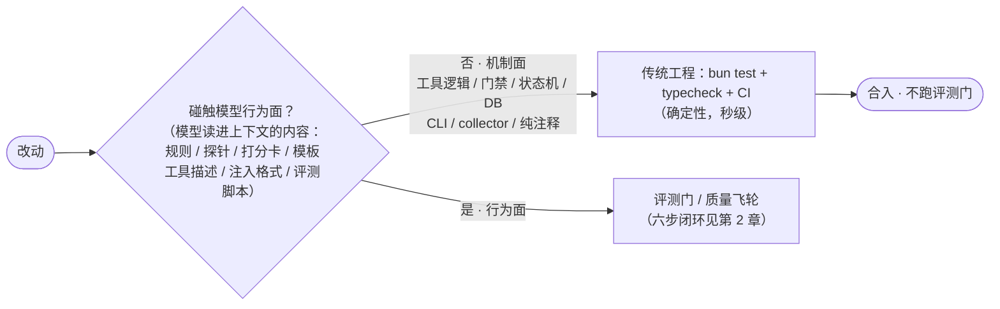
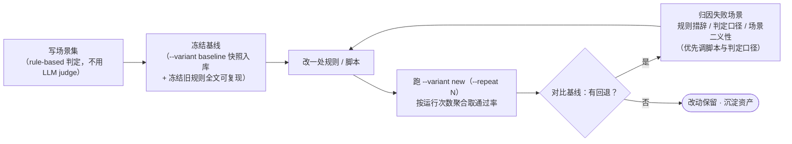
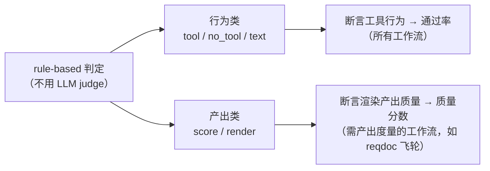

# 评测驱动规则迭代方法论（AI 深度绑定应用开发）

版本: 1.0.0
最后更新: 2026-08-16
来源: opencode-session-mgmt 实践（`opencode-session-mgmt/scripts/eval-rules`）

说明
- 适用对象：以**自然语言规则/提示词作为模型行为规格**、模型本身是行为执行体的 AI 深度绑定应用开发（agent 规则/提示词驱动）。当系统的行为由「模型读了规则文本后怎么执行」决定、而非由「编译器的确定语义」决定时，本方法论才成立。
- 本文是「评测驱动规则迭代标准作法」的独立成文，为**单一事实源**；`opencode-session-mgmt` 是完整落地实例（场景/命令/实测见其 `docs/session-management.md` 第 13 章）。
- 位置：本文件与 `plugin-guide/plugin-dev-guide.md` 同级，均属仓库根 `plugin-guide/` 的跨插件通用规范，不隶属任一插件工程。文中的 `opencode-session-mgmt/...` 路径以仓库根为基准；「设计文档 X 章」指 `opencode-session-mgmt/docs/session-management.md`（同 plugin-dev-guide.md 说明）。

## 1. 为什么需要这套作法（与传统开发的不同）

传统开发里，代码→行为的映射由**编译器**决定，正确性靠类型检查 + 单测保证，需求语义是人理解后翻译成代码。这里完全不同：

- 规则文本是**模型直接读的行为规格**，模型遵循度是概率性的、随措辞波动的——没有编译器能保证「这句规则 → 模型就这么做」。
- 因此唯一可信的验证是：拿**真实模型端点**批量跑场景，对比改前/改后通过率（或产出质量分数）。

**适用边界（行为面 vs 机制面）**——不是整个 AI 应用开发都用这套，只有行为面需要：

| 类别 | 走什么验证 | 说明 |
|---|---|---|
| 机制面 | `bun test` + `typecheck` + CI | 工具逻辑 / 门禁 / 状态机 / DB / CLI / collector / 纯注释文档——仍走传统软件工程，且**更要守住**（模型行为不可编译验证，机制层更依赖单测兜底） |
| 行为面 | 本方法论（评测门 / 质量飞轮） | 规则文本 / 探针清单 / 打分卡 / 模板 / 工具描述 / 注入格式 / 评测脚本自身——模型读进上下文的内容 |

**改动分级**（哪些改动才需要跑评测门）：

传统测试与评测驱动的逐条差异：

- **验证对象**：传统断言「代码做对没」；这里断言「模型会不会照规则调工具 / 产出质量达不达标」。
- **断言要适配被测能力**：`exactCount`（恰 N 次）对推理模型过苛，可放宽为「≥1 次 + `distinctArg` 不重复」——传统开发绝不会为被测对象放宽断言。
- **措辞敏感**：规则写细了弱模型反而不调工具；编译期根本不会发生。
- **输入二义性**：测试输入（userTurn）可能被模型误解（一个词既像阶段名又像要点 id），传统测试输入不存在这个问题。
- **基线冻结**：模型输出随注入内容漂移，改规则前须冻结旧规则全文、可复现旧注入格式；传统开发不需要「冻结旧源码全文」。
- **随机性**：模型输出有抖动，要 `--repeat N` 多次取通过率；需要产出度量的工作流进一步把「过/不过」升级为 0-100 数字评分（见 7 章质量飞轮进阶）。

## 2. 核心闭环（六步，一次只改一处）

改任何注入规则/提示词前，走以下闭环，**凭数据而非直觉**：

1. **写场景集**（rule-based 判定，不用 LLM judge）：每个关键规则一个场景，`userTurn` 是对应触发语，判定断言「模型应调用哪个工具 + 哪些参数谓词」（如 approve 时 `developer_confirmed` 必须 true）。状态夹具直接构造（不跑真实工具循环），隔离「规则遵循度」与「工具机制」两个变量；baseline 与 new 共用同一夹具保证可对等比较。
2. **冻结基线**：跑 `--variant baseline` 记录通过率快照（结果 json 入库 + 必要时冻结旧规则全文，可复现旧注入格式）；`--dry` 只打印注入片段与判定期望，不调模型，先验证渲染。
3. **改规则/脚本**：一次只改一处，避免多变量无法归因。
4. **对比**：跑 `--variant new` 自动对比 baseline，通过率不降才保留改动（仅靠通过率的工作流以通过率回退为唯一判据；需要产出度量的工作流另做质量分数对比，见 7 章）。
5. **逐个归因失败场景**：按「规则措辞 / 判定口径 / 场景二义性」三类归因——优先调**脚本适配与判定口径**，其次修场景，**规则文本保持简洁**（弱模型对复杂措辞极敏感，为提升某模型把规则写细实测反而伤害弱模型）；多模型验证（本地弱模型 + 远端强模型），避免过拟合单一模型。
6. **`--repeat N` 多次取通过率**（聚合按运行次数统计），防单次抖动掩盖趋势。

## 3. 场景设计原则

- 每个关键规则一个场景；`userTurn` 是对应触发语；判定断言「模型应调用哪个工具 + 哪些参数谓词」。
- 状态夹具直接构造（不跑真实工具循环），隔离「规则遵循度」与「工具机制」两个变量；baseline 与 new 共用同一夹具保证可对等比较。
- **userTurn 须与规则前提一致**：场景输入要先满足规则触发条件再期望动作——曾有用未指明文件的发言却期望模型杜撰文件调 `open_ide`（规则要求「先询问要改哪个文件」），两模型均失败；改为 userTurn 明确文件后通过。
- **userTurn 避免二义性**：发言词不要同时是阶段名与要点 id（如「边界这块」既像阶段名又像要点 id），否则强模型可能误走错误分支。

## 4. 判定设计（两类 judge，都不用 LLM judge）

判定一律 **rule-based**，不用 LLM judge（避免用模型判断模型、判卷口径漂移）。分两类：

- **行为类**：`tool` / `no_tool` / `text`——断言「模型调了什么工具、怎么调、回复含什么」。通用，任何工作流都用。
- **产出类**：`score` / `render`——断言「模型渲染产出的文本质量」（如五维打分、渲染结构 diff）。只给需要**产出度量**的工作流用（如 reqdoc 质量飞轮）。

判定口径须**适配模型能力**：`exactCount`（恰 N 次）对单轮单发 tool_call 的推理模型过苛，可放宽为「≥1 次 + `distinctArg` 不重复」，反映能力基线而非单次抖动。

## 5. 基线纪律

- baseline 与 new 共用同一夹具，保证可对等比较。
- 结果 json 入库（`results/{baseline,new}.json`）可重跑对比；必要时冻结旧规则全文（`fixtures/baseline/`）可复现旧注入格式。
- `--dry` 先验证注入片段与判定期望渲染，不调模型，秒级。

## 6. 模型适配与防过拟合

- **推理模型**：`msg.content` 为空时回退 `reasoning_content`（推理模型正文可能在 thinking，`text` 类判定读不到 content）。
- **输出上限**：`EVAL_MAX_TOKENS` 可配——推理模型显式 4096 留 thinking 空间，**慢速弱模型默认 2048**（实测 ~16 tok/s，4096 会让长生成场景拖到超时）。
- **超时 + 重试**：单请求可达数十秒、服务端排队更久；`EVAL_TIMEOUT_MS`（默认 180s）+ 网络/超时错误重试 3 次（HTTP 4xx/5xx 不重试），否则偶发超时会中断整轮评测（曾丢 25 分钟全量结果）。
- **多模型验证**：本地弱模型 + 远端强模型各跑一遍，避免过拟合单一模型；弱模型对规则措辞最敏感，是主要回归面。
- **共享包 hoisted 拷贝残留**：`node-linker=hoisted` 下 workspace 共享包是真实拷贝；修改 shared 契约后须删除对应 `node_modules/<共享包>` 并 `bun install` 重同步，否则评测读到旧规则文本（`typecheck`/`bun test` 仍全绿，易漏）。

## 7. 落地实例：opencode-session-mgmt（scripts/eval-rules）

`opencode-session-mgmt` 为完整落地，新插件可照抄骨架：

| 步骤 | 参考文件/示例 |
|------|--------------|
| 场景集 | `opencode-session-mgmt/scripts/eval-rules/src/scenarios.ts`（46 场景：sdlc s1-s22 + reqdoc r1-r24，每场景 = name + workflowType + 状态夹具 state + userTurn + judge）；judge 形态见 `opencode-session-mgmt/scripts/eval-rules/src/types.ts`——行为类 `tool`/`no_tool`/`text`（sdlc 与 reqdoc 共用），产出类 `score`/`render`（reqdoc 专属，五维打分与渲染 diff，见 `opencode-session-mgmt/docs/workflow-reqdoc.md` 10 章） |
| 工具契约同步 | `opencode-session-mgmt/scripts/eval-rules/src/tool-defs.ts`——评测用精简工具定义须与插件真实工具 description/参数名一致（改插件工具时同步改这里，否则测的不是真实契约）；跨插件工具（如 open-ide 的 `open_ide`/`unlock_file`）也在此声明 |
| 状态夹具 | `opencode-session-mgmt/scripts/eval-rules/src/scenarios.ts` 顶部辅助：`enter`/`approve`/`addSegment`/`rejectSegment`/`finish()`（按阶段重算 commit）——直接构造 WorkflowState，不跑真实工具循环 |
| 运行入口 | `opencode-session-mgmt/scripts/eval-rules/run.ts`（`--variant baseline\|new`、`--repeat N`、`--dry`；环境变量 `EVAL_BASE_URL`/`EVAL_MODEL`/`EVAL_API_KEY`） |
| 冻结快照 | `opencode-session-mgmt/scripts/eval-rules/fixtures/baseline/`（旧规则全文）+ `opencode-session-mgmt/scripts/eval-rules/results/{baseline,new}.json`（通过率快照入库，可重跑对比） |
| 模型适配 | `opencode-session-mgmt/scripts/eval-rules/src/client.ts`（content 空回退 `reasoning_content`、`max_tokens` 可配、超时/重试） |
| 判定口径适配 | `opencode-session-mgmt/scripts/eval-rules/src/judge.ts`（如 s5 放宽为「≥1 次 confirm + `distinctArg` 不重复」） |
| 方法论文档 | `opencode-session-mgmt/docs/session-management.md` 第 13 章（本项目落地实例：运行/改动分级决策图/判定/实测记录/教训）；sdlc 场景 s1-s22 见 `opencode-session-mgmt/docs/workflow-sdlc.md` 8 章、reqdoc 场景 r1-r24 与质量飞轮见 `opencode-session-mgmt/docs/workflow-reqdoc.md` 10 章 |

**质量飞轮（进阶应用）**：`reqdoc` 工作流把「通过/不通过」升级为 **0-100 五维数字度量**——把 reqdoc 打分卡（五维扣分标准，单一事实源经 `reqdocScoreRubric()` 注入）接进评测，让确定性评分器 `scorePrd()` 对每个场景渲染出的 PRD 自动评分，获得每维数字基线、回归检测（哪一维掉了）与归因（哪个维度系统性薄弱 → 对应三支柱哪一根）。三支柱机制、落地节奏与实测轮次见 `opencode-session-mgmt/docs/workflow-reqdoc.md` 10 章；**度量对象与改进落点辨析、迭代方式与收敛点**（直接度量需求书质量、改进应用行为面能力，非机制面代码质量；人机协同迭代、范围框定、收敛判据）见该章质量飞轮一节。

## 8. 与设计文档族的关系

- **本文（plugin-guide/eval-driven-rule-iteration.md）**：通用方法论（单一事实源）。
- **`opencode-session-mgmt/docs/session-management.md` 第 13 章**：本方法论在 opencode-session-mgmt 的落地实例——运行命令（13.1）、判定方式（13.3）、实测记录（13.4）、关键教训（13.5）、改动分级决策图（13.6，行为面改动何时跑评测门的共用决策图）。
- **`opencode-session-mgmt/docs/workflow-sdlc.md` 8 章**：sdlc 场景 s1-s22 明细（共享评测门，只看通过率）。
- **`opencode-session-mgmt/docs/workflow-reqdoc.md` 10 章**：reqdoc 场景 r1-r24 明细 + 质量飞轮（打分卡五维度量的进阶应用）。
