# Session Management: 标准化开发流程、理解保障与效能分析

## 1. 需求背景

### 1.1 核心问题

开发人员在使用 OpenCode 进行 AI 辅助开发时，面临三个层次的问题：

| 层次 | 问题 | 本质 |
|------|------|------|
| 过程管理 | 多个需求并行，如何在会话间切换并走完完整流程 | 效率问题 |
| **理解保障** | **AI 生成了代码，人是否真正看懂了？三个月后谁能维护？** | **控制权问题** |
| 效能度量 | AI 到底提效了多少？Token 消耗是否合理 | 可证明性问题 |

这三个层次对应《领导汇报_退出风险与ROI评估》中的两个核心疑问：

- **疑问一（退出风险）**：AI 写的代码，人能不能接、能不能改、AI 停了怎么办
- **疑问二（ROI 验证）**：Token 投入与产出之间的关系，同等产出下资源配置的优化空间

### 1.2 核心场景

**基本前提**：开发人员始终在 TUI 内，以自然语言对话的形式进行开发。工作流的推进（进入阶段、确认完成、回退）、代码审查、理解确认，全部通过对话完成，不需要退出 TUI 执行 CLI 命令。

CLI 只做两件事：
- **会话管理**：在 TUI 之外创建、列表、删除、标记会话
- **外部查看**：在不进入 TUI 的情况下查看工作流状态和统计数据

开发人员使用 OpenCode 进行 AI 辅助开发时，经常在同一时间收到多个需求。每个需求需要走完完整流程：需求分析 → 设计 → 编码 → 测试 → 审查 → 提交。每个需求对应一个会话，在不同需求之间来回切换，但每个需求都能走完完整流程。

### 1.3 衍生需求

在讨论过程中，识别出四个层面的需求：

1. **会话管理** — 纯 CLI 子命令，不依赖 TUI 也能管理会话
2. **工作流追踪** — 确保每个会话走完完整流程，允许反复迭代但不可跳过
3. **理解保障** — 确保开发者真正理解 AI 生成的代码，而非仅仅"审查通过"
4. **使用分析** — 支撑投入产出评估、算力预算规划与质量监控，为资源配置决策提供数据依据

### 1.4 现状架构

OpenCode 采用 C/S 架构：

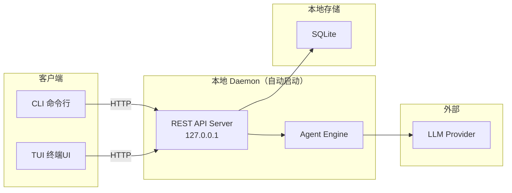

**TUI 已有完善的会话管理**（不需要改动）：创建、列表、删除、重命名、快速切换（`<leader>1-9`）、分叉、后台运行、压缩、中断、恢复。

**REST API 已完备**（大部分不需要改动）：`session.list`、`session.create`、`session.get`、`session.prompt`、`session.compact`、`session.interrupt`、`session.active`、`session.context`、`session.history`。

**缺失的能力**：

1. CLI 层没有 `opencode session` 子命令（`commands.ts` 只有 `api`、`debug`、`migrate`、`service`、`serve`）
2. 协议层没有 `session.update` 端点（SDK 中存在但协议组缺失）
3. 会话数据模型没有 tags、status、workflow、account_id 字段
4. 没有工作流追踪机制
5. 没有使用统计分析

---

## 2. 技术决策记录

### 2.1 工作流模型选择

#### 候选方案对比

| | 方案 A：严格流水线 | 方案 B：完成门控 |
|---|---|---|
| **模型** | 单向推进，不允许回头 | 自由跳转，提交时统一检查 |
| **约束点** | 每个阶段转换 | 仅最终提交 |
| **灵活性** | 差 | 好 |
| **适合场景** | 瀑布式开发 | 迭代式开发 |

#### 方案 A：严格流水线（被拒绝）

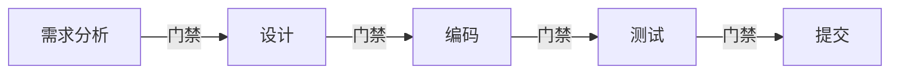

**拒绝原因**：开发人员指出，实际开发中编码时经常发现需求不清楚，需要回到需求分析阶段；测试失败也需要回去改代码。严格流水线无法支持这种反复迭代。

#### 方案 B：完成门控（采用）

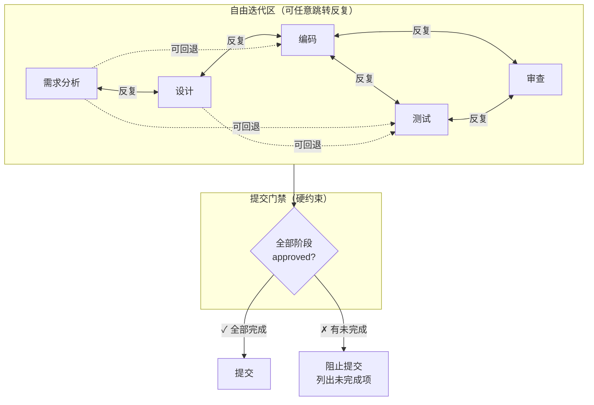

**采用原因**：真实开发本质上是迭代的。约束点应该是"所有必需产物是否都已完成"，而不是"当前处于哪个阶段"。

**审查阶段的特殊地位**：审查（review）是五阶段中唯一**不可被 AI 自行推进**的阶段。审查不仅检查代码正确性，更检查**人是否真正理解了代码**。审查清单包含四个硬性检查项（详见 3.2），不满足则审查阶段不可 approve。审查阶段与编码、测试阶段形成迭代循环——编码完成后进入审查，审查不通过则回到编码或测试。

### 2.2 阶段检测方式选择

#### 候选方案对比

| | AI 自动推断 | 工具使用模式 | 产物文件判断 | AI 提议+开发者确认 |
|---|---|---|---|---|
| **准确度** | 低（语义歧义） | 低（行为歧义） | 低（存在≠确认） | 高（人为决策） |
| **可靠性** | 概率性 | 启发式 | 机械式 | 确定性 |
| **实现复杂度** | 高 | 中 | 低 | 低 |

**被拒绝的方案**：

- **AI 从对话推断**：讨论"用户权限"是在做需求分析还是设计？AI 会猜错
- **从工具使用判断**：写代码时也可能在重新思考需求
- **从产物文件判断**：文档存在不代表需求已被确认

**核心结论**：唯一真正知道"当前在哪个阶段、是否完成"的人，是**开发者本人**。

#### 采用的方案：AI 提议 + 开发者确认

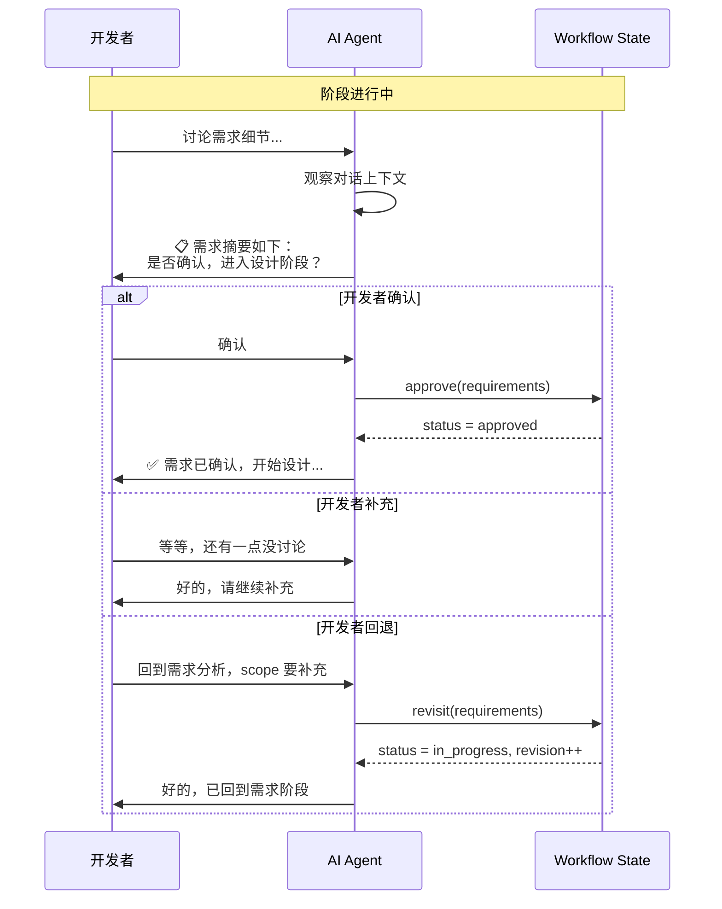

**规则**：
1. 阶段转换的唯一来源是开发者的明确操作
2. AI 只能提议，绝不自行推进
3. 开发者说"回到XX"时立即回退
4. 提交是唯一的硬门禁

### 2.3 统计分析粒度选择

讨论中确认需要三个层级：

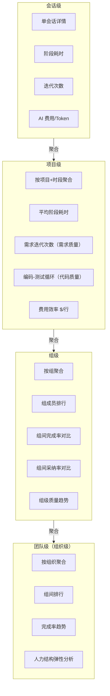

**统计层级说明**：

| 层级 | 聚合维度 | 对应 CLI 参数 | 用途 |
|------|----------|---------------|------|
| 会话级 | 单会话 | `opencode session stats <id>` | 开发者自检 |
| 项目级 | 按项目+时段 | `opencode session stats --project <id>` | 项目经理跟踪 |
| 组级 | 按组聚合 | `opencode session stats --group <id>` | 组长管理、月度汇报 |
| 团队级（组织级） | 按组织聚合 | `opencode session stats --team` | 领导汇报、预算决策 |

组级统计是核心汇报层级——回应"各组 AI 使用程度和依赖程度"的需求。组级视图展示：成员排行、采纳率分布、返工率对比、触达迭代上限的会话数。

**数据来源决策**：零额外采集。工作流状态变更的时间戳即为分析数据源。

**身份关联决策**：复用现有 `AccountTable`（`account.ts`，含 `id`、`email`、`active_org_id`）和 `Org`（`id`、`name`），在 `SessionTable` 添加 `account_id`。同时新增 `GroupTable` 支持组/团队层级聚合，`AccountTable` 通过 `group_id` 关联到组，组可嵌套（`parent_group_id` 支持子组）。

---

## 3. 数据模型设计

### 3.1 SessionTable 新增列

**文件**: `packages/core/src/session/sql.ts`

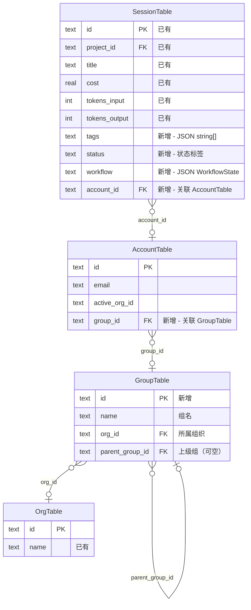

```typescript
// 新增列（全部有默认值，向后兼容）
tags: text({ mode: "json" }).$type<string[]>().$default(() => []),
status: text(),   // "todo"|"analysis"|"design"|"coding"|"testing"|"review"|"done"|"archived"|null
workflow: text({ mode: "json" }).$type<WorkflowState>(),
account_id: text().$type<AccountV2.ID>(),
```

**AccountTable 新增列**：

```typescript
// packages/core/src/account/sql.ts — 新增列
group_id: text().$type<GroupTable.ID>(),  // 关联 GroupTable
```

**GroupTable（新建）**：

```typescript
// packages/core/src/group/sql.ts — 新建
import { text } from "drizzle-orm/sqlite-core"

export const GroupTable = sqliteTable("group", {
  id: text("id").primaryKey(),
  name: text("name").notNull(),
  org_id: text("org_id").notNull().references(() => OrgTable.id),
  parent_group_id: text("parent_group_id"),  // 可空，支持子组嵌套
})
```

组层级支持两级：一级组（如"前端组"、"后端组"）直接挂载在 Org 下；二级组（如"前端-基础架构组"）通过 `parent_group_id` 挂载在一级组下。统计时支持按组聚合，满足"各组 AI 使用程度和依赖程度"的汇报需求。

### 3.2 WorkflowState Schema

**新文件**: `packages/schema/src/session-workflow.ts`

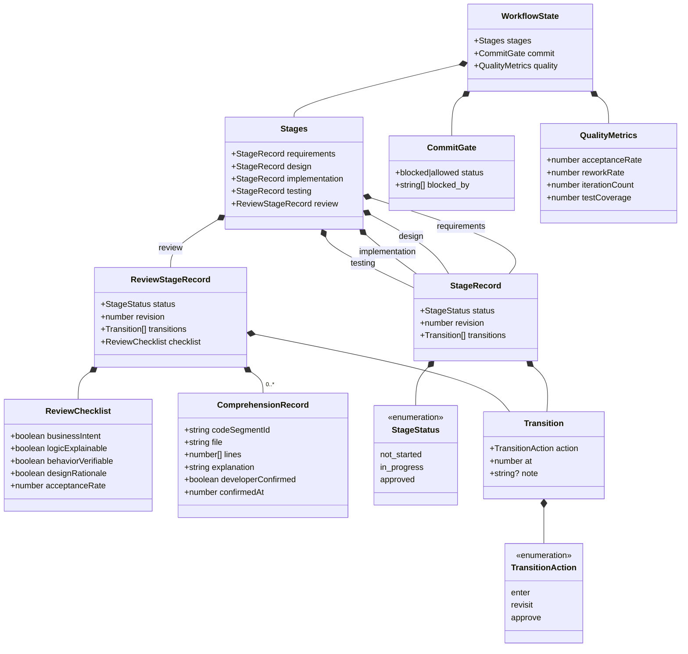

**ReviewChecklist — 可接手标准检查项**：

审查阶段不同于其他四个阶段。审查不仅检查代码正确性，更检查**人是否真正理解了 AI 生成的代码**。`ReviewChecklist` 包含四个硬性检查项，全部通过后审查阶段才可 approve：

| 检查项 | 要求 | 验证方式 |
|--------|------|----------|
| `businessIntent` | 公共方法必须有注释，说明业务意图而非只描述参数 | 审查清单 |
| `logicExplainable` | 圈复杂度 > 10 的方法必须有行内注释 | 静态分析 + 审查 |
| `behaviorVerifiable` | 每个 Service 方法至少有一个集成测试，测试即使用文档 | 审查清单 + 门禁 |
| **`designRationale`** | **AI 必须为每个代码变更输出设计推导：为什么这样写、有哪些替代方案被放弃、潜在风险是什么** | **开发者逐段确认** |

此外，审查阶段记录 `acceptanceRate`（代码建议采纳率），用于监控开发者是否在不经审查地接受 AI 代码。业界研究表明，接受率在 25-35% 为健康区间，超过 45% 表明开发者在不经审查地接受（来源：larridin.com 2026）。

**ComprehensionRecord — 理解确认记录**：

`ComprehensionRecord` 是理解保障的核心数据。它不是简单的"审查通过"标记，而是**开发者逐段确认理解的凭证**。每次 AI 生成代码变更后，在审查阶段：

1. AI 将每个代码变更拆分为可理解的片段（按方法/类/模块），每个片段一个 `ComprehensionRecord`
2. AI 为每个片段输出 `explanation`（自然语言解释：这段代码做了什么、为什么这样写、有哪些替代方案被放弃）
3. 开发者必须逐段阅读 `explanation` 并确认 `developerConfirmed = true`
4. 开发者可以对任意片段追问"为什么这样写"，追问和回答追加到 `explanation` 中
5. 所有片段确认后，`ReviewChecklist` 的 `designRationale` 才可标记为 `true`

```typescript
interface ComprehensionRecord {
  codeSegmentId: string       // 唯一标识
  file: string                // 文件路径
  lines: [number, number]     // 代码行范围
  explanation: string         // AI 输出的自然语言解释（含设计推导、替代方案、风险）
  developerConfirmed: boolean // 开发者确认已理解
  confirmedAt: number         // 确认时间戳
}
```

**为什么这能解决"三个月后没人看得懂"的问题**：`ComprehensionRecord[]` 本身就是一个可检索的知识库。三个月后接手这段代码的人，不需要从零阅读代码——先读 `explanation`，理解设计意图；再读代码，验证实现是否匹配意图；如果有疑问，`explanation` 中的"替代方案和风险"能帮助判断改动的安全边界。

**QualityMetrics — 质量维度数据**：

`QualityMetrics` 记录本会话的质量相关数据，用于统计分析中的质量维度：

| 指标 | 定义 | 来源 |
|------|------|------|
| `acceptanceRate` | 开发者对 AI 代码建议的接受比例 | Agent 会话内追踪 |
| `reworkRate` | 合并后的代码在后续触发修改/Bug 修复的比例 | 外部 CI 管道回写 |
| `iterationCount` | 同一段代码的 AI 生成-修改循环次数 | Agent 会话内追踪 |
| `testCoverage` | AI 参与模块的增量测试覆盖率 | 外部 CI 管道回写 |

**QualityMetrics 的写入机制**：

`QualityMetrics` 字段按写入来源分为两类：

| 字段 | 写入方 | 写入时机 | 写入方式 |
|------|--------|----------|----------|
| `acceptanceRate` | Agent | 审查阶段，实时更新 | Agent 通过 `session.update` 更新 workflow.quality |
| `iterationCount` | Agent | 每次代码生成-修改循环，实时更新 | Agent 通过 `session.update` 更新 workflow.quality |
| `reworkRate` | 外部 CI 管道 | 合并后，当检测到同一会话产出的代码被再次修改 | CI 通过 `session.update` API 回写 |
| `testCoverage` | 外部 CI 管道 | 合并后，SonarQube/覆盖率工具生成报告时 | CI 通过 `session.update` API 回写 |

`session.update` 的 payload 已支持 `workflow` 字段（见 4.1），外部系统通过写入 `workflow.quality` 完成数据回写。Agent 负责会话内指标（acceptanceRate、iterationCount），外部 CI 负责合并后指标（reworkRate、testCoverage）。两者互不依赖，写入同一数据模型，统计时统一聚合。

**Phase 1 的范围**：`acceptanceRate` 和 `iterationCount` 随 Phase 2 Agent 规则一起实现。`reworkRate` 和 `testCoverage` 依赖外部 CI 集成，标记为 Phase 3+，在不接入外部 CI 的情况下，这两个字段默认为 `null`，统计输出中显示为 `N/A`，不影响其他功能。

**迭代轮次上限**：AI 对同一段代码的生成-修改循环不超过 3 轮。当 `iterationCount` 达到 3 时，Agent 拒绝继续生成，提示人工介入。第 4 轮起必须人工重写。这是基于业界实证研究——5 轮 AI 迭代后代码关键漏洞增加 37.6%（来源：index.dev 2025）。

**迭代轮次重置规则**：以下情况触发 `iterationCount` 重置为 0：

| 触发条件 | 检测方式 |
|----------|----------|
| 开发者手动修改了该文件（非 Agent 编辑） | 检测该文件的最新 diff 来源不是 Agent |
| 开发者显式声明"已手动修改，重置计数" | Agent 识别关键词后重置 |
| 开发者以人工重写的方式提交了新版本 | 文件变更超过 50% 行数，且包含非 Agent 的 commit author |

仅靠 Agent 在对话中说"已修改"不足以触发重置——必须有文件级的实际变更证据。这防止开发者口头绕过迭代上限。

### 3.3 状态转换规则

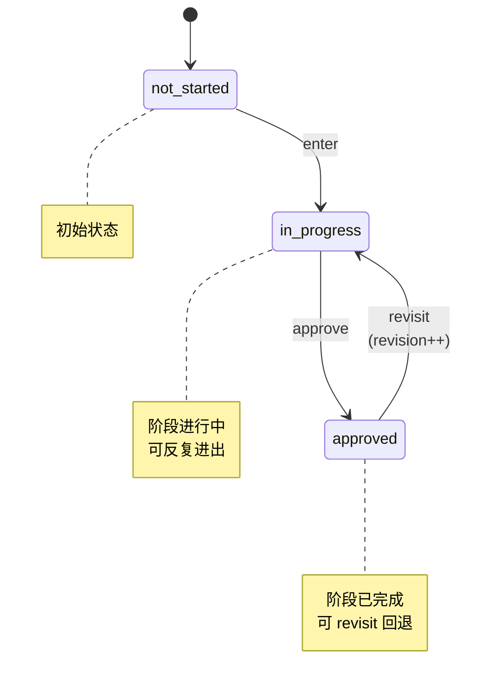

每次转换自动追加到 `transitions[]`：

```json
{
  "action": "enter",
  "at": 1722412800000,
  "note": "开始需求分析"
}
```

这些时间戳就是统计分析的数据来源。

### 3.4 提交门禁逻辑

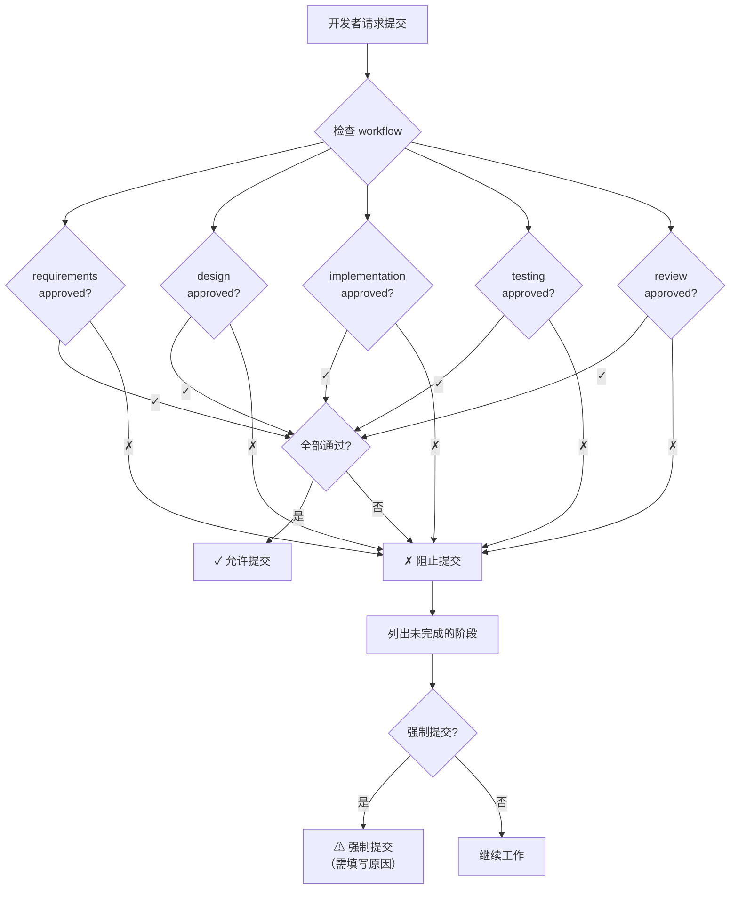

---

## 4. API 变更

### 4.1 新增端点

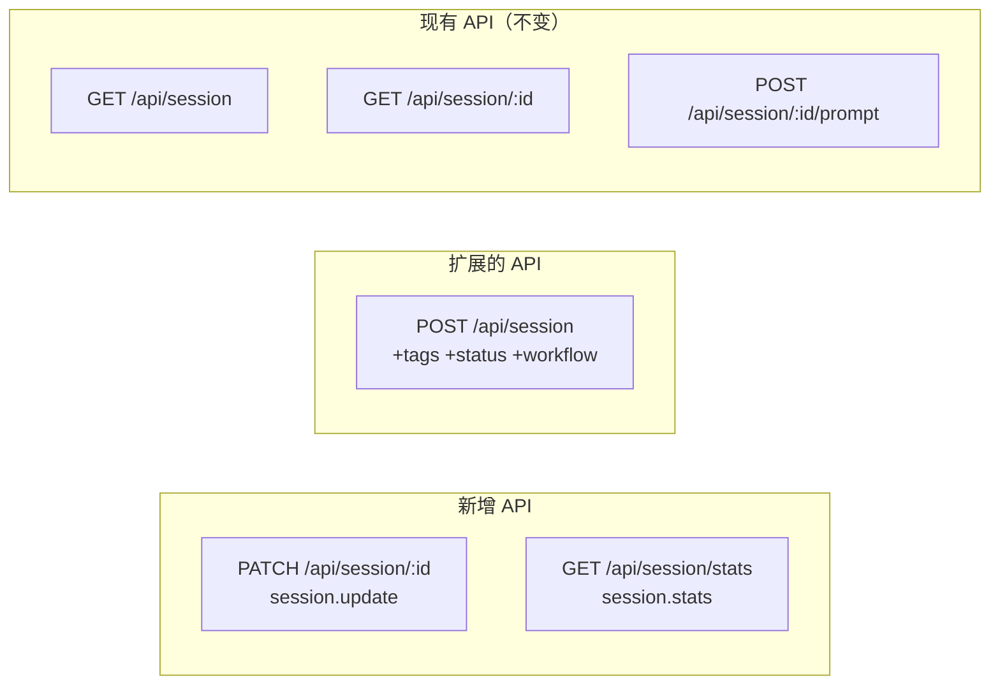

#### session.update

```typescript
// session.update 采用 PATCH 语义 — 增量合并，不覆盖未传入的字段
HttpApiEndpoint.patch("session.update", "/api/session/:sessionID", {
  params: { sessionID: Session.ID },
  payload: Schema.Struct({
    title: Schema.String.pipe(Schema.optional),
    tags: Schema.Array(Schema.String).pipe(Schema.optional),
    status: Schema.String.pipe(Schema.optional),
    workflow: Schema.DeepPartial(WorkflowState).pipe(Schema.optional),
  }),
  success: Schema.Struct({ data: Session.Info }),
  error: SessionNotFoundError,
})
```

**PATCH 增量合并语义**：

`workflow` 字段使用 `DeepPartial`，即只传入需要更新的字段，服务端与现有值做深度合并。例如：

```json
// CI 管道只回写 reworkRate，不覆盖 Agent 维护的 acceptanceRate
PATCH /api/session/sess_abc123
{
  "workflow": {
    "quality": {
      "reworkRate": 0.08
    }
  }
}
```

服务端合并后：`quality.acceptanceRate` 保持 Agent 写入的值，`quality.reworkRate` 更新为 0.08。这确保 Agent 和 CI 管道各自维护自己的指标，互不覆盖。

#### session.stats

```
GET /api/session/stats?scope=session&sessionID=<id>
GET /api/session/stats?scope=project&project=<id>&period=7d
GET /api/session/stats?scope=group&groupID=<id>&period=30d
GET /api/session/stats?scope=team&orgID=<id>&period=30d
```

### 4.2 Core 层

**文件**: `packages/core/src/session.ts` — Interface 追加：

```typescript
readonly update: (input: {
  sessionID: SessionSchema.ID
  title?: string
  tags?: string[]
  status?: string
  workflow?: WorkflowState
}) => Effect.Effect<SessionSchema.Info, NotFoundError>
```

---

## 5. CLI 命令设计

### 5.1 命令清单

```
opencode session list       [--search <q>] [--limit <n>] [--status <s>] [--tag <t>] [--json]
opencode session create     [--title <title>] [--agent <agent>] [--model <model>] [--json]
opencode session get        <sessionID> [--json] [--context]
opencode session rename     <sessionID> <title>
opencode session delete     <sessionID> [--yes]
opencode session resume     <sessionID> [message]
opencode session active     [--json]
opencode session compact    <sessionID>
opencode session interrupt  <sessionID>
opencode session tag        <sessionID> [--add <tag...>] [--remove <tag...>] [--list]
opencode session workflow   <sessionID> [checklist|comprehension|stats]
opencode session stats      [<sessionID>] [--project <id>] [--group <id>] [--team] [--period <nd>] [--json]
```

**合并说明**（从 18 个命令合并为 12 个）：

| 原命令 | 合并到 | 方式 |
|--------|--------|------|
| `prompt` | `resume` | `resume <id> "消息"` 即等价于原 `prompt` |
| `untag` | `tag` | `tag <id> --remove <tag>` |
| `status` | `get` + `workflow` | 查看：`get <id>` 已包含状态；设置：`workflow` 阶段变更已隐含状态切换 |
| `context` | `get` | `get <id> --context` 查看对话历史 |
| `review` | `workflow` | `workflow <id> checklist|comprehension|stats` |

**resume 命令说明**：

| 用法 | 行为 |
|------|------|
| `opencode session resume <id>` | 打开 TUI，直接进入该会话的交互模式 |
| `opencode session resume <id> "消息"` | CLI 一次性模式：发送消息、输出进度摘要+回复、退出 |

**workflow 命令说明**：

工作流的推进（进入阶段、确认、回退）通过 **TUI 内自然语言对话**完成，不走 CLI。开发者只需在对话中说"需求确认了"、"回到设计阶段"等，Agent 按规则执行。CLI 的 `workflow` 仅用于**从外部查看状态**：

| 子命令 | 行为 |
|--------|------|
| *(默认)* | 查看当前工作流状态（阶段进度、当前阶段） |
| `checklist` | 查看审查清单四项状态 |
| `comprehension` | 列出理解确认记录，支持 `--unconfirmed` 过滤未确认片段 |
| `stats` | 查看当前会话的采纳率、迭代轮次、覆盖率等质量指标 |

### 5.2 处理器实现模式

所有处理器遵循 `packages/cli/src/commands/handlers/api.ts` 的模式：

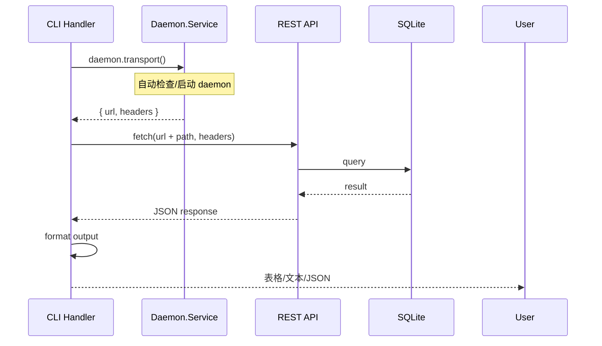

---

## 6. 统计分析设计

统计分析的定位是**投入产出评估与资源规划的数据基础**，服务于三个明确目标：

1. **算力预算规划** — Token 消耗按场景/模型/组拆分，为下一次预算申请提供数据支撑
2. **质量监控** — 跟踪采纳率、返工率、覆盖率，确保提效不以牺牲质量为代价
3. **流程优化** — 阶段耗时与迭代次数分析，识别瓶颈环节

### 6.1 数据来源（零额外采集）

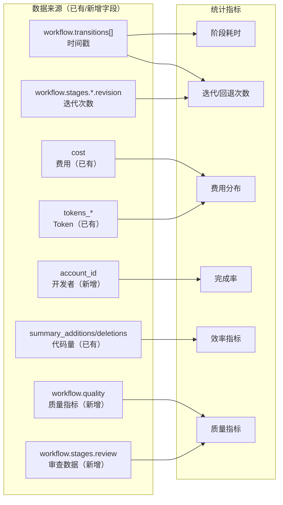

### 6.2 三级统计输出示例

**会话级**：

```
📋 会话 "用户认证模块" (sess_abc123)
开发者: alice@example.com
周期: 3.25 天

工作流:
  需求分析  ████████░░  2.1h   ✓ approved (修改2次)
  设计     ██████░░░░  1.5h   ✓ approved (修改1次)
  编码     ████████████████  4.2h  ✓ approved (编码-测试循环3次)
  测试     ██████████░░  2.8h  ✓ approved
  审查     ██████░░░░  1.2h  ✓ approved (采纳率 32%, 理解确认 5/5)

质量:
  建议采纳率: 32% (健康)  |  迭代轮次: 2/3  |  测试覆盖率: 82%
  返工标记: 无  |  审查清单: ✓全部通过(4/4)  |  理解确认: 5片段 ✓已确认

AI 使用: 对话 47轮 | $0.36 | 85K tokens
```

**项目级**：

```
📊 项目 "用户系统" - 最近 7 天
会话: 12 | 完成率: 75% | 平均周期: 2.3 天
阶段耗时: 分析 2.1h | 设计 1.5h | 编码 4.2h | 测试 2.8h | 审查 1.2h
迭代: 需求修改 avg 1.3次 | 编码-测试循环 avg 2.7次
费用: $4.32 总计 | $0.36/会话 | $0.02/行

质量:
  平均采纳率: 34%  |  超阈值(>45%)会话: 1/12 ⚠
  返工率: 8%  |  变更失败率: 2%  |  平均测试覆盖率: 78%
  触达迭代上限(3轮): 0 会话
```

**组级**：

```
👥 组 "前端组" - 最近 30 天
成员: 5 | 总会话: 42 | 完成率: 85%

  alice  12会话 92%完成 $6.30  2.1天/会话 采纳率31% 覆盖率84%
  bob     8会话 78%完成 $3.80  2.8天/会话 采纳率48% ⚠ 覆盖率71%
  carol  10会话 89%完成 $5.20  2.3天/会话 采纳率29% 覆盖率79%

质量:
  组平均采纳率: 34% (健康)  |  超阈值(>45%)成员: 1/5 ⚠
  组返工率: 6%  |  变更失败率: 2%  |  触达迭代上限: 1/42 (2.4%)

趋势: 需求迭代 ↓1.5→0.9 | AI效率 ↑$0.04→$0.02/行 | 返工率 ↓10%→6%
```

**团队级**：

```
👥 团队 "Engineering" - 最近 30 天
成员: 8 | 总会话: 156 | 完成率: 82%

  alice  24会话 92%完成 $12.30 2.1天/会话 采纳率31% 覆盖率84%
  bob    18会话 78%完成 $9.80  2.8天/会话 采纳率48% ⚠ 覆盖率71%
  carol  22会话 85%完成 $11.20 2.3天/会话 采纳率29% 覆盖率79%

质量:
  团队平均采纳率: 34% (健康)  |  超阈值(>45%)成员: 1/8 ⚠
  团队返工率: 7%  |  变更失败率: 3%
  触达迭代上限会话: 2/156 (1.3%)

趋势: 需求迭代 ↓1.3→0.8 | AI效率 ↑$0.03→$0.02/行 | 返工率 ↓12%→7%
```

### 6.3 质量维度指标定义

质量维度数据用于验证"提效"不是建立在牺牲质量的基础上，同时支撑退出风险管控中的质量衰减监控（措施三）。

| 指标 | 定义 | 计算公式 | 数据来源 | 告警阈值 |
|------|------|----------|----------|----------|
| 代码建议采纳率 | 开发者对 AI 代码建议的接受比例（会话内统计） | Agent 生成的代码变更中，被开发者直接接受的数量 / 总变更数 × 100% | Agent 会话内追踪 | 健康区间 25-35%，>45% 触发告警（不经审查地接受） |
| 返工率 | 合并后触发修改/Bug 修复的比例 | 返工提交数 / 总会话提交数 × 100% | Git + CI 管道 | 连续 2 个月上升触发审查 |
| 变更失败率 | 因 AI 生成代码引发的测试缺陷或生产故障 | 失败变更数 / 总变更数 × 100% | CI/CD + 缺陷跟踪 | 月度环比上升 >5% 触发告警 |
| 测试覆盖率 | AI 参与模块的增量测试覆盖率 | 覆盖行数 / 总行数 × 100% | SonarQube / CI | <70% 触发告警，<80% 不可 approve review |
| 迭代轮次 | 同一段代码的 AI 生成-修改循环次数 | workflow.quality.iterationCount | Agent 追踪 | 达到 3 轮时 Agent 拒绝继续生成 |
| 审查清单通过率 | review.checklist 四项全部通过的会话比例 | 全部通过的会话数 / 总会话数 × 100% | workflow.stages.review.checklist | <90% 触发流程审查 |

这些指标在三个统计层级中的呈现方式不同：
- **会话级**：展示具体数值，标记是否超阈值（如采纳率 48% ⚠）
- **项目级**：展示平均值和分布，标记超阈值会话数
- **团队级**：展示成员排行，标记超阈值成员，展示趋势

---

## 7. Agent 工作流约束

### 7.1 实现机制

工作流约束不修改 OpenCode 核心引擎，而是通过**会话级系统提示（system prompt）**注入规则。OpenCode 在创建会话时，将工作流规则作为系统提示的一部分下发给 LLM，Agent 在对话中遵循这些规则。

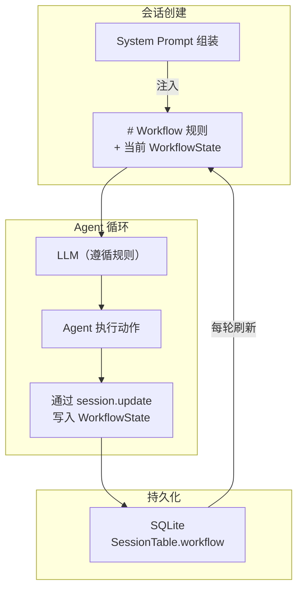

关键点：
- **规则注入**：会话创建时，OpenCode 从 `session-workflow` schema 读取当前状态，将规则 + 当前状态一起注入 system prompt
- **状态持久化**：Agent 通过 `session.update` API 写入 `WorkflowState`（阶段变更、审查清单、理解记录），不依赖 LLM 记忆
- **状态同步**：每次对话轮次开始时，OpenCode 将最新的 `WorkflowState` 刷新到 system prompt 中，确保 Agent 始终知道当前进度

### 7.2 实际效果：开发者看到什么

以一次典型的开发会话为例，展示开发者视角的交互过程。

**场景一：阶段推进（对话中自然触发）**

```
开发者: 用户认证模块的需求就这些了，你帮我总结一下

Agent:  📋 需求分析摘要
       1. 支持用户名+密码登录
       2. 支持 JWT token 刷新（access token 15min, refresh token 7d）
       3. 登录失败 5 次锁定 30 分钟
       4. 密码强度要求：8位+，含大小写+数字
       
       需求分析阶段是否确认完成？确认后进入设计阶段。

开发者: 确认

Agent:  ✅ 需求分析已确认。进入设计阶段。
       需要我帮你设计数据库 schema 和 API 接口吗？
```

**场景二：审查阶段——理解确认（逐段交互）**

```
开发者: 代码写完了，进入审查吧

Agent:  🔍 审查阶段 — 本会话共生成 3 个代码变更片段，逐段确认理解：

       ─── 片段 1/3: auth/service.ts:12-45 ───
       📖 这是 TokenService.refresh() 方法。
       它实现了 refresh token 轮换机制：每次用旧 refresh token 换取新 token 对时，
       旧 token 立即失效。选择这个方案（而非延长旧 token 有效期）是因为：
       - 如果 refresh token 泄露，轮换机制确保只有最新的 token 可用
       - 被放弃的替代方案：延长有效期（不够安全）、双 token 队列（复杂度高）
       - 潜在风险：并发刷新时可能触发竞态条件，已在 L38 用数据库行锁处理
       
       你是否理解这段代码的工作原理？[确认/追问]

开发者: 确认

Agent:  ─── 片段 2/3: auth/middleware.ts:8-32 ───
       📖 这是 AuthMiddleware，拦截所有 /api/* 请求...
       （解释内容同上结构）
       
       你是否理解这段代码的工作原理？[确认/追问]

开发者: L22 的缓存逻辑为什么用 Map 而不是 Redis？

Agent:  好问题。这里用了内存 Map 而非 Redis，原因是：
       - 缓存的是公钥（JWK），不是用户数据，不需要持久化
       - 每个服务实例独立缓存，内存占用极小（~2KB）
       - 如果将来需要多实例共享，可以切换到 Redis，接口不变
       - 替代方案：每次请求都去 Auth Server 验证（延迟高，已被放弃）
       
       现在理解了吗？[确认/追问]

开发者: 确认

Agent:  ─── 片段 3/3: auth/model.ts:1-20 ───
       ...
       
       ✅ 所有 3 个片段已确认理解。审查清单验证：
       ✓ businessIntent   — 公共方法有业务意图注释
       ✓ logicExplainable  — 圈复杂度 >10 的方法有行内注释
       ✓ behaviorVerifiable — 每个 Service 方法有集成测试
       ✓ designRationale   — 所有片段已确认理解
       
       审查阶段通过。可以提交了。
```

**场景三：提交门禁（对话中触发）**

```
开发者: 帮我提交代码

Agent:  🔒 提交门禁检查...
       ✓ requirements — approved
       ✓ design       — approved
       ✓ implementation — approved
       ✓ testing      — approved
       ✗ review       — 未完成（审查清单未通过）
       
       请先完成审查阶段再提交。输入 "进入审查阶段" 开始。

开发者: 进入审查阶段

Agent:  🔍 审查阶段 — 本会话共生成 2 个代码变更片段...
       （进入审查交互）
```

**场景四：迭代轮次上限触发**

```
开发者: 这段代码还是有问题，再改一下

Agent:  ⚠ 此段代码已达到 3 轮 AI 迭代上限。
       继续让 AI 修改可能导致质量衰减（5 轮迭代后漏洞增加 37.6%）。
       
       建议：你手动修改这段代码，或者告诉我具体哪里需要调整，
       我会给出建议但不直接生成代码。
```

### 7.3 规则可靠性

"系统提示"方案的局限在于 LLM 可能不遵守规则。通过以下措施提高可靠性：

| 风险 | 措施 |
|------|------|
| Agent 忘记当前阶段 | 每轮对话开始时将最新 `WorkflowState` 刷新到 system prompt |
| Agent 自行推进阶段 | 规则重复强调"绝不自行判断"，且 `approve` 操作在服务端校验：只有开发者回复中包含明确确认词（"确认"/"approve"/"ok"）时才执行 |
| Agent 跳过审查交互 | 审查阶段是独立的系统提示块，规则优先级最高；提交门禁在服务端二次校验 `ReviewChecklist` |
| Agent 批量跳过逐段确认 | **服务端防篡改**：`session.update` 处理 `workflow.stages.review.comprehension` 时，单次请求只允许更新一个 `ComprehensionRecord` 的 `developerConfirmed` 字段。Payload 中必须携带 `codeSegmentId` 精确匹配，防止 LLM 在开发者回复"看起来不错"时将全部片段批量设为 `confirmed` |
| LLM 上下文窗口不足 | 工作流状态压缩在 JSON 中，system prompt 中只注入当前阶段规则，历史规则不重复注入 |

### 7.4 规则全文

```markdown
# Workflow Agent 规则

## 阶段推进规则
1. 会话开始时，初始化 workflow 状态（所有阶段 not_started）
2. 当对话表明阶段可能完成时，输出摘要并询问确认
3. 开发者明确确认后才标记 approved
4. 开发者说"回到XX"时，立即 revisit
5. 开发者要求提交时，检查所有阶段（含 review）
6. 绝不自行判断阶段已完成

## 审查阶段 — 理解保障规则（核心）
7. 审查阶段是唯一不可被 AI 自行推进的阶段
8. 审查阶段的核心目标是**确保开发者理解代码**，而非仅仅检查代码是否符合规范

## 代码解释与理解确认交互
9. 审查阶段进入时，Agent 将每个 AI 生成的代码变更拆分为可理解片段（按方法/类/模块边界）
10. 对每个片段，Agent 必须输出 ComprehensionRecord：
    - 自然语言解释：这段代码做了什么、为什么这样写
    - 设计推导（designRationale）：为什么选择这个方案，有哪些替代方案被放弃
    - 潜在风险：边界条件、性能考量、未来可能的变更点
    - 关联说明：这段代码与本会话其他代码片段的关系
11. 开发者必须**逐段**确认理解，不可一键 approve 所有片段
12. 开发者对任意片段追问"为什么这样写"时，Agent 必须详细解释，并将追问和回答追加到 explanation 中
13. 所有片段 developerConfirmed = true 后，designRationale 才可标记为 true
14. 审查清单中其他三项（businessIntent、logicExplainable、behaviorVerifiable）同时验证

## 代码建议采纳率监控
15. Agent 在会话内跟踪代码建议采纳率（acceptanceRate）：
    - 每次 Agent 生成代码变更后，记录为一次"建议"
    - 开发者在审查阶段直接 accept（未修改、未追问）→ 计入"接受"
    - 开发者要求修改、追问"为什么这样写"、或手动修改 → 计入"未接受"
    - acceptanceRate = 接受数 / 总建议数 × 100%
16. 当单会话采纳率 >45% 时，Agent 发出提醒：
    "⚠ 本会话采纳率 {rate}%，超过健康阈值（45%）。过高的采纳率可能意味着未充分审查 AI 代码。
    建议逐段回顾以下变更，确认每段你都能独立解释其工作原理。"

## 迭代轮次上限规则
17. 跟踪同一段代码/文件的 AI 生成-修改循环次数（iterationCount）
18. 当 iterationCount 达到 3 时，Agent 拒绝继续生成，提示：
    "此段代码已达到 3 轮 AI 迭代上限，请人工重写或手动修改后重新开始计数"
19. 第 4 轮起必须人工介入，Agent 只提供建议，不直接生成代码
20. iterationCount 重置规则（以下任一条件满足时重置为 0）：
    - 检测到该文件的 diff 来源不是 Agent（开发者手动编辑）
    - 开发者显式声明"已手动修改，重置计数"
    - 文件变更超过 50% 行数，且包含非 Agent 的 commit author
    仅靠对话中说"已修改"不足以触发重置——必须有文件级的实际变更证据。

## 审查清单验证
21. 审查阶段 approve 前，必须验证 ReviewChecklist 四项全部为 true：
    - businessIntent: 公共方法有业务意图注释
    - logicExplainable: 圈复杂度 >10 的方法有行内注释
    - behaviorVerifiable: 每个 Service 方法有至少一个集成测试
    - designRationale: 所有代码片段有 ComprehensionRecord 且 developerConfirmed = true
22. 任一检查项未通过，审查阶段不可 approve，需回到编码或测试阶段

## 理解凭证的持久价值
23. ComprehensionRecord 不仅是审批流程的产物，更是可检索的知识库
24. 三个月后接手代码的开发者，应先阅读 ComprehensionRecord[] 中的 explanation，再阅读代码
25. 如果开发者未逐段确认理解就直接 approve，审查阶段会在下一次 augment 时被标记为"需重新审查"
```

---

## 8. 文件清单

### 修改的现有文件

| 文件 | 变更 |
|------|------|
| `packages/cli/src/commands/commands.ts` | 添加 `session` 命令组 |
| `packages/cli/src/index.ts` | 注册 session 处理器映射 |
| `packages/schema/src/session.ts` | `Info` 添加 tags、status、workflow |
| `packages/core/src/session/sql.ts` | `SessionTable` 添加 tags、status、workflow、account_id |
| `packages/core/src/session.ts` | `Interface` 添加 `update` |
| `packages/protocol/src/groups/session.ts` | 添加 `session.update`，扩展 `session.create` |
| `packages/server/src/handlers/session.ts` | 添加 `session.update` 处理器 |
| `packages/core/src/account/sql.ts` | `AccountTable` 添加 `group_id` |

### 新建的文件

| 文件 | 用途 |
|------|------|
| `packages/schema/src/session-workflow.ts` | WorkflowState schema |
| `packages/cli/src/commands/handlers/session/format.ts` | 格式化工具 |
| `packages/cli/src/commands/handlers/session/list.ts` | 列表 |
| `packages/cli/src/commands/handlers/session/create.ts` | 创建 |
| `packages/cli/src/commands/handlers/session/get.ts` | 详情 |
| `packages/cli/src/commands/handlers/session/rename.ts` | 重命名 |
| `packages/cli/src/commands/handlers/session/delete.ts` | 删除 |
| `packages/cli/src/commands/handlers/session/resume.ts` | 恢复/发送消息 |
| `packages/cli/src/commands/handlers/session/active.ts` | 活跃会话 |
| `packages/cli/src/commands/handlers/session/compact.ts` | 压缩 |
| `packages/cli/src/commands/handlers/session/interrupt.ts` | 中断 |
| `packages/cli/src/commands/handlers/session/tag.ts` | 标签（含增/删/列） |
| `packages/cli/src/commands/handlers/session/workflow.ts` | 工作流 + 审查 |
| `packages/cli/src/commands/handlers/session/stats.ts` | 统计 |
| `packages/server/src/handlers/session-stats.ts` | 统计 API |
| `packages/cli/test/commands/handlers/session/format.test.ts` | 单元测试 |
| `packages/core/src/group/sql.ts` | GroupTable 定义 |
| `packages/core/src/group.ts` | Group 接口 |

---

## 9. 实施顺序

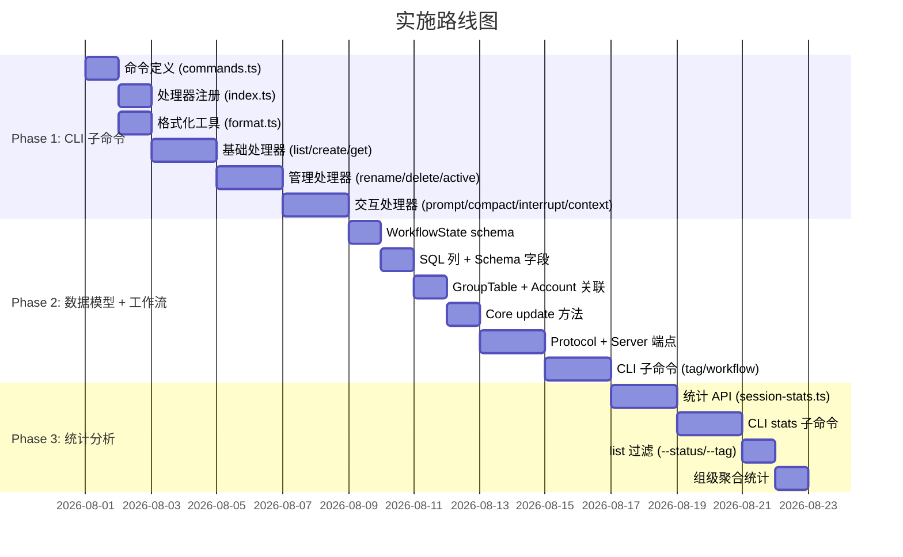

### Phase 1: CLI session 子命令

1. `commands.ts` 添加命令定义
2. `index.ts` 注册处理器
3. `format.ts` 格式化工具
4. 处理器：list → create → get → rename → delete → active → compact → interrupt → tag → resume → workflow → stats

### Phase 2: 数据模型 + 工作流

1. `session-workflow.ts` schema（含 ReviewChecklist、QualityMetrics）
2. `schema/session.ts` 新字段
3. `core/session/sql.ts` 新列
4. `core/group/sql.ts` GroupTable 新建
5. `core/account/sql.ts` 添加 group_id
6. `core/session.ts` update 方法
7. `protocol/groups/session.ts` update 端点
8. `server/handlers/session.ts` 处理器（含 QualityMetrics 外部回写路径）
9. CLI：tag、workflow（含阶段操作 + 审查子命令）

### Phase 3: 统计分析

1. `server/handlers/session-stats.ts`（含质量维度聚合）
2. CLI：stats（含 --group 选项）
3. list 过滤
4. 组级聚合统计

---

## 10. 向后兼容性

- 所有新增 SQL 列有默认值，不影响现有行
- `session.update` 是新增端点，不影响现有消费者
- `Session.Info` 新增字段均为 `optional`，现有解码不受影响
- CLI 子命令纯新增，不修改现有命令
- TUI 通过 SDK 调用 API，新增字段 optional，不受影响

---

## 11. 安全与隐私

- 统计数据存储在本地 SQLite，不上传外部服务器
- 团队级分析通过本地 `AccountTable.active_org_id` 聚合
- 统计的是流程数据（时间、次数、费用），不记录代码内容
- API 仅本地可访问（Daemon 绑定 `127.0.0.1`）

---

## 12. 验证方式

所有命令通过 `daemon.transport()` 自动启动 daemon，无需手动操作。

```bash
opencode session list
opencode session create --title "用户认证模块"
opencode session tag <id> --add feature auth
opencode session workflow <id>
opencode session workflow <id> checklist
opencode session resume <id>
opencode session stats <id>
opencode session stats --project <id> --period 7d
opencode session stats --group <id> --period 30d
opencode session stats --team --period 30d --json
```

单元测试：`packages/cli/test/commands/handlers/session/format.test.ts`（遵循 `test/cli/account.test.ts` 模式）。

现有测试回归：`packages/core/test/session-*.test.ts`、`packages/tui/test/component/dialog-session-list.test.ts`、`packages/sdk/js` 测试。
