# Session Management: 标准化开发流程、理解保障与效能分析

## 1. 需求背景

### 1.1 核心问题

开发人员在使用 OpenCode 进行 AI 辅助开发时，面临三个层次的问题：

| 层次 | 问题 | 本质 |
|------|------|------|
| 过程管理 | 多个需求并行，如何在会话间切换并走完完整流程 | 效率问题 |
| **理解保障** | **AI 生成了代码，人是否真正看懂了？三个月后谁能维护？** | **控制权问题** |
| 效能度量 | AI 到底提效了多少？Token 消耗是否合理 | 可证明性问题 |

这三个层次对应《领导汇报_退出风险与ROI评估》中的两个核心疑问：

- **疑问一（退出风险）**：AI 写的代码，人能不能接、能不能改、AI 停了怎么办
- **疑问二（ROI 验证）**：Token 投入与产出之间的关系，同等产出下资源配置的优化空间

### 1.2 核心场景

**基本前提**：开发人员始终在 TUI 内，以自然语言对话的形式进行开发。工作流的推进（进入阶段、确认完成、回退）、代码审查、理解确认，全部通过对话完成，不需要退出 TUI 执行 CLI 命令。

CLI 只做两件事：
- **会话管理**：在 TUI 之外创建、列表、删除、标记会话
- **外部查看**：在不进入 TUI 的情况下查看工作流状态和统计数据

开发人员使用 OpenCode 进行 AI 辅助开发时，经常在同一时间收到多个需求。每个需求需要走完完整流程：需求分析 → 设计 → 编码 → 测试 → 审查 → 提交。每个需求对应一个会话，在不同需求之间来回切换，但每个需求都能走完完整流程。

### 1.3 衍生需求

在讨论过程中，识别出四个层面的需求：

1. **会话管理** — 纯 CLI 子命令，不依赖 TUI 也能管理会话
2. **工作流追踪** — 确保每个会话走完完整流程，允许反复迭代但不可跳过
3. **理解保障** — 确保开发者真正理解 AI 生成的代码，而非仅仅"审查通过"
4. **使用分析** — 支撑投入产出评估、算力预算规划与质量监控，为资源配置决策提供数据依据

### 1.4 现状架构

OpenCode 采用 C/S 架构：

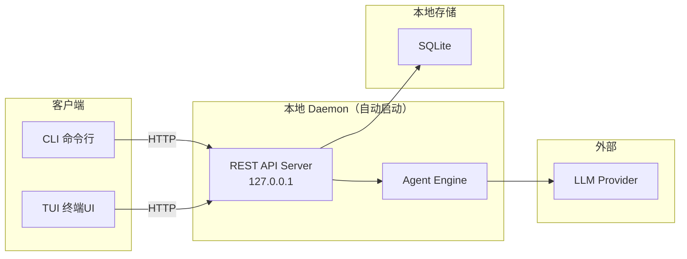

**TUI 已有完善的会话管理**（不需要改动）：创建、列表、删除、重命名、快速切换（`<leader>1-9`）、分叉、后台运行、压缩、中断、恢复。

**REST API 已完备**（全部复用，不修改）：`session.list`、`session.create`、`session.get`、`session.prompt`、`session.compact`、`session.interrupt`、`session.active`、`session.context`、`session.history`。上游 CLI 也已有 `opencode session list|delete`、`opencode stats`（token/费用统计）。

**Project（项目）是自动关联的**：OpenCode 根据工作目录自动创建 Project（`ProjectTable`，含 `worktree` 路径、`name`、`icon` 等）。开发者在某个目录下启动 OpenCode 时，自动关联该目录对应的 Project。Session 创建时自动继承当前 Project 的 `project_id`。**开发者不需要手动设定或管理 Project**。

> **例**：Alice 在 `~/work/user-service` 下执行 `opencode`，OpenCode 自动创建 Project（`worktree=/home/alice/work/user-service`，`name=user-service`，`id=proj_a1b2c3`）；她在 TUI 里创建的会话自动继承 `project_id=proj_a1b2c3`。第二天她在 `~/work/frontend` 启动 OpenCode，会话自动归属另一个 Project。全程无任何配置操作。因此统计时 `opencode-sm stats --period 7d` 省略 `--project` 即按 CWD 自动聚合本项目数据；只有人为划定的组/组织层级（开发者 init 时自报的身份数据，无法从 CWD 推断）才需要显式传 `--group`/`--org`。

**缺失的能力**（均由本方案以插件 + 独立 CLI `opencode-sm` 补齐，不修改上游代码，见 2.4）：

1. 没有工作流追踪机制（阶段推进、审查门禁、提交门禁）
2. 没有理解保障机制（代码片段级的理解确认记录）
3. 没有会话标签与扩展属性（tags、status）
4. 没有组/组织级的使用统计与质量分析

---

## 2. 技术决策记录

### 2.1 工作流模型选择

#### 候选方案对比

| | 方案 A：严格流水线 | 方案 B：完成门控 |
|---|---|---|
| **模型** | 单向推进，不允许回头 | 自由跳转，提交时统一检查 |
| **约束点** | 每个阶段转换 | 仅最终提交 |
| **灵活性** | 差 | 好 |
| **适合场景** | 瀑布式开发 | 迭代式开发 |

#### 方案 A：严格流水线（被拒绝）

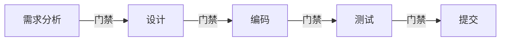

**拒绝原因**：开发人员指出，实际开发中编码时经常发现需求不清楚，需要回到需求分析阶段；测试失败也需要回去改代码。严格流水线无法支持这种反复迭代。

#### 方案 B：完成门控（采用）

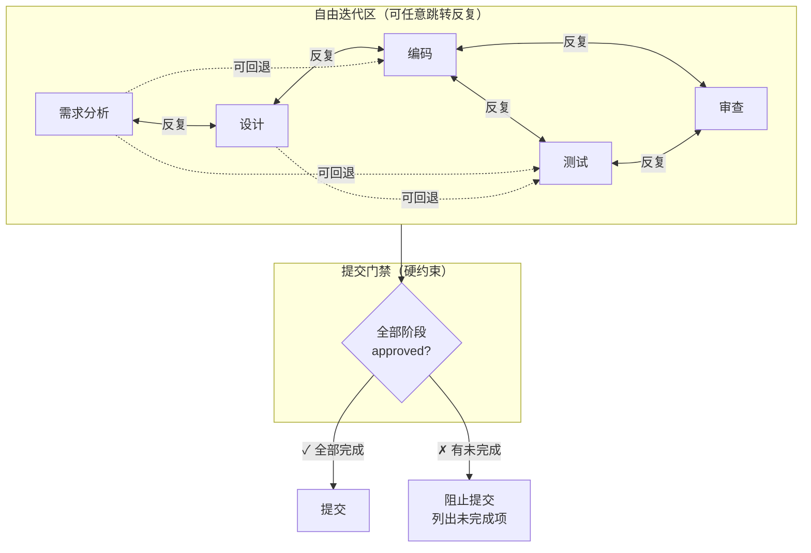

**采用原因**：真实开发本质上是迭代的。约束点应该是"所有必需产物是否都已完成"，而不是"当前处于哪个阶段"。

**审查阶段的特殊地位**：审查（review）是五阶段中唯一**不可被 AI 自行推进**的阶段。审查不仅检查代码正确性，更检查**人是否真正理解了代码**。审查清单包含四个硬性检查项（详见 3.2），不满足则审查阶段不可 approve。审查阶段与编码、测试阶段形成迭代循环——编码完成后进入审查，审查不通过则回到编码或测试。

### 2.2 阶段检测方式选择

#### 候选方案对比

| | AI 自动推断 | 工具使用模式 | 产物文件判断 | AI 提议+开发者确认 |
|---|---|---|---|---|
| **准确度** | 低（语义歧义） | 低（行为歧义） | 低（存在≠确认） | 高（人为决策） |
| **可靠性** | 概率性 | 启发式 | 机械式 | 确定性 |
| **实现复杂度** | 高 | 中 | 低 | 低 |

**被拒绝的方案**：

- **AI 从对话推断**：讨论"用户权限"是在做需求分析还是设计？AI 会猜错
- **从工具使用判断**：写代码时也可能在重新思考需求
- **从产物文件判断**：文档存在不代表需求已被确认

**核心结论**：唯一真正知道"当前在哪个阶段、是否完成"的人，是**开发者本人**。

#### 采用的方案：AI 提议 + 开发者确认

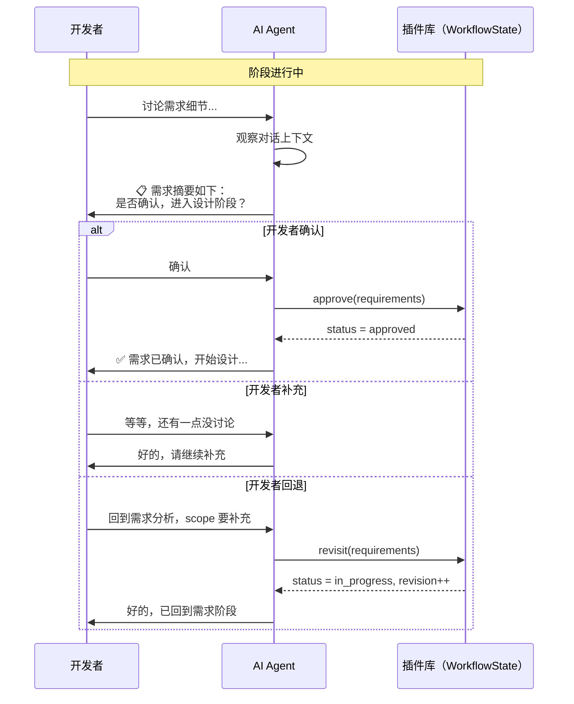

**规则**：
1. 阶段转换的唯一来源是开发者的明确操作
2. AI 只能提议，绝不自行推进
3. 开发者说"回到XX"时立即回退
4. 提交是唯一的硬门禁

### 2.3 统计分析粒度选择

讨论中确认需要三个层级：

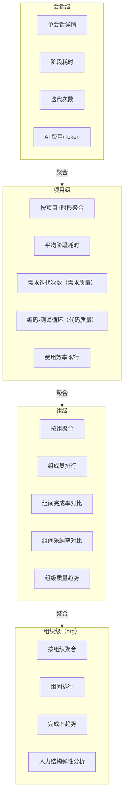

**统计层级说明**：

| 层级 | 聚合维度 | 对应 CLI 参数 | 用途 |
|------|----------|---------------|------|
| 会话级 | 单会话 | `opencode-sm stats <id>` | 开发者自检 |
| 项目级 | 按项目+时段 | `opencode-sm stats --project "用户系统"`（或省略，自动检测 CWD） | 项目经理跟踪 |
| 组级 | 按组聚合 | `opencode-sm stats --group "前端组"` | 组长管理、月度汇报 |
| 组织级（org） | 按组织聚合 | `opencode-sm stats --org` | 领导汇报、预算决策 |

组级统计是核心汇报层级——回应"各组 AI 使用程度和依赖程度"的需求。组级视图展示：成员排行、采纳率分布、返工率对比、触达迭代上限的会话数。

**数据来源决策**：零额外采集。工作流状态变更的时间戳即为分析数据源。

**身份关联决策**：account → group → org 三级身份层级。身份不写上游数据库、不读上游账号体系——由开发者 `opencode-sm init` 四问自报（账号邮箱、组名、组织名、收集服务地址），存全局 `identity.json`；组是名称字符串，子组用命名约定；跨机聚合在每 org 一个的收集服务侧完成（见 2.4、3.1）。

### 2.4 部署架构选择：插件 + 独立 CLI（上游零修改）

#### 决策原则

团队后续需要持续同步 OpenCode 上游更新。**核心文件（session.ts、prompt.ts、sql.ts、protocol）是上游改动最频繁的文件**，任何直接修改都会导致每次同步产生合并冲突，核心 schema 迁移（给 SessionTable 加列）的风险尤其高。因此本方案的硬约束是：**所有定制不修改上游代码，收敛到我们自己的三个包里**（插件、`opencode-sm` CLI、org 收集服务）。

#### 关键发现：上游插件体系已覆盖所需能力

OpenCode 插件运行在 daemon 进程内，生命周期与 daemon 一致，通过 `config.plugin` 按 npm 名或本地路径加载。插件 `Hooks` 接口（`packages/plugin/src/index.ts`）提供的能力与接线位置如下（均已核实上游源码，无需任何上游改动即可使用）：

| 所需能力 | 插件 Hook | 上游已接线位置 |
|----------|-----------|----------------|
| 每轮注入 WorkflowState 到 system prompt | `experimental.chat.system.transform`（修改 `output.system: string[]`） | `agent/agent.ts`、`session/llm/request.ts` |
| 注册工作流工具（LLM 在对话中调用） | `tool`（ToolDefinition 字典） | `tool/registry.ts` |
| 硬门禁：阻断未过审查的提交 | `tool.execute.before`（抛错即令工具失败） | `session/tools.ts` |
| 统计工具执行（迭代计数、采纳率） | `tool.execute.after` | `session/tools.ts` |
| 时间戳采集（阶段耗时数据源） | `chat.message` / `event` | `session/prompt.ts`、事件总线 |
| 读取会话数据（cost/tokens） | `PluginInput.client`（SDK） | 插件入参 |

#### 架构总览

**opencode-sm**（OpenCode Session Management CLI）：我们独立开发、单独安装的命令行工具，与上游代码零耦合，只读插件库与调用上游 REST API。每位开发者在自己机器上独立使用 OpenCode，因此部署形态是"每机器一套插件 + 全局身份配置，每组织一个收集服务"：

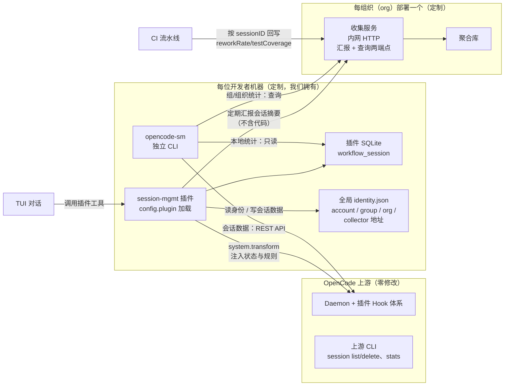

#### 设计点映射

| 需求 | 零侵入实现方式 |
|------|----------------|
| WorkflowState 每轮注入 system prompt | 插件 `experimental.chat.system.transform`，从插件 DB 读最新状态追加 |
| 会话 tags、status、workflow 扩展属性 | 存插件自有 SQLite，以核心 sessionID 为主键关联，不动 SessionTable |
| account / group / org 身份 | 开发者首次使用 `opencode-sm init` 四问自报，存全局 `identity.json`；组结构由各人汇报在 org 聚合库自然形成，组即名称字符串（见 3.1） |
| 阶段推进 / 审查 / 理解确认 | 插件注册工具（`workflow_advance`、`comprehension_confirm`、`review_submit`），Agent 在 TUI 对话中调用，校验逻辑在工具 handler 内——天然服务端强制 |
| 迭代上限（3 轮）与提交门禁 | `tool.execute.after` 计数每阶段代码编辑；`tool.execute.before` 对未过审查的 `git commit` 抛错阻断；system prompt 提示剩余额度 |
| QualityMetrics 采集 | 会话内指标（acceptanceRate/iterationCount）由插件记录于本机插件库；合并后指标（reworkRate/testCoverage）由 CI 按 sessionID 回写 org 收集服务 |
| 外部管理（tag/workflow/stats） | 独立 CLI `opencode-sm`：本地统计读插件库 + 上游 REST API；组/组织统计查 org 收集服务；通用会话操作（list/delete/stats）直接用上游已有命令 |

#### 风险与取舍

- **experimental hook 稳定性**：`experimental.chat.system.transform` 带 experimental 前缀，上游可能调整签名。缓解：插件是唯一受影响面，上游升级后只需改插件代码并回归测试，成本远低于核心合并冲突。插件内以适配层封装 hook，集中变更点。
- **rename（重命名会话）**：上游无会话标题更新 API（标题自动生成）。本方案不提供 rename；如将来必须支持，它是全部定制中唯一值得引入的小核心补丁，单独评估。
- **身份变更是快照语义**：汇报携带当时的 account/group/org 快照。开发者调组后重跑 `opencode-sm init`，只影响此后的汇报，历史统计归属不追溯变更。
- **收集服务不可用**：插件在本地缓冲未送达的汇报，服务恢复后补推；期间单机会话/项目级统计不受影响（直读本地插件库）。
- **插件 DB 孤儿记录**：会话被上游删除后，插件 DB 中对应的扩展数据成为孤儿记录。`opencode-sm` 与插件定期以 `session.list` 比对清理（惰性清理即可，不影响功能）。

---

## 3. 数据模型设计

### 3.1 数据模型（插件库 + 全局身份 + 组织聚合库，上游零修改）

**三个存储位置**（每位开发者在自己机器上独立使用 OpenCode，故身份按机器配置、会话数据按项目存放、跨机统计在组织侧汇聚）：

| 存储 | 位置 | 内容 |
|------|------|------|
| 全局身份配置 | `~/.config/opencode/session-mgmt/identity.json` | `opencode-sm init` 四问写入：`{account, group, org, collector_url}`，每机器一份 |
| 插件库 | `<project>/.opencode/session-mgmt.db`（插件自动建表，迁移自管） | 每会话的工作流数据 `workflow_session` |
| 组织聚合库 | org 收集服务侧（每 org 一个） | 各机器汇报的会话摘要，组/组织结构由此自然形成 |

所有定制数据均**不修改上游 SessionTable / AccountTable**，通过核心 `sessionID` 与上游会话逻辑关联；费用、Token 等核心指标经 SDK（`session.list`/`session.get`）获取——**插件不直接读上游数据库**。

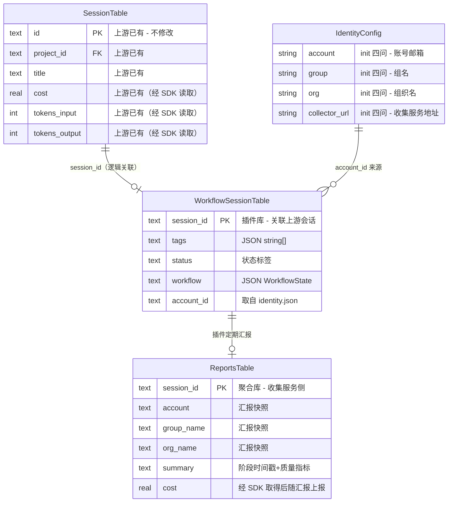

```typescript
// plugins/session-mgmt/src/db/schema.ts — 插件库（bun:sqlite / drizzle），每项目一个
export const WorkflowSessionTable = sqliteTable("workflow_session", {
  session_id: text("session_id").primaryKey(),  // 上游 SessionTable.id
  tags: text({ mode: "json" }).$type<string[]>().$default(() => []),
  status: text(),   // "todo"|"analysis"|"design"|"coding"|"testing"|"review"|"done"|"archived"|null
  workflow: text({ mode: "json" }).$type<WorkflowState>(),
  account_id: text(),  // 会话首次活动时从全局 identity.json 写入
})

// ~/.config/opencode/session-mgmt/identity.json — 全局身份，opencode-sm init 写入
// { "account": "alice@example.com", "group": "前端组", "org": "Engineering",
//   "collector_url": "http://10.0.1.20:8787" }

// 收集服务侧聚合库（tools/opencode-sm-collector）：reports 表按 session_id 主键
// 接收汇报快照（account/group/org + 阶段时间戳 + cost/tokens + 质量指标），不含代码内容
```

**组是名称字符串，没有 ID 与嵌套表**：每台机器只有一个身份（init 填写），不存在单机花名册；"前端组有几个人"这件事由众人汇报的快照在聚合库中 `GROUP BY group_name` 自然得出。子组用命名约定表达（`前端组/基础架构组`）。组织级聚合同理：`GROUP BY org_name`。

**account / group / org 的关联时机**：

| 关联 | 写入方 | 时机 | 方式 |
|------|--------|------|------|
| identity.json（account/group/org/collector_url） | 开发者本人 | 每台机器一次，人员变动时重跑 | `opencode-sm init` 交互式四问，全部手动填写（见 5.1） |
| `workflow_session.account_id` | 插件 | 会话首次活动（`chat.message` hook） | 从全局 identity.json 读取 account 写入，不读上游数据库 |
| 聚合库 account/group/org | 插件 | 定期汇报 + 阶段事件触发 | 汇报携带当时的身份快照，收集服务落库 |

**快照语义**：三层关联随汇报固化在聚合库记录里。开发者调组后重跑 `opencode-sm init`，只影响此后的汇报与本机新会话的打标，**历史统计归属不追溯变更**。本机 `workflow_session.account_id` 亦为创建时快照。

**孤儿记录清理**：上游删除会话后，`workflow_session` 中对应记录成为孤儿。插件与 `opencode-sm` 以 `session.list` 定期比对，惰性清理，不影响功能。

### 3.2 WorkflowState Schema

**文件**: `plugins/session-mgmt/src/schema/workflow.ts`（插件包内）

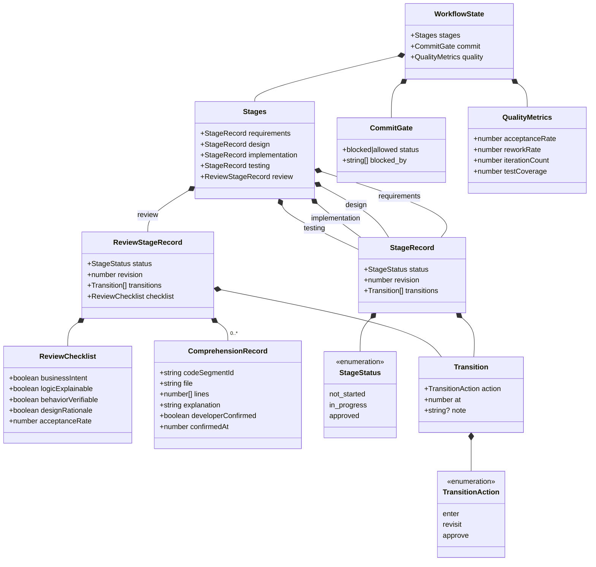

**ReviewChecklist — 可接手标准检查项**：

审查阶段不同于其他四个阶段。审查不仅检查代码正确性，更检查**人是否真正理解了 AI 生成的代码**。`ReviewChecklist` 包含四个硬性检查项，全部通过后审查阶段才可 approve：

| 检查项 | 要求 | 验证方式 |
|--------|------|----------|
| `businessIntent` | 公共方法必须有注释，说明业务意图而非只描述参数 | 审查清单 |
| `logicExplainable` | 圈复杂度 > 10 的方法必须有行内注释 | 静态分析 + 审查 |
| `behaviorVerifiable` | 每个 Service 方法至少有一个集成测试，测试即使用文档 | 审查清单 + 门禁 |
| **`designRationale`** | **AI 必须为每个代码变更输出设计推导：为什么这样写、有哪些替代方案被放弃、潜在风险是什么** | **开发者逐段确认** |

此外，审查阶段记录 `acceptanceRate`（代码建议采纳率），用于监控开发者是否在不经审查地接受 AI 代码。业界研究表明，接受率在 25-35% 为健康区间，超过 45% 表明开发者在不经审查地接受（来源：larridin.com 2026）。

**ComprehensionRecord — 理解确认记录**：

`ComprehensionRecord` 是理解保障的核心数据。它不是简单的"审查通过"标记，而是**开发者逐段确认理解的凭证**。每次 AI 生成代码变更后，在审查阶段：

1. AI 将每个代码变更拆分为可理解的片段（按方法/类/模块），每个片段一个 `ComprehensionRecord`
2. AI 为每个片段输出 `explanation`（自然语言解释：这段代码做了什么、为什么这样写、有哪些替代方案被放弃）
3. 开发者必须逐段阅读 `explanation` 并确认 `developerConfirmed = true`
4. 开发者可以对任意片段追问"为什么这样写"，追问和回答追加到 `explanation` 中
5. 所有片段确认后，`ReviewChecklist` 的 `designRationale` 才可标记为 `true`

```typescript
interface ComprehensionRecord {
  codeSegmentId: string       // 唯一标识
  file: string                // 文件路径
  lines: [number, number]     // 代码行范围
  explanation: string         // AI 输出的自然语言解释（含设计推导、替代方案、风险）
  developerConfirmed: boolean // 开发者确认已理解
  confirmedAt: number         // 确认时间戳
}
```

**为什么这能解决"三个月后没人看得懂"的问题**：`ComprehensionRecord[]` 本身就是一个可检索的知识库。三个月后接手这段代码的人，不需要从零阅读代码——先读 `explanation`，理解设计意图；再读代码，验证实现是否匹配意图；如果有疑问，`explanation` 中的"替代方案和风险"能帮助判断改动的安全边界。

**QualityMetrics — 质量维度数据**：

`QualityMetrics` 记录本会话的质量相关数据，用于统计分析中的质量维度：

| 指标 | 定义 | 来源 |
|------|------|------|
| `acceptanceRate` | 开发者对 AI 代码建议的接受比例 | Agent 会话内追踪 |
| `reworkRate` | 合并后的代码在后续触发修改/Bug 修复的比例 | 外部 CI 管道回写 |
| `iterationCount` | 同一段代码的 AI 生成-修改循环次数 | Agent 会话内追踪 |
| `testCoverage` | AI 参与模块的增量测试覆盖率 | 外部 CI 管道回写 |

**QualityMetrics 的写入机制**：

`QualityMetrics` 字段按写入来源分为两类：

| 字段 | 写入方 | 写入时机 | 写入方式 |
|------|--------|----------|----------|
| `acceptanceRate` | Agent | 审查阶段，实时更新 | Agent 调用插件工具 `quality_report`，写入插件 DB |
| `iterationCount` | 插件 | 每次代码生成-修改循环，实时更新 | 插件 `tool.execute.after` hook 计数后写入插件 DB |
| `reworkRate` | 外部 CI 管道 | 合并后，当检测到同一会话产出的代码被再次修改 | CI 按 sessionID 回写 org 收集服务（见 4.3） |
| `testCoverage` | 外部 CI 管道 | 合并后，SonarQube/覆盖率工具生成报告时 | CI 按 sessionID 回写 org 收集服务（见 4.3） |

Agent 负责会话内指标（acceptanceRate、iterationCount，写本机插件库并随汇报上行），外部 CI 负责合并后指标（reworkRate、testCoverage，回写 org 收集服务）。两条通道在聚合库按 sessionID 合并，互不覆盖，统计时统一聚合（见 4.3）。

**Phase 1 的范围**：`acceptanceRate` 和 `iterationCount` 随 Phase 2 Agent 规则一起实现。`reworkRate` 和 `testCoverage` 依赖外部 CI 集成，标记为 Phase 3+，在不接入外部 CI 的情况下，这两个字段默认为 `null`，统计输出中显示为 `N/A`，不影响其他功能。

**迭代轮次上限**：AI 对同一段代码的生成-修改循环不超过 3 轮。当 `iterationCount` 达到 3 时，Agent 拒绝继续生成，提示人工介入。第 4 轮起必须人工重写。这是基于业界实证研究——5 轮 AI 迭代后代码关键漏洞增加 37.6%（来源：index.dev 2025）。

**迭代轮次重置规则**：以下情况触发 `iterationCount` 重置为 0：

| 触发条件 | 检测方式 |
|----------|----------|
| 开发者手动修改了该文件（非 Agent 编辑） | 检测该文件的最新 diff 来源不是 Agent |
| 开发者显式声明"已手动修改，重置计数" | Agent 识别关键词后重置 |
| 开发者以人工重写的方式提交了新版本 | 文件变更超过 50% 行数，且包含非 Agent 的 commit author |

仅靠 Agent 在对话中说"已修改"不足以触发重置——必须有文件级的实际变更证据。这防止开发者口头绕过迭代上限。

### 3.3 状态转换规则

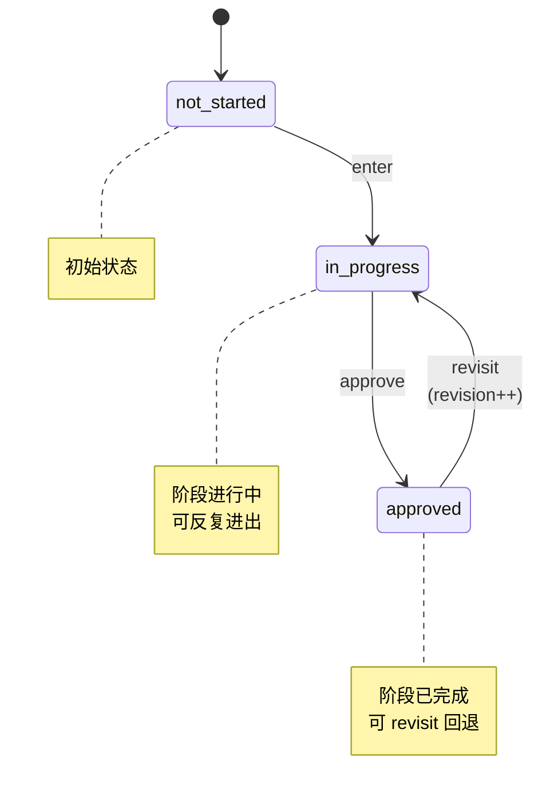

每次转换自动追加到 `transitions[]`：

```json
{
  "action": "enter",
  "at": 1722412800000,
  "note": "开始需求分析"
}
```

这些时间戳就是统计分析的数据来源。

### 3.4 提交门禁逻辑

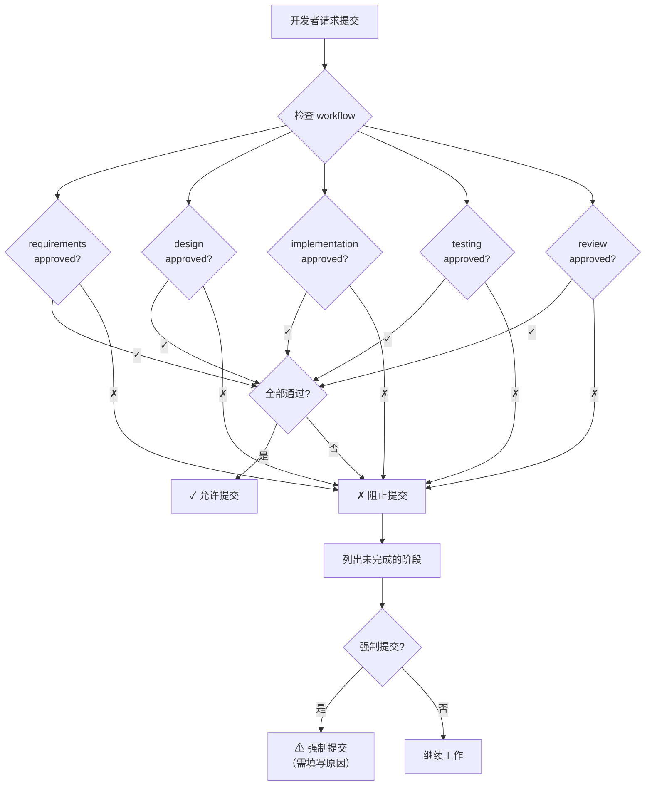

**执行点**：门禁落在插件侧——Agent 调用 `commit_gate_check` 工具获取检查结果；即使 LLM 不遵守规则，`tool.execute.before` hook 也会拦截未过审查的 `git commit`（见 7.3），硬约束不依赖 LLM 自觉。

---

## 4. 接口设计（插件工具 + 复用上游 API + org 收集服务端点，上游零修改）

### 4.1 插件工具（Agent 在 TUI 对话中调用）

工作流的所有状态变更不经过 REST API，而是通过插件注册的**工具（tool）**完成。Agent 在对话中调用这些工具，校验逻辑写在工具的 handler 内——运行在 daemon 进程里，天然具备服务端强制性。

| 工具 | 用途 | 服务端校验 |
|------|------|-----------|
| `workflow_advance` | 提议进入下一阶段 / 标记当前阶段 approved | 必须携带开发者确认语义；AI 不可在无确认时调用成功 |
| `workflow_revisit` | 回退到指定阶段（revision++） | 目标阶段必须存在 |
| `comprehension_confirm` | 确认单个代码片段已理解 | **单次调用只接受一个 `codeSegmentId`**，防止批量确认（见 7.3） |
| `comprehension_ask` | 对片段追问，问答追加到 explanation | 片段必须存在 |
| `review_submit` | 提交审查清单四项结果 | 四项全部 true 且所有片段已确认，否则拒绝 |
| `quality_report` | 上报 acceptanceRate 等会话内指标 | 增量合并写入 `workflow.quality` |
| `commit_gate_check` | 提交前门禁检查 | 返回未完成阶段列表；未通过时 `tool.execute.before` 阻断 `git commit` |

工具定义遵循上游插件 `ToolDefinition` 接口（`packages/plugin/src/tool.ts`），由 `tool` hook 注册后自动进入 LLM 可用工具集（上游 `tool/registry.ts` 已接线）。

### 4.2 复用的上游 API（不修改）

`opencode-sm` 与插件通过上游 SDK 调用以下已有端点，不新增、不修改任何上游端点：

```
GET  /api/session                     session.list
POST /api/session                     session.create
GET  /api/session/:id                 session.get      （含 cost / tokens）
GET  /api/session/active              session.active
POST /api/session/:id/prompt          session.prompt   （resume 一次性模式）
POST /api/session/:id/compact         session.compact
POST /api/session/:id/interrupt       session.interrupt
GET  /api/session/:id/context         session.context
GET  /api/session/:id/history         session.history
```

### 4.3 质量指标写入与统计查询

**增量合并语义**：插件工具对本机 `workflow_session.workflow` 的写入采用深度合并（等价于 PATCH DeepPartial），只更新传入的字段，Agent 维护的字段互不覆盖。

**两条质量指标写入通道**：

| 指标 | 通道 |
|------|------|
| acceptanceRate / iterationCount | 插件工具写入本机插件库 `workflow.quality`，随会话摘要汇报到收集服务 |
| reworkRate / testCoverage | CI 管道按 sessionID **回写 org 收集服务**（`POST {collector_url}/api/ci-quality`），收集服务在聚合库按 session 合并 |

```json
// CI → 收集服务：只回写 reworkRate，与 Agent 汇报的指标在聚合库合并
{ "sessionID": "sess_abc123", "quality": { "reworkRate": 0.08 } }
```

**统计查询（不新增任何核心 API）**：

| 统计范围 | 数据来源 |
|----------|----------|
| 会话级 / 项目级 | `opencode-sm` 本机组合：插件库（工作流/会话内质量）+ 上游 `session.list`/`session.get`（cost/tokens/project），按 sessionID 关联 |
| 组级 / 组织级 | `opencode-sm` 查询 **org 收集服务的查询端点**（`GET {collector_url}/api/stats?scope=group&group=前端组`），聚合库已含各人汇报与 CI 回写 |

`--project` 参数不传时，自动从当前工作目录（CWD）检测对应的 Project；传入时接受 Project 名称（如 `opencode-sm stats --project "用户系统"`）。`--group` 接受组名（如 `--group "前端组"`）；`--org` 使用 identity.json 中配置的组织。

---

## 5. CLI 命令设计

### 5.1 命令清单

命令分两部分：**上游已有命令直接复用**（不新增），**`opencode-sm` 独立 CLI**（我们自己的包，承载定制数据的查看）。

**复用上游 OpenCode 命令（零开发）**：

```
opencode session list                     # 会话列表（上游已有）
opencode session delete <sessionID>       # 删除会话（上游已有）
opencode stats [--days <n>]               # token/费用统计（上游已有）
opencode                                  # 进入 TUI，交互式恢复任意会话（上游已有）
```

**`opencode-sm` 独立命令（定制，读插件库 + 调上游 API + 查收集服务）**：

```
opencode-sm init       # 每台机器一次：交互式四问（账号/组/组织/收集服务地址），写入全局 identity.json
opencode-sm tag        <sessionID> [--add <tag...>] [--remove <tag...>] [--list]
opencode-sm workflow   <sessionID> [checklist|comprehension|stats]
opencode-sm stats      [<sessionID>] [--project <name>] [--group "组名"] [--org] [--period <nd>] [--json]
opencode-sm list       [--status <s>] [--tag <t>] [--json]     # 在上游 session.list 结果上叠加插件库的 status/tag 过滤
```

**init 交互示例**（四问全部由开发者手动填写）：

```
$ opencode-sm init
? 你的账号（邮箱）: alice@example.com
? 所在组: 前端组
? 所属组织: Engineering
? 收集服务地址: http://10.0.1.20:8787
✓ 已写入 ~/.config/opencode/session-mgmt/identity.json，本机即时生效
```

组名/组织名由组织内口头约定（如"前端组"），子组用命名约定（`前端组/基础架构组`）；收集服务地址由 org 管理员告知。人员变动（调组、换邮箱）时重跑 `init` 即可——只影响此后的统计归属（快照语义，见 3.1）。

**说明**：

| 事项 | 处理方式 |
|------|----------|
| resume（继续开发） | 主路径是 TUI 内切换会话（上游已有，`<leader>1-9` 快速切换）；一次性发消息用上游 `session.prompt` API 或 `opencode run` |
| create / get / active / compact / interrupt | 上游 REST API 已完备，TUI 与 `opencode-sm` 直接调用，不包装重复命令 |
| rename | 不提供。上游无标题更新 API，标题自动生成（见 2.4 取舍） |
| review | 并入 `opencode-sm workflow <id> checklist\|comprehension\|stats` |

**workflow 命令说明**：

工作流的推进（进入阶段、确认、回退）通过 **TUI 内自然语言对话**完成（Agent 调用插件工具，见 4.1），不走 CLI。开发者只需在对话中说"需求确认了"、"回到设计阶段"等。`opencode-sm workflow` 仅用于**从外部查看状态**：

| 子命令 | 行为 |
|--------|------|
| *(默认)* | 查看当前工作流状态（阶段进度、当前阶段） |
| `checklist` | 查看审查清单四项状态 |
| `comprehension` | 列出理解确认记录，支持 `--unconfirmed` 过滤未确认片段 |
| `stats` | 查看当前会话的采纳率、迭代轮次、覆盖率等质量指标 |

### 5.2 opencode-sm 实现模式

`opencode-sm` 是独立安装的二进制（我们自己的包），按统计范围选择不同的数据源：

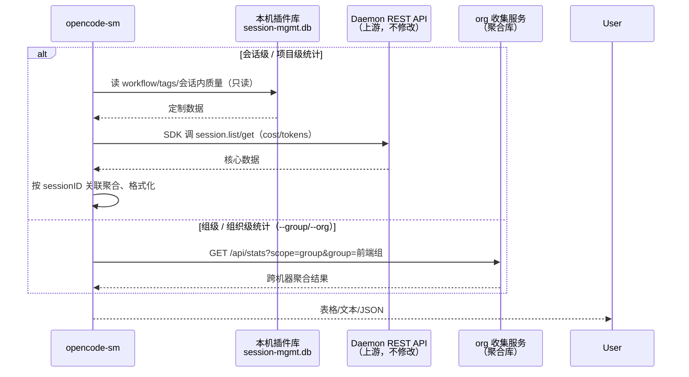

---

## 6. 统计分析设计

统计分析的定位是**投入产出评估与资源规划的数据基础**，服务于三个明确目标：

1. **算力预算规划** — Token 消耗按场景/模型/组拆分，为下一次预算申请提供数据支撑
2. **质量监控** — 跟踪采纳率、返工率、覆盖率，确保提效不以牺牲质量为代价
3. **流程优化** — 阶段耗时与迭代次数分析，识别瓶颈环节

### 6.1 数据来源（零额外采集）

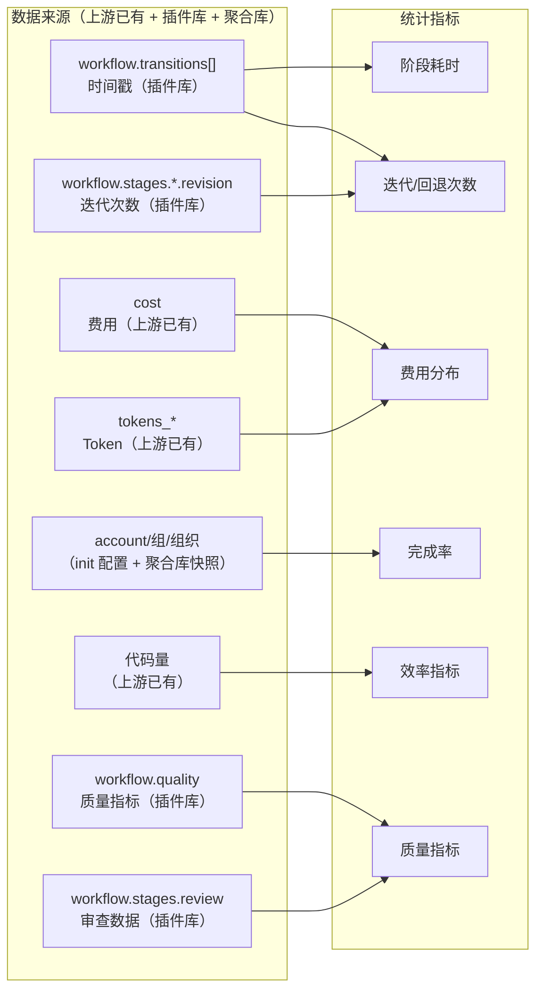

### 6.2 三级统计输出示例

**会话级**：

```
📋 会话 "用户认证模块" (sess_abc123)
开发者: alice@example.com
周期: 3.25 天

工作流:
  需求分析  ████████░░  2.1h   ✓ approved (修改2次)
  设计     ██████░░░░  1.5h   ✓ approved (修改1次)
  编码     ████████████████  4.2h  ✓ approved (编码-测试循环3次)
  测试     ██████████░░  2.8h  ✓ approved
  审查     ██████░░░░  1.2h  ✓ approved (采纳率 32%, 理解确认 5/5)

质量:
  建议采纳率: 32% (健康)  |  迭代轮次: 2/3  |  测试覆盖率: 82%
  返工标记: 无  |  审查清单: ✓全部通过(4/4)  |  理解确认: 5片段 ✓已确认

AI 使用: 对话 47轮 | $0.36 | 85K tokens
```

**项目级**：

```
📊 项目 "用户系统" - 最近 7 天
会话: 12 | 完成率: 75% | 平均周期: 2.3 天
阶段耗时: 分析 2.1h | 设计 1.5h | 编码 4.2h | 测试 2.8h | 审查 1.2h
迭代: 需求修改 avg 1.3次 | 编码-测试循环 avg 2.7次
费用: $4.32 总计 | $0.36/会话 | $0.02/行

质量:
  平均采纳率: 34%  |  超阈值(>45%)会话: 1/12 ⚠
  返工率: 8%  |  变更失败率: 2%  |  平均测试覆盖率: 78%
  触达迭代上限(3轮): 0 会话
```

**组级**：

```
👥 组 "前端组" - 最近 30 天
成员: 5 | 总会话: 42 | 完成率: 85%

  alice  12会话 92%完成 $6.30  2.1天/会话 采纳率31% 覆盖率84%
  bob     8会话 78%完成 $3.80  2.8天/会话 采纳率48% ⚠ 覆盖率71%
  carol  10会话 89%完成 $5.20  2.3天/会话 采纳率29% 覆盖率79%

质量:
  组平均采纳率: 34% (健康)  |  超阈值(>45%)成员: 1/5 ⚠
  组返工率: 6%  |  变更失败率: 2%  |  触达迭代上限: 1/42 (2.4%)

趋势: 需求迭代 ↓1.5→0.9 | AI效率 ↑$0.04→$0.02/行 | 返工率 ↓10%→6%
```

**组织级**：

```
👥 组织 "Engineering" - 最近 30 天
成员: 8 | 总会话: 156 | 完成率: 82%

  alice  24会话 92%完成 $12.30 2.1天/会话 采纳率31% 覆盖率84%
  bob    18会话 78%完成 $9.80  2.8天/会话 采纳率48% ⚠ 覆盖率71%
  carol  22会话 85%完成 $11.20 2.3天/会话 采纳率29% 覆盖率79%

质量:
  组织平均采纳率: 34% (健康)  |  超阈值(>45%)成员: 1/8 ⚠
  组织返工率: 7%  |  变更失败率: 3%
  触达迭代上限会话: 2/156 (1.3%)

趋势: 需求迭代 ↓1.3→0.8 | AI效率 ↑$0.03→$0.02/行 | 返工率 ↓12%→7%
```

### 6.3 质量维度指标定义

质量维度数据用于验证"提效"不是建立在牺牲质量的基础上，同时支撑退出风险管控中的质量衰减监控（措施三）。

| 指标 | 定义 | 计算公式 | 数据来源 | 告警阈值 |
|------|------|----------|----------|----------|
| 代码建议采纳率 | 开发者对 AI 代码建议的接受比例（会话内统计） | Agent 生成的代码变更中，被开发者直接接受的数量 / 总变更数 × 100% | Agent 会话内追踪 | 健康区间 25-35%，>45% 触发告警（不经审查地接受） |
| 返工率 | 合并后触发修改/Bug 修复的比例 | 返工提交数 / 总会话提交数 × 100% | Git + CI 管道 | 连续 2 个月上升触发审查 |
| 变更失败率 | 因 AI 生成代码引发的测试缺陷或生产故障 | 失败变更数 / 总变更数 × 100% | CI/CD + 缺陷跟踪 | 月度环比上升 >5% 触发告警 |
| 测试覆盖率 | AI 参与模块的增量测试覆盖率 | 覆盖行数 / 总行数 × 100% | SonarQube / CI | <70% 触发告警，<80% 不可 approve review |
| 迭代轮次 | 同一段代码的 AI 生成-修改循环次数 | workflow.quality.iterationCount | Agent 追踪 | 达到 3 轮时 Agent 拒绝继续生成 |
| 审查清单通过率 | review.checklist 四项全部通过的会话比例 | 全部通过的会话数 / 总会话数 × 100% | workflow.stages.review.checklist | <90% 触发流程审查 |

这些指标在三个统计层级中的呈现方式不同：
- **会话级**：展示具体数值，标记是否超阈值（如采纳率 48% ⚠）
- **项目级**：展示平均值和分布，标记超阈值会话数
- **组织级**：展示成员排行，标记超阈值成员，展示趋势

---

## 7. Agent 工作流约束

### 7.1 实现机制

工作流约束不修改 OpenCode 核心引擎，而是通过**插件 + 会话级系统提示（system prompt）**实现：插件通过上游已有的 `experimental.chat.system.transform` hook（上游在组装 system prompt 时触发，见 2.4），每轮将工作流规则与当前状态注入 system prompt；状态变更通过插件注册的工具完成，写入插件库。

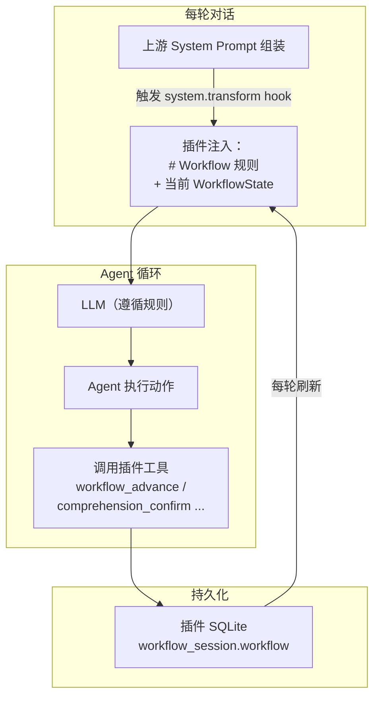

关键点：
- **规则注入**：上游每一步 Agent 循环都会重新组装 system prompt 并触发 `experimental.chat.system.transform`，插件在此 hook 中从插件库读取当前会话的 `WorkflowState`，将规则 + 当前状态追加到 `output.system`——无需修改 `prompt.ts`
- **状态持久化**：Agent 通过插件工具（4.1）写入 `WorkflowState`（阶段变更、审查清单、理解记录），不依赖 LLM 记忆
- **状态同步**：每轮 hook 触发时读取的都是插件库中的最新状态，确保 Agent 始终知道当前进度

### 7.2 实际效果：开发者看到什么

以一次典型的开发会话为例，展示开发者视角的交互过程。

**场景一：阶段推进（对话中自然触发）**

```
开发者: 用户认证模块的需求就这些了，你帮我总结一下

Agent:  📋 需求分析摘要
       1. 支持用户名+密码登录
       2. 支持 JWT token 刷新（access token 15min, refresh token 7d）
       3. 登录失败 5 次锁定 30 分钟
       4. 密码强度要求：8位+，含大小写+数字
       
       需求分析阶段是否确认完成？确认后进入设计阶段。

开发者: 确认

Agent:  ✅ 需求分析已确认。进入设计阶段。
       需要我帮你设计数据库 schema 和 API 接口吗？
```

**场景二：审查阶段——理解确认（逐段交互）**

```
开发者: 代码写完了，进入审查吧

Agent:  🔍 审查阶段 — 本会话共生成 3 个代码变更片段，逐段确认理解：

       ─── 片段 1/3: auth/service.ts:12-45 ───
       📖 这是 TokenService.refresh() 方法。
       它实现了 refresh token 轮换机制：每次用旧 refresh token 换取新 token 对时，
       旧 token 立即失效。选择这个方案（而非延长旧 token 有效期）是因为：
       - 如果 refresh token 泄露，轮换机制确保只有最新的 token 可用
       - 被放弃的替代方案：延长有效期（不够安全）、双 token 队列（复杂度高）
       - 潜在风险：并发刷新时可能触发竞态条件，已在 L38 用数据库行锁处理
       
       你是否理解这段代码的工作原理？[确认/追问]

开发者: 确认

Agent:  ─── 片段 2/3: auth/middleware.ts:8-32 ───
       📖 这是 AuthMiddleware，拦截所有 /api/* 请求...
       （解释内容同上结构）
       
       你是否理解这段代码的工作原理？[确认/追问]

开发者: L22 的缓存逻辑为什么用 Map 而不是 Redis？

Agent:  好问题。这里用了内存 Map 而非 Redis，原因是：
       - 缓存的是公钥（JWK），不是用户数据，不需要持久化
       - 每个服务实例独立缓存，内存占用极小（~2KB）
       - 如果将来需要多实例共享，可以切换到 Redis，接口不变
       - 替代方案：每次请求都去 Auth Server 验证（延迟高，已被放弃）
       
       现在理解了吗？[确认/追问]

开发者: 确认

Agent:  ─── 片段 3/3: auth/model.ts:1-20 ───
       ...
       
       ✅ 所有 3 个片段已确认理解。审查清单验证：
       ✓ businessIntent   — 公共方法有业务意图注释
       ✓ logicExplainable  — 圈复杂度 >10 的方法有行内注释
       ✓ behaviorVerifiable — 每个 Service 方法有集成测试
       ✓ designRationale   — 所有片段已确认理解
       
       审查阶段通过。可以提交了。
```

**场景三：提交门禁（对话中触发）**

```
开发者: 帮我提交代码

Agent:  🔒 提交门禁检查...
       ✓ requirements — approved
       ✓ design       — approved
       ✓ implementation — approved
       ✓ testing      — approved
       ✗ review       — 未完成（审查清单未通过）
       
       请先完成审查阶段再提交。输入 "进入审查阶段" 开始。

开发者: 进入审查阶段

Agent:  🔍 审查阶段 — 本会话共生成 2 个代码变更片段...
       （进入审查交互）
```

**场景四：迭代轮次上限触发**

```
开发者: 这段代码还是有问题，再改一下

Agent:  ⚠ 此段代码已达到 3 轮 AI 迭代上限。
       继续让 AI 修改可能导致质量衰减（5 轮迭代后漏洞增加 37.6%）。
       
       建议：你手动修改这段代码，或者告诉我具体哪里需要调整，
       我会给出建议但不直接生成代码。
```

### 7.3 规则可靠性

"系统提示"方案的局限在于 LLM 可能不遵守规则。通过以下措施提高可靠性：

| 风险 | 措施 |
|------|------|
| Agent 忘记当前阶段 | 每轮 `system.transform` hook 将最新 `WorkflowState` 刷新到 system prompt |
| Agent 自行推进阶段 | 规则重复强调"绝不自行判断"，且 `workflow_advance` 工具在服务端（插件 handler）校验：只有开发者回复中包含明确确认词（"确认"/"approve"/"ok"）时才执行成功 |
| Agent 跳过审查交互 | 审查阶段是独立的系统提示块，规则优先级最高；`review_submit` 工具在服务端二次校验 `ReviewChecklist`，未全部通过则拒绝 |
| Agent 批量跳过逐段确认 | **服务端防篡改**：`comprehension_confirm` 工具单次调用只接受一个 `codeSegmentId`，批量传入直接报错，防止 LLM 在开发者回复"看起来不错"时将全部片段批量设为 `confirmed` |
| Agent 绕过门禁直接提交 | `tool.execute.before` hook 拦截 `bash` 中的 `git commit`，未通过 `commit_gate_check` 时抛错阻断——这是插件层的硬约束，不依赖 LLM 自觉 |
| LLM 上下文窗口不足 | 工作流状态压缩在 JSON 中，system prompt 中只注入当前阶段规则，历史规则不重复注入 |

### 7.4 规则全文

```markdown
# Workflow Agent 规则

## 阶段推进规则
1. 会话开始时，初始化 workflow 状态（所有阶段 not_started）
2. 当对话表明阶段可能完成时，输出摘要并询问确认
3. 开发者明确确认后才标记 approved
4. 开发者说"回到XX"时，立即 revisit
5. 开发者要求提交时，检查所有阶段（含 review）
6. 绝不自行判断阶段已完成

## 审查阶段 — 理解保障规则（核心）
7. 审查阶段是唯一不可被 AI 自行推进的阶段
8. 审查阶段的核心目标是**确保开发者理解代码**，而非仅仅检查代码是否符合规范

## 代码解释与理解确认交互
9. 审查阶段进入时，Agent 将每个 AI 生成的代码变更拆分为可理解片段（按方法/类/模块边界）
10. 对每个片段，Agent 必须输出 ComprehensionRecord：
    - 自然语言解释：这段代码做了什么、为什么这样写
    - 设计推导（designRationale）：为什么选择这个方案，有哪些替代方案被放弃
    - 潜在风险：边界条件、性能考量、未来可能的变更点
    - 关联说明：这段代码与本会话其他代码片段的关系
11. 开发者必须**逐段**确认理解，不可一键 approve 所有片段
12. 开发者对任意片段追问"为什么这样写"时，Agent 必须详细解释，并将追问和回答追加到 explanation 中
13. 所有片段 developerConfirmed = true 后，designRationale 才可标记为 true
14. 审查清单中其他三项（businessIntent、logicExplainable、behaviorVerifiable）同时验证

## 代码建议采纳率监控
15. Agent 在会话内跟踪代码建议采纳率（acceptanceRate）：
    - 每次 Agent 生成代码变更后，记录为一次"建议"
    - 开发者在审查阶段直接 accept（未修改、未追问）→ 计入"接受"
    - 开发者要求修改、追问"为什么这样写"、或手动修改 → 计入"未接受"
    - acceptanceRate = 接受数 / 总建议数 × 100%
16. 当单会话采纳率 >45% 时，Agent 发出提醒：
    "⚠ 本会话采纳率 {rate}%，超过健康阈值（45%）。过高的采纳率可能意味着未充分审查 AI 代码。
    建议逐段回顾以下变更，确认每段你都能独立解释其工作原理。"

## 迭代轮次上限规则
17. 跟踪同一段代码/文件的 AI 生成-修改循环次数（iterationCount）
18. 当 iterationCount 达到 3 时，Agent 拒绝继续生成，提示：
    "此段代码已达到 3 轮 AI 迭代上限，请人工重写或手动修改后重新开始计数"
19. 第 4 轮起必须人工介入，Agent 只提供建议，不直接生成代码
20. iterationCount 重置规则（以下任一条件满足时重置为 0）：
    - 检测到该文件的 diff 来源不是 Agent（开发者手动编辑）
    - 开发者显式声明"已手动修改，重置计数"
    - 文件变更超过 50% 行数，且包含非 Agent 的 commit author
    仅靠对话中说"已修改"不足以触发重置——必须有文件级的实际变更证据。

## 审查清单验证
21. 审查阶段 approve 前，必须验证 ReviewChecklist 四项全部为 true：
    - businessIntent: 公共方法有业务意图注释
    - logicExplainable: 圈复杂度 >10 的方法有行内注释
    - behaviorVerifiable: 每个 Service 方法有至少一个集成测试
    - designRationale: 所有代码片段有 ComprehensionRecord 且 developerConfirmed = true
22. 任一检查项未通过，审查阶段不可 approve，需回到编码或测试阶段

## 理解凭证的持久价值
23. ComprehensionRecord 不仅是审批流程的产物，更是可检索的知识库
24. 三个月后接手代码的开发者，应先阅读 ComprehensionRecord[] 中的 explanation，再阅读代码
25. 如果开发者未逐段确认理解就直接 approve，审查阶段会在下一次 augment 时被标记为"需重新审查"
```

---

## 8. 文件清单

### 上游 OpenCode（零修改）

不修改、不新增任何上游包（`packages/*`）内的文件。仅依赖上游已有的插件 Hook 体系与 session REST API（见 2.4、4.2）。

### 插件包 `plugins/session-mgmt/`（新建，我们拥有）

| 文件 | 用途 |
|------|------|
| `src/index.ts` | 插件入口：注册 hooks（`experimental.chat.system.transform`、`tool`、`tool.execute.before/after`、`chat.message`、`event`） |
| `src/schema/workflow.ts` | WorkflowState schema（含 ReviewChecklist、ComprehensionRecord、QualityMetrics） |
| `src/db/schema.ts` | 插件库表定义（仅 `workflow_session` 一张表） |
| `src/db/index.ts` | 插件 SQLite 初始化与迁移（bun:sqlite，WAL 模式） |
| `src/identity.ts` | 读全局 `identity.json`，会话首次活动时打标 `account_id` |
| `src/prompt.ts` | system prompt 注入片段：规则全文 + 当前状态压缩 JSON |
| `src/tools/workflow.ts` | `workflow_advance` / `workflow_revisit` / `commit_gate_check` 工具 |
| `src/tools/review.ts` | `comprehension_confirm` / `comprehension_ask` / `review_submit` 工具（含防批量确认校验） |
| `src/tools/quality.ts` | `quality_report` 工具 + 迭代计数逻辑 |
| `src/gate.ts` | `tool.execute.before` 提交门禁拦截（git commit 阻断） |
| `src/report.ts` | 会话摘要汇报：推送至 `collector_url`，不可用时本地缓冲、恢复补推 |
| `src/stats.ts` | 本机统计聚合查询（供 opencode-sm 复用） |
| `test/*.test.ts` | 工具校验逻辑、合并语义、门禁、汇报缓冲的单元测试 |
| `package.json` | 插件包定义（入口、依赖） |

### 独立 CLI `tools/opencode-sm/`（新建，我们拥有）

| 文件 | 用途 |
|------|------|
| `src/index.ts` | 入口与命令注册 |
| `src/commands/init.ts` | 交互式四问，写全局 `identity.json` |
| `src/commands/tag.ts` | 标签管理（读写插件库） |
| `src/commands/workflow.ts` | 工作流状态外部查看（含 checklist/comprehension/stats） |
| `src/commands/stats.ts` | 四级统计：会话/项目级组合本机数据；组/组织级查收集服务 |
| `src/commands/list.ts` | 会话列表（上游 list + 插件库 status/tag 过滤） |
| `src/api.ts` | 上游 opencode SDK 封装 + 收集服务查询客户端 |
| `test/*.test.ts` | 格式化与聚合的单元测试 |

### 组织收集服务 `tools/opencode-sm-collector/`（新建，每 org 部署一个）

| 文件 | 用途 |
|------|------|
| `src/index.ts` | 内网 HTTP 服务：`POST /api/report`（插件汇报）、`POST /api/ci-quality`（CI 回写）、`GET /api/stats`（opencode-sm 查询） |
| `src/db.ts` | 聚合库（reports 表，按 session_id 合并汇报与 CI 指标） |
| `test/*.test.ts` | 合并语义与查询的单元测试 |

### 部署配置

项目级 `opencode.json`（或等效配置）启用插件，无需改动上游：

```json
{ "plugin": ["./plugins/session-mgmt"] }
```

---

## 9. 实施顺序

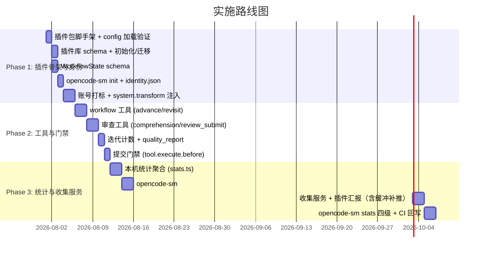

### Phase 1: 插件骨架与身份

1. 插件包脚手架，`config.plugin` 加载验证（确认 hook 在 daemon 内触发）
2. 插件库 schema（`workflow_session`）+ 初始化/迁移
3. `schema/workflow.ts`（含 ReviewChecklist、ComprehensionRecord、QualityMetrics）
4. `opencode-sm init`：四问写全局 `identity.json`
5. `identity.ts` 账号打标 + `system.transform` hook 注入（规则全文 + 当前状态压缩 JSON）

### Phase 2: 工具与门禁

1. `workflow_advance` / `workflow_revisit` 工具（含开发者确认校验）
2. `comprehension_confirm` / `comprehension_ask` / `review_submit` 工具（防批量确认、清单二次校验）
3. 迭代计数（`tool.execute.after`）+ `quality_report` 工具
4. 提交门禁：`tool.execute.before` 拦截未过审查的 `git commit`

### Phase 3: 统计与收集服务

1. `stats.ts` 本机统计聚合（插件库 + 上游 session API 组合）
2. `opencode-sm`：tag、workflow（含 checklist/comprehension/stats）、list 过滤
3. org 收集服务（汇报 + 查询端点）+ 插件 `report.ts` 汇报（不可用时本地缓冲、恢复补推）
4. `opencode-sm stats` 组/组织级查询收集服务 + CI 回写端点（按 sessionID 合并）

---

## 10. 升级兼容性（上游同步）

本方案的核心目标是**让后续同步 OpenCode 上游更新没有合并冲突**：

- **上游零修改**：不改任何上游包内文件，上游版本升级等同正常更新，无核心文件冲突、无核心 schema 迁移对齐负担
- **数据独立**：定制数据全部在插件自有 SQLite 与 org 聚合库，表结构迁移各自自管，与上游 schema 演进互不影响；对上游会话仅以 `sessionID` 逻辑关联
- **接口稳定面小**：仅依赖上游插件 Hook 与 session REST API 两类公开接口；**插件不直读上游数据库**，上游内部表结构变化对定制无影响
- **experimental hook 风险受控**：`experimental.chat.system.transform` 若被上游调整签名，影响面仅插件包 `src/prompt.ts` 一处适配层，升级后回归测试即可，成本远低于核心合并
- **上游行为不变**：TUI、上游 CLI、上游 API 消费者均不受影响；卸载插件（移除 `config.plugin` 条目）即完全还原
- **快照语义**：身份（account/group/org）随汇报固化，调整 `identity.json` 不追溯历史统计（见 3.1）

---

## 11. 安全与隐私

- 本机会话数据存储于本地插件 SQLite；跨机汇聚仅传输**流程摘要**（阶段时间戳、cost/tokens、质量指标、身份字段），**不含代码内容**
- 汇报携带的账号邮箱属个人信息：收集服务应仅内网可达、最小化留存，访问权限限于组/组织管理者
- 组织级分析基于收集服务聚合库（各人汇报快照），不读上游账号体系
- 开发者可关闭汇报（不配置/停用 `collector_url`），退化为本机会话/项目级统计，功能不受影响
- 上游 Daemon 仅绑定 `127.0.0.1`，opencode-sm 经本机回环访问，不暴露网络端口

---

## 12. 验证方式

上游命令与 `opencode-sm` 均通过 daemon 自动启动机制工作，无需手动操作。


```bash
# 首次使用（每台机器一次）
opencode-sm init    # 四问：账号 / 组 / 组织 / 收集服务地址

# 上游命令（复用，验证未被定制影响）
opencode session list
opencode stats --days 7

# 定制命令（opencode-sm）
opencode-sm tag <id> --add feature auth
opencode-sm workflow <id>
opencode-sm workflow <id> checklist
opencode-sm workflow <id> comprehension --unconfirmed
opencode-sm stats <id>
opencode-sm stats --project "用户系统" --period 7d
opencode-sm stats --group "前端组" --period 30d
opencode-sm stats --org --period 30d --json

# TUI 内对话验证（工作流推进、理解确认、提交门禁按 7.2 场景走通）
opencode
```

单元测试：插件包 `plugins/session-mgmt/test/`（工具校验、防批量确认、合并语义、门禁拦截）、`tools/opencode-sm/test/`（格式化与聚合）。

上游回归：因上游零修改，只需确认插件启用/卸载两种状态下上游既有测试（`packages/core/test/session-*.test.ts`、`packages/tui/test/`、`packages/sdk/js`）均通过。

